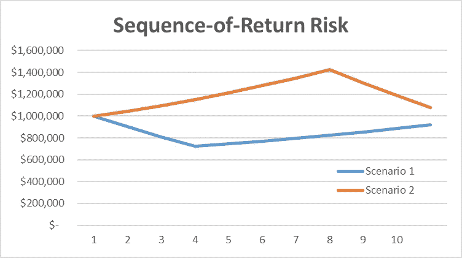
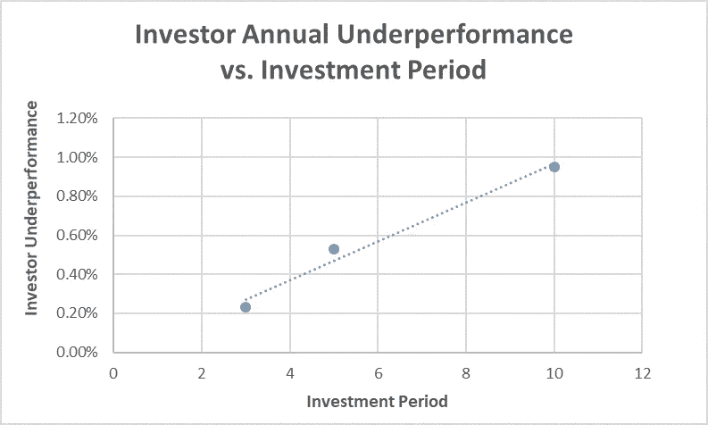
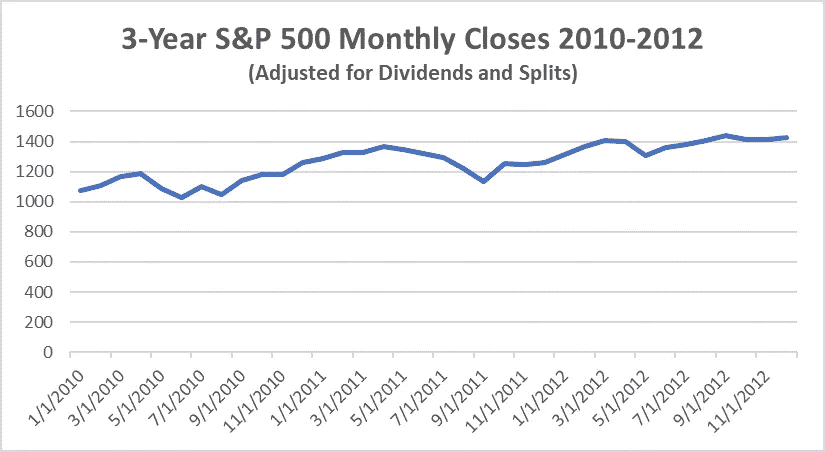
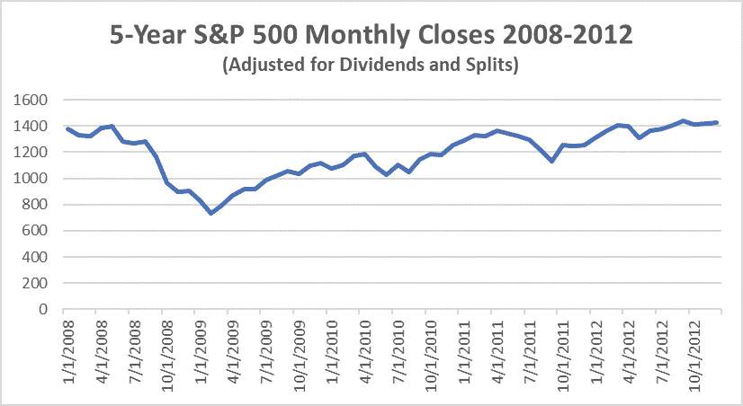
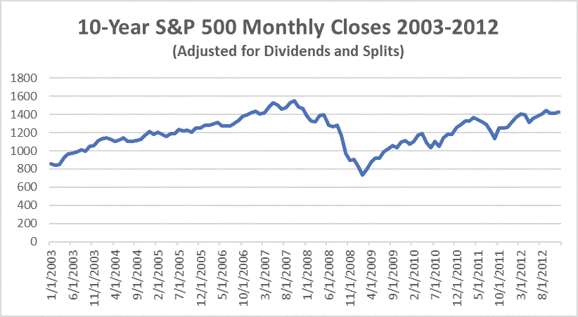
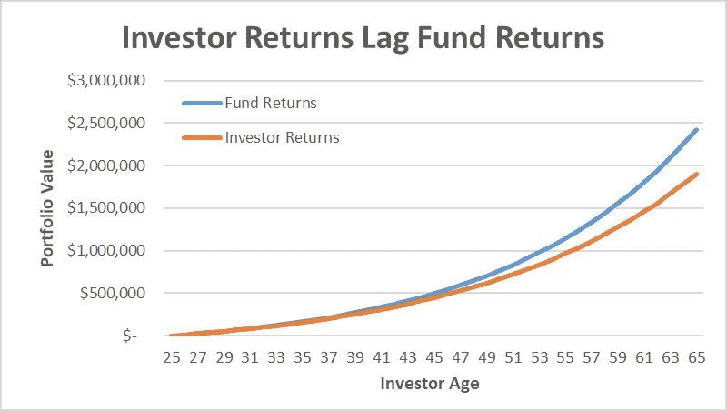
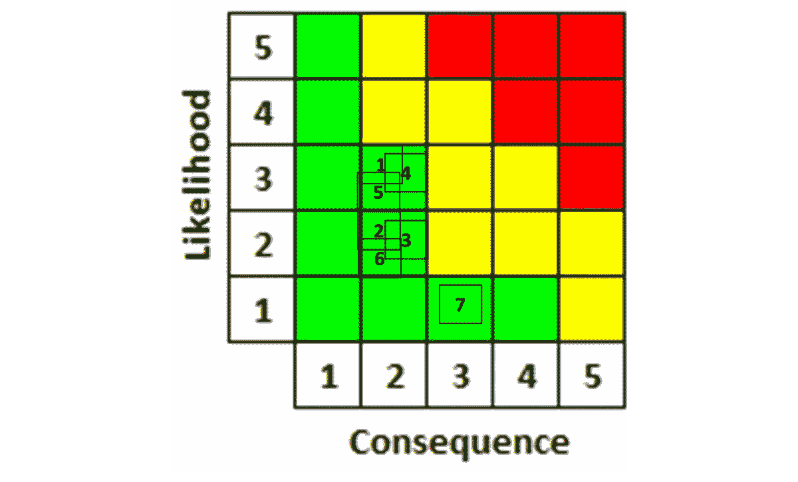

# 如何克服退休后最可怕的 7 大风险

> 原文：<https://medium.datadriveninvestor.com/how-to-overcome-the-7-scariest-risks-to-your-retirement-234180930406?source=collection_archive---------7----------------------->

## 当“失败不是一个选项”时，将 NASA 使用的风险管理工具的简化版本应用到你自己的任务中

## 一个详细的一步一步的方法，以确定，理解和克服 7 个最大的风险，以舒适的退休生活

Photo by [Sammie Vasquez](https://unsplash.com/@sammieeev?utm_source=unsplash&utm_medium=referral&utm_content=creditCopyText) on [Unsplash](https://unsplash.com/s/photos/risk?utm_source=unsplash&utm_medium=referral&utm_content=creditCopyText)

生活充满了惊喜，许多令人不愉快的变化。

作为人类，我们更致力于避免痛苦或失败，而不是取得伟大的成就。用专业术语来说，这叫做“规避风险”

一个目标越重要，我们就越不愿意失败，这使得我们更不愿意冒险，即使是经过计算的风险。问题是，这样做，我们欺骗了自己更大的胜利。

如果你想在生活中获得更大的成功，以下是我从美国国家航空航天局学到的管理风险的简化版本，以及你如何将它应用到你的退休计划中，因为“失败不是一个选项！”

# 什么是风险以及如何管理风险

简单来说，风险就是某件事情出错的可能性。管理风险需要 5 个重要步骤。

1.  识别你的风险
2.  评估每个风险的可能性和后果
3.  对于可能性和后果都可以接受的风险，接受它们可能发生，不要担心
4.  对于具有不可接受的高可能性和/或后果的风险，如果可行，改变你的计划以预防风险；如果不可行，制定一个降低可能性和/或后果的缓解计划
5.  重新评估每个风险缓解后的可能性和后果，以确保它们现在是可接受的

# 为什么退休规划如此具有挑战性

退休规划是你面临的最大的个人财务挑战之一，原因有二。

首先，舒适的退休生活需要很多钱，因为我们大多数人赚的钱不足以满足我们目前的所有需求和欲望，也不足以存下“很多钱”，所以这种储蓄必须以满足目前的需求为代价——有人延迟满足吗？

 [## 即使没有 6 位数的收入，如何实现财务独立

### 这里有一条通往财务独立的 4 步之路，不需要你有惊人的收入。

medium.com](https://medium.com/financial-strategy/how-to-reach-financial-independence-even-if-you-do-not-earn-6-figures-86d3d491f24a) 

第二，正如诺贝尔物理学奖获得者尼尔斯·波尔曾经调侃的那样，“*做出准确的预测是非常困难的，尤其是对未来*，”当未来是几十年后的事情时更是如此，当你必须以看似可信的准确性预测市场在退休前(和退休后)的表现，以及你需要多少钱才能过上舒适的退休生活时更是如此。

 [## 如何让一个简单的华尔街日报退休计算器更好

### 包括逐步说明

medium.com](https://medium.com/financial-strategy/a-useful-retirement-calculator-from-the-wall-street-journal-and-how-to-fix-it-453ab51942e4) 

只要听听金融大佬们的发言，你就会很快意识到，他们中没有一个人能够准确预测任何特定日子、星期、月、年甚至十年的市场回报。

根据美国银行的研究，41%的美国人说他们使用预算。这意味着 59%的人没有当前支出的预算，所以他们怎么可能知道退休后需要多少钱呢？

# 退休计划的 7 个最可怕的风险和克服它们的 5 步计划

让我们从管理退休风险的 5 个步骤开始。

# 第一步。识别风险。

**风险#1:市场风险**

如上所述，即使是专家也无法预测市场回报，但如果历史可以作为指导，在几十年的退休过程中，你应该预期每 2-3 年有 10%+“修正”(读作“损失”)，每 6-7 年有一个熊市(20%+损失)。

平均而言，熊市持续了 14 个月，平均亏损 33%，用了两年多一点的时间才回到熊市前的价值。当你的退休收入在很大程度上取决于你投资组合的规模及其回报时，遭受 33%的损失可能是毁灭性的。

**风险#2:回报序列风险**

最简单地说，回报序列风险就是当你开始退休时，市场会像岩石一样下跌的风险。结果将是，你需要在市场低迷时卖出，以满足最初几年的退休需求，而这种损失将在几十年内影响你的投资组合。

为了证明这一点，让我们考虑退休后第一个十年的两种情况。

在这两种情况下，你退休时都有 100 万美元的投资组合，每年提取 4 万美元(为了简单起见，我们假设没有通货膨胀)。在情景 1 中，你在退休的前 3 年经历了 6%的年损失，随后的 7 年中每年有 9%的年收益。在第二种情况下，你会得到相同的回报，但是顺序相反。先是 7 年 9%的收益，然后是 3 年 6%的损失。

从数学上来说，如果你在这十年里既不投资也不退出你的投资组合，那么在这两种情况下，最终结果将是相同的。然而，因为在这个例子中你已经退休，并且正在从你的投资组合中取钱，事情不会像那样发展。

如图所示，尽管起点相同，十年来的平均年回报率也是 4.26%，但在情景 1 中，你以 7.7%*的亏损结束这十年，而在情景 2 中，你以 7.9% ***的收益*** 结束这十年。仅仅改变退货的顺序就会导致 155，870 美元的结果差异！*

**

*Example of how sequence of returns can cause a retirement portfolio to lose 7.7% over a decade with losses at the start vs. gaining 7.9% if those same losses occur at the end of the decade, all with the same average 4.26% annual gain in that decade.*

> *尽管退休后的第一个十年有着相同的起点和 4.26%的平均年回报率，但在情景 1 中，你最终可能会亏损 7.7%，而在情景 2 中，你可能会获得 7.9%的收益。仅仅改变退货的顺序就会导致 155，870 美元的结果差异！*

*你的收益序列风险是你的提前退休更像情景 1 而不像情景 2。*

***风险#3:利率风险***

*在退休期间，以及临近退休的最后几年，退休人员通过将其投资组合的很大一部分分散到固定收益资产，如国库券、存单(CDs)和储蓄账户，来降低市场风险。*

*这导致了一种风险，即如果利率像最近几年那样下降，退休人员就不能指望从利息支付中获得那么多钱，当他们因为 CD 或国库券到期而不得不将这部分投资组合进行再投资时，他们的收入可能会突然大幅下降。*

*这导致你不得不花费更多的本金，这些钱是你指望在以后的几年里产生更多的钱。*

***风险#4:通胀风险(尤其是医疗通胀)***

*从历史上看，大多数年份的价格都比上一年的价格有所上涨。这被称为通货膨胀，通常是根据美国劳工部(DOL)的消费者价格指数(CPI)来引用的。CPI 是根据一篮子商品和服务的月度价格数据计算出来的。*

*在 1926 年至 2018 年最糟糕的 20 年滚动期内，美元贬值超过 70%！在平均 20 年的时间里，它仍然损失了近 53%。*

*劳工部还计算了一个所谓的“CPI-E”，其中“E”代表“老年人”。出于显而易见的原因，消费物价指数使用了一个略有不同的篮子，更加强调医疗费用。自一九八一年以来，每年消费物价指数平均上升 2.8%，而消费物价指数平均上升 3.1%。每年额外的 0.3%在很大程度上是由于医疗保健价格上涨更快，自 1981 年以来平均每年上涨 5%。*

*这里的风险是，当你退休时，价格开始更快地上涨，这给你的预算带来了压力。*

***风险#5:投资者行为风险***

*正如 Ben Le Fort 在他关于[投资者如何破坏他们自己的投资组合表现](https://wealthtender.com/insights/investing/diy-investors-are-sabotaging-their-portfolios/)的精彩文章中指出的那样，投资者作为一个群体在 ***高买低卖*** 中表现得极其“出色”——这是一个错失良好投资回报的好方法。*

*Le Fort 引用晨星公司的一项研究显示，在截至 2012 年 12 月 31 日的 3 年期、5 年期和 10 年期内，投资者的平均表现分别低于他们所拥有的共同基金 0.23%、0.53%和 0.95%(见图表)。*

**

*Investor underperformance over time relative to the performance of the funds in which they invested.*

> *平均而言，在截至 2012 年 12 月 31 日的 3 年期、5 年期和 10 年期内，投资者分别比他们拥有的共同基金低 0.23%、0.53%和 0.95%！*

*人们不禁要问，为什么随着投资期的延长，投资者表现不佳的情况会变得如此严重。这可能是我们的情绪行为——恐惧、贪婪和过度自信——有更多的时间来破坏我们的投资，在这种情况下，随着投资期限延长到 20 年、30 年、40 年或更长时间，你会预期表现不佳的情况会变得更糟。*

* [## 金钱:冠状病毒疫情期间的投资|数据驱动的投资者

### 在我将近 20 年的金融服务生涯中，我曾经负责监督整个…

www.datadriveninvestor.com](https://www.datadriveninvestor.com/2020/07/29/money-investing-during-the-coronavirus-pandemic/) 

或者，它可能是由特定时期的市场波动所驱动的。如下图(数据来自雅虎！与 5 年期相比，截至 2012 年 12 月 31 日的 10 年期市场波动更严重，与截至同一日期的 3 年期相比，市场波动更严重。

如果这是上述趋势的原因，我们可以预计，与 10 年的水平相比，在很长一段时间内，表现不佳的情况将类似或略差。

3-year S&P 500 monthly closing values from 2010 to 2012

5-year S&P 500 monthly closing values from 2008 to 2012

10-year S&P 500 monthly closing values from 2003 to 2012

## **这对您的投资结果意味着什么**

为了让大家正确看待这一切，我们来看看投资者在情绪化投资行为中是如何伤害自己的。

 [## 如何在不牺牲孩子或财务的情况下安全理智地离婚|数据驱动…

### 在美国，七月是以孩子为中心的离婚月。作为 cdfaⓡ的专业人士，我可以向你保证，从长远来看…

www.datadriveninvestor.com](https://www.datadriveninvestor.com/2020/07/28/how-to-divorce-safely-and-sanely-without-sacrificing-your-children-or-your-finances/) 

下图比较了两个假设的投资者的结果，他们从 25 岁到 65 岁，每年年底都投资 12，000 美元，其中一个人只是投资，并让这些基金假设的 7.05%的年回报率发挥其魔力，而第二个人试图把握市场时机，最终以 6.1%的年回报率投资这些基金*。*

**

*Investor long-term returns can lag the returns of the mutual funds in which they invested by almost 25%*

*在这个假设的 40 年期间，积极投资者的投资组合达到健康的 190 万美元。不算太寒酸。然而，他的买入并持有型朋友的投资组合达到了 240 万美元，在完全相同的基金中投资了相同的金额！*

*这位买入并持有的投资者比他的积极朋友总共高出 27%，最终他的投资组合中多了 520，000 美元，根据 4%规则(尽管该规则可能需要更新)，他每年可以额外提取 21，000 美元。*

> *即使投资完全相同的基金,“凭直觉”投资会让你一生中付出比坚持到底多 25%的代价。*

***风险#6:长寿风险***

*这是你可能会比你的钱活得更长的风险，是退休人员最害怕的事情之一。*

*在过去几十年里，我们退休后的预期寿命增加了许多年。根据社会保障管理局(SSA)的数据，一个在 1940 年年满 65 岁的工人预计在退休后还能活 14 年。1990 年年满 65 岁的工人的这一数字超过了 17 年(男女平均预期寿命)。*

*使用 [SSA 的预期寿命计算器](https://www.ssa.gov/cgi-bin/longevity.cgi)，这个数字目前刚刚超过 20 岁。这表明，65 岁的预期寿命在过去 79 年中增加了近 43%。更重要的是，现在年满 65 岁的人中，有一半会在退休后活过 20 年。*

*[SSA 的精算表](https://www.ssa.gov/oact/STATS/table4c6.html)显示，如今年满 65 岁的夫妇有大约 50%的几率至少有一人活到 90 岁，20%的几率至少有一人活到 95 岁，将近 5%的几率至少有一人活到 100 岁以上。研究还显示，SSA 的数据低估了比平均水平富裕的人的预期寿命。*

***风险#7:健康风险***

*[根据 Fidelity](https://www.fidelity.com/viewpoints/personal-finance/plan-for-rising-health-care-costs) 的数据，2019 年退休的 65 岁夫妇平均预计退休时的医疗费用为 28.5 万美元，不包括长期护理。这个数字没有考虑到医疗费用的任何通货膨胀。*

*了解了这一点，你就可以在制定退休计划时为其做准备。你可以使用一个 [Nerdwallet 计算器](https://www.nerdwallet.com/blog/investing/what-will-you-spend-on-health-care-costs-in-retirement/)来估算你自己的预期退休医疗费用中值。*

*然而，上述估计是平均值。健康风险是您和/或您的配偶可能遭受一些严重的健康相关危机或慢性疾病，使您的医疗保健费用大大高于平均水平。*

*让你们中的一个人长期住院的严重疾病或事故可能会让你在医院账单、处方药(尤其是如果这些不是通常处方药物的所谓“处方集”的一部分)等方面花费数十万美元。患有长期慢性疾病，需要多年的家庭支持，同样会摧毁你的退休计划。*

*既然我们已经确定了 7 个风险，我们终于可以继续第 2-5 步了…*

# *第二步。评估每个风险的可能性和后果。*

*现在我们知道了风险是什么，让我们使用美国宇航局的工具，称为“风险矩阵”，来计算每个风险到底有多可怕。我根据上面的数字确定了上述每种风险，并将其放在我认为合适的标题中。*

**

*A 5x5 risk matrix, or “fever chart,” showing the likelihood vs. consequence of the 7 scariest risks if you don’t do anything to prepare and overcome them*

# *第三步。接受可接受的风险。*

*在这里，所有风险都处于黄色或红色区域，任何风险都不应被视为可接受的。*

# *第四步。制定风险规避和缓解策略。*

*这里有一些缓解措施，你应该认真考虑实施，以解决这 7 个最可怕的风险，你舒适的退休生活。*

***降低市场风险***

*为了降低投资组合价值下跌的风险，你能做的第一件也是最重要的事情就是首先尽可能地扩大投资组合。*

*这意味着现在就尽可能多地为退休投资(即使那只占你收入的 1%)，并将每次加薪、每份奖金、每份现金礼物和收到的每份遗产的至少一半分配出去。不要试图把所有这些“找到钱”的情况留到将来，你更有可能坚持下去。*

* [## 如何舒舒服服地退休，绝对不吝啬

### 你在为退休储蓄时面临的最大问题是，你很难勒紧裤腰带来设定…

medium.com](https://medium.com/financial-strategy/your-optimal-path-to-being-able-to-retire-comfortably-1d97882366a) 

尤其是当你临近退休时，转移你的投资，这样你的市场风险就会降低。这并不意味着将你的整个投资组合永久地从股票市场转移到债券、CDs、储蓄或货币市场账户。这将极大地增加通胀侵蚀你投资组合价值的风险，可能会超过一半。

你可以考虑你的年龄和可能的寿命。[一些专家建议](https://medium.com/makingofamillionaire/https-medium-com-opher-ganel-the-case-for-being-100-percent-invested-in-equities-651f7e4f32b7)用 120 减去你的年龄，并以此来确定你的投资组合中应该持有股票的比例。在 65 岁时，这个比例是 55%。

然而，一些研究人员建议，当你接近退休时，几乎完全退出股票，然后逐渐将资金转移回股票和股票基金(另见回报序列风险的缓解)。

**降低收益序列风险**

如上所述，为了降低这种风险，你可以在临近退休时将几乎所有的投资转出股票，并在退休后的前 5-10 年内逐步转回股票。

这将使你退休时遭遇潜在熊市的可能性和后果最小化。这将增加通胀风险的可能性和后果，但由于只离开市场几年，这不会像完全投资于股票并在你开始从投资组合中提款时经历一场大熊市那样对你的退休产生毁灭性的影响。

另一个缓解措施是在高流动性和低风险的资产中，如货币市场基金或高息储蓄账户，至少有 1-2 年的退休费用。如果市场下跌，你可以从中获利，如果市场上涨，你可以从你的股票头寸和/或股票股息和债券息票中获利。

**降低利率风险**

为了降低利率风险，您可以在利率较高时购买即时年金或[单保费递延年金](https://www.insureuonline.org/consumer_life_fda_ten_tips.htm) (SPDA)。如果市场利率下降或股市表现不佳，选择固定利率将使你的利率不会下降。你还可以将投资组合中的至少一部分股票投资于高股息股票和基金。

**缓解通胀风险(尤其是医疗通胀)**

为了减轻通胀风险，你可以投资于增长速度通常高于通胀的资产，比如股票；以及保证跑赢通胀的债券，如通胀保值债券(TIPS)。

**减轻投资者行为风险**

这是一个完全取决于你的缓和。第一步是诚实地评估你的投资组合价值会有多大的下跌，你愿意并且能够忽略，并且坚持到底。然后，相应地在股票和风险较低的资产之间分配投资。

接下来，停止对市场的痴迷，不要听信所有所谓的市场专家。他们并不比你更了解市场明天、下周、下个月或明年的表现。

沃伦巴菲特(Warren Buffet)在他写给伯克希尔哈撒韦公司(Berkshire Hathaway)投资者的一封著名的年度信中写道，他不明白为什么同样是那些喜欢在购物中心自己最喜欢的商店半价销售的人，会在市场下跌 50%时恐慌，这给了他们买入大公司股票的黄金机会。

当市场下跌时，不要恐慌抛售。事实上，考虑一下这是否是一个很好的买入机会，并可能将更多的资金投入股票。相反，当市场飙升时，考虑通过将投资组合重新平衡到计划的股票配置来获利。

 [## 熊市中期的反弹提供了一个双刃剑的机会

### 熊市已经结束了吗？

medium.com](https://medium.com/datadriveninvestor/the-double-edged-opportunity-of-a-mid-bear-rally-874b2834d87a) 

如果需要的话，请一位财务顾问来帮助你克制自己，不要在熊市中恐慌性抛售，这只会锁定你的损失。

**减轻长寿风险**

为了减轻你的钱不够用的风险，确保你的投资组合中有一定比例的钱可以让你安全退休几十年。著名的 4%法则建议在退休的第一年提取投资组合的 4%,并根据上一年的通货膨胀率每年调整金额。虽然截至 20 世纪 90 年代的历史数据表明，这将为 30 年的退休提供一种安全的方法，但正如我在其他地方所写的那样，David Planchett 的一项研究表明，基于前瞻性估计，更合适的初始提款率将是 3%。

 [## 如何弄清楚你需要什么才能退休

### 你可能需要比你想象的更多(或更少)的钱才能退休——古老的“4%法则”可能对你不适用…

medium.com](https://medium.com/financial-strategy/you-may-need-a-lot-more-or-less-than-you-thought-to-retire-5342c28630a8) 

此外，你可以通过增加财富中提供有保证收入的部分(如社会保障、固定年金、养老金等)来提高这一比例。)，减少退休支出中非自由支配的部分(例如，抵押贷款、水电费、汽车贷款等)。).后者会让你在未来几年更自由地减少支出，让你的投资组合保值。

固定年金，无论是即时年金还是 SPDA，都将增加您终身的保证收入，降低长寿风险的可能性和影响。这也有助于降低市场风险，如果年金有一个通货膨胀调整附加条款，它也可以减轻通货膨胀风险。

最后，考虑延迟你的社会保障福利，如果你负担得起的话，可以延迟到 70 岁才申请，这将最大程度地增加你的福利。在 62 岁的提前退休年龄申请福利，相对于你完全退休年龄的福利，将永久削减你 30%的福利。另一方面，延迟超过您的完全退休年龄(FRA ),每延迟一年，您的福利将永久增加约 8%。

> 如果你的 FRA 是 67 岁，与 62 岁时申请相比，在 70 岁时申请社会保障将使你的福利增加约 77%。

**降低健康风险**

减轻健康风险的最佳方式是将你的生活方式转变为更健康的饮食，定期锻炼(可以只是每天散步一小时，但最好每周锻炼几次)。确保你有足够的健康保险，包括牙科保险，因为[医疗保险不包括大多数牙科保健](https://www.medicare.gov/coverage/dental-services)。

如果你有一个高免赔额的健康保险政策，它可能会使你有资格投资健康储蓄账户(HSA)。这个账户比最好的退休计划有更好的税收优势。

 [## 最好的退休账户不是一个

### 有时最好的结果可能不是有意的…

medium.com](https://medium.com/financial-strategy/the-best-retirement-account-isnt-a-retirement-account-at-all-e549e676bdd5) 

捐款是免税的，你可以投资，它的增长是免税的，用于合格医疗费用的提款是免税的。如果你尽可能地每年向 HSA 缴款，并且在退休前从不提取，你就减少了医疗保健的税后成本。

最后，如果你需要多年的家庭护理，也可以考虑购买长期护理保险，以避免你的积蓄遭受损失。如果你真的购买了这份保险，在你可能需要它之前很久就购买，比如在你 50 多岁的时候购买，会使它更便宜，并降低出现健康问题的风险，健康问题会导致保险公司拒绝向你出售这份保单。

# 第五步。重新评估每个风险缓解后的可能性和后果。

如果你成功并有效地应用了上述所有缓解措施，你的风险“发烧图”可能看起来更像下图。

在这里，所有的风险都降到了“安全”的绿色区域。这并不是说你的退休计划 100%没有任何风险。如果不出意外，可能会有一场全球性的经济崩溃，同时摧毁所有的资产类别，迫使你减少投资组合。类似上世纪 70 年代的另一轮滞胀可能会袭来，带来高通胀与停滞甚至负增长的结合。

> ***注补充:*** *我第一次发表这篇文章是在 2019 年 10 月，比我们任何人听说所谓的“新型冠状病毒”还要早几个月目前正在进行的新冠肺炎疫情对许多人产生了巨大的经济影响，即使他们从未感染这种病毒。如果政府没有花费数万亿美元来支撑经济，情况可能会比大萧条更糟。*

然而，遵循上面概述的步骤可以大大降低你的退休计划出轨的可能性，如果发生不好的事情，对你退休的影响将更容易承受。

The same 5x5 risk matrix, or “fever chart,” this time showing the likelihood vs. consequence of the 7 scariest risks if you do everything you can to prepare and overcome them

# 底线

正如我在开头所说，生活充满了惊喜，包括许多不愉快的事情。事情就是这样。然而，如果你为最大的风险做好准备并减轻它们，你的退休生活可能会更舒适。

# 关于作者

Opher Ganel 已经建立了几个成功的小企业，包括支持 NASA 和政府承包商的咨询公司。他最近的冒险是为独立专业人士提供的[金融策略服务](https://www.opherganel.com/)(在那里你可以注册他的双周刊时事通讯并获得一些漂亮的免费 pdf)。你也可以通过他的媒体出版物[金融战略](https://medium.com/financial-strategy)与他联系。

# 放弃

*本文仅供参考，不应视为财务建议。在做出任何重大财务决定之前，你应该咨询财务专家。*

*最初发表于*[*https://wealthtender.com*](https://wealthtender.com/insights/money-management/7-biggest-risks-to-your-retirement-plan-and-what-you-should-do-about-them/)*。*

## 访问专家视图— [订阅 DDI 英特尔](https://datadriveninvestor.com/ddi-intel)**