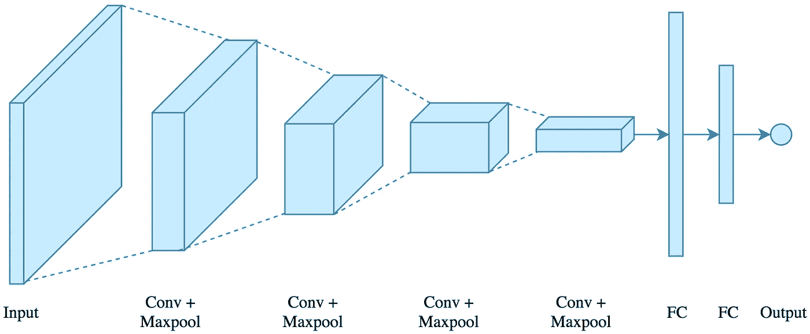
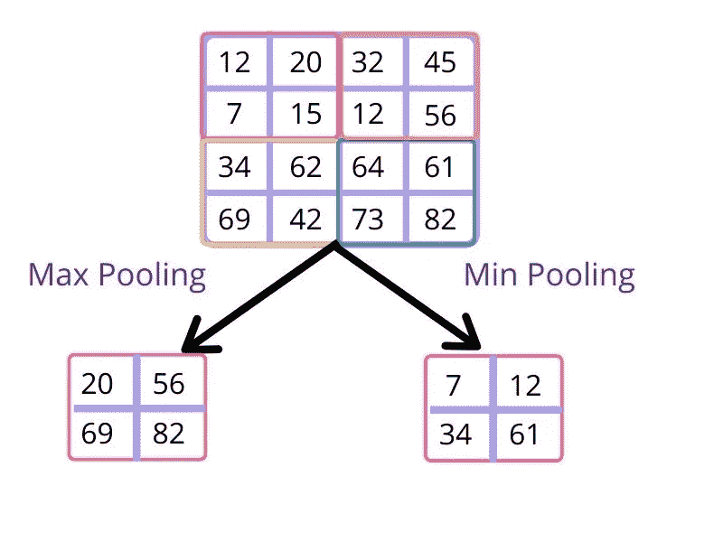
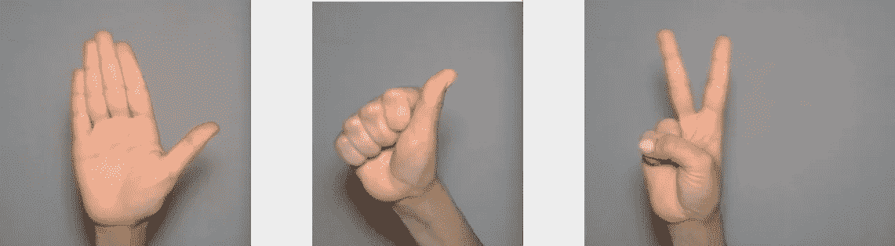

# 如何使用卷积神经网络进行图像分类

> 原文：<https://medium.datadriveninvestor.com/how-to-perform-image-classification-using-convolutional-neural-network-f0df759c29f?source=collection_archive---------6----------------------->

原文章发表在 [**DataSpoof**](https://www.dataspoof.info/post/how-to-perform-image-classification-using-convolutional-neural-network) 博客上

在过去的几十年里，机器学习在医疗保健、自动驾驶汽车、网络搜索和图像识别领域越来越受欢迎。互联网使用的增加产生了大量的数据。许多科技巨头利用这些数据来了解客户行为等等。医疗行业也可能会发生变化，因为深度学习可以帮助医生更早地预测或检测癌症，从而挽救生命。

在金融方面，机器学习和深度学习有望帮助公司甚至个人节省资金，更明智地投资，更有效地分配资源。而这三个领域只是机器学习和深度学习未来趋势的开始。我们已经在这里发布了一系列机器学习教程。

然而，每种技术都有其利弊，机器学习无法处理大量数据。由于这种深度学习的出现。深度学习可以处理海量数据并做出预测。这样做需要强大的计算能力。用于深度学习的一种硬件是图形处理单元(GPU)，而机器学习程序可以在低端机器上运行，没有那么多计算能力。

深度学习的一个很酷的应用是图像分类。在本文中，我们将了解如何使用卷积神经网络解决图像分类问题。

# 目录

1.  什么是卷积神经网络
2.  卷积神经网络的基本构件
3.  什么是图像分类
4.  解决图像分类问题的工作流
5.  了解真实世界的数据集
6.  用 keras 实现 CNN 解决图像分类问题
7.  总结本次会议

# **你可能想看的另一篇博文是**

*   [**python 中的时间序列分析 part-1**](https://www.dataspoof.info/post/time-series-analysis)
*   [**K-使用 scikit-learn 在 Python 中表示聚类**](https://www.dataspoof.info/post/k-means-clustering-python)
*   [**在 python 中实现 K-近邻从零开始**](https://www.dataspoof.info/post/implementation-of-k-nearest-neighbors-from-scratch-in-python)
*   [**第 1 章——py torch 初学者:基础知识**](https://www.dataspoof.info/post/pytorch-for-beginners-basics)
*   [**第二章——如何在 PyTorch 中执行线性回归**](https://www.dataspoof.info/post/linear-regression-in-pytorch)
*   [**第三章——在 PyTorch 中逐步建立逻辑回归**](https://www.dataspoof.info/post/logistic-regression-in-pytorch)

# 什么是卷积神经网络

卷积神经网络是人工神经网络的一种特殊结构，最常用于图像问题。这个术语是由 Yann LeCun 在 1988 年首次提出的。

例如——亚马逊用这种算法生成产品推荐，谷歌用它让用户在照片中搜索。脸书用它来自动标记图片。

图像分类的主要任务是获取输入图像，为图像中的各个方面/对象分配重要性(可学习的权重和偏差),并能够区分它们。人眼可以非常容易地完成这些任务，而计算机看到的图像则完全不同。

计算机将图像视为 0 和 1 的操作系统像素形式。对于灰度图像，只有 1 个通道，但当我们拍摄彩色图像时，图像中有 3 个通道，即红色、绿色和蓝色，每个像素的范围在 0 到 255 之间。

神经网络由三部分组成:输入层、隐藏层和输出层。而卷积神经网络有五个部分:输入层、卷积层、汇集层、全连接层和输出层。

CNN via [medium](https://medium.com/@anupriyam/wtf-is-cnn-d8bdd03928b1)

# 卷积神经网络的基本构件

# 卷积层

卷积层是构建 CNN 模型的第一步。在这一步中，我们从输入图像中提取特征。

 [## 人工智能、深度学习和医疗实践|数据驱动的投资者

### 人工智能和深度神经学习的效用看起来可能是合法和有前途的，特别是…

www.datadriveninvestor.com](https://www.datadriveninvestor.com/2020/06/24/disclosure-and-resolution-program-wont-prevent-physicians-from-practicing-defensive-medicine/) 

执行卷积运算涉及 3 个必要元素。

*   **输入图像:**作为卷积层输入的图像
*   **特征检测器:**也称为**内核或滤波器**，用于通过对输入图像逐元素相乘来产生特征图。

滤波器大小等于 n*m，其中“ *n* ”为输入数量，“ *m* 为输出数量。以下过滤器尺寸为 3x3、5x5 和 7x7。

*   **特征图:**是输入图像和特征检测器的结果。

**卷积运算到底是怎么工作的？**

我们采用作为输入图像和特征检测器的两个矩阵，并逐元素相乘，以产生作为特征图或卷积特征的新矩阵集。

GIF via [GIPHY](https://giphy.com/gifs/huffingtonpost-food-cake-XMgCFjsCSARxK)

在上面的 GIF 图中，绿色的是输入图像，黄色的称为特征检测器或内核。并且输出是特征图。

**现在的问题是如何计算特征地图的尺寸。**

输出特征映射的大小取决于 3 个参数，即滤波器大小、步幅和零填充。

在直接转向 ReLU 之前，让我们了解一下什么是**激活功能。**决定神经网络结果的是数学。该函数用于网络中的每个神经元，并基于与模型预测相关的输入来决定哪个神经元被激发或不被激发。

# 整流线性单元

使用 ReLu 函数的目的是增加图像的非线性。使用该函数是因为自然地，所有图像都是非线性的。

假设我们在看狗的图像，你会发现它包含许多非线性特征(例如，像素之间的变化，边界等。).

ReLU 用于进一步分解线性度，以补偿当我们对图像进行卷积运算时可能强加的线性度。

# 汇集层

池层用于逐渐减小表示的空间大小，以减少网络中的参数和计算的数量。这也有助于我们防止过度拟合。

有几种类型的汇集方法可用。最重要的如下

1.  **最大池化:**这是一个卷积过程，其中内核或特征检测器提取其卷积区域的最大值。
2.  **Min pooling:** 类似地，在 Min pooling 中，内核提取其卷积区域的最小值。
3.  **平均池:**在平均池中，内核提取其卷积的面积的平均值。

在我们的数据集中，我们使用最大池操作。最大池也称为缩减采样。

Image via [dataspoof](http://www.dataspoof.info)

# 变平

现在，我们展平汇集的特征图的输出，以创建单个长特征向量。

# 全连接层

现在完成以上所有步骤后，需要附加**一个**全连接层**。全连接层从卷积网络获取输出信息。当我们将完全连接的层连接到网络的末端时，会产生一个 N 维向量，其中 N 是模型从中选择所需类别的类别数。**

计算参数的总数是“ **(n*m*l+1)*k** ”，其中 n*m 表示滤波器大小，k 是输出特征图，l 是输入特征图。

# Softmax

现在，最后一步，我们将应用 softmax 函数将输出转换为每个类的概率值。接下来，我们选择具有最大概率的值。并打印该类。

# 什么是图像分类

**图像分类**是根据特定规则对图像中的像素或矢量组进行分类和标记的任务。

图像分类模型被训练来识别不同类别的图像。例如，一个模型可能被训练来识别代表三种不同类型动物的照片:兔子、仓鼠和狗。

# 解决图像分类问题的工作流

*   CNN 网络将图像作为输入
*   然后，它应用许多不同的内核来创建一个特征图
*   之后，我们使用 relu 激活函数来增加图像中的非线性。
*   然后，我们将池层应用于每个特征地图，以减少其维度。
*   之后，我们将合并的图像展平成一个长向量。
*   现在，该矢量被附加到一个完全连接的层。
*   接下来，我们使用 softmax 输出每个类的概率值。并选择具有最大值的概率
*   现在我们通过前向传播和反向传播来训练几个时期。然后重复这一过程，直到网络学会正确分类图像。

# 了解真实世界的数据集

在本教程中，我们将对石头、布、剪刀进行分类。在我们的数据集中，我们的训练集中总共有 900 幅图像，测试集中有 300 幅图像。

数据集是从 Kaggle 下载的。到石头、纸、剪刀数据集的链接是这里的。

下面给出了示例图像。

Rock, paper, scissor dataset.

# CNN 解决图像分类的实现

从[这里了解更多](https://www.dataspoof.info/post/how-to-perform-image-classification-using-convolutional-neural-network)

# 总结本次会议

最后，我们终于结束了本教程，在本教程中，我们学到了以下内容:

1.  什么是卷积神经网络？
2.  卷积神经网络的基本构件
3.  什么是图像分类？
4.  解决图像分类问题的工作流。
5.  了解真实世界的数据集
6.  CNN 解决图像分类的实现

希望你喜欢这个教程，如果你对这个话题有任何疑问，欢迎评论。

如果你想获得关于机器学习、数据科学、深度学习和计算机视觉的免费备忘单，可以在我们的 [telegram](https://t.me/dataspoof) 频道获得

## 访问专家视图— [订阅 DDI 英特尔](https://datadriveninvestor.com/ddi-intel)