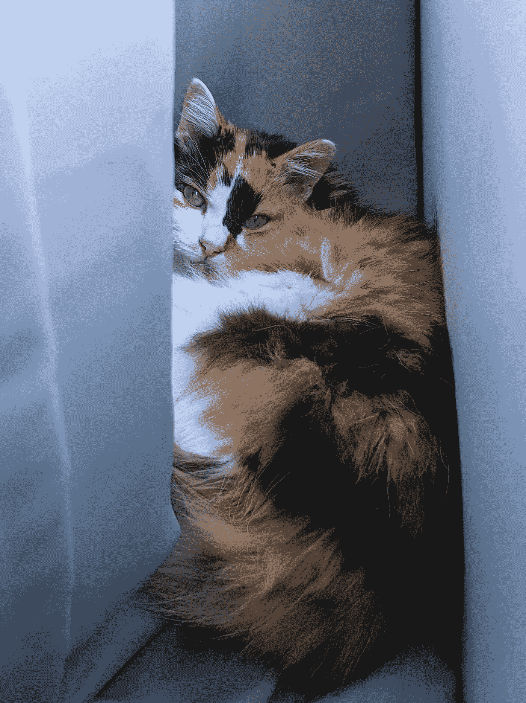
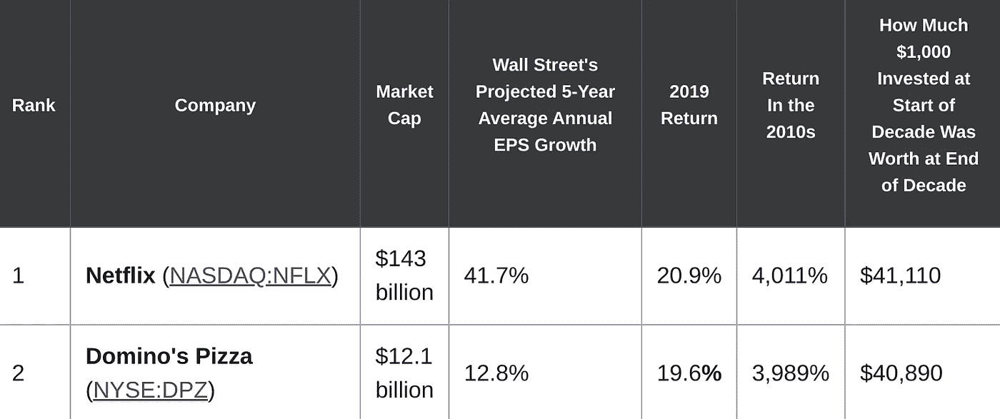
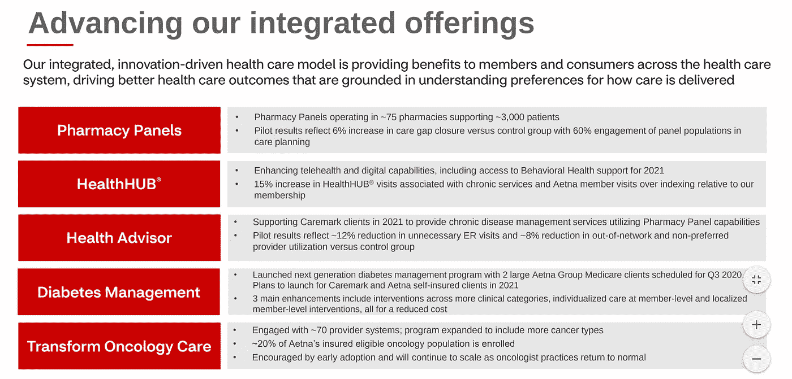
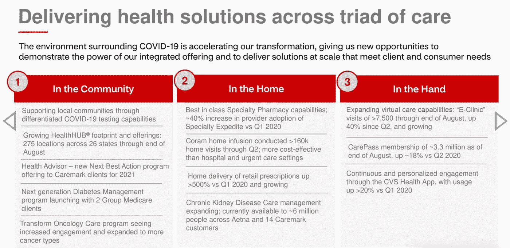
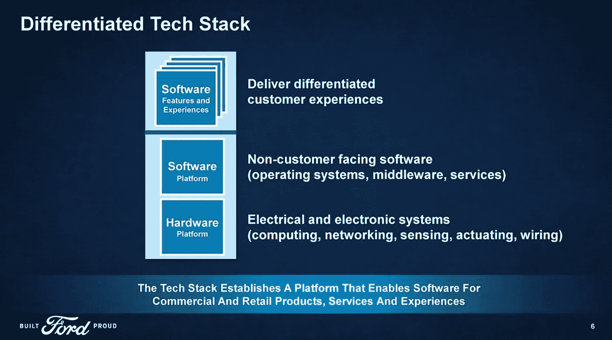
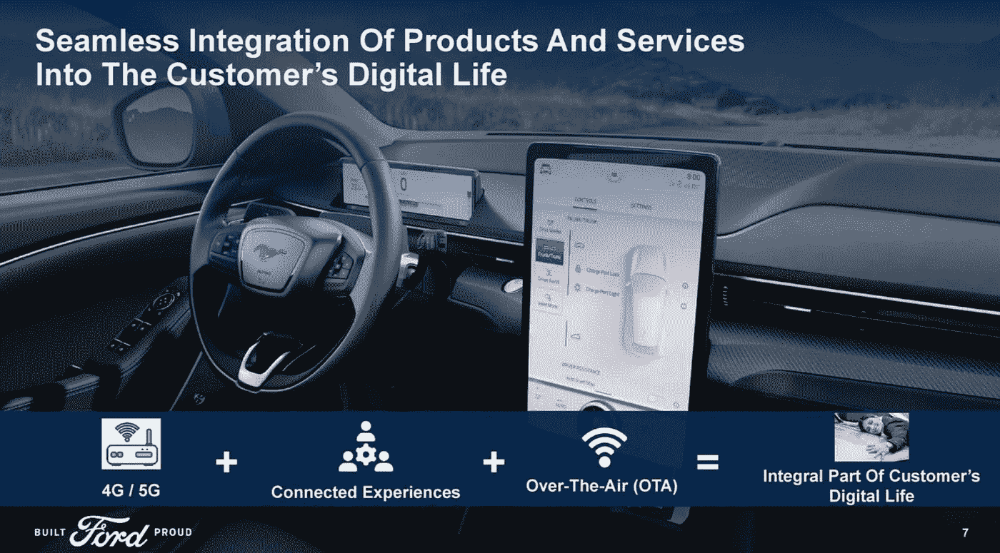

# 如何挑选像网飞和达美乐公司在 2010 年代那样在 2020 年代崩盘的股票

> 原文：<https://medium.datadriveninvestor.com/how-to-pick-stocks-that-will-crush-the-2020s-like-netflix-and-dominos-did-the-2010s-668f6dee1f84?source=collection_archive---------6----------------------->

## 寻找一家表现得像科技公司的非科技公司

**Source: Author**

我们当中有很多写个人理财和投资的人不鼓励日内交易。事实上，越来越多的人中有很大一部分主张长期策略，比如纯粹的买入并持有，以及[派息股票](https://roccopendola.medium.com/3-reasons-to-consider-dividend-growth-investing-9db9cd15c155)，股息再投资*开启*。

在其他条件相同的情况下，这种投资方式适合大多数人。这是防御性的，相对容易执行。虽然等待复利的力量变得明显需要时间，但这是通过股市积累财富的最直接途径，尤其是在你担心风险的情况下。

你想成为那只猫。冷静下来，而不是每小时刷新你的投资账户 12 次。

也就是说，还有其他购买股票的方式。大多数投资组合中都有投机的空间。我的投资组合中有一部分是投机性的。除了一种情况，这些投机性稍强的股票(如 CVS Health)都支付了令人望而生畏的股息。在一个例子中(福特)，它不支付股息。

在这篇文章中，我对我在最近的文章中为[数据驱动投资者](https://medium.com/u/de42e9af1960?source=post_page-----668f6dee1f84--------------------------------)讨论的策略进行了扩展:

> 像科技公司一样思考和行动。这一直是我对股票的信念的一个关键组成部分，我感觉这些股票将会突破，并在长期内大幅突破。

这到底是什么意思？读完这篇文章后，你会很好地理解它的含义，以及如何将我的定性策略应用到你的选股过程中。

我把网飞和达美乐放在这篇文章的标题中是有原因的。

它们是从 2010 年开始的十年中表现最好的股票:

**Source:** [**The Motley Fool**](https://www.fool.com/investing/2020/01/06/the-10-best-performing-stocks-of-the-decade.aspx)

大多数人都会同意网飞是一家科技公司。像许多媒体/内容公司一样，它是技术。在网飞之前，界限是模糊的，但该公司颠覆了媒体，以至于你基本上必须像一家科技公司一样思考和行动才能参与竞争。

2010 年，大多数人都不认为达美乐比萨是一家科技公司。我敢打赌，相当一部分“大多数人”今天仍然不知道。这就是优势所在。作为一名投资者，如果你能理解达美乐比萨是一家科技公司，你就能发现哪些股票有潜力在 2010 年至 2020 年间像达美乐比萨和网飞一样成功。

正如我在上面链接和引用的文章中指出的，我用这个镜头挑选了达美乐和星巴克。我最近用它来选择 CVS Health 和福特这两家非科技公司，它们的思维和行为都像科技公司，它们的股票将粉碎当前的十年。

你可以看到参考文章中的数字，但达美乐和星巴克表现得非常好(遗憾的是，我从未拥有过达美乐，但我是龙星巴克)。CVS Health 和福特没有参与疫情的拉力赛，但是围绕这两只股票有一个新的积极的叙事形成，它们开始移动(我拥有 CVS Health 和福特)。

**这一切都始于建立一个生态系统，让公司超越其核心(也是显而易见的)使命。**

这可能简单得荒谬。以达美乐为例。

它基本上遵循了星巴克的模式。你有一家食品饮料公司。你如何创造一个消费者生态系统，吸引人们并让他们愿意回来？

我可以整天谈论星巴克数字和移动平台的主要设计师。我不会整天谈论他们(我在别处有)。我会让它简短，甜蜜，切中本文的主题。

2010 年前，两个家伙——亚当·布罗特曼和斯蒂芬·吉列——开始在星巴克制作数码产品和手机。他们看到了未来。他们意识到，他们可以创造一个像苹果或谷歌一样有粘性的生态系统，而不会遭受许多其他实体零售商的命运。他们一点也不知道，在全球疫情期间，他们战略的实地执行会有多么方便。或者也许他们有？

毫无疑问，达美乐借鉴了星巴克的经验。该公司设置了性感的移动和数字界面，有效地将披萨订购过程游戏化。他们是在有史以来最伟大、最有效的广告活动之一中自暴自弃后这样做的。一切都如此大胆。非常高科技。

**Source:** [**YouTube**](https://www.youtube.com/watch?v=AH5R56jILag)

CVS 健康始于门店。它只不过是一个便利店和药店。然后，当它着手扩展其药房服务时，它收购了 Aetna。CVS Health 决定建立一个科技型的、有粘性的、包罗万象的医疗保健生态系统。

但是现在，正如我在最近的 Seeking Alpha [文章](https://seekingalpha.com/article/4375994-cvs-not-just-your-corner-drugstore)中解释的，借用 CEO 的话，CVS 不仅仅是你街角的药店:

> 这是总裁兼首席执行官拉里·梅洛在[公司最近的 Q2 收益电话会议](https://seekingalpha.com/article/4364729-cvs-health-corporation-cvs-ceo-larry-merlo-on-q2-2020-results-earnings-call-transcript)上的讲话:

> *CVS health 不仅仅是街角的药店。在这个新冠肺炎时代，我们在医疗保健领域的多元化资产战略，这种在社区、家庭和手掌中提供联系的三位一体的医疗保健非常重要…*
> 
> *我们资产的力量正越来越多地将我们带入提供更多选择的领域，以及新的增长领域，从诊断测试到 B2B 解决方案，再到临床试验、招聘和登记的潜力。*
> 
> *我们今天与您分享的结果强调了我们的战略是正确的，是有效的，并且* ***新冠肺炎正在推动我们显著地弯曲我们的创新曲线，并加速实现具有长期可持续性的解决方案。在我们的三大核心业务中，有许多相互依存的关系，这一点在疫情已经变得更加明显，在为市场带来新的解决方案的同时，也增强了我们的多元化优势*** *。*(我强调)

> 梅洛听起来像一个科技公司的首席执行官。他说的话听起来很像 10 年前星巴克推进数字化时我们听到的语言。这与星巴克首席执行官凯文·约翰逊最近所说的话类似:

> *我们的数字领导能力以及将低绩效位置和业态转化为成功的新门店业态的能力(即，将星巴克门店从低客流量的购物中心迁移到新的、繁荣的星巴克门店，将第三位置与免下车服务结合在一起)是我们在未来几个月将利用的独特优势。我们在三到五年内进行的更广泛的商店转型计划将在未来 12 到 18 个月内实施。*

> 这一切都是关于利用技术和敏捷，请原谅我们的行话。

***Source:*** [***CVS presentation***](https://seekingalpha.com/article/4374403-cvs-health-cvs-presents-morgan-stanley-global-healthcare-conference-slideshow) ***at the Morgan Stanley Global Health Conference***

***Source:*** [***CVS presentation***](https://seekingalpha.com/article/4374403-cvs-health-cvs-presents-morgan-stanley-global-healthcare-conference-slideshow) ***at the Morgan Stanley Global Health Conference***

我希望这一切都在一起。公司的概念我们传统上并不认为技术思维和行为像一个技术公司。

为了把它拉在一起，让我们看看福特。这两张幻灯片说明了一切:

**Source:** [**Ford Presentation**](https://seekingalpha.com/article/4388545-ford-motor-company-f-presents-deutsche-bank-autotech-conference-slideshow) **@ The Deutsche Bank AutoTech Conference**

**Source:** [**Ford Presentation**](https://seekingalpha.com/article/4388545-ford-motor-company-f-presents-deutsche-bank-autotech-conference-slideshow) **@ The Deutsche Bank AutoTech Conference**

> “互联体验。”“客户数字生活不可或缺的一部分。”

福特明白了。技术渗透，如果不是主宰，我们生活的大部分。我不认为这是消极的。事实上，当有什么东西打断了这种渗透时，我很恼火。

Android Auto 在我的现代伊兰特上并不总是完美运行。没有谷歌地图和 Spotify 等应用程序的完整功能和连接，让我的工作效率降低。汽车中的数字体验必须像在其他地方一样无缝。汽车旅行应该是我们数字和移动生活的逻辑延伸，而不是与之决裂(当然，除非你选择用你的汽车时间来断开连接和减压)。福特明白这一点，并正在打造一个反映人们生活方式的生态系统。

在 CVS，这并没有什么不同。来自我上面链接的 Seeking Alpha 文章:

> 访问你当地的简历可以带来多方面、多层次的关系。CVS 可以成为你的医疗保健提供者之一，远不止是拿一张处方。在商店内外，CVS 似乎都有一个策略，那就是在你面前，无处不在，在所有的时间里，把你作为它开展业务的许多领域的客户。

你还可以在 CVS 买到一包薯条和一罐汽水。你可以在那里买到化妆品、避孕套或节日装饰品。这是一家便利商店。您也可以独立于或同时进行上述任何一项或全部操作，领取处方或检查血压。

但是，由于 CVS 已经演变为 CVS Health，您可以进行一次“得来速”COVID 测试。您可以处理越来越多的与健康相关的问题——预防和其他——这些问题过去需要去诊所就诊。你可以在 CVS 商店里这样做，也可以不去商店。你可以在家里、电话上、网上或通过 CVS 不断扩大的社区存在来做这件事。

CVS 已经成为一种新型的医疗保健公司，恰好拥有带药房的实体便利店。它曾经是一家实体便利店，执行有限数量的基本健康相关任务和干预措施。

事情是这样的——拥抱科技公司的心态和实际运用基于科技的解决方案一样重要。

技术思维意味着理解消费者的期望很高，因为移动和数字技术在他们的生活中无处不在。他们想要体验。他们想要方便。他们希望与提供各种有逻辑联系和互补的产品和服务的品牌建立关系。

大多数实体零售不理解这一点。也许他们没有能力或不愿意理解这一点，并想象他们如何能像科技公司一样思考和行动。尽管原因如此，大量的实体商店已经或正在消亡(想想看:像 J. C. Penney 和 Sears 这样的百货商店),因为它们没有设置星巴克或多米诺骨牌那样的路线。CVS 和福特懂了。他们从事基于生态系统的体验业务。他们只是用有东西的商店和有四个轮子的汽车作为基础跳板。

这篇文章不是为了吹捧 CVS 健康和福特。当然，为了更好地解释让我如此热衷于这两家公司的总体战略，我很难抑制自己的信念。

也就是说，你可能会使用我的部分或全部方法来识别我从未想到的公司。我倾向于零售运气。对 CVS Health 和福特的荣誉奖: [Peloton](https://roccopendola.medium.com/why-peloton-could-be-the-next-apple-e72abc2a1c60) 。尽管这可能有点过于投机，而且远没有达到我喜欢的分红水平。

无论如何，我们总是在寻找选股的优势。即使你对股息支付者采取相对保守的态度，股票也不会以与股息相关的指标开始和结束。有一家公司正在做一些事情，或者至少应该做一些事情。你可以通过询问一家公司是否像一家科技公司一样思考和行动，并正在培养一个类似科技、以消费者为中心的生态系统，来了解这家公司的增长和扩张前景。