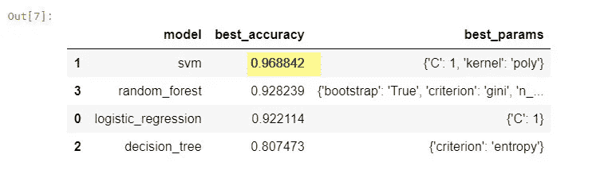

# 如何挑选最好的 ML 机型？

> 原文：<https://medium.datadriveninvestor.com/how-to-pick-the-best-ml-model-69d1556763f4?source=collection_archive---------30----------------------->

[机器学习](http://becominghuman.ai)模型建立在训练数据上，然后进行预测以解决业务问题。有很多模型(像 SVM、决策树、随机森林、逻辑回归、朴素贝叶斯等。)其中可以内置[机器学习](https://becominghuman.ai/machine-learning-concepts-every-data-scientist-should-know-4d70bed18a8a)。

选择最佳模型有时颇具挑战性，因为我们需要找到具有最佳参数的正确模型。让我们考虑将 SVM 模型应用于特定数据集，为了优化该模型，我们必须决定核、C、γ等的参数。类似地，需要优化的其他模型也有不同的参数。优化的模型将给出最好的预测。这个优化超参数的过程被称为超参数调谐。


设置这些参数和构建优化的模型是一个步骤，从这些模型中选择最佳模型是另一个步骤。让我们通过下面的例子来学习一种选择最佳模型的方法。

在本例中，我们将使用来自 sk.learn 的 digits 数据集，并构建逻辑回归、SVM、决策树分类器和随机森林分类器模型。让我们调整一些超参数，以获得优化的模型，并找到其中最好的。

让我们用下面的代码获取数据

```
from sklearn import datasets
digits = datasets.load_digits()
```

现在让我们导入构建上述模型所需的库。

```
from sklearn import svm 
from sklearn.ensemble import RandomForestClassifier 
from sklearn.linear_model import LogisticRegression 
from sklearn.tree import DecisionTreeClassifier
```

现在让我们创建不同模型设置所需的配置字典，其中我们为 digits 数据集指定模型类型和这些模型的一些参数。

```
model_parameters = {

    'logistic_regression' : {
        'model': LogisticRegression(solver='liblinear',multi_class='auto'),
        'params': {
            'C': [1,5,10]
        }
    }, 

    'svm': {
        'model': svm.SVC(gamma='auto'),
        'params' : {
            'C': [1,10,20],
            'kernel': ['rbf','linear','poly']
        }  
    },

    'decision_tree': {
        'model': DecisionTreeClassifier(),
        'params': {
            'criterion': ['gini','entropy'],

        }
     },
     'random_forest': {
        'model': RandomForestClassifier(),
        'params' : {
            'n_estimators': [1,10,20],
            'criterion': ['gini','entropy'],
            'bootstrap': ['True','False']
        }
    },
}
```

在上面的字典中，我们为每个模型指定了几个参数。让我们看看其中的一些细节

**逻辑回归**:在逻辑回归中，我们将能够使用以下参数预测二元因变量。

*   *解算器*是一个可用于最小化成本函数的参数。在这里，我们使用“liblinear”作为求解器的值，因为它是一个用于大型线性分类的库，并且在高维度下表现良好。
*   *Multi_class* 默认设置为自动。c 是正则化参数(到边距的距离)。
*   *C 参数*允许您决定要对错误分类的分数进行多少处罚。越低越好。默认情况下，该值为 1。我们可以通过考虑不同的值来优化这一点。我用过 1，5，10。

请记住，有许多其他参数的逻辑回归可以优化，但我只使用了几个，以简化解释。

**【SVM】(支持向量** [**机器**](https://becominghuman.ai/machine-learning-using-logistic-regression-in-python-with-code-ab3c7f5f3bed) **)** :有明显边距的分离数据是 SVM。SVM 有许多超参数。

*   *内核*指定数据需要如何转换。选项可以是 rbf(径向基函数)，线性，多项式。
*   *C 参数*允许您决定要对错误分类的分数进行多少处罚。默认情况下，该值为 1。我们可以用 1，10，20 试试，看看哪个的分数更好。
*   *gamma* 定义了单个训练样本的影响范围。如果值很低，那么它离边距很远。

**决策树**:决策树有许多参数，我们可以通过这些参数指定分割标准，如基尼系数或熵、如何分割、扩展到什么程度、随机性等。如果我们不指定值，决策树分类器将选择缺省值。在这里，我使用了基尼系数和熵的标准。

[](https://www.datadriveninvestor.com/2020/11/19/how-machine-learning-and-artificial-intelligence-changing-the-face-of-ecommerce/) [## 机器学习和人工智能如何改变电子商务的面貌？|数据驱动…

### 电子商务开发公司，现在，整合先进的客户体验到一个新的水平…

www.datadriveninvestor.com](https://www.datadriveninvestor.com/2020/11/19/how-machine-learning-and-artificial-intelligence-changing-the-face-of-ecommerce/) 

**随机森林**:这是一个估计器，它根据数据的各种子集拟合多个决策树，并对预测进行平均，从而提高准确性。该分类器将具有与决策树相似的参数，并且可以添加更少的参数。我们可以指定决策树的数量，使用什么标准(基尼或熵)，走多远(max_depth)。我们还可以指定 bootstrap(是否使用 bootstrap 样本来构建树)，它可以是真或假等。在这里，我使用 1，10，20 作为 n 估计值，它指定考虑决策树的数量。标准是基尼系数或熵，自助法是真还是假。

在指定了这个字典之后，我们可以迭代每个模型，并获得所有上述模型的准确度分数。为此，我们需要网格搜索 cv，它可以从 sklearn.model_selection 导入。(下面的代码片段)

```
from sklearn.model_selection import GridSearchCV
import pandas as pd
accuracy = []for model_name, mp in model_parameters.items():
    clf =  GridSearchCV(mp['model'], mp['params'], cv=5, return_train_score=False)
    clf.fit(digits.data, digits.target)
    accuracy.append({
        'model': model_name,
        'best_accuracy': clf.best_score_,
        'best_params': clf.best_params_
    })

df = pd.DataFrame(accuracy,columns=['model','best_accuracy','best_params'])df.sort_values(by=['best_accuracy'],ascending=False)
```

在上面的代码片段中，我使用交叉验证作为 5。这意味着它每次预测时都使用不同的测试集，这样持续 5 次，得到所有测试集的平均值。在 GridSearchCV 被处理之后，我们得到了模型名称、最佳分数和最佳参数。



如果我们看看结果，从所有上述数字数据集模型，最好的模型是 SVM，它给出了 96%的准确性，最好的参数是 C:1 和内核:“聚”。

**结论:**

这种为优化模型而计算准确性分数的方法将为您提供基于数据的决策，以决定对您的业务问题应用何种模型。如果多个模型具有相同的精度，可以考虑计算资源和时间较少的模型。

*原载于 2020 年 12 月 27 日*[*【https://www.numpyninja.com】*](https://www.numpyninja.com/post/how-to-pick-the-best-ml-model)*。*

获得专家视图— [**订阅 DDI 英特尔**](https://datadriveninvestor.com/ddi-intel)