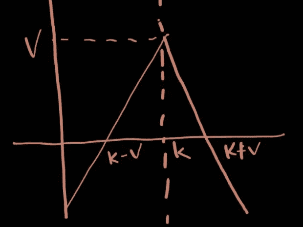

# 如何通过交互式经纪人 API(101 教程)进行期权交易

> 原文：<https://medium.datadriveninvestor.com/how-to-place-option-spread-e-g-straddle-through-interactive-brokers-api-a-101-tutorial-aca2a0be3737?source=collection_archive---------1----------------------->



My hideous attempt in creating an original short straddle pay-off structure without ripping a picture off the internet

最近，我在研究一种利用市场波动风险溢价的期权价差策略。在从 CBOE 获得支付期权链数据后，我用 boostrapping 模拟对这个策略进行了回溯测试。事实证明，这个策略似乎是可行的。

但是这里有一个问题。

我如何将这一策略部署到生产中？也就是说，将策略部署到我桌上的迷你服务器上。


My personal jarvis

在我之前的文章[这里](https://medium.com/datadriveninvestor/designing-and-building-a-fully-automated-algorithmic-trading-portfolio-management-system-6945c6c87620)中，我开发了一个全自动的股票和 ETF 算法交易系统，具有性能监控功能(见[第一部分](https://medium.com/datadriveninvestor/developing-a-performance-monitoring-component-in-my-fully-automated-algorithmic-trading-system-88f5afae05cd)、[第二部分](https://medium.com/datadriveninvestor/developing-a-performance-monitoring-component-in-my-fully-automated-algorithmic-trading-system-983368441bba)和[第三部分](https://medium.com/datadriveninvestor/performance-monitoring-component-in-my-fully-automated-algorithmic-trading-system-part-3-3d41f14005))和对冲机制(见[这里](https://medium.com/datadriveninvestor/deploying-a-hedging-feature-for-foreign-exposure-in-fully-automated-algorithmic-trading-system-8db31f50d3ad))。但不是期权，因为它是一种不同的动物，有不同的罢工和到期日。

当我开始我的期权策略的自动化之旅时，我希望有某种形式的教程向我展示如何通过 IB API 设置期权价差头寸。这将节省我大量的时间，大大缩短我的学习曲线。不幸的是，据我所知(或谷歌搜索)，没有完整的教程介绍如何下单。

因此，如果你正在寻找一个教程来自动化你的期权策略。不要再看了。我将通过一个玩具示例向您展示如何通过 API 下跨骑订单，

*   什么是空头？
*   假设设置
*   提取基础股票价格
*   为不同的航段创建合同(分别卖出和买入)
*   创建具有不同段的合约(买入和卖出的一揽子合约)
*   获取跨期价格
*   发出跨骑订单

**什么是空头多空？**

做空策略是一种期权策略，包括卖出一个具有相同执行价格、K 和到期日的看涨和看跌期权。最大利润是通过出售期权收取的溢价金额，用 v 表示。但当下跌或上涨幅度巨大时，潜在损失可能会很大。该策略的盈亏平衡点在 K-V 或 K+V，如需了解更多信息，您可以访问此处的链接[。](https://www.investopedia.com/terms/s/shortstraddle.asp#:~:text=A%20short%20straddle%20is%20an,lives%20of%20the%20options%20contracts.)


My hideous attempt in creating an original straddle pay-off structure without ripping a picture off the internet

**假定设置**

为了遵循本教程，我假设如下，

*   安装的 python
*   为 ib_insync、datetime、numpy 和 time 安装了 python 包
*   已安装 IB TWS(带图形用户界面)或 IB 网关(不带 GUI 的轻量级版本)。我的偏好是后者，我在我的生产技术栈中使用它。

**提取标的股票价格**

首先，通过 IB 网关或 TWS 建立连接。如果通过 spyder 或 Jupyter notebook 之类的 IDE 运行 util.startLoop()是必需的。否则，如果您通过命令行运行它，您可以省略它。

```
**#Required if you run it through an IDE****#util.startLoop()
ib = IB()
#ib.connect(‘<local ip>’, <port>, clientId=<random integer usually, an identifier for a strategy>)
ib.connect(‘127.0.0.1’, 4001, clientId=9999)**
```

要想在资金间谍多空时卖出一支，你需要知道间谍的当前价格。在下面的代码中，我获得了过去 60 秒的价格，并对其进行平均。如果对你来说更有意义，你可以把它修改为数量加权平均价格(VWAP)。

```
**bars_spy = \
ib.reqHistoricalData(
spy_contract,
endDateTime=’’,
durationStr=’60 s’,
barSizeSetting=’1 secs’,
whatToShow=’MIDPOINT’,
useRTH=True,
formatDate=1)
df_spy = util.df(bars_spy)
avg_price = round(np.nanmean(df_spy.close))**
```

**为单个航段创建一个跨运合同**

获取您偏好的到期日，并将其与潜在的间谍价格一起传递到期权函数中。在这里，您已经为单个卖出和买入分支创建了合约。

```
**#Obtain strike date of your preference. Replace input parameter in days accordingly****strike_date = (datetime.date.today() + datetime.timedelta(days=2)).strftime(“%Y%m%d”)****spy_call = Option(‘SPY’, strike_date, avg_price, ‘C’, ‘SMART’)
ib.qualifyContracts(spy_call)****spy_put = Option(‘SPY’, strike_date, avg_price, ‘P’, ‘SMART’)
ib.qualifyContracts(spy_put)**
```

**创建具有不同分支的跨期合约**

但是如何保证两条腿同时执行呢？魔力来了。你必须把这些单独的合同放进一个“袋子”里。在单个分支中，您必须指定一个“销售”动作，因为我们是跨分支销售。请注意，这不仅限于期权策略。你也可以用它来做期货或股票的差价策略。

```
**#Create a straddle contract****contract = Contract()
contract.symbol = spy_put.symbol
contract.secType = “BAG”
contract.currency = spy_put.currency
contract.exchange = spy_put.exchange****leg1 = ComboLeg()
leg1.conId = spy_call.conId
leg1.ratio = 1
leg1.action = “SELL”
leg1.exchange = spy_put.exchange****leg2 = ComboLeg()
leg2.conId = spy_put.conId #DBK MAR 15 2019 C
leg2.ratio = 1
leg2.action = “SELL”
leg2.exchange = spy_call.exchange
contract.comboLegs = []
contract.comboLegs.append(leg1)
contract.comboLegs.append(leg2)**
```

**获取多空价格**

创建包包合同后，继续获取跨座的价格，即 IB 将为包包合同报出综合价格。这样就省去了为每条腿单独定价的麻烦

```
**#Obtain straddle price****bars = \
ib.reqHistoricalData(
contract,
endDateTime=’’,
durationStr=’60 s’,
barSizeSetting=’1 secs’,
whatToShow=’TRADES’,
useRTH=True,
formatDate=1)
df = util.df(bars)
avg_price = np.nanmean(df.close)**
```

**放置跨骑订单**

接下来，创建一个 LimitOrder 对象。请注意，在 LimitOrder 对象中，我指定了“买入”而不是“卖出”，因为我已经在“**创建具有不同分支的跨期合约**”部分中为各个分支指定了“卖出”。在下面的例子中，我添加了 0.995 的酌情权，即高于当前价格 0.5%，以确保订单得到执行。你可以根据自己的喜好随意调整。

[](https://www.datadriveninvestor.com/2020/07/28/how-to-divorce-safely-and-sanely-without-sacrificing-your-children-or-your-finances/) [## 如何在不牺牲孩子或财务的情况下安全理智地离婚|数据驱动…

### 在美国，七月是以孩子为中心的离婚月。作为 cdfaⓡ的专业人士，我可以向你保证，从长远来看…

www.datadriveninvestor.com](https://www.datadriveninvestor.com/2020/07/28/how-to-divorce-safely-and-sanely-without-sacrificing-your-children-or-your-finances/) 

最后但并非最不重要的杀手锏——下订单！通常，我会将它赋给一个交易变量，并通过一个文本文件流来跟踪状态。这里不包括代码。

```
**#Place a straddle order****order = LimitOrder(“BUY”, 10, round(avg_price*0.995,2), tif=”DAY”, account = ‘<account number>’) ##algos only DAY
trade = ib.placeOrder(contract, order)
print(trade)
time.sleep(5)
#Disconnect
ib.disconnect()**
```

**警告和进一步说明**

*   上面的代码不包括工程特性和安全措施，如调度、错误处理和日志记录特性。如果您希望部署此代码，请包括它们。
*   此处不包括空头平仓代码。您可以在“下单”部分将“买入”转换为“卖出”。如果你持有到到期，你不需要做任何事情，但是你会被分配一条腿，即有义务购买或有义务出售。
*   上述代码的变体适合我的面向对象的框架。为更相关的特性添加函数/方法更容易。
*   我还排除了在回溯测试和引导模拟中测试的信号和风险管理特性。请包括他们。如果没有，长期下来你的账户会爆掉。
*   期权数据很难获得，而且相对昂贵。我花了几百美元从 CBOE 买的。谢天谢地，这是用我的波动率风险溢价策略中的一项交易的零头赚回来的。相比较而言，每日股票价格通常是免费的。
*   了解你的希腊人可能会有用。如果你不熟悉这个，可能你甚至不应该从事这个乐器。
*   就我的肤浅知识而言，期权交易者本质上通常是自由决定的，但是有系统的框架和模型。我只把我的系统期权策略限制在最简单的交易过滤器和连续信号上，这样我可以自动操作它们，利用波动风险溢价。但对于涉及收益公告、联邦公告或政治游戏的更复杂的策略，你可能必须更深入地研究希腊，才能形成交易计划。

*如果你喜欢这些内容，你可以访问我以前的文章* [这里](https://medium.com/datadriveninvestor/designing-and-building-a-fully-automated-algorithmic-trading-portfolio-management-system-6945c6c87620) *我讨论了我如何设计、构建和部署我的全自动算法非期权策略。*

我也写过关于系统性能监控功能的文章，在这些文章中，我讨论了如何捕捉权益曲线、时间加权回报、下滑、汇率影响、滚动波动和提款。参见 [第一部分](https://medium.com/datadriveninvestor/developing-a-performance-monitoring-component-in-my-fully-automated-algorithmic-trading-system-88f5afae05cd)[第二部分](https://medium.com/datadriveninvestor/developing-a-performance-monitoring-component-in-my-fully-automated-algorithmic-trading-system-983368441bba)和[第三部分](https://medium.com/datadriveninvestor/performance-monitoring-component-in-my-fully-automated-algorithmic-trading-system-part-3-3d41f14005)

**附录**

## 访问专家视图— [订阅 DDI 英特尔](https://datadriveninvestor.com/ddi-intel)