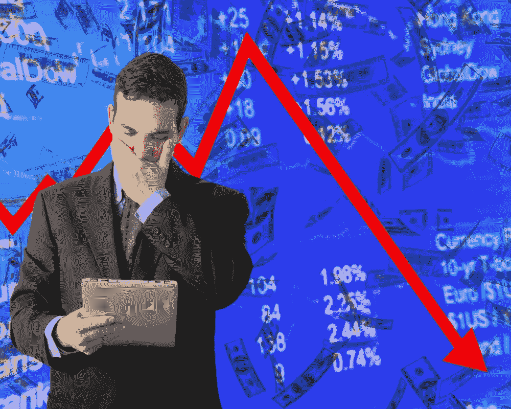

# 如何玩股市崩盘

> 原文：<https://medium.datadriveninvestor.com/how-to-play-a-stock-market-crash-cd3ae665da9a?source=collection_archive---------10----------------------->

当别人恐惧时，要贪婪

在经济疲软的背景下，股市还能上涨多久？虽然股票的定价是基于未来的前景而不是当前的经济前景，但人们预测崩盘已经有一段时间了。

我听过 2018 年、2019 年和 2020 年股市崩盘的论调。我肯定会在 2021 年、2022 年和 2023 年听到股市崩盘的论调。

我不会表现得好像我知道股市崩盘何时会到来，或者是否很快就会到来。我不急于卖掉我的任何证券，因为有人说崩盘即将再次来临。然而，如果有人说“崩溃”足够多次，那个人最终将是正确的。

但在崩盘期间，你到底应该做些什么来积累财富呢？在任何股票市场，总是有机会加速你的财富…无论经济看起来有多糟糕。

同样，任何牛市都会充满表现不佳或破产的亏损股票。

我建议投资任何股票市场，因为把所有的钱都留在场外会保证通货膨胀导致的负回报。

 [## 收盘，但没有雪茄-股票市场目标在停滞的 COVID 救济中创新高|数据驱动…

### 专家聊天程序:一个协作市场，在这里人们可以和能够解决他们问题的专家聊天。是……

www.datadriveninvestor.com](https://www.datadriveninvestor.com/2020/08/18/close-but-no-cigar-stock-market-targets-record-highs-amidst-stalled-covid-relief/) 

# 设立应急基金

应急基金可以让你在事情变糟的情况下支付你的重要开支。每个人对他们的应急基金都有不同的想法，但是大多数人应该在他们的应急基金中储存至少 3 个月的费用。

如果你在应急基金里存了太多的钱，你就没有钱投资能带来高回报的股票了。

我目前没有应急基金，因为我 20 多岁，住在家里。我没有任何费用，除了我的业务费用，我总是可以用我从业务中赚的钱来偿还。

我可以安然度过今天的崩盘，并持有我的股票几年，这对于经济复苏来说是足够长的时间。我买股票和指数基金的目的是永不卖出。结合我目前的生活费用，我可以现实地持有我投资了几十年的股票。

如果你已经有了家庭，应急基金会给你足够的缓冲来支付生活费用。在危机中损失最大的人是那些全押了，因为他们的花费而等不及经济复苏的人。

# 进行压力测试

股市崩盘时有发生。如果你的投资组合明天遭遇闪电崩盘，你能情绪化地应对吗？如果你的投资组合突然下跌 50%，你会紧张吗？或者你有足够的信心度过难关吗？

如果你不知道你的下一笔抵押贷款将从哪里来，你可能会因为你的投资组合在一天内下跌 50%而感到紧张。

股市崩盘几乎从未发生过，但如果你的投资组合下跌 50%，你能承受短期的不确定性吗？

如果你一想到这种可能性就感到压力，开始保护自己。建立你的应急基金，如果你用保证金来扩大你的投资组合，就减少保证金，并以一种你不会担心短期下跌 50%的方式来构建你的投资组合。

# 不要试图计算撞车的时间

即使出现了崩溃的迹象，也没有人真正知道崩溃什么时候会发生。网络泡沫持续了数年才破裂。如果你过早卖出股票，你有现金应对崩盘，但你会错过一路走来的巨大收益。

只购买你打算长期持有的公司的股票是一个好的投资原则。

把握市场时机需要相当多的工作，即使这样也只是猜测。

应对崩盘的最佳方式是逐步蚕食股票和指数基金。你无法预测顶部或底部，所以如果你在整个周期中不断蚕食，你的平均成本会在崩盘时越来越低。

# 不要冒疯狂的风险

冒疯狂的风险从来都不是好事，同样的规则也适用于股市崩盘。投资股市在任何时候都不是一个疯狂的风险，因为股市长期保持增长。

我把疯狂风险定义为做空股票和购买即将到期的期权。

当你做空一只股票时，随着股价下跌，你会赚更多的钱。然而，做空股票会导致无限的损失。几年来，特斯拉卖空者在社交媒体和新闻媒体上游荡。当特斯拉今年迄今上涨 376%时，许多卖空者都被击垮了。

一些人加倍做空，希望收回他们的钱。其他投资者持有空头头寸，因为他们希望运气会好转。

购买期权有其风险，但可能相当有利可图。如果你购买的期权将在 1-4 周内到期，疯狂的风险因素就开始发挥作用。一些“投资者”购买将在几天后到期的期权。那不是投资。那是赌博。

只是轻咬这里和那里。每个月投入一定数量的资金，并着眼于长远。

# 继续学习

你在股市崩盘时消费的信息可以让你获得巨大的财富。你会更好地了解经济表现如何，复苏开始需要克服哪些障碍，以及哪些股票将在复苏中赢得最多。

崩盘不是退缩和考虑厄运和悲观的时候。崩溃是加倍你的知识和保持最新发展的时候，这样你就为复苏做好了准备。

这些策略将帮助你度过股市崩盘。我仍在投资，并将继续这样做，但对你来说，重要的是建立一个在股市崩盘时你会做什么的游戏计划。

**进入专家视角—** [**订阅 DDI 英特尔**](https://datadriveninvestor.com/ddi-intel)