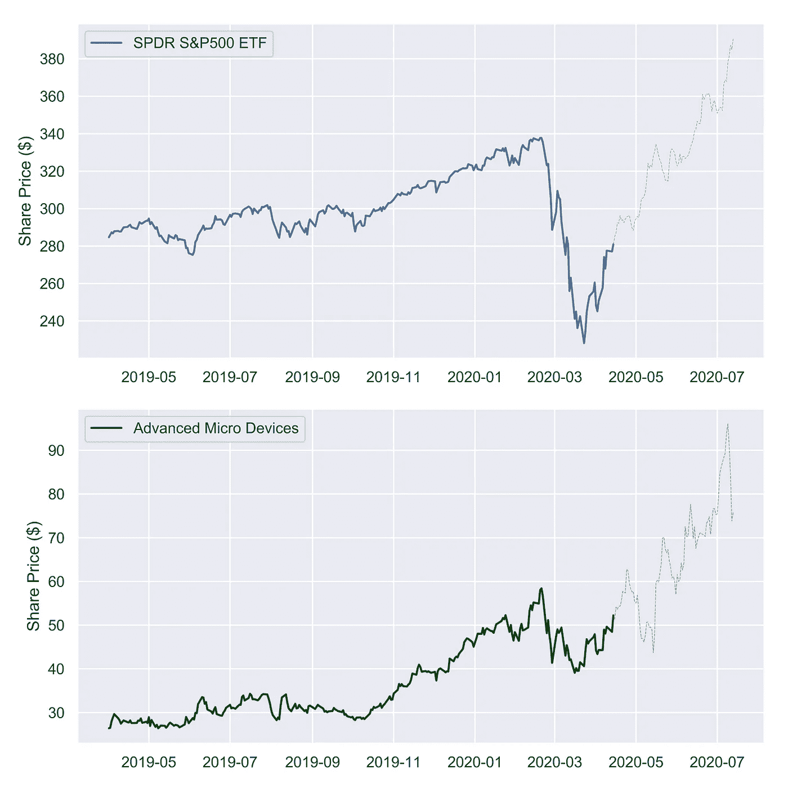
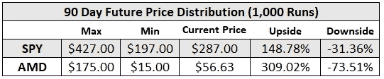

# 根据过去的表现预测未来的股票价格

> 原文：<https://medium.datadriveninvestor.com/how-to-predict-future-stock-prices-using-historic-volatility-b0e17b2abd02?source=collection_archive---------1----------------------->

Photo by [Aditya Vyas](https://unsplash.com/@aditya1702?utm_source=medium&utm_medium=referral) on [Unsplash](https://unsplash.com?utm_source=medium&utm_medium=referral)

# **简介**

如果你能自信地决定一只股票明天、下周以及下个月的开盘价，那么你很可能会成为这个星球上最富有的人。但准确预测一只股票的未来价格几乎是一项不可能完成的任务，接近它也极具挑战性。市场的起伏很大程度上受到无法预见的外部因素的影响，如世界大事、公司战略变化或突发新闻。

对何时投资一家公司、以什么价格投资做出估计和决定，是基于经验、公司研究、数据分析，有时也是基于直觉。借助一些基本的统计学和 Python，我试图回答以下问题。

> 历史波动率能否作为推断未来股价的可接受依据？

# **方法**

用于模拟未来股票价格趋势的过程如下图所示。

**什么是波动性？**

> [**波动率**](https://www.investopedia.com/terms/v/volatility.asp) 是对给定证券或市场指数的收益离差的统计度量。

表现出高波动性的股票价格更加不稳定，在被评估的时间间隔内会经历快速的变化。低波动性通常意味着价格稳定，与平均值的差异较小。

 [## 使用谷歌搜索趋势预测首次申请失业救济人数|数据驱动的投资者

### 几年来，我的重点一直是使用多种替代数据来预测宏观经济统计数据…

www.datadriveninvestor.com](https://www.datadriveninvestor.com/2020/03/25/using-google-search-trends-to-predict-initial-jobless-claims/) 

公司股价的波动性可以用各种指标来计算。在这个例子中，我选择使用股票的历史日收益率来生成概率分布曲线。我关注两种历史波动性不同的安全资产，S&P500 ETF(SPY)和 AMD。

根据所示的标准差，AMD 的波动性是 SPY 的 3.5 倍(3.31%比 0.97%)。

**对数据拟合概率分布**

为我们的数据集拟合正确的标准分布至关重要。通过选择一个使原始数据的变化最小化的标准分布，我们可以提高相对于我们的假设的结果的置信水平。

因为我们处理的是对称分布，所以我选择研究正态分布、拉普拉斯分布和均匀分布曲线。我使用 SciPy Python 包来计算标准分布输入参数并生成随机数据数组。

下面的 Q-Q 图可用于确定哪种分布最符合我们的数据。

Q-Q plots for various probability distributions

从上图中可以得出一些观察结果:

*   均匀分布很难捕捉数据集的行为和分布。
*   正态分布在捕捉数据方面做得更好，但是无法考虑远离均值的日收益率。
*   拉普拉斯分布看起来最适合这两种股票。它在捕捉数据的极值方面做得更好。这些值代表引起市场剧烈波动的低概率事件，如 2008 年的金融危机。

**蒙特卡洛模拟**

现在我们已经选择了拉普拉斯分布曲线作为我们的基础，我们可以从概率分布中生成随机值。每次我们生成一个随机数组的值，并绘制价格趋势，我们就称之为“运行”。用于推断价格的等式定义如下，其中 *PercentChange* 是未来每天随机生成值的一维数组。

下面是一个单次“运行”的例子，我们推断未来 90 天的股票价格。图表中的每条虚线都说明了单次运行中股票的预计未来价格趋势。加粗的彩色线条显示了历史价格趋势。

1 Run

在 90 天内运行 100 次“运行”会产生:

100 Runs

现在是 90 天 1000 次“跑步”:

1,000 Runs

在模拟了 1000 次运行后，很明显很难确定正确的未来价格。通过拉动模拟返回的最大值和最小值，我们可以看到，相对于 AMD 的当前股价，存在比 SPY 更大的价格分布。这是意料之中的，因为 AMD 是一只更不稳定的股票。

最大值和最小值事件发生的概率比其他价格小得多，这可以从上面的图表密度中看出。在柱状图上绘制 90 天后的最终价格可以更好地显示结果。垂直虚线表示截至 2020 年 4 月 27 日 SPY 和 AMD 的当前交易价格。模拟表明，90 天后，SPY 和 AMD 的股价都将低于其当前交易价格的可能性更高。

Histogram of stock prices after 90 days for 1,000 run simulation

# **结论**

从结果中可以明显看出，仅使用历史波动率来预测未来价格趋势可能会导致糟糕的结果，因为潜在结果的分布很广。上述方法是一种数据驱动的分析，仅基于过去的波动数据。为了改进我们的结果，需要使用一个更健壮的模型。其他指标，如交易量、收益报告数据、财务报表数据，都可以纳入进来，以提高我们模型的准确性。

诸如未来公司战略或决策等因素是不可预测的，会影响股票的未来走势。预测和量化这些企业行为本身就是一个挑战，这也是利用纯数据方法进行预测的一个陷阱。

如果你读过一份公司文件，通常会弹出一个重复的短语。

> “…过去的表现并不能保证未来的表现…”

使用的 Python 包: *Pandas，NumPy，SciPy，Seaborn，Matplotlib*

源代码可以在我的[**GitHub**](https://github.com/nasriv/VolatilityPredictor) 上找到

连接上 [**Linkedin**](https://www.linkedin.com/in/vincentnasri/)