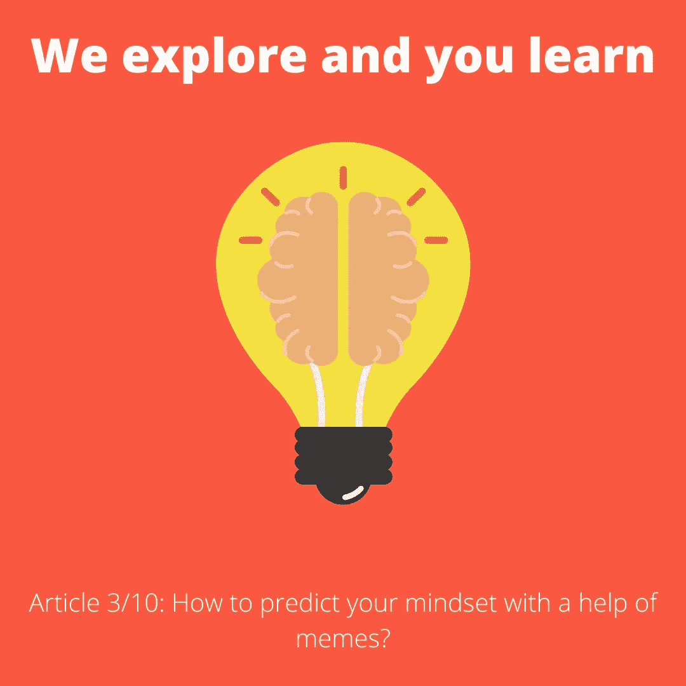
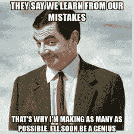
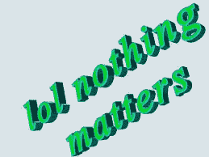

# 如何借助模因预测自己的心态？

> 原文：<https://medium.datadriveninvestor.com/how-to-predict-your-mindset-with-the-help-of-memes-31ebeb1dc432?source=collection_archive---------15----------------------->

大家好，

很高兴看到您回来阅读本系列的第三篇文章，标题是“[我们探索，您学习](https://twitter.com/dhruvtrehan45/status/1308142729004638208)”。

直到现在，我想你应该很清楚我对读者的期望是什么。如果没有，请立即查看我以前的文章:

第一条:“[如果你想创业，你应该问自己的 9 个问题”](https://link.medium.com/wnfYAHOtbab)

第二条:[“如何发展谈判技巧的 5 个建议？”](https://link.medium.com/jywj4loc89)

所以，回到我们在这篇文章中要介绍的内容。只是一个提示:这次会更有趣，因为我和 Asmi(我的队友)一起探索了 Carol Dweck 博士的研究，后来提出了一些视觉分析，我将在本文中分享。

让我们从迷因开始，因为我知道你们把迷因联系得很好。

剧透:我知道你已经发现了这一个。

Image Courtesy: Meme you(Tell me if anyone own)

这个迷因让我变得理智，让我对自己的主题进行更多的探索。

> 旅程从这里开始，我探索了特定主题的每一点，后来我和我的队友一起进行了探索性分析，这使我围绕关键词“增长思维模式与固定思维模式”记录了这篇文章。

Image courtesy: [Drill it Down](https://www.drillitdown.com/)

是的，这是一个关于上述主题的非常详细的概述。首先，我希望你回答我的几个疑问/疑问/问题:

> 你曾经试图从你的错误中吸取教训吗？
> 
> 当你面对生活中的任何批评时，你的反应是什么？
> 
> 当你受到某人的挑战时，什么对你来说很重要？
> 
> 当你面对第一次失败时，你的反应是什么？
> 
> 你被别人的成就所激励吗？

我希望你诚实地回答这些问题。这些答案只能帮助你得到你自己的详细分析。

 [## 贫困心理学|数据驱动的投资者

### 似乎有一种真诚的信念，如果你足够努力地工作，有远大的梦想并努力去做，你就会摆脱贫困…

www.datadriveninvestor.com](https://www.datadriveninvestor.com/2020/01/31/psychology-of-poverty/) 

现在，让我们通过预测答案来做分析，你可以在一些策划的迷因的帮助下想到这些答案。

[Meme](https://www.thiswasntonthelessonplan.com/blogs/my-worst-teaching-mistakes-and-how-you-can-avoid-them)

憨豆先生提出了一个术语，如果他一再犯错，他很快就会成为天才。他会吗？

我猜他不会。使你成为一个人的，是你从你一生中曾经犯下的错误中学到了多少。一个错误或一个剧透警报就足以让你回到赛道上。所以，避免像憨豆先生一样，因为他有固定的思维模式，你需要搞砸与[成长思维模式](https://www.drillitdown.com/growth-mindset-article/)更相关的迷因，而不是像**憨豆先生**。

*如何写出能帮助你恰当地分析自己的完美答案:*

> 写下过去 10 年中发生在你身上的 5 件事。
> 
> 写下你从这些事件中学到的东西。
> 
> 每一件事都应该给你的生活增加一些不同的价值。
> 
> 写下该事件影响你生活方式的方式。
> 
> 如果同样的事情再次发生在你身上，你会有什么反应？

注意:练习这个超过一个月肯定会增加你生活的价值，并帮助你向发展成长心态更近一步。

现在，今天的第二个问题是:“**当你在生活中面临任何批评时，该如何反应？”**

如果你是下图中的那种人，那么巴迪“你需要尽快改变自己，因为有成长心态的人只有在他们的评论给他们的生活带来积极意义时才会在意批评者。”

[When you care about critics?](https://highlysensitiverefuge.com/highly-sensitive-people-criticism/)

如果你是一个无忧无虑的人，那么这甚至不是一个成长心态的好迹象，因为你仍然需要注意那些评论你工作的批评家，因为你总是有机会从他们那里学到很多东西。

[Why nothing matters to you?](https://www.washingtonpost.com/technology/2019/12/30/most-important-viral-reactions-internet-past-years/)

抓住你了。

> 我希望你喜欢读到现在，如果是这样的话:我他妈的肯定，你会喜欢我们接下来要讨论的内容！

如何写出完美的答案来分析你在生活中曾经面临的批评:

> 策划一个故事，分享你在生活中面临的最负面的批评，以及你对此的反应。
> 
> 策划一个故事，分享你在生活中遇到的最积极的批评，以及你对此的反应。
> 
> 事情做完了，现在你只需要分析你的故事，你就会得到你的答案。
> 
> 好吧！你不信任我？所以，你为什么不试试呢！

今天的第三个问题是:“**当你受到某人的挑战时，什么对你来说很重要？”**

所以，我认为作者想知道的是:“*每当你被某人挑战时，你的第一个想法是什么？”*

比如，如果有人挑战我。我的第一个想法是:“*这个挑战不会让我失去我最爱的东西吗？”*

对我来说，这是一个合理的想法。但是，还是时隔多年。我觉得，我的第一个想法应该永远是:

> “为什么我会受到挑战？
> 
> 我能从中学到什么？
> 
> 我为什么要参加？
> 
> 如果我不知何故失去了呢？"

因此，添加一些可信的词语，比如:不知何故，这是一种成长心态的标志。这些话给你一种力量去奋斗和反击，即使是在最糟糕的时候。

文章中提到的第四个问题是，“**当你面对第一次失败时，你是如何反应的？”**

[Failure](https://reputationtoday.in/failure-and-failing/)

*所以，如果有人私下问我:“当我失败时，我哭了，真的，我哭了。”*

原因是，在那之前我从未面对过失败。从来没有人走过来告诉我，即使是我也可能会失败。在那之前，一切对我来说都很好，我很开心。但是，第一次有这样的事情发生。我彻底崩溃了。

现在，每当我想起那些日子，我觉得它们仍然是我们生活中的一种可能性，我们应该试着对我们正在做的事情进行现实检查。

> 整个谈话的唯一要点是试着从你生活中最糟糕的情况中吸取一些积极的东西。

比如，我讨厌我学校的高三。

我真的很讨厌我一生中的几个决定，比如，“**我为什么要换学校？；为什么我改变了我的城镇？；为什么我没有尝试新的东西？；为什么我过着每个人都希望我过的生活？”**

整个局面的最终结果是，“*在完成了我在学校的最后两年高三后，我的生活完全改变了。情况让我变得更加强大，因为我试图分析整个情况，我对从我的经历中获得的任何东西都感到满意。”*

最后也是最后一个问题，“你被其他人的成就激励过吗？”

Are you inspired?

你写下这个答案的唯一前提，就是要:**对自己**诚实。当谈到分析人类年表时，我们都嫉妒别人的成就，这是一件好事，直到它激励我们做得更好。

所以，重新发现你在生活中的任何时候对某人的嫉妒程度，然后分析它。

**如何分析？**

> 首先，了解嫉妒背后的原因。你的嫉妒达到了什么程度，你的潜意识强迫你做了什么，以及最终那种嫉妒的感觉是如何逃离的。

这样，我们就可以结束这篇文章了。那么，让我知道: ***你最喜欢哪些策略和技巧，你希望下一篇文章是关于哪个主题的？***

请通过 [Dhruv Trehan](https://www.linkedin.com/in/dhruv-trehan-8a0466156/) 与我联系

与 Asmi 联系: [Asmi Gupta](https://www.linkedin.com/in/asmi-gupta-112a811b2/)

[Thank you](https://www.proposify.com/blog/how-to-say-thank-you-in-business)

## 访问专家视图— [订阅 DDI 英特尔](https://datadriveninvestor.com/ddi-intel)