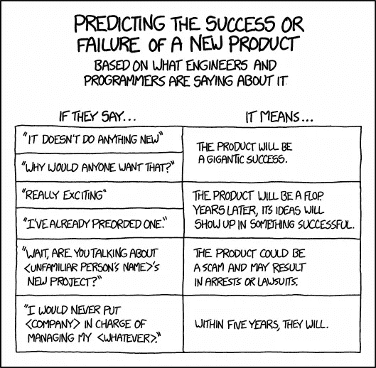
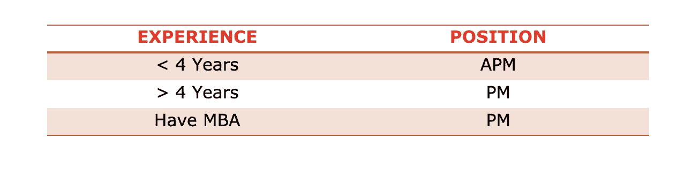
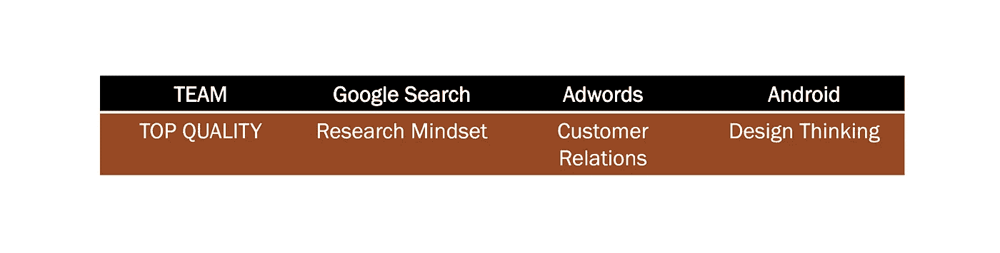
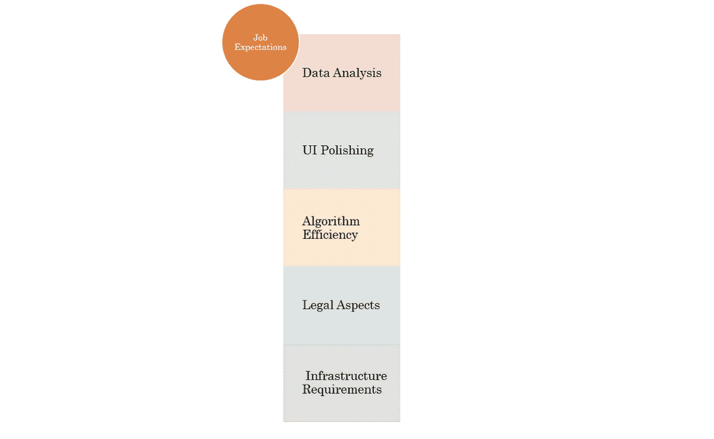

# 如何准备谷歌项目经理的角色

> 原文：<https://medium.datadriveninvestor.com/how-to-prepare-for-google-pm-role-be5951f4efce?source=collection_archive---------6----------------------->

## 在谷歌上获得 PM 工作的建议！

Photo by [Arthur Osipyan](https://unsplash.com/@arty_nyc?utm_source=medium&utm_medium=referral) on [Unsplash](https://unsplash.com?utm_source=medium&utm_medium=referral)

# 概观

谷歌的愿景来自于步兵，因为它天生就是工程师驱动的。因此，预防性维护的作用是确保工程机械运转良好。谷歌的产品经理为其工程师提供他们可能需要的任何非工程支持。这涵盖了从设计到客户反馈的所有环节。项目经理的一个重要角色是将他们的职能建立在分析和策略的基础上。

> 谷歌的愿景来自于步兵，因为它天生就是工程师驱动的。

# 文化@谷歌

要了解他们雇佣的是什么样的人，你需要了解他们的文化。谷歌本质上一直是一家初创公司。他们的文化源于同一个。他们欢迎新的和创新的想法，并不害怕冒险进入未知的领域。他们对跨团队共享代码和跨团队协作持开放态度。这就是为什么在谷歌的职业生涯中，很多产品经理会跨团队流动。

> 这就是为什么很多产品经理在谷歌的职业生涯中倾向于跨团队流动

# PM/工程师比率

产品经理的角色很大程度上取决于公司的项目经理与工程师的比例。谷歌每个工程师的项目经理很少。这影响了项目经理与工程师互动的频率以及她处理的项目的规模。谷歌的产品经理获得大型项目的所有权。

[XKCD — What Engineers Say](https://xkcd.com/1497/)

跨团队协作是产品经理工作描述的一大部分。在谷歌更是如此，因为当谈到不同团队在做什么时，有很多透明度。谷歌的项目经理倾向于在团队之间频繁流动

> 谷歌的产品经理获得大型项目的所有权。

# 经验水平

与苹果和亚马逊相反，谷歌热衷于雇佣 ncg(新大学毕业生)担任项目经理。这些毕业生一般都是计算机专业的。他们加入 APM(助理产品经理)计划，这是一个为期两年的轮换计划。尽管谷歌聘请 MBA 担任项目经理，但它更喜欢博士和硕士学位的人。

最重要的是，他们寻找有自我驱动力的企业家，这些企业家有技术当早餐。

Experience Based Role @ Google

## 高级电源管理

这是一个 2 年的初学者项目，是一个地狱般的旅程。

# 工作说明

Google 拥有大量的产品，每个产品对其 PM 角色的要求都略有不同。虽然谷歌搜索团队可能要求其项目经理具有学术头脑，但 Android 团队的项目经理可能需要灌输更高层次的设计思维。

Example requirements depending on team priorities.

谷歌可能是唯一一家给新总理极大自由的公司。事实上，有时候项目经理的第一个任务就是为自己设计一个项目。

 [## 人工智能如何在全球创造数百万个远程工作岗位|数据驱动的投资者

### 当人们谈论人工智能和就业市场时，他们经常谈论人工智能将如何从…

www.datadriveninvestor.com](https://www.datadriveninvestor.com/2020/02/26/how-ai-is-creating-millions-of-remote-jobs-around-the-world/) 

## 最重要的技能

在谷歌，项目经理最需要的技能之一是具备分析思维。谷歌的产品会产生大量数据。即使是 MVP 或 alpha 版本也会产生数十亿字节的用户数据。需要一个项目经理来分析这些数据，以决定产品方向。

Expectations from a PM

## 20%的时间

人们总是可以期待谷歌推动创新。谷歌允许其项目经理和工程师分配 20%的时间来创造创新。没有批准，没有限制！Gmail 和 Orkut 都是从这 20%的项目开始的。因此，谷歌的项目经理有无限的自由和执行的自由。

谷歌产品经理的角色是任何渴望成为项目经理的人梦寐以求的角色。以上见解来自盖尔·拉克曼·麦克道尔(CareerCup.com 公司创始人兼首席执行官)和杰基·巴瓦罗(阿萨纳公司产品经理)的一本精彩的书

 [## 破解 PM 访谈

### TL；博士-成为一个邪恶的聪明的多面手，因为市场仍然在定义刚刚添加了标题的角色…

www.goodreads.com](https://www.goodreads.com/book/show/19243347-cracking-the-pm-interview) 

**访问专家视图—** [**订阅 DDI 英特尔**](https://datadriveninvestor.com/ddi-intel)