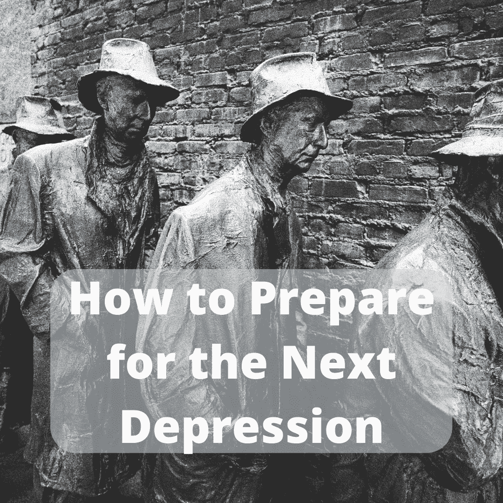

# 如何为下一次萧条做准备

> 原文：<https://medium.datadriveninvestor.com/how-to-prepare-for-the-next-depression-a4f144fcdfa3?source=collection_archive---------7----------------------->

# 冠状病毒可能会引发下一次抑郁症

全球经济正受到冠状病毒爆发的严重影响。企业要么暂时关门，要么永久关门。各国政府正在制定一揽子刺激计划，各国央行正在向金融体系提供流动性。虽然你可能记得在 2008 年金融危机期间看到过类似的市场效应和应对措施，但在这次疫情期间，市场暴跌的速度是前所未有的。此外，最糟糕的还在后面。在美国和欧洲，冠状病毒病例仍在快速上升。医疗保健系统开始出现问题。失业率开始上升。没有疫苗，我们将永远无法度过这一关。随着事态继续恶化，我们需要学会如何为下一次萧条做准备。下面，我详细介绍了我们可以采取的 3 项措施，以避免冠状病毒危机带来的经济影响。

# 1.多元化你的收入来源

由于生活何时能恢复某种程度的正常存在如此多的不确定性，雇主和雇员都处于极其脆弱的境地。由于步行交通陷入停滞，实体商业一直受到影响。公司正在撤回他们的指导，因为他们不能预测事情会变得多糟糕。政府正在介入，但也只能帮这么多。为下一次萧条做准备的最好方法之一是通过分散收入来源来帮助我们自己。这听起来说起来容易做起来难，但我们可以利用一些好机会。下面，我列出了三个目前需求量很大的[副业](https://bunkerbasics.com/part-time-side-hustles/)。

 [## 更好的预算，打造更大的|数据驱动型投资者

### 即使是专家也承认它们并不完美。从 1 到 10 的范围内，安东尼·科普曼和德尔…

www.datadriveninvestor.com](https://www.datadriveninvestor.com/2018/11/08/budget-better-to-build-bigger/) 

## 机会 1:交付

随着各州开始发布就地安置令，全国各地的餐馆都在关闭店铺。然而，餐馆仍然被允许给顾客送餐。食品配送需求的增加为副业提供了机会。像 [Uber Eats](https://www.ubereats.com/) 、 [DoorDash](https://www.doordash.com/) 和 [Postmates](https://postmates.com/) 这样的送餐应用正在帮助餐馆维持运营。他们还为隔离区的人们提供了急需的服务。在一个重要的时候，为快递服务工作是分散你收入来源的好方法。

## 机会 2:远程学习

许多学校被关闭，迫使教师努力解决如何远程教育学生的问题。然而，学生并不是唯一需要继续接受教育的人。随着冠状病毒危机的加深，情况尤其如此。当失业开始产生影响时，人们将需要学习高需求的技能。甚至在需要这些技能之前就学习它们是在隔离状态下打发时间的一种谨慎方式。这为那些急需技能的人提供了赚取额外收入的机会。你可以通过在 YouTube 上发布教育视频，在播客上分享你的知识，或者通过兼职教学服务来赚钱。我们应该始终优先考虑继续我们的教育。通过远程教育他人，我们可以在非常需要的时候为社会做出贡献，同时在这个过程中帮助自己。

## 机会 3:将爱好货币化

爱好是发泄情绪的好方法。它们也是赚取额外收入的好方法。木工、艺术和手工艺、汽车修复和园艺只是可以货币化的爱好的一些例子。我的朋友从头开始做了一张餐桌，看起来比市场上的任何东西都好。太美了。太漂亮了，事实上，我也想要一个。我提议付钱让他给我做一个，他同意了。木工一直是他的爱好。现在真的有回报了。有了像 Etsy 和 MegaHobby.com 这样的网站，你可以找到愿意付钱给你做你喜欢的事情的人。这些都是很好的平台，可以帮助你把你的劳动产品运送给那些可以享受它的人。你不需要离开家来使你的收入来源多样化。所以，如果你想知道如何为下一次萧条做准备，就开始想办法做你已经热爱的事情来获得报酬。

# 2.勒紧你的钱包

在为隔离措施辩护时，我们听到政客们反复声明我们需要为了更大的利益做出牺牲。我同意他们要求我们做出的牺牲是必要的，但这种牺牲只是冰山一角。我们也需要勒紧我们的钱包。牛市已经结束，所以是时候改变我们的消费行为了。我们应该总是量入为出。如果我们的手段越来越不确定，那么我们应该极其谨慎。首先，我们应该避免承担任何额外的债务。在艰难的市场环境下，我们最不需要的就是另一项金融义务。让我们也买通用品牌，买旧货，在买新衣服之前穿久一点，用胶带来修补我们弄坏的东西，而不是购买替代品。虽然这个建议似乎显而易见，但从长远来看，小的行为改变可以转化为大的节约。我们应该从现在开始改变我们的行为。

# 3.尽你所能储蓄

随着我们进入 2020 年第二季度，每个人都将感受到更严峻的财务压力。那些投资股市的人已经遭受了巨大的损失，但这仅仅是开始。公司将勒紧他们众所周知的裤腰带。你今年争取加薪了吗？你通常指望你的圣诞奖金吗？你应该很高兴保住你的工作。这就是为什么当你可以的时候存钱是很重要的。公司管理层不一定喜欢解雇员工，但他们会在必要时这么做。如果你不幸收到解雇通知书，你会希望有存款来帮助你度过一段艰难的财务时期。我建议现在就开始存钱。如果你已经有储蓄基金，积极地增加它。牢记上面的建议，开始勒紧自己的钱袋，这样你就可以在力所能及的时候存钱了。

# 逆向思维:冒险

我通常不会建议冒大风险。话虽如此，我不能否认许多最具标志性和最成功的公司都是在市场低迷时期创立的。苹果、微软和通用电气都是在经济困难时期创立的。当其他人太胆小不敢冒险的时候，你可能会把经济低迷视为投资的机会。资产价格低迷，市场动荡。根据你的风险承受能力，这可能是掷骰子的最佳时机。风险越大，回报越大。要知道成功的几率对你不利。

# 如何为下一次萧条做准备:现在就行动

对于如何为下一次萧条做准备，没有固定的公式。我们不知道情况会有多糟糕，也不知道我们会受到多大程度的影响。然而，我们可以采取行动来降低财务困难的风险。想办法分散你的收入来源，节俭消费，开始存钱。我们不能控制经济，但我们可以控制我们为度过经济衰退做了多少准备。那些今天做出艰难、务实决定的人将为自己未来的成功做好准备。我希望你是其中之一。

最初发布于:[https://bunker basics . com/how-to-prepare-for-the-next-depression/](https://bunkerbasics.com/how-to-prepare-for-the-next-depression/)