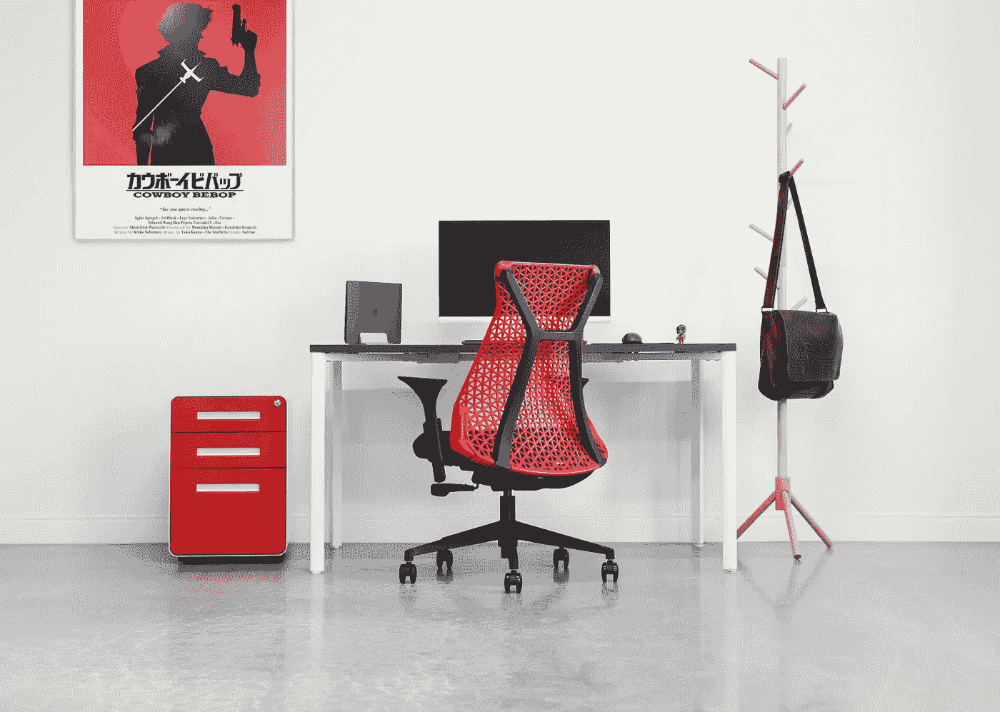

# 如何做好准备成为一名全职远程工作者

> 原文：<https://medium.datadriveninvestor.com/how-to-prepare-yourself-to-thrive-as-a-full-time-remote-worker-c8fc7fcccd07?source=collection_archive---------4----------------------->

## 规划未来的 6 种方法，无需传统办公室

Photo by [Laura Davidson](https://unsplash.com/@lauradavidson?utm_source=unsplash&utm_medium=referral&utm_content=creditCopyText) on [Unsplash](https://unsplash.com/s/photos/office-empty?utm_source=unsplash&utm_medium=referral&utm_content=creditCopyText)

今年早些时候，许多不知情的隔间员工第一次尝到了远程工作的滋味。

对一些人来说，这成了一个有趣的实验。

对其他人来说，这意味着更多的家庭时间和更少的通勤。但对大多数人来说，工作模式的改变代表了巨大的冲击。

他们熟悉的办公室惯例不得不让位于新规则和新想法。他们的交流渠道变了。最重要的是，他们突然不得不面对不同的责任，并对自己负责。

没有人知道小隔间是否会很快成为过去，或者雇主是否会在即将到来的经济衰退中施加更多的控制。

但有一个趋势是明确的:远程工作安排将继续存在。

无论你的主要愿望是回到办公室还是永远远程工作，都有一些有用的方法来为不确定的未来做计划。

作为一名数字流浪者，多年来，在机场、咖啡店和机场航站楼工作已经成为我职业生活中不可或缺的一部分。

我的工作程序不依赖于传统的办公室设置，让风景的变化变得轻而易举。

不管你是必须在家工作还是想全职去 T2 出差，以下远程工作原则将会提高你的生产力、纪律性和勤奋程度。

在此基础上，以下是如何让自己做好准备，成为一名全职远程工作者。

# **1。学习如何将你的工作习惯与平常的办公环境分开**

作为一名远程工作者，成功的秘诀是将你的日常工作从僵硬的办公环境中分离出来。

因此，你的习惯不能依赖于只存在于传统办公室的特定因素。

举个例子，如果你只觉得和同事在一起很有效率，你就需要找到方法在没有同事的情况下复制这种感觉。

在这方面，不断的沟通会有所帮助。

同样，一些人在没有他们处于工作环境中视觉线索的情况下不能切换到工作模式。

在这种背景下，特定的办公室背景、熟悉的面孔和与工作相关的家具往往会发挥作用。

解决方案是在您的远程工作地点尽可能地反映这些视觉线索。

如果有空间的话，建立一个专门的家庭办公室。改变你的桌面背景，模仿你办公室里的背景。最后，穿上你在办公大楼里会穿的衣服。

挑战在于建立一个不需要真正的办公室就能保证你工作效率的程序。

# **2。训练你的注意力以抵御干扰**

对于第一次远程办公的员工来说，最大的挑战之一是在日常办公之外保持注意力集中。

无论你是旅行还是在家工作，你都会面临分心的事情。如果没有适当的保护措施，这些干扰会扼杀你的注意力。

如果你想在任何地方保证你的工作成果，你需要训练你的思维，不管环境如何，都要专注于工作。

在这方面，进行单任务冲刺、定期冥想以及尽可能自动化是卓有成效的工具。

 [## 如何在困难时期保持你的生产力

### 艰难时期保持工作成果的 7 种方法

medium.com](https://medium.com/datadriveninvestor/how-to-safeguard-your-productivity-in-difficult-periods-13db0e6a6685) 

# **3。学习如何对自己负责**

责任是远程工作的重要组成部分。

作为一名员工，你习惯于对老板负责。根据不同的公司，你的上司会选择不同的方法来保证你的勤奋。

通过远程工作，你消灭了几种控制方法。因为没有上级亲自在场，一种形式的责任不复存在。

因此，你需要用不依赖于你上司的个人方法来代替那种形式的责任。

在这方面，责任日志、目标设定工作表和直接沟通渠道都很有效。

如果你是一名企业家，你将自始至终负责任，远程工作将增加另一层责任。

作为一个远程工作的企业家，你需要将你的责任系统从办公室转移到你的远程设备上。

激励你自己和你的员工在任何地方都保持责任感。

例如，许多成功的领导者承诺，如果他们的远程员工不在办公室时提交了更详细的报告，他们将给予奖励。

同样，由于自我负责而实现特定目标的游牧企业家通常会奖励自己旅游经历。

# **4。整理您的远程工作设备和技术**

远程工作可能不会成为你的全职生活方式，但它仍然会在你未来的工作安排中发挥作用。

这就是为什么整理你的设备和技术是显而易见的。

合适的笔记本电脑、椅子(如果你在家工作的话)、降噪耳机和其他元素，如设定目标的笔记本电脑，可以对你的整体工作效率产生积极的影响，无论你是继续远程工作还是回到办公室。

与远程工作设备类似，正确的技术至关重要。

因此，获得最有用的应用程序、软件和通信方式是为未来成为全职远程工作者做准备的理想方式。

# **5。确定您的最佳远程工作地点**

就像找到合适的装备一样，确定你的最佳远程工作地点是为远离办公室的未来做计划的好方法。

一些人在家移山，而另一些人喜欢 hygge 风格的咖啡店的舒适氛围。

最关键的一点是找到你最擅长的领域，并在这个领域为你的未来做好计划。

将来，你可能一周要远程工作两天。

事先知道你最有生产力的地方不是很好吗？

# **6。建立以结果为导向的思维模式，而不是办公室惯例**

最后，如果你想成为一名全职远程工作者，你需要采取正确的态度。

你需要形成一种优先考虑结果的心态，而不是与办公室相关的习惯。

在这种背景下，大多数企业办公楼都有不成文的规定。

当我在一家大型律师事务所工作时，有一个不言而喻的准则，那就是没有人会在晚上询问他们的上司是否需要更多帮助之前离开。

实际上，这几乎总是导致低年级学生等 30-60 分钟才能找到高年级学生。

在大多数情况下，这 30-60 分钟不会产生任何结果。它们只是老式办公室礼仪的一部分。

作为一个远程工作者，这些日常事务不能干扰你的节奏。没有人会去检查它们，如果你坚持这样做，你会失去宝贵的时间。

然而，重要的是结果。

总之，要成为一名成功的远程工作者，你需要优先考虑结果，而不是办公室的日常事务。

这些套路和潜规则在办公室之外都无关紧要。另一方面，你的成就会。

## 如果你喜欢这篇文章，[加入我的电子邮件列表，获得更多关于如何建立理想生活方式的想法](https://minimalistfocus.com/email-list/)。

# 你可能也会喜欢

 [## 7 名远程工作人员，随时随地保持高效工作

### 如何在平常的办公环境之外茁壮成长

medium.com](https://medium.com/datadriveninvestor/7-remote-working-hacks-to-stay-productive-anywhere-92554c9dd3fa)