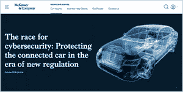
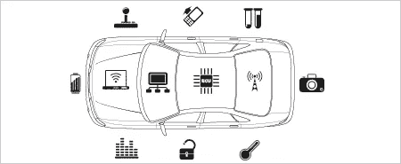
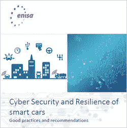
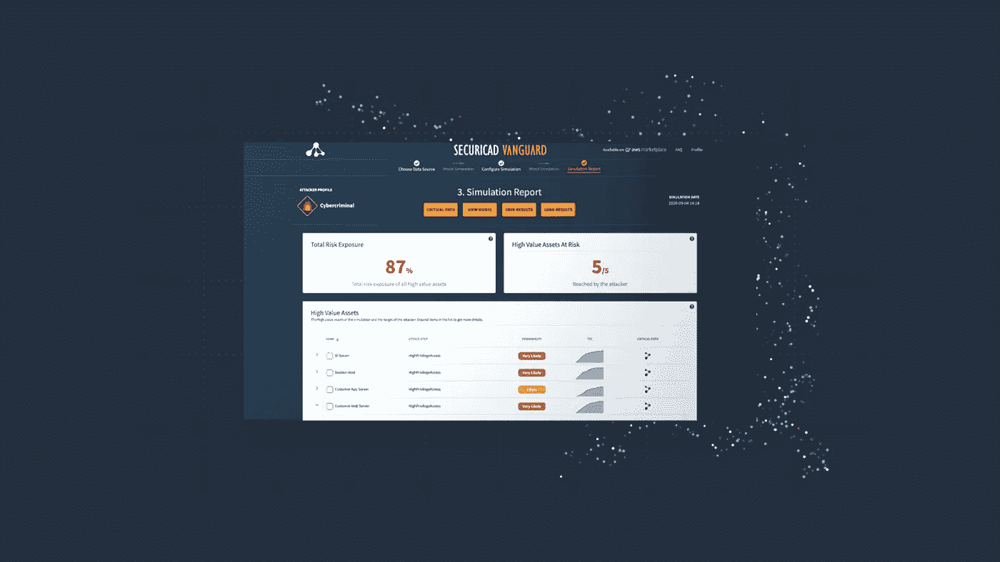

# 如何使用威胁建模防止联网汽车遭受网络攻击

> 原文：<https://medium.datadriveninvestor.com/how-to-prevent-cyber-attacks-on-connected-cars-using-threat-modeling-f7255ed12ab1?source=collection_archive---------28----------------------->

*Image by author*

**汽车行业正在经历重大变革**转向互联和自动驾驶汽车，随着越来越多的车辆使用 V2X 通信，风险和威胁也在上升。安全设计和主动管理网络风险绝对是关键。正如麦肯锡公司在本文 [*中所述，“汽车制造商必须从一开始就安全地设计车辆平台和相关的数字移动服务。这是因为汽车平台固有的复杂性，加上其漫长的开发周期和复杂的供应链，不允许后期的架构变化。”*](https://www.mckinsey.com/industries/automotive-and-assembly/our-insights/the-race-for-cybersecurity-protecting-the-connected-car-in-the-era-of-new-regulation) 然而，安全设计和主动管理风险是一项非常具有挑战性的任务，许多公司因此而苦苦挣扎。

*Image by* McKinsey and Company

**威胁建模非常适合这项任务。**它是一种优化网络/应用/互联网安全的方法，通过识别目标和漏洞并定义对策来防止或减轻威胁对系统/环境或设备的影响。对于汽车环境，威胁建模用于通过识别整个系统和不同部分的漏洞和威胁来主动增强安全性，例如特定产品/单元/ECU 控制器或连接受损可能导致道路事故、伤害、盗窃、财务损失等。

*Image by foreseeti*

**ENISA 在出版物** [***“智能汽车的网络安全和弹性，良好实践和建议. pdf”***](https://www.enisa.europa.eu/publications/cyber-security-and-resilience-of-smart-cars/at_download/fullReport)**中建议，汽车制造商应进行网络安全风险评估，包括对每辆汽车的威胁建模**以及围绕汽车的进出数据流。这些分析也应该随着时间的推移而更新。还建议制造商分析可能的威胁源，威胁源被定义为针对有意利用漏洞的意图和方法，或者可能意外触发漏洞的情况和方法。对于每个漏洞，应生成一份摘要报告，简要总结风险分析和威胁建模信息。分析结果和作为结果出现的关键信息也应可追溯到相关文档。

*Image by* **ENISA**

[**securiCAD**](https://foreseeti.com/securicad/) **工具支持为联网汽车量身定制的自动化威胁建模和攻击模拟，使威胁建模对汽车公司来说切实可行。** securiCAD 是自动化威胁建模和攻击模拟的领先工具，旨在对 IT 架构模型执行虚拟攻击模拟。它使公司能够将其威胁建模和风险评估从孤立的技术问题转变为衡量其 It 基础架构风险暴露的整体方法。securiCAD 的专业之一是联网车辆，使汽车公司能够对联网车辆的特定系统进行建模，并对这些特定系统进行自动威胁建模和攻击模拟。专业化是在一个创新项目中发展起来的，该项目涉及 [foreseeti](https://foreseeti.com/) 、斯堪尼亚、[沃尔沃汽车](https://www.volvocars.com/)、 [F-Secure](https://www.f-secure.com) 和 [KTH](https://www.kth.se/) 皇家理工学院。

# 在汽车行业使用 securiCAD:

使用 securiCAD 进行网络安全分析的基本方法是模拟对您当前或未来系统/设备/应用程序的数字双胞胎/模型的攻击。由于模拟是在数字双胞胎/模型上进行的，因此 securiCAD 不会干扰真实的现有解决方案。在 securiCAD 中构建环境模型时，检查模型/结构并标记高价值资产。模型中的任何对象和任何数量的对象都可以被选为高价值资产。securiCAD 中的攻击模拟随后将尝试到达模型的每个角落，这意味着对于模型中的大多数对象，都有攻击模拟结果。该报告显示选定高价值资产的风险暴露值和妥协时间值。关键路径和阻塞点可视化了攻击路径，即攻击者如何最容易地到达和/或危害您的高价值资产。然后，用户可以选择并测试不同的适用缓解措施的有效性，以评估如何以最有效的方式缓解风险。

*Image by author*

**设计阶段的主动建模:**使制造商能够在设备/产品或应用推出之前发现它们的弱点。在设计阶段和/或部署之前模拟对计划的 IT 架构的攻击。根据反馈给开发团队的见解采取主动行动。

**现有架构的主动建模:**以非侵入的方式分析活动系统。为你的架构建立一个模型；手动和自上而下，或通过数据导入自动完成。模拟攻击。找出在降低整体业务风险方面效果最好的安全措施。