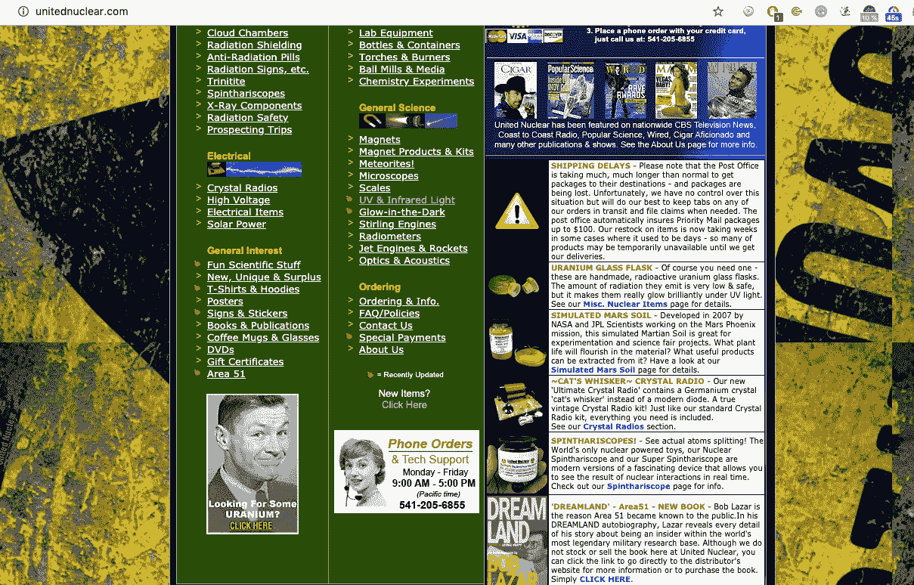

# 如何防止错误信息的传播

> 原文：<https://medium.datadriveninvestor.com/how-to-prevent-the-spread-of-misinformation-8ac03bca2f1f?source=collection_archive---------2----------------------->

*—如何在散布假新闻前抓住自己。*

两个月前，五角大楼投下了这个重磅炸弹。假设你没看过视频。我劝你现在就看——它会让你大吃一惊的。

Source: [Guardian](https://www.youtube.com/watch?v=auITEKd4sjA)

[五角大楼关于视频的官方声明](https://www.defense.gov/Newsroom/Releases/Release/Article/2165713/statement-by-the-department-of-defense-on-the-release-of-historical-navy-videos/)

首先，不明飞行物或不明飞行物并不直接暗示地外生命的存在。其次，这不是一个关于美国政府精心策划掩盖真相的故事。写这篇博客是为了让你在研究晦涩难懂的东西时能提出更好的关键问题。

解开谜团的崇高追求充满了陷阱。当真实和虚构之间的界限变得模糊时，内部冲突就产生了。你可以开始质疑现实、社会、身份等的基础。由于无法区分事实和观点，大多数人最终陷入了虚无主义的兔子洞——不知道该相信谁或什么。

为了防止这种好奇的风险。你必须用怀疑的态度取代开放的态度，只有在严格的事实核查过程后才能形成观点。虽然这个过程很耗时，但它会带来双倍的回报，因为它挑战了你对现实或想象社会的理解。

> 第一个原则是你不能欺骗自己——而你是最容易被欺骗的人。—理查德·费曼

# 真实性

约翰·奥利弗制作了一集关于如何区分事实和虚构的[特别节目](https://www.youtube.com/watch?v=0b_eHBZLM6U)。为什么那么多人会上阴谋论的当？

以 1963 年肯尼迪遇刺为例。很难相信一个人能绕过训练有素的保镖监视系统。在行为经济学中，这被称为[比例偏差](https://en.wikipedia.org/wiki/Proportionality_bias):假设重大事件有重大原因的倾向。

## 假新闻/文章

老实说，在你读了新闻或科学家的文章后，你自己会读参考资料吗？在我写这篇文章之前，我没有，除非我为大学写作。

地缘政治、全球化经济、气候变化、COVID 等话题错综复杂，未受教育的人看不到。

我想邀请你在面对一个非传统的理论或观点时，提出这三个问题，而不是在那个时候专注于一个主题而蒙蔽你的双眼。

1.  有理性的非阴谋解释吗？
2.  这是否经过了专家的审查？
3.  这种有争议的说法有多大的可信度？

## 个案研究

向你展示如何测试一个疯狂理论的有效性。我选了包伯·拉札的案例。

1989 年 11 月 11 日和 13 日，他站出来揭发美国政府拥有外星车辆的遗骸。他和其他科学家正在研究这些不明飞行物，以了解他们的技术。

对于有兴趣进行研究的人，耶戈在网飞纪录片[包伯·拉札中详细讲述了他在 51 区的经历:51 区&飞碟](https://www.imdb.com/title/tt9107368/)和[乔·罗根的播客采访](https://www.youtube.com/watch?v=BEWz4SXfyCQ&t=1s)。

以下是他提出的三项主张的清单:

*   115 号元素驱动反物质发生器产生重力场。
*   有人或某个组织抹去了他在麻省理工学院、加州理工学院和洛斯阿拉莫斯国家实验室的过去。
*   包伯·拉札在《乔·罗根秀》中声称他没有从自己的故事中获利，并希望人们不要打扰他和他的妻子

# 1.有理性的非阴谋解释吗？

根据加拿大报纸《星报》的专栏作家维奈·梅农的说法，耶戈要么是一个恶毒的骗子，要么是某种英雄。

## 人民的捍卫者

约瑟夫·坎贝尔(Joseph Cambell)写的书《英雄之旅》(The Hero's Journey)描述了人类神话中任何英雄的原型叙事。成为英雄意味着牺牲正常生活的机会来面对社会的不道德行为。在告密者的世界里，爱德华·斯诺登付出了全部的代价——很可能，他再也不会踏上美国的土地了。

据称，在提出不明飞行物理论后，包伯·拉札和他的妻子受到美国政府的骚扰，一些不明飞行物体疯子威胁他们。如果他的主张对公众来说是危险的，为什么没有人试图把他关进监狱？目前，鲍勃似乎婚姻幸福，他自己的企业联合核能公司蒸蒸日上。

## 不明飞行物爱好者的煽动者

怀疑论者称包伯·拉札为病态骗子，他用伪科学来说服 UFO 信徒。他为什么要危及自己作为科学家的尊严？

新闻网站 [INSIDER](https://www.insider.com/one-in-five-americans-believe-aliens-have-visited-earth-2019-7) 在 2019 年进行了一项民意调查，他们在美国询问了一千多名受访者，他们是否相信外星人已经来到地球。如果我们推断 20%的人代表整个美国，大约有 5000 万成年人会相信外星人已经登陆我们的星球。

## 财政激励

像亚马逊和网飞这样的媒体公司是如何将这一部分货币化的？
为了在美国媒体行业竞争，公司必须向他们的股东承诺市场份额的稳定增长。

淘汰旧的，引进新的——原创内容才是王道。网飞和 HBO 最近的成功吸引了亚马逊和迪士尼进入流媒体业务。假设你要为广大受众提供内容。有什么比 UFO 研究这个有争议的话题更有趣？

据《洛杉矶时报》的特约撰稿人斯蒂芬·巴塔格里奥(Stephen Battaglio)称，像网飞、HBO 和 CNN 这样的电视网愿意为一部高端纪录片支付高达六位数到一百万美元的费用。例如，网飞购买了三部关于这个主题的纪录片的版权 [*未被承认——一部揭露世界最大秘密的*](https://www.youtube.com/watch?v=XMnPKVbgH60)*[*包伯·拉札——第 51 区&飞碟*s](https://www.youtube.com/watch?v=Zn9RrAv60uM)[*太空生命的探索*](https://www.youtube.com/watch?v=FF_vhYBlQNE) *。*甚至[亚马逊 Kindle](https://www.amazon.com/Best-Sellers-Kindle-Store-UFOs/zgbs/digital-text/158617011) 在畅销书排行榜中也有 UFO 类别。*

*在 2020 年，成为 ufologist 可能是一项有利可图的工作。*

**

*Photo by [Dan Dimmock](https://unsplash.com/@dandimmock?utm_source=unsplash&utm_medium=referral&utm_content=creditCopyText) on [Unsplash](https://unsplash.com/s/photos/research?utm_source=unsplash&utm_medium=referral&utm_content=creditCopyText)*

# *2.这是否经过了专家的审查？*

*是的，很多人花了时间和精力来分析鲍勃·拉扎尔的故事的不同方面。为了节省你的时间，我把它缩小到叙事，物理，心理分析。*

## *受害者*

*叙事是故事的视角。根据不同的类型，我们会对主角感同身受，对对手感到厌恶。每次包伯·拉札讲述他的故事，他都塑造了一个偶然发现真相的普通工人的形象。*

*例如，纪录片 [*包伯·拉札——第 51 区&飞碟* s](https://www.youtube.com/watch?v=Zn9RrAv60uM) 的前提是，在他将机密细节局限于纪录片制作人[杰里米·科贝尔](https://en.wikipedia.org/wiki/Jeremy_Kenyon_Lockyer_Corbell)之后，联邦调查局突袭了包伯·拉札。*

*Vice Motherboard 的作者 Tim McMillan 找到了那次联邦调查局突袭的真实警方报告，报告称他们在寻找销售违禁元素铊的文件。2015 年，31 岁的 Janel Struzl 女士死于铊中毒。包伯·拉札没有被列为这起谋杀案的嫌疑人，但警方想知道他的公司是否拥有铊，以及买家是谁。*

*2017 年的这次突袭并不是耶戈和[联核](https://www.unitednuclear.com/) 第一次接触执法部门。此外，在 2003 年，耶戈的家遭到了消费者产品和安全委员会的突击检查，因为鲍勃在不知情的情况下向联邦特工出售了用于制造非法烟花的违禁化学品。*

*Youtube 怀疑论者，[机器人头](https://www.youtube.com/watch?v=VmJLSuLmgdg)，提供了他们设置这种受害者叙事的视觉证据。*

**

*Source: [Bob Lazar Area 51 & Flying Saucers — The Worst Documentary on Netflix](https://www.youtube.com/watch?v=VmJLSuLmgdg) timestamp 3.35*

*在这部纪录片中，杰瑞米在与正在进行突袭的包伯·拉札取得联系时，表现出了痛苦的情绪。而事实上，真实事件的日期与那次突袭的日期并不相同。因此，我得出结论，他们策划了开场场景，给观众情感上的分量，以完成这部纪录片。*

*对叙述的操纵并不能证明包伯·拉札的经历没有发生。在电影制作中，与观众产生强烈的情感反应是一种众所周知的技巧。但这引发了关于道德操守的问题。*

## *物理学*

*鲍勃声称 115 号元素为反物质发生器提供能量，反物质发生器产生重力场，从而使不明飞行物飞行。在包伯·拉札宣称 115 号元素存在的 14 年后，莫斯科维奇被发现。然而，科学版的“115 号元素”与耶戈多年来描述的截然不同；该元素在 0.65 秒内衰变，不能用于任何用途。*

*粒子物理学家大卫·L·摩根博士指出，包伯·拉札的想法需要彻底改变我们目前对能量、引力和原子的理解。包伯·拉札说他徒手触摸了引擎，没有任何电线。*

*所以，反物质在地球上很难制造，因为它的不稳定性——[反物质](https://www.youtube.com/watch?v=Lo8NmoDL9T8)在物理接触时会湮灭物质。当真空只存在于像实验室这样的人造环境中时，很难修补反物质发动机。*

*核科学家斯坦顿·弗莱德曼对包伯·拉札的教育历史进行了研究。他没有找到一丝一毫的证据来支持学术可信度:没有文凭，没有简历，没有成绩单，没有专业组织的成员资格，没有论文，没有麻省理工学院或加州理工学院的年鉴。当斯坦顿查看耶戈的高中记录时，他发现鲍勃没有和他的同学同时毕业，只选修了一门科学课程，化学，在所有学生中排名第 261/396。因此，弗里德曼得出结论，耶戈永远不会被麻省理工学院或加州理工学院录取。*

*我们星球的环境使得基于反物质发电机的发动机无法提供动力，反物质发电机使用像 115 号元素这样的不稳定资源。在没有学术记录的情况下，包伯·拉札隐藏在理论概念的背后，比如重力场操纵，这类似于曲速的概念。*

## *社会分析*

*你有故事，你有所谓的事实，你有那个人。当鲍勃在采访中回忆过去时，他的故事似乎与他之前的回忆有所关联。*

*心理健康顾问托德·格兰德博士分析了包伯·拉札的行为和过去。他认为鲍勃很有说服力，因为他有一些优点。*

*例如，鲍勃从不质疑怀疑论者，并且非常谦虚，因为他没有看到或知道一切——继续反英雄叙事，他没有选择聚光灯；这使得他很受大众喜爱。甚至在我做这个深入研究之前，我觉得听他的话是完整的。*

*当然，当耶戈讲述他的故事时，他省略了他的执法历史，经营妓院，申请破产，欺骗他的妻子，以及其他刑事犯罪。因此，格兰德得出结论，在看了事实后，他找不到任何理由相信他的故事。*

*包伯·拉札声称，他不喜欢他的报道引起的关注，或者说他的报道没有赚到一分钱。优步自动驾驶通过访问包伯·拉札公司的网站，揭穿了他的谎言。*

**

*Source: [UnitedNuclear](https://www.unitednuclear.com/) -> Look at the Dreamland Are 51 Book.*

*在我看来，耶戈先生具有反社会者的所有特征。他很有魅力，擅长交谈，但道德标准有问题。*

# *3.这个阴谋的可能性有多大？*

*换句话说，有多少人在故意撒谎？*

*例如，如果登月是假的。成千上万的人不得不被几个政府收买，包括天文学家、宇航员、火箭工程师，他们为探索太空奉献了一生。*

*包伯·拉札已经说服了他的妻子、朋友、纪录片制作人[杰瑞米·科贝尔](https://en.wikipedia.org/wiki/Jeremy_Kenyon_Lockyer_Corbell)、调查记者[乔治·纳普](https://en.wikipedia.org/wiki/George_Knapp_(television_journalist))、播客主持人[乔·罗根](https://en.wikipedia.org/wiki/Joe_Rogan)以及一小群忠实的追随者。*

*为了迎合自己的需要，他编造了这个故事，他辩称，政府抹去了他的过去，因为他们无法让他闭嘴。毕竟他上市了。*

*为什么美国政府没有对斯诺登做同样的事情？因为他出示了政府从事间谍活动的物证。*

## *公开*

*UFO 学家 Steven Greer 博士从 1952 年开始收集了一份政府研究 UFO 的证据清单。*

*我同意的是，政府，不仅仅是美国，应该向公众公开他们的发现。*

*我们在这个宇宙中并不孤独的想法打开了一个思考生命的新领域。特别是在气候变化的情况下，我们的星球可以在向可再生能源过渡和恢复生物圈的过程中使用一些技术帮助。*

# *最后的想法*

*写这个故事深刻地改变了我与我的网络分享的观点。当我发现自己在说什么的时候，我没有严格地核实事实，我会把我的话改写成“我相信”或者“以我的观点”但在大多数情况下，我会回答:“我不知道，但如果对你有影响的话，我可以做一些研究。"*

*不要总是分享关于政治、人际关系、科学或一般生活的每一个想法和观点，你可以选择谦虚，说出你在黑暗中的位置。*