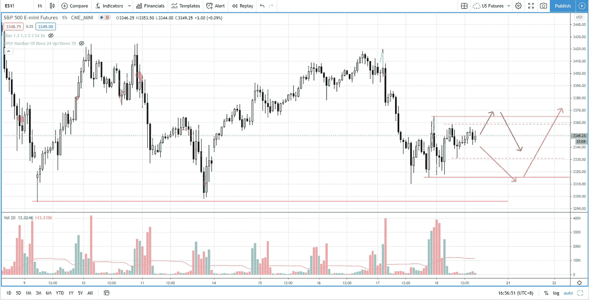

# 我交易上升楔形模式的秘密技术(这将立即增加你的利润)

> 原文：<https://medium.datadriveninvestor.com/how-to-profit-from-rising-wedge-pattern-day-trading-s-p-500-6c06dfe4f8ca?source=collection_archive---------9----------------------->

找出如何用我的秘密技术交易上升楔形模式来增加你的利润。

观看视频，了解 2020 年 9 月 18 日交易时段标准普尔 500 指数期货的**每日市场分析。在这段视频中，我将向您展示上一个交易日的市场回顾，以及三分钟内可能进行的交易回顾(包括进场、出场及其背后的原理)。**

## 时间戳

*   [1:05](https://www.youtube.com/watch?v=YumibLioD6w&t=65s) 昨日市场回顾
*   [4:30](https://www.youtube.com/watch?v=YumibLioD6w&t=270s) 贸易回顾
*   [5:45](https://www.youtube.com/watch?v=YumibLioD6w&t=345s) 上升楔形意味着什么
*   [8:25](https://www.youtube.com/watch?v=YumibLioD6w&t=505s) 隐藏电源
*   当前的市场状况

如果你还没有看我在上一次会议中的[每日市场分析视频](https://youtu.be/jfSvCwFYxzI)，以便更好地了解市场回顾和交易回顾。

**偏向** —中性(日内交易)；看涨(长期)

**关键点位** —阻力:3360-3380，3425，3450；支持:3300，3230

**潜在设置** —在关键级别寻找潜在反转。

# 资源

**每周市场展望&最佳交易建议【https://www.tradeprecise.com/】直抵您的收件箱:**

**职业免费**制图平台:创建账户→[www.TradingView.com](https://bit.ly/2U2Femd)

非美国居民？ ( **马来西亚、新加坡**、澳大利亚、新西兰、欧洲等):[点击此处，存款 2000 新加坡元](https://ji.hn/sgtiger)即可获得**免费股票(价值 100++美元)&老虎经纪**的欢迎礼物

美国居民？[点击此处，当您存入 1500 美元](https://ji.hn/ustradeup)时，就有机会在 TradeUP 上获得一份**免费的 AMZN 股票(价值 3000++美元** ) & **欢迎礼物**

**无限制访问媒体文章** —加入以下:【https://priceactiontrading.medium.com/membership】T2

# 进一步阅读

 [## 标准普尔 500 日交易中的趋势交易策略(有效)

### 通过以下两个步骤，了解如何使用这种趋势交易策略在标准普尔 500 期货日交易中获利…

medium.datadriveninvestor.com](/a-trend-trading-strategy-that-works-in-s-p-500-day-trading-3294e0aa837f)  [## 部门轮换基金流入家具行业-瑞士联邦理工学院，霍夫，腿，TPX

### 虽然纳斯达克和标准普尔 500 已经调整了两个多星期，但家具板块已经走强，而且…

medium.datadriveninvestor.com](/sector-rotation-fund-flows-into-furniture-industry-eth-hoft-leg-tpx-de725bc791d5)  [## 乘着这些受益于经济复苏的工业股票的强劲趋势——GLDD、MTZ、NOA…

### 尽管纳斯达克出现抛售，道琼斯指数却创下新高。工业股票领涨市场，因为它们是…

medium.datadriveninvestor.com](/riding-the-strong-trend-of-these-industrial-stocks-benefit-from-economy-recovery-gldd-mtz-noa-dafb63ff5a2a) 

披露:如果您点击本文中的链接进行购买或开立账户，并将所需金额存入推荐的经纪人账户，我们将免费为您赚取佣金。

免责声明:本演示中的信息仅用于教育目的，不应作为投资建议。