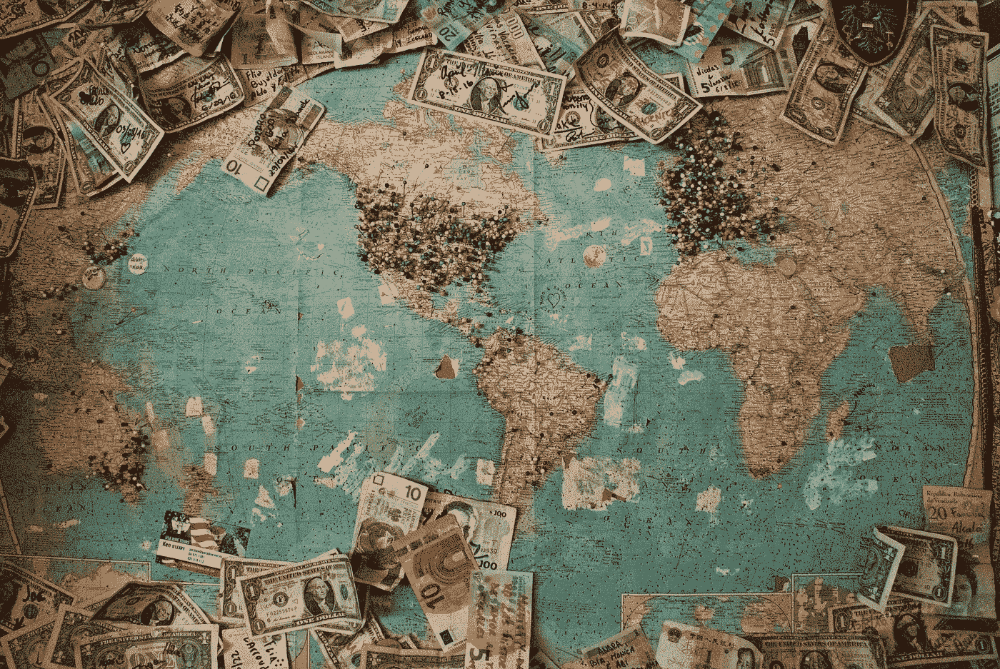

# 如何从财政刺激计划中获得最大利益

> 原文：<https://medium.datadriveninvestor.com/how-to-profit-from-the-fiscal-stimulus-plans-47fc6be952b9?source=collection_archive---------15----------------------->

## 很简单，跟着钱走

全球疫情正在伤害每个人。生命丧失，企业放缓或关闭，失业率上升。全球经济正受到新冠肺炎病毒的冲击。

虽然今天的媒体对病例和死亡人数的上升、封锁或疫苗，甚至对非理性和不负责任的政客都很狂热，但他们的焦点很快就会转移。因为当各国最终找到应对病毒的方法时，下一个大话题将是关于关闭的企业和裁员。

# 投入政府资金

Photo by [Christine Roy](https://unsplash.com/@agent_illustrateur?utm_source=unsplash&utm_medium=referral&utm_content=creditCopyText), Unsplash.

不要误解我的意思，公民的生计以及如何度过即将到来的全球经济衰退是一个正在进行的令人严重关切的话题。这就是为什么世界各国政府投入数十亿和数万亿美元来支撑他们的经济。

[美国](https://www.ft.com/content/9575e856-6ed3-11ea-9bca-bf503995cd6f)2 万亿美元，英国约[655 亿美元，中国](https://www.bloomberg.com/news/articles/2020-03-26/u-k-s-sunak-pledges-coronavirus-support-for-self-employed)约[3440 亿美元，其他国家还有更多数十亿美元。总计 7 万亿美元的救济、补贴、贷款和其他财政措施已经投入](https://www.reuters.com/article/us-health-coronavirus-china-measures/china-implementing-344-billion-of-mainly-fiscal-measures-in-coronavirus-fight-idUSKBN21D2I2)，而且这个数字预计还会上升。

这些是帮助人们应对困难所必需的，无论是那些靠薪水生活却突然没有薪水的人，还是那些失去收入但仍有租金的人。毕竟，他们的困境是疫情不可避免的影响，因为企业在惨淡的收入和有限的现金流中挣扎，这些现金流几乎跟不上日常运营支出。

 [## 投资区块链前要问的三个简单问题(也是一个困难的问题)|数据…

### 现在是了解区块链的最佳时机。不同货币之间的增长率，比如…

www.datadriveninvestor.com](https://www.datadriveninvestor.com/2020/03/12/three-simple-questions-and-one-difficult-one-to-ask-before-investing-in-a-blockchain/) 

然而，政府承诺维持经济运转的资金永远不够。这也不会是公平的分配。人们想要比他们需要的更多，这并不罕见，这可能是你对这篇文章感兴趣的原因。

# 要想在大流行后的经济中茁壮成长，跟着钱走

你可能会得到某种形式的经济援助，无论是生活费、补贴、租房延期还是免税。这些都是为了帮助企业和人们度过难关，直到经济恢复。

现在，停止那个想法。问问你自己，如果你没有这些货币支持会怎么样？

你可能需要调整你的生活方式。它可以是日常生活的微小变化——不喝酒、不外出就餐、不购物、不出国度假。*假期？这年头谁还能出门呢？*也可能是极端的，比如关闭你的企业，卖掉你的房子、汽车和其他资产来维持生活。无论是轻微的取舍还是巨大的牺牲，都是相对的。

你准备好做这些了吗？或者你希望这笔钱能帮你度过难关，直到我们回到正常状态？

我记得当我年轻的时候，我的祖母曾经只煮了粥和一个鸡蛋作为午餐。我抱怨并大发脾气，坚持说我会饿，对此她分享了她的家人如何在二战后的日子里几乎一无所有——想象一下自己种的红薯，一点点粥，大部分是水。*我以前不明白，但现在明白了。*

你看，我对一顿饭的不满就是特权的象征。很有可能，大多数希望货币政策帮助他们恢复正常生活的人也来自特权阶层——一个被资本主义纵容的阶层。

## 让生活回归“正常”

当然，我们今天生活在一个非常不同的世界——一个食物过剩的世界，即使它们只是腌制食品和方便面。全世界的政府可能都不认为我们需要达到这样的极端。因此，在我们“恢复正常”之前，这一切都是关于投入一点点援助。

这就是各种财政政策财政援助的本质——这些钱将帮助人们回归“正常”,无论“正常”是什么。

这些钱是用来刺激消费的，如果你想成为所有这些钱的接受者，不，你不必诉诸非正统的手段。**你只需要在所有消费的最后。**

## 每个人都渴望过自己平常的生活方式

在封锁期，每个人都渴望恢复正常。特朗普希望美国经济在复活节前恢复——这是一个一厢情愿的想法，后来被打消了，但请注意这一愿望。人们想走出家门，去见见他们的朋友，去环游世界。我们不都希望街道和经济再次繁荣起来吗？

我们每个人都希望回到正常的生活中，但很少有人愿意做出牺牲。或者也许情况还没有糟糕到我们不得不为长期的战争般的贫困生活做准备的地步。

资本主义助长了我们对“规范”的渴望。他们健康吗？不一定，但那是题外话。事实是，政府希望用所有的刺激资金帮助公民重新站起来，有些政府甚至准备“不惜一切代价”这样做。

# 回到“免费”的钱——如何最大限度地利用它？

为了充分利用财政政策，我们只需要在消费的末端，但这意味着什么呢？很简单，企业将再次繁荣，你想成为这些企业的一部分。

杂货和食物是日常必需品。然后，还有交通、购物和旅游。只要看看危机前人们在哪里消费就知道了；当经济“恢复”时，这可能是他们再次消费的地方。

话虽如此，[现在跳入一个行业是不明智的](https://marker.medium.com/tom-colicchio-spent-19-years-building-a-restaurant-empire-coronavirus-gutted-it-in-a-month-6c08cdc8cc05)。我们正处于一场没有疫苗、无法治愈的疫情，也不知道这场危机会持续多久。当人们害怕消费时，你不会想从事零售业；当所有其他国家都在考虑延长封锁期，而航空公司都在停飞它们的飞机时，你也不会想从事旅游和酒店行业。

但你可以肯定的是，飞机会再次起飞，人们会再次旅行，生活会恢复正常——不会很快，但最终会。齿轮将再次运转，资金将再次开始流动。

## 你不需要创业来拥有一家企业

还有，不一定要自己创业。有一种叫做“股权”的东西，你投入资金来拥有一家企业的一小部分。你只需要对正确的公司下正确的赌注，这完全是另一个教训。

我甚至听说过个人贷款投资股票。*野人*。银行提供创纪录的低利率？*非常感谢。*虽然杠杆是聪明的，但接住掉下来的刀也是高风险的；在承担债务之前，你最好知道如何管理风险。

抛开股票和杠杆，如果你想从所有的金融刺激中获利，你只需要聪明一点。在你的周围寻找线索，并在它们恢复正常之前投资于这些东西——股票、商业和交易。你会得到一大笔赏金。

*本文不应作为投资建议。如果有一件事你应该带走，那就是反思你自己的消费习惯，减少过度消费。因为当我们回到不受约束的资本主义状态时，我们只是在等待下一场危机。*