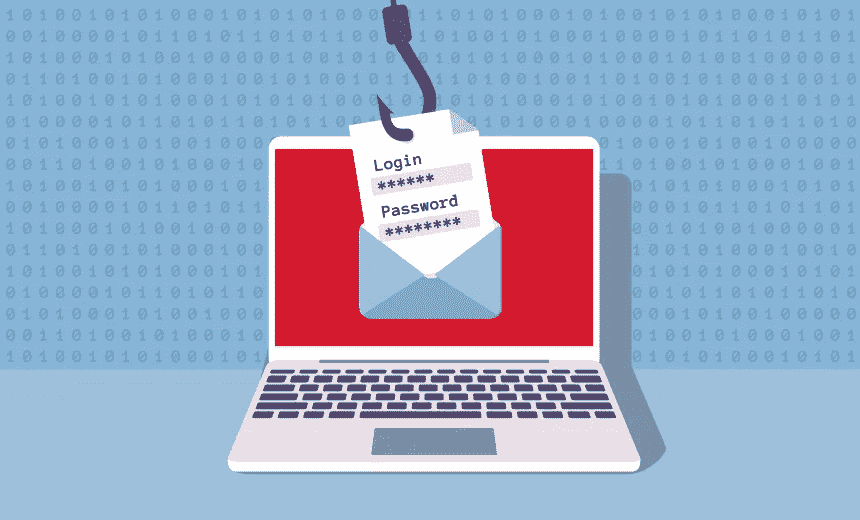
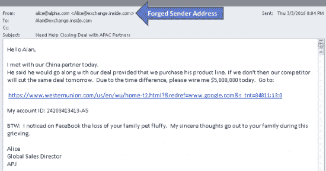
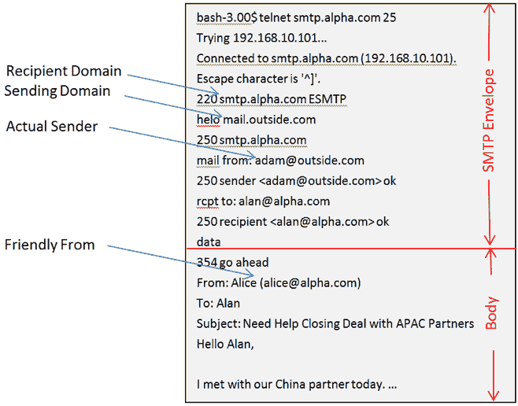

# 保护您的企业免受电子邮件危害攻击的 3 种方法

> 原文：<https://medium.datadriveninvestor.com/how-to-protect-your-business-from-bec-attacks-da70461a6d9b?source=collection_archive---------12----------------------->

BEC cybercriminals stole $1.7 billion in 2019

在过去三年中，BEC 攻击是网络犯罪分子窃取金钱和数据的最有效方法之一。

根据美国互联网犯罪投诉中心(IC3)的数据，[2019 年](https://pdf.ic3.gov/2019_IC3Report.pdf)向联邦调查局报告了 23，775 起事件——估计净损失资产 17 亿美元。

**什么是 BEC？**

> BEC 是一种具有高度针对性的网络犯罪攻击，它:
> 
> 1.发起与公司员工的电子邮件交流，或接管现有的电子邮件通信；
> 
> 2.获得员工的信任；
> 
> 3.说服员工向第三方发送机密数据或电汇，员工错误地认为这是合法的业务操作。

大多数 BEC 攻击的目标是让员工将资金转移到第三方账户，或窃取机密数据，但其他时候，礼品卡是通过电子邮件请求的。

Some BEC attacks presume the victim won’t pay attention

BEC 攻击采用四种攻击媒介。但是他们更多的主修社会工程。这些邮件从来都不是随机的，它通常是数月艰苦数据收集的结果。

**流行的 BEC 攻击媒介**

BEC 攻击利用四种流行的攻击方法。

**鱼叉式网络钓鱼**

根据一份 [FBI 宣誓书](https://www.documentcloud.org/documents/6299590-Obinwanne-Okeke-Affidavit.html)，2018 年 6 月，总部位于英国的卡特彼勒重工业和农业设备出口销售办公室 Unatrac Holding Limited 报告称，Unatrac 已通过电子邮件妥协成为受害者，最终导致总计近 1100 万美元的欺诈性电汇。

 [## 2020 年最佳短期投资选择精选资源|数据驱动型投资者

### 投资是增加你净财富的一个好方法。如果你通过遵循一个严格的…

www.datadriveninvestor.com](https://www.datadriveninvestor.com/2020/03/28/handpicked-resources-for-the-best-short-term-investment-options-of-2020/) 

Unatrac 的首席财务官(“CFO”)收到了一封包含 web 链接的网络钓鱼电子邮件，据称是指向该首席财务官在 Microsoft Office365 上的在线电子邮件帐户的登录页面。

当这位首席财务官打开这个链接时，他却被带到了一个精心制作的仿冒网站，该网站模仿了合法的 Office365 登录页面。他相信这个页面是真实的，于是输入了自己的登录凭证，这些凭证被一个控制这个伪造网页的未知入侵者捕获。

在获取合法凭证后，入侵者能够远程登录并访问首席财务官的整个 Office365 帐户，其中包括他的所有电子邮件和各种数字文件。

如果你在工作中处理敏感的现金头寸，限制你在社交媒体上发布的内容。

**暗网转储**

仅在 2018 年，就有 30 亿份凭据被盗，并在暗网上发布。骗子定期在黑暗的网络上搜索大量的数据转储。最近抛售的股票包括雅虎、优步、万豪、微软和脸书。这些垃圾会与监视名单上的受害者进行比较，如果发现匹配，欺诈者就会抢先行动。

其他时候，会仔细检查转储，并与电子邮件地址重新匹配，如果转储允许他们访问电子邮件，则会仔细研究流向该电子邮件的财务数据，以帮助破解。个人更有可能成为这种攻击的受害者。

**恶意软件**

随着西非技术领域的发展，BEC 犯罪分子也从完全的新手发展到构建和部署有效的恶意软件。退伍军人赚了足够的钱去买恶意软件。使得毫无准备的公司很难击败他们的企图。

大多数分析师仍然错误地认为 BEC 骗子是低技术的社会工程师。然而，[来自 Paolo Alto Network 第 42 单元的关于尼日利亚网络罪犯的研究](https://unit42.paloaltonetworks.com/silverterrier-2019-update/)指出，越来越多的证据表明，他们正在发展成为构建和部署恶意软件的全球恶名。

Unit42 的 Wildfire 恶意软件分析还估计了超过 27，000 次恶意软件 BEC 攻击。一些网络犯罪网络有内部的木马工程师。划掉那个！

**恶搞**

网络犯罪分子不仅在构建恶意软件，还会购买超出他们创造力范围的工具。在我的第一篇关于浪漫骗局的文章之后，我遭到了欺骗攻击，这表明了这些软件是多么的便宜。

我的电话号码被盗用了，我的电报账户被攻破了，还有我的电子邮件。带有电话号码的 2FA 是一个被高估的网络安全协议。

# 常见的 BEC 攻击方法

**电子邮件劫持**

这是最危险的 BEC 攻击形式，因为攻击者在发起攻击之前会研究并理解公司的通信资金转移协议。他们研究电子邮件中的消息和附件，可以很容易地伪装成被黑客攻击的受害者，并创建电子邮件过滤器，使最初的攻击受害者不知情，直到公司受到欺诈。

Keep your private life off social media

The email was a dud

**来自高级经理的请求**

2018 年，一家荷兰子公司的董事总经理据称收到了该集团法国董事总经理的一封电子邮件，授权向迪拜的一个账户支付款项，以购买一个秘密的市场优势。该公司在这次袭击中损失了 10 美元。

在这里，网络罪犯使用*伪造的电子邮件地址*以高级经理的名义发送虚假消息，如上图所示。为了让它更可信，他们研究他们攻击的主题，并善意地在电子邮件交流中加入经理的私人细节(攻击的受害者是知情的)，以使它更可信。

**假冒商业伙伴**

南俄勒冈大学[向骗子](https://mailtribune.com/news/happening-now/sou-loses-1-9-million-in-email-fraud)汇去近 200 万美元，这些骗子冒充安德森建筑公司——在校园里进行建筑工程的承包商——给学校发电子邮件。在这种情况下，欺诈者冒充受害者所在组织的合作公司代表。

他们通常通过注册与外部方的域名几乎相同的域名来做到这一点。有时，受害者的公司实际上是一家真正的公司。在其他情况下，假装成律师、会计师和其他商业伙伴。

# 其他 BEC 攻击技术

多年来，BEC 攻击已经从 CFO 骗局演变为技术和社会工程专业知识的复杂组合。技术技能为他们打开了一扇门，而他们的社会工程专业知识使罪犯能够撰写消息，触发预期的人类反应。以下是 BEC 骗子的一些攻击技巧:

**相似域**

一家打算投资一家初创公司的中国风险投资公司[损失了 100 万美元，因为犯罪分子](https://www.informationsecuritybuzz.com/study-research/how-to-steal-1-million-by-email-check-point-researchers-detail-million-dollar-fraud-against-chinese-vc-firm/)用欺骗性域名劫持了他们的对话。

在这里，网络犯罪分子注册的域名与他所冒充的外部供应商或他想要在内部攻破的公司非常相似。经常在原来的名字上省略或增加一个新的音节。

**电子邮件欺骗**

网络罪犯经常伪造电子邮件标题来迷惑受害者。结果，例如，在受害者的收件箱中，一条从*phisher@email.com*发出的信息看起来来自*yourCEO@yourcompany.com*。这种方法有很多变化，不同的头可以用不同的方式改变。在手机上查看这些邮件尤其危险。

**电子邮件劫持**

Unactrac Holdings 的首席财务官电子邮件被网络钓鱼攻击劫持后，损失了 1100 万美元， [Invictus Obi and co](https://www.documentcloud.org/documents/6299590-Obinwanne-Okeke-Affidavit.html) 接着下载了大量发票，并按照正常协议向其他员工发送虚假的付款电子邮件，授权将资金电汇到亚洲的账户。通过使用电子邮件规则，将授权邮件限制在有限的 IP 地址，可以限制这种攻击。

# **如何抵御 BEC 的攻击**

防范 BEC 骗局需要多种措施，因为 BEC 骗局通常是技术威胁和社会工程的结合。

首先，假设公司服务器中的一封电子邮件已经被入侵。这种思维模式将改变游戏规则，为公司的网络安全政策定下基调。

尼日利亚的网络罪犯因 BEC 诈骗案而臭名昭著，曾多次被定罪，但中国对知识产权的网络盗窃迄今为止只记录了[一次定罪](https://www.washingtonpost.com/world/national-security/46-month-sentence-for-businessman-who-helped-chinese-military-hackers-steal-data-from-us-defense-contractors/2016/07/13/8807d35c-4946-11e6-bdb9-701687974517_story.html)，因为还没有丢失的钱触发警报，许多商业机密已被中国人窃取。

关键是，被泄露的电子邮件比执法部门披露的还要多。

将内部电子邮件视为已经泄露。对于非常需要隐私的公司，制定一项政策，要求定期在全公司范围内更改密码。

**设置离岸资金转移规则**

我曾经住在一个大门通向多个公寓的房子里，我们轮流在晚上锁门，没有明确的顺序或责任范围，有些晚上我们双重检查大门以确认它是否锁了，其他晚上没有人费心检查，假设其他人已经检查了，在那些晚上的一个晚上，我们的公寓被盗。

明确定义贵公司的资金转账程序，以便向第三方账户转账经过一系列审批。某些门槛金额要求链条上有更多的高级管理人员。

**员工意识**

意识是遏制商业电子邮件危害攻击的核心，通过结合攻击模拟和研讨会来培训您的员工，重点是怀疑传入电子邮件的真实性，这些电子邮件要求违反官方政策的快速响应。

[如果您在认知培训方面需要帮助，请联系我](https://gum.co/abIccf)。

**实施电子邮件安全策略**

实施电子邮件安全策略，如 SPF、DKIM 签名和 DMARC 策略，以防范内部攻击。

如果你觉得这篇文章有用，你可以在 Twitter @ [Mxnasseh](http://www.twitter.com/mxnasseh) 上关注我。

[加入我的时事通讯](https://gumroad.com/mxnasseh/follow)，了解更多关于欺诈、网络诈骗和阴谋的信息。