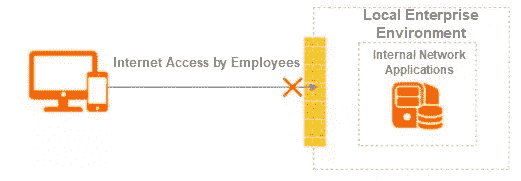
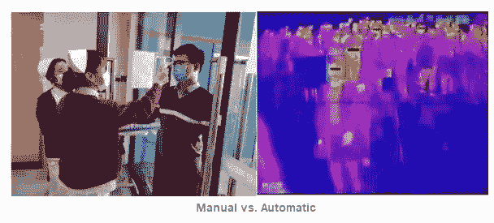
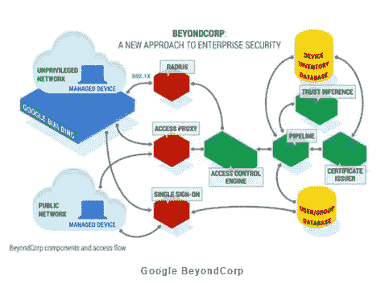
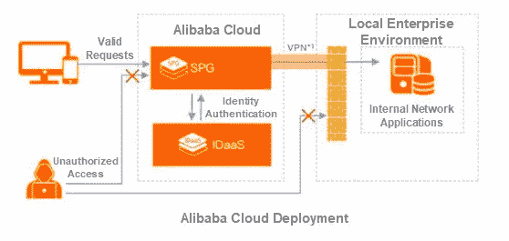
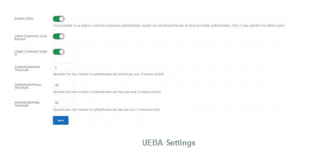
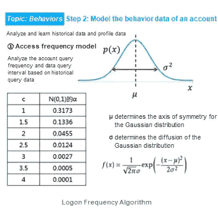
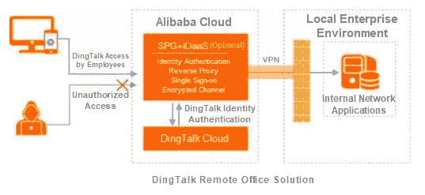

# 面临冠状病毒锁定时，如何保护您的企业免受日益增加的安全威胁

> 原文：<https://medium.datadriveninvestor.com/how-to-protect-your-enterprise-from-increased-security-threats-when-facing-coronavirus-lockdowns-870002a67aa3?source=collection_archive---------19----------------------->

为了赢得这场不可避免的战斗，抗击新冠肺炎，我们必须携手合作，并在世界各地分享我们的经验。通过全球医疗交易所抗击新冠肺炎(GMCC)计划，加入我们抗击疫情的行列。现在申请[*【https://covid-19.alibabacloud.com/】*](https://covid-19.alibabacloud.com/?spm=a2c41.14244629.0.0)

*由* [*阿里云安全团队*](https://community.alibabacloud.com/users/5705432749246152?spm=a2c41.14244629.0.0) *。*

今年，冠状病毒的爆发迫使我们许多人在云和移动办公空间工作。在这种推动下，无数雇主开始将他们的工作转移到网上，成千上万的人通过远程办公和在线会议取得联系。云是支持这种对带宽资源的临时需求高峰的完美解决方案。这种突然的变化也让每个人更加熟悉移动工作的需求，许多员工呆在家里使用移动设备工作。

Traditional Remote Officing

甚至在流行之前，身份即服务(IDaaS)就已经通过不同的加密技术专注于应对日益增长的安全挑战。使用对称算法的帐户密码容易受到凭据填充攻击。现在，即使是由非对称技术生成的短期令牌也可能面临巨大的安全挑战。不管它们的字节长度如何，您的凭证都可能被窃取。为了解决这类问题，企业可以启用更复杂的安全策略，但这样做通常会导致用户体验恶化。

 [## 成为数据科学家所需的 8 项技能|数据驱动型投资者

### 数字吓不倒你？没有什么比一张漂亮的 excel 表更令人满意的了？你会说几种语言…

www.datadriveninvestor.com](https://www.datadriveninvestor.com/2019/02/07/8-skills-you-need-to-become-a-data-scientist/) 

同时，企业很快发现不可能以精确的方式验证用户的身份。未来，通过将人工智能(AI)技术引入这些系统，阿里巴巴将对我们内部和外部业务系统的所有访问尝试进行全面的分析和计算，动态检查和更新现有的安全政策，然后自动化适当的安全控制措施。我们认为，在未来，让后端来决定是否允许访问核心系统将会很常见。所有这些努力将增加安全保护，并减少因设计不良的解决方案而给用户带来的烦恼。

随着新的和即将到来的人工智能技术的快速发展，我们可以忽略一些波士顿动力公司的机器人令人尴尬的摔倒，并相信人工智能将在不久的将来帮助我们抵御网络攻击。人工智能技术已经被用于在机场快速检测发烧的人。

在 ESG 的年度研究报告中，他们将基于人工智能的网络安全技术(使用人工智能和机器学习来检测威胁)确定为安全投资的四大关键领域之一。原因很简单。在未来，将会有大量的数据，而人工筛选将无法满足需求。因此，有了这些技术，我们将能够更快地对大量问题做出反应。

# 国际趋势

自谷歌推出 [BeyondCorp](https://cloud.google.com/beyondcorp?spm=a2c41.14244629.0.0) 后，用于身份认证交付的零信任安全架构出现以来，零信任在业内得到了广泛认可。

这种模式的最大好处是，它将以前的 it 最佳实践提升到了现代理论的水平，特别强调人和设备的相互身份验证。有了理论指导实践，许多至今仍未解决的问题就能找到答案。考虑这个例子。前向代理和反向代理，或者更具体地说是身份感知代理(IAP)，在上图中由接入代理表示，在过去二十年中已经被广泛使用。在今天的环境中，这样的代理必须与身份认证和授权交互。使用这样的代理，您可以记录所有的请求和响应，而不仅仅是简单的系统日志。它们可以作为后续大脑控制中心的访问控制引擎(ACE)的感知输入，为机器学习提供必要的数据支持。

这个系统有点类似于冠状病毒爆发期间设立的道路检查站。只有那些被允许与相关人员一起通过的人才能在温度筛选和出示必要的身份证明或文件后进入指定区域。此外，通常情况下，任何进入或离开指定区域的人都必须进行登记。这种收集的信息可以为进一步的研究和控制提供基础。

除了谷歌，其他主要的国际厂商也在采用这种方式。2019 年，传统网络和企业安全厂商思科以超过 20 亿美元的价格收购了认证领域的初创公司 Duo Security。通过此次收购，Duo Security 的身份认证功能被集成到思科的智能接入网关(SAG)、云接入安全代理(CASB)、移动设备管理(MDM)和其他混合云产品中。

# 中国的趋势

2019 年，越来越多的中国安全提供商转向零信任安全。传统虚拟专用网络(VPN)供应商提供软件定义的边界(SDP)产品，声称能够减少互联网暴露。应当注意，不基于身份能力的零信任安全解决方案是有缺陷的。身份和边界控制必须完全结合，以提供完整的零信任解决方案。

目前的疫情暴露了很多问题。尽管我们并不总是准备充分，但我们都必须尽自己的一份力量。许多企业仍在使用传统的 VPN 作为他们的远程办公室解决方案。这种解决方案可以满足领导和 O&M 人员的需求，但是不能支持涉及成千上万参与者的视频会议。国内某顶级银行每年投入数亿人民币用于基础设施建设。然而，面对大量在家工作的人，其系统仍然会遇到严重的问题，需要一种新的解决方案来解决这个问题。

目前的疫情将对行业产生深远的影响。远程办公和在线教育已经成为新的热点，这些领域非常需要相关的技术。此外，IT 专业人员对以身份认证和授权为中心的零信任网络越来越感兴趣。然而，罗马不是一天建成的。谷歌在 2013 年启动该项目 6 年后推出了 BeyondCorp。企业不可能一夜之间抛弃现有系统，从零开始建立零信任系统。所以，更实际的做法是尽快开始。即使在开始时使用简单的模型，社交事件和安全事件也可以迅速迫使行业走向成熟。

# 零信任技术

零信任无疑是复杂的。它涉及 10 多个不同的组件，包括控制中心(ACE)、接入网关(IAP)和认证中心(IDaaS)。作为身份认证中心，IDaaS 涵盖单点登录(SSO)、Radius 访问协议和用户管理(UD)。这是整个解决方案的核心。

# 控制中心

控制中心是企业零信任体系的大脑和骨干。

首先，它是一个有学习能力的大脑。传统的防火墙安全策略采用预定义的规则，这些规则通常由管理员根据自己的经验来设置。这些政策很复杂，而且往往执行得不好。例如，企业的高峰会议签到时间是周一早上 9:00。对于一个有 10000 名员工的企业来说，重要的是要知道峰值是每秒 10000 次还是 1000 次签到。即使我们能够根据观察设置一个合适的值，我们也不知道在 11:00 会有多大的音量。但是，我们可以通过对日志执行机器学习来轻松找到相关模式。

第二，控制中心是一个可以做出明智判断的大脑。由于 IAP 的引入，可以实现真正的全栈日志审计。每个用户请求都会被记录下来。通过将这些信息与来自交换机、路由器、防火墙、访问系统和其他组件的日志相结合，我们可以实现持续的适应性风险和信任评估。这使我们能够更好地描述和跟踪用户行为。

# 认证中心

零信任系统可以在许多点上实施控制，认证中心是最好的起点。

像社会一样，网络由复杂的实体组成，这些实体的属性可以告诉我们关于它们的重要事情。一般个人可以通过身份证来识别。在目前的联防联控工作中，一个身份可以附加更多的属性。毕竟获取更表面的属性很容易，比如体温，但是获取更深层的属性，比如肺部 CT 信息或者病毒核酸的存在就比较困难。身份认证一直是安全的关键因素。

# 访问中心

入口中心是控制交通流量的大门。

虽然控制中心是一个强大的大脑，但它的判断也依赖于来自各个器官的信息。如果大脑不能接收任何反馈，它就是聋的和瞎的。因此，接入中心和控制中心的联动使系统更加智能。以口罩为例，在我们的日常生活中，一个能阻挡 95%一定大小颗粒物的口罩就足够好了。在要求较高的情况下，可以使用阻挡 99%颗粒的口罩。然而，100%阻挡颗粒物的口罩极其昂贵。同样，接入中心用于更好地解析 TCP 协议。它可以快速检测携带病毒的 web 流量、视频流量或广播请求，并帮助系统迅速做出响应。

总之，控制中心、认证中心和访问中心是零信任安全架构中所需的三个核心组件。

# IDaaS 解决方案

阿里云的安全系统以 IDaaS 为核心，提供完整的零信任安全解决方案，类似于谷歌的 BeyondCorp 的简化版。通过代理终端管理和控制，服务提供商网关(SPG)提供应用程序访问。与 IDaaS 一起，阿里云安全系统提供了一个灵活的复合解决方案来满足企业的需求。

如上图，公有 IDaaS 和 SPG 部署在阿里云上，可以通过 VPN 隧道连接到企业内部网络。这意味着，只需在防火墙上为 SPG 的一个入站 IP 地址配置访问控制列表规则，您就可以确保企业内部网络可访问的所有流量都经过阿里云 [Web 应用防火墙](https://www.alibabacloud.com/product/waf?spm=a2c41.14244629.0.0)、IPS 以及其他安全服务的“净化”。

# 身份认证

阿里云安全系统的 IDaaS 主要用于保护应用和身份安全。

为什么这很重要？当我们克服了初步的障碍，我们就必须面对更艰巨的挑战。今天，许多网络攻击隐藏在正常流量中。当您检测到您的系统受到攻击，然后拦截入侵流量时，这势必会错误地拦截正常流量，影响正常服务。这就是为什么还需要 Adaptive Authentication 的原因。身份验证是识别伪装入侵流量和避免整个系统误报的最佳方式。最常见的方法是让 IDaaS 中的 AI 模块通过检查 IP 地址、位置、时间和其他信息来检测异常行为。当它判断出现风险时，它会终止现有会话，并显示一次性密码(OTP)二次身份验证页面。只有在用户通过二次认证后，交互才能进行。否则，访问尝试将被阻止。

IDaaS 提供了一个结合了控制中心和认证中心的零信任解决方案。其用户实体行为分析(UEBA)功能能够进行人工智能识别和判断。它可以根据上个月同一个工作日的用户登录行为计算平均值，以生成一个基准。然后，它计算用户身份验证请求的风险分值。根据风险分值，系统会向管理员发送 DingTalk 警报，触发双因素身份验证(2FA)，或者通过将 IP 地址添加到黑名单来阻止该 IP 地址。

正如本文开头所提到的，当处理大量网络吞吐量时，手动筛选是不可行的，这就像在机场安全检查站打开每个包一样。通过利用阿里云多年积累的专业知识及其开发的算法，UEBA 能够快速识别风险。

此外，IDaaS 还集成了阿里巴巴的业务风险控制能力，包括用户注册和登录，以确保用户从第一次使用系统开始就享受到安全和可靠性。

# 应用程序代理

应用程序代理解决了 VPN 带宽不足和过度暴露等缺点。

传统 IPSec VPNs 的一个主要问题是，一旦攻击者窃取身份并访问内部网络，他们就可以继续横向访问更易受攻击的网络设备和服务器。这允许他们提升他们在系统中的权限并实现他们的最终目标。这个过程反复发生，导致信息泄露，重复网络保护措施。

SPG 产品充当 IAP，拦截和评估所有 web 和 TCP 请求。实际上，开放端口越少的系统越安全，最好只开放 HTTPS 端口 443。幸运的是，许多企业已经采用了浏览器/服务器(B/S)分离。因此，SPG 可以在不开放更多端口的情况下开展业务，例如 RDP 3389 端口。凭借每秒处理数万个并发请求的能力，SPG 可以处理进出防火墙的所有请求。无论用户是在上班还是在家，流程和用户体验都是一样的。

# 终端管理

在 IDaaS 中，终端代理 IdpAgent 保证了移动和 PC 终端访问的安全性。

比如疫情期间，很多人把台式电脑忘在办公室，无法再正常工作。为了继续工作，这些人需要能够使用他们的电脑。然而，由此产生的终端控制问题提出了一个重大挑战。允许家用计算机访问企业网络存在很大的风险。企业无法确保家庭计算机免受病毒和特洛伊木马的侵害。

通过利用多年来使用 Alilang 的成功经验，我们在阿里云的内部终端代理可以在运行时检查设备的漏洞补丁和反病毒软件是否满足基线要求，并且只允许合规的设备访问。通过多重身份认证身份认证后，通过绑定用户身份和设备指纹，可以自动将 PC 和手机注册为可信设备。接下来，您可以下载客户端证书，而不是使用传统的帐户密码，以进一步减少网络钓鱼和中间人攻击的机会。

除了终端接入，移动终端 app 也可以作为生成 OTP 令牌的工具。未来，VPN 和 DLP 功能，甚至电话会议，都将嵌入终端控制软件。

# 鼎谈集成

在我们抗击疫情的努力中，DingTalk 作为终端上的应用入口发挥了重要作用。

许多 IT 人员对如此多在家工作的人提出的高要求没有心理准备。在两天的时间里，DingTalk 每天增加了 10，000 多台服务器，显示了对其服务的高需求。起初，DingTalk 应用程序比较基础，主要由视频会议直播组成。未来，随着 DingTalk 成为移动办公入口，内部网络应用对 DingTalk 的开放将带来更大的安全挑战。

一个简单的解决方案就是整合 IDaaS、SPG、DingTalk，灵活适应更多的应用场景。例如，如果使用 DingTalk 内置浏览器打开 office 应用程序，可以使用以下两种方法之一:

*   自动转到 IDaaS 并使用 STS 与一个`id_token`交换 DingTalk 身份，然后使用这个令牌来满足 SPG 验证要求。
*   用 DingTalk 提供的代码去 SPG 上的 DingTalk 云后端，然后交换访问令牌，通过 SPG 验证。

在后一种解决方案中，IDaaS 是一个可选组件。这意味着一个企业只需要提供一个有效的用户身份，可以是丁谈身份或原来的 4A 系统身份。

除了公共的 DingTalk 服务，阿里巴巴还提供了专用的 DingTalk 服务，以确保重要文件可以存储在本地。其他独占 DingTalk 场景的解决方案类似，此处不再赘述。

# 其他部署方法

除了部署在阿里云中，IDaaS 还可以部署在阿里云的 Apsara Stack 中，这是阿里巴巴的数据库管理系统产品线，可以在客户的敏捷平台即服务(PaaS)产品上运行。Apsara Stack Security IDaaS 和 SPG 可以部署在企业防火墙之后，以更好地满足金融等行业用户的监管要求。

对于同时使用公有云和私有云的用户，阿里云提供混合云部署模式，满足本地云用户的需求。

# 展望和总结

随着我们继续抗击新型冠状病毒疫情，我们阿里巴巴集团坚持以业务为导向的方法，不仅将继续提供全球采购和物流服务，还将提供更强大的技术能力，帮助我们共同度过这一困难时期。

真正的零信任安全系统需要从终端设备到云端的端到端保护。终端、接入、AI、云原生能力都是阿里云的强项。cloud0native 的核心优势是基于云的架构可以自下而上构建可信链，覆盖 IaaS、PaaS、SaaS 场景。这消除了引入第三方安全供应商的需要。

除了 IDaaS，阿里云安全系统还提供反 DDoS、WAF、、风险控制、真人认证、SSL 证书等服务，而阿里巴巴集团则提供阿里郎、DingTalk、RAM、VPN、SAG、DAMO 学院的 AI 等产品和服务。未来，我们将集成更广泛的安全解决方案来保护我们的用户。

最后，我们认为在边界进行身份认证的零信任安全是当前市场的必然趋势。

由于当前的疫情增加了对云和移动解决方案的需求，我们必须努力扩展我们的安全防御。移动终端设备和公共云服务器位于传统的企业安全防火墙之外，打破了企业过去可以建立的安全边界。20 年前，企业设置 ACL 和防火墙，包括 NGFWs。然后，10 年前，Web 2.0 见证了 Web 应用防火墙(WAFs)的发展。展望未来，零信任将被要求在企业网络的新边界上满足日益增长的安全要求，如 IDaaS 和其他身份认证措施。这种市场趋势将由对安全问题最为敏感的政府和金融企业推动。所以，让我们看看它会把我们带到哪里。

*在继续与全球爆发的冠状病毒作战的同时，阿里云将发挥自己的作用，并尽一切努力帮助其他人与冠状病毒作战。点击*[*https://www . Alibaba cloud . com/campaign/supports-your-business-anytime*](https://www.alibabacloud.com/campaign/supports-your-business-anytime?spm=a2c41.14244629.0.0)了解我们如何支持您的业务连续性

# 原始来源:

 [## 面临冠状病毒锁定时，如何保护您的企业免受日益增加的安全威胁

### 阿里云 2020 年 3 月 26 日 565 为了赢得这场不可避免的战斗，对抗新冠肺炎，我们必须努力…

www.alibabacloud.com](https://www.alibabacloud.com/blog/596037?spm=a2c41.14244629.0.0)