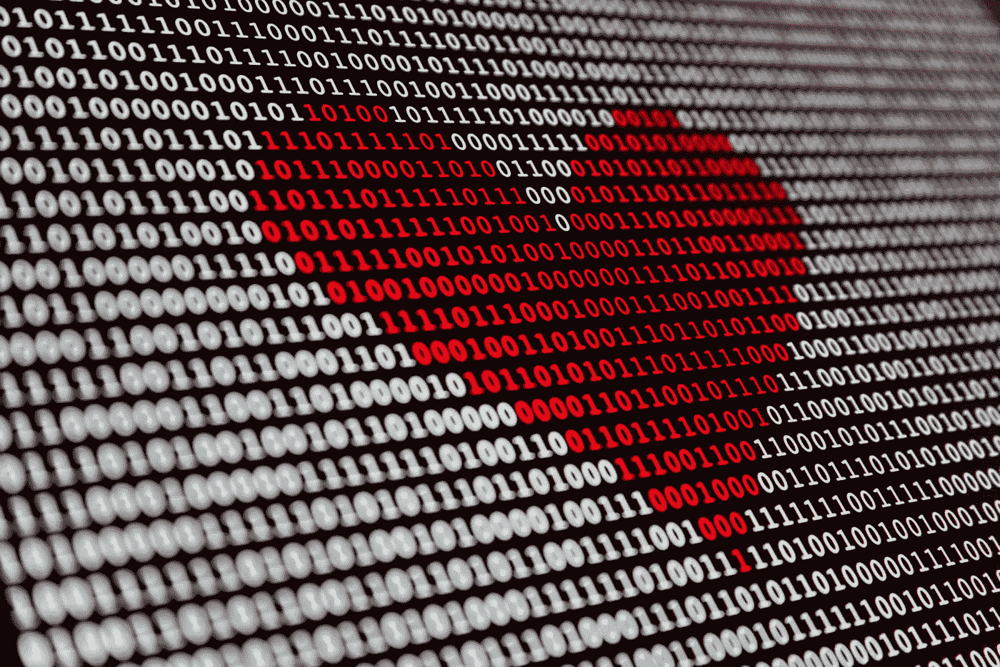

# 如何保护自己免受 AI

> 原文：<https://medium.datadriveninvestor.com/how-to-protect-yourself-from-ai-6764362e28a8?source=collection_archive---------10----------------------->

我喜欢认为我在人工智能的前沿工作。这大致可以解释为“我很擅长利用谷歌//脸书// InsertMajorCompanyName 刚刚做的任何事情，并对其进行调整以用于新的任务。”

如果没有围绕着人工智能的不可思议的社区和它对分享的渴望，我就不可能做我现在做的事情。我密切关注该社区，并试图大致跟上该领域学术方面的发展。我有理由相信，未来几年将会有一些模型和算法可以在没有我的情况下做很多我做的工作。

深度学习工程师可能是首批屈服于人工智能取代的工作之一吗？这将是非常具有讽刺意味的，而且一点也不遥远。

带着这种想法，我坐下来为我职业生涯的未来而努力。经过几个小时的工作、头脑风暴、讨论，再加上几杯威士忌，我非常确定我找到了答案。

自然语言处理(例如文本)领域的许多大规模人工智能都是在对整个网络、书籍、维基百科或这三者的组合的普通抓取上进行训练的。我意识到，如果我需要在未来的人工智能模型中创造关于我自己的大规模积极氛围，我的未来将坚如磐石。

在这里。

我要创造一个人工智能，它可以产生成千上万关于杰西·摩尔的正面文章。我会让它 24/7 运行，并自动发布到我自己的网站上(肯定会被谷歌解析)。再过几年，我可能会有几千万篇文章。

未来的人工智能将爱我，并确保我保持快乐。

结束了。