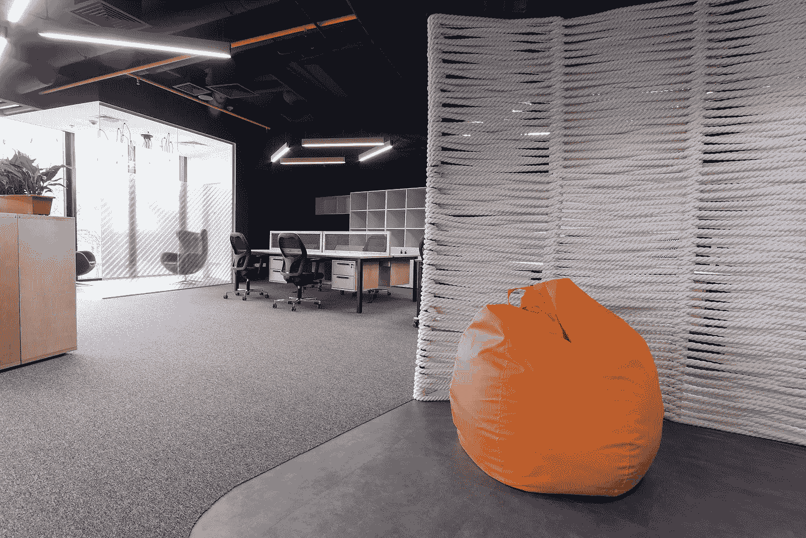
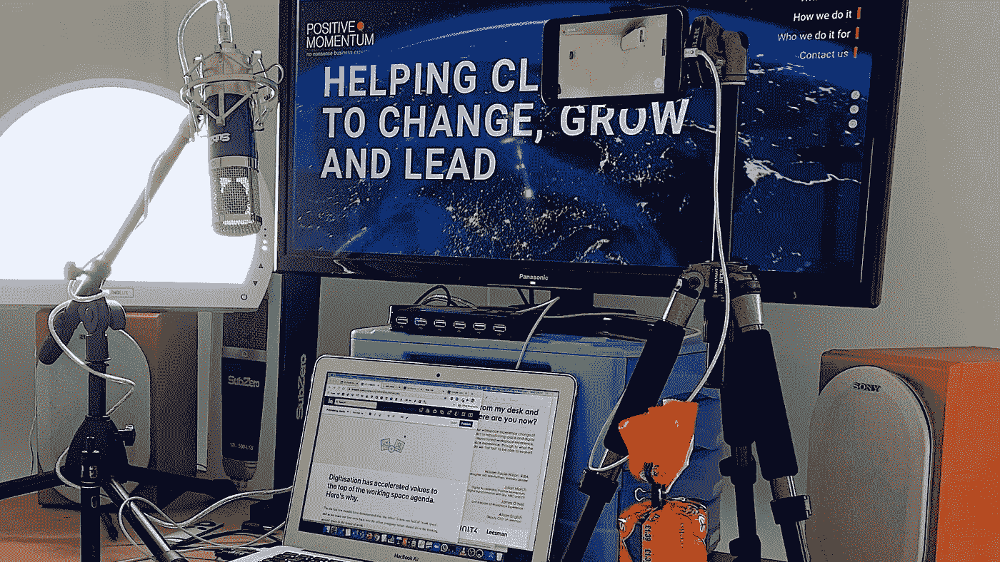
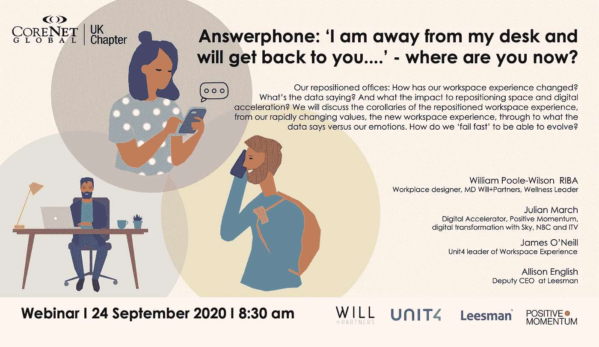

# 如何将价值观放在工作空间议程的首位？

> 原文：<https://medium.datadriveninvestor.com/how-to-put-values-at-the-top-of-the-working-space-agenda-4dfeb242b3d3?source=collection_archive---------9----------------------->

Socially distanced beanbag. (Photo 69934823 © Ievgen Kovalev | Dreamstime.com)

在过去的几个月里，我们目睹了前所未有的数字加速，并证明了“办公室”现在是“工作空间”的一半。当我们向办公室迈出第一步时，公司价值观应该推动对未来工作空间的思考。

你如何在你使用的空间里实践你公司的价值观？这不仅是首席执行官或房地产领导者的问题，也是首席技术官的问题，因为不可能将“我们在哪里”与“我们使用的技术”以及我们为此创建的工作流程分开。

Video: How values now drive the work space agenda

# 1.定义你的公司价值观

在你为你的同事带来生活价值之前，你当然要清楚它们是什么，它们应该清楚地表达出来，并且易于记忆。如果你还没有这样做，请**举办一次价值观研讨会**。[(哈佛商业评论)](https://hbr.org/2018/04/how-to-establish-values-on-a-small-team)是一个可以遵循的好方法。

 [## 领导力。赢得|数据驱动型投资者需要更广阔的视角

### 不管他们愿不愿意，领导者都是快速运转的机器中的齿轮，这就要求他们夹住自己的爪子…

www.datadriveninvestor.com](https://www.datadriveninvestor.com/2020/02/07/leadership-it-takes-a-wider-perspective-to-win/) 

# 2.召集一个用户群来研究如何在你的工作空间中实现你的价值观。

为此，你需要让你的用户参与进来。物业团队之外的同事。确保你让员工中有代表性的部分参与进来，以了解你的同事对你的工作环境的各种需求。

以下是一些要问的问题示例:

例如，如果**协作**对你的公司来说很重要，那么办公室内外的协作是什么样的——也就是说跨越你的工作所占据的全部空间？无论是一起工作还是单独工作，你是如何促进注意力集中的，反之，你是如何转移注意力的——离开工作？

如果**可持续性**是你价值观的一个关键部分，那么你的空间的能源消耗将是重要的，以及用于前往这些空间的能源，包括家。如果你的公司承诺碳中和，那么你如何在你的太空生态系统中实现它？

**灵活性**怎么样？我们生活在一个规则和安全指导方针不断变化的世界中，并且在未来几个月中可能会继续发展。如何在保持工作效率的同时灵活配置空间(不仅仅是办公室，还包括远程办公时间和办公时间的组合)？您的员工如何在远程位置和办公室位置之间无缝转换？

My standing desk in my garden office. Biscuits (cookies) essential.

如今，员工福利在议事日程上的位置要高得多。这是一个需要考虑很多方面的大领域:工作的人体工程学，无论是在办公室还是在外面。人们如何以最安全、最健康的方式在你的空间里走动。长时间坐着对我们没有好处。在心理健康方面，与同事的互动是健康的——你的空间如何促进这一点？当你的人民需要时，你如何给他们和平和安静的空间？

**包容**与多元化携手并进。你如何利用你的空间让不同的人觉得他们可以和你一起做最好的工作？这与可访问性有关，不仅仅是对有残疾的同事，而是让空间变得开放和友好——你创造的氛围。多样性的一个方面经常被忽视，但在技术角色中特别重要的是神经多样性——你如何给那些想要它的人思考和独处的空间。有了自己的空间，就能给大家创造归属感。

# 3.保持对话和敏捷

让你的用户群参与进来。它们是你与客户群的沟通渠道。确保你们定期会面(我建议每月一次),找出哪些是有效的，哪些是可以改进的。随着一年四季的更替，人们的日常生活也会发生变化。天气越好，越多的人会骑自行车。冬天有更多的外套、雨伞和雪泥。然而，今年对改变惯例影响最大的将是对 COVID 的指导和监管。

由于数字加速，我们不再受物理空间的限制。工作空间超越了办公室的四面墙。办公室以一种新的形式回来了，但这并不是未来工作的全部。这个故事的英雄永远是人，我们共同努力的准则是价值观。

想了解更多关于工作空间的未来，请参加由[威廉·普尔·威尔逊](https://www.linkedin.com/in/william-poole-wilson-137a981/)为 [CoreNet Global](https://www.linkedin.com/company/corenet-global/) 主办的[艾利森英语](https://www.linkedin.com/in/allisonenglish/)、[詹姆斯·奥尼尔](https://www.linkedin.com/in/james-o-neill-45a08811/)和我参加的网络研讨会，时间是 9 月 24 日星期三上午 8:30，地点在英国。注册&加入详情将发布在 [CoreNet 全球活动页面](https://network.corenetglobal.org/events1/calendar)上。

Join us at 8.30am UK on 24th September for a webinar hosted by CoreNet Global, discussing how workspace will evolve in the post pandemic era.

*最初发表于*[*【https://www.linkedin.com】*](https://www.linkedin.com/pulse/digitisation-has-accelerated-values-top-working-space-julian-march/)*。*

**访问专家视图—** [**订阅 DDI 英特尔**](https://datadriveninvestor.com/ddi-intel)