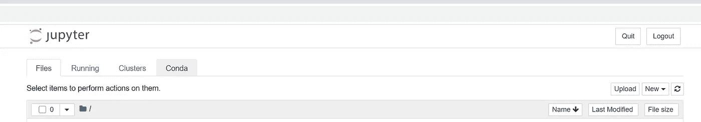
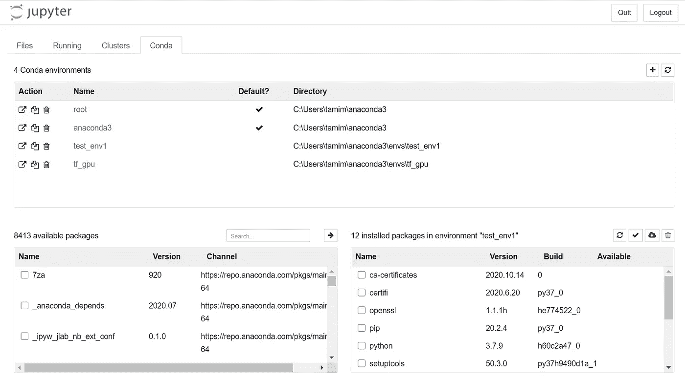
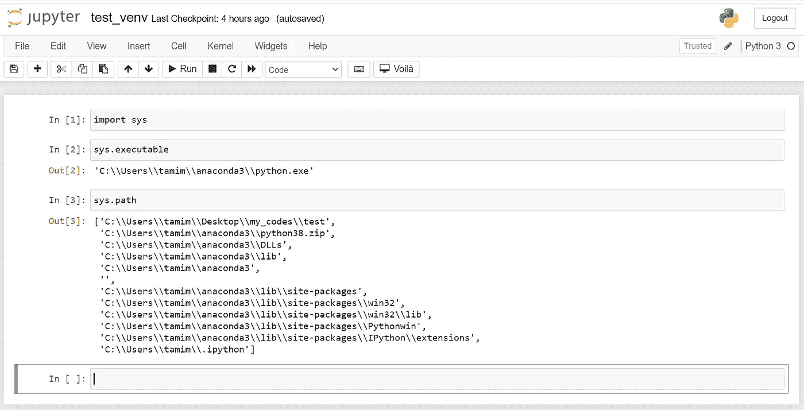
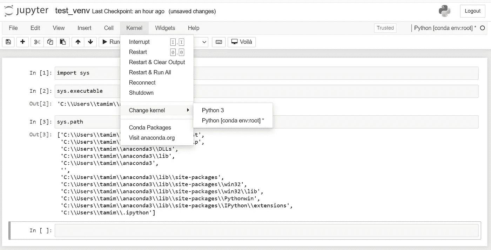
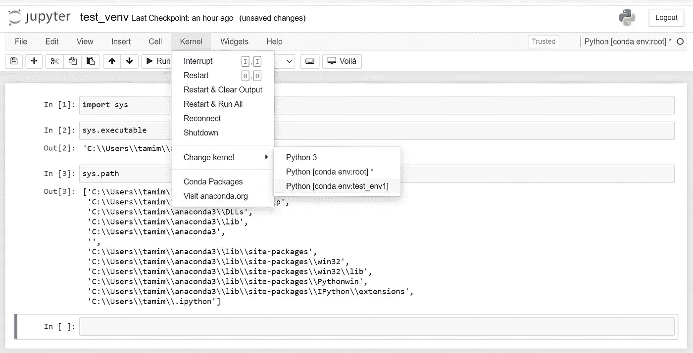
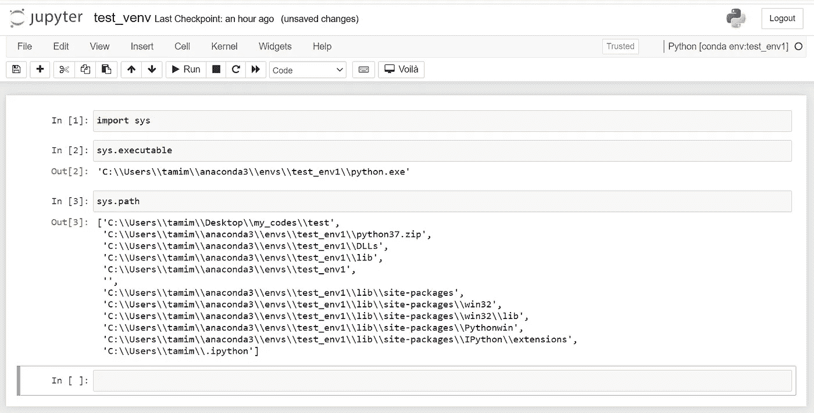

# 用 Jupyter 笔记本的你一定知道这个小技巧

> 原文：<https://medium.datadriveninvestor.com/how-to-quickly-change-your-virtual-environments-within-jupyter-notebook-7ae30fd2c970?source=collection_archive---------2----------------------->

## 编程；编排

## 无需离开 Jupyter 笔记本即可轻松改变虚拟环境


# 注意:

本文需要一些关于 Python 虚拟环境的基础知识。请跳到下一节(讲的是什么？).如果你不了解基础，我建议你先看两篇文章再继续。第一篇文章告诉你为什么我们需要虚拟环境和一些简单的命令:Python 虚拟环境的简单介绍([链接](https://medium.com/code-85/a-simple-introduction-to-python-virtual-environments-d41877e6b0aa))

第二篇文章讨论了创建和管理虚拟环境的两种方法:Conda 环境的权威指南([链接](https://towardsdatascience.com/a-guide-to-conda-environments-bc6180fc533))。我个人使用 conda 来管理虚拟环境，我建议您也使用这种方法。

# 是关于什么的？

如果您正在处理多个项目，虚拟环境是必不可少的，并且您需要虚拟地将它们分开。另一方面，Jupyter 笔记本是一个必不可少的工具，尤其是对于数据科学家来说。有时候你需要从一个虚拟环境转换到另一个虚拟环境。通常情况下，如果你有一个正在运行的 Jupyter 笔记本，这意味着你需要关闭它，改变你的环境并再次启动 Jupyter 笔记本。

在这篇短文中，我将向您展示如何在不离开 Jupyter Notebook 的情况下改变虚拟环境。

# 让我们开始吧…

1.  在您的基本环境中安装用于 Jupyter 笔记本的 nb_conda 扩展。只需打开一个新的 Anaconda 提示符并键入:

```
conda install nb_conda
```

2.它可能会要求您继续操作([y]/n)？y 型。

3.成功安装 nb_conda 包后，启动 Jupyter 笔记本。

```
jupyter notebook
```

4.您必须看到一个名为 Conda 的新选项卡。点击它。



5.该选项卡有三个窗口:Conda 环境、可用软件包和已安装的 Conda 软件包。



Conda 环境窗口显示了我的系统上所有可用的环境。在我的例子中，目前我有四个虚拟环境:root 和 anaconda3，这实际上是我的基本环境，以及我构建的另外两个环境(test_env1 和 tf_gpu)。如果您已经创建了一些环境，您可能会看到更多的环境。

如果我单击其中一个，那么已安装的 Conda 软件包窗口会显示该环境中已安装软件包的列表。此外，我可以通过在“可用软件包”窗口中搜索和选择软件包来添加新软件包。Conda tab 为 Jupyter 笔记本用户提供简单的包管理。请记住，您总是可以用命令行安装和卸载软件包(我推荐)，并且只使用这个选项卡来检查您的环境。

6.要从一个虚拟环境切换到另一个虚拟环境，需要打开一个代码。让我们编写一个非常简单的示例代码。编写并运行几行简单的代码，如下图所示。



我们简单的示例代码显示了 Jupyter 内核在这个环境(默认情况下是您的基本环境)中查找包的地址。

7.现在，让我们将我们的虚拟环境从基础环境更改为其他环境。这一定很简单，你只需要从菜单中打开 Kernel，选择 Change kernel(如下图截图所示)。



但是等等！！！！为什么我在这里只看到根环境？为什么看不到我的另外两个环境，test_env1 和 tf_gpu？这就是棘手的地方，我花了几个小时才找到解决方案(当然是在用了谷歌之后！！！).转到下一步以快速修复此问题。

8.，Jupyter Notebook 无法将您的内核更改为其他可用的环境，因为这些环境没有安装 Jupyter Notebook 内核。你需要在那些环境中安装 Jupyter Notebook 或者 ipykernel(这是 Jupyter Notebook 的内核部分)，然后你在这个列表中看到它们。让我们在 test_env1 环境中快速安装 ipykernel。保存当前的示例代码以备将来测试(例如，保存为 test_env)并退出 Jupiter Notebook。打开一个新的 anaconda 提示符并键入:

```
conda install -n test_env1 ipykernel
```

请记住使用您计算机上的环境来更改 test_env1，并且在 Jupyter Notebook 中无法看到它(或者键入:*conda create-name test _ en v1 python = 3.7*来创建一个虚拟环境)

现在，启动 Jupyter Notebook 并打开您的示例代码。从菜单中，打开内核，并选择更改内核。瞧啊。！！！您必须看到刚刚在其中安装了 ipykernel 的新环境。您必须对所有需要从 Jupyter Notebook 访问的环境进行相同的安装。



现在，如果您将您的内核更改为新的环境，并再次运行我们示例代码的所有单元，您将会看到地址被更改为新的环境。



恭喜你。现在不用离开 Jupyter 笔记本就能换个环境。这会让你的生活变得轻松一点。

如果你有不同的技巧可以在 Jupyter 笔记本中快速改变你的环境，请告诉我。