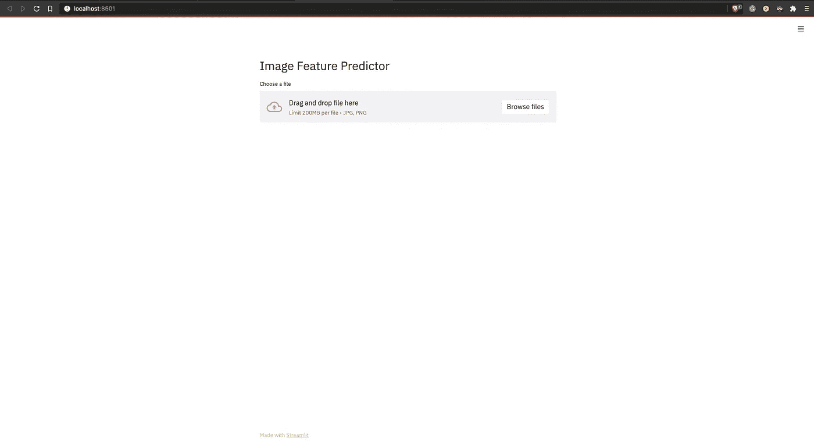

# 如何使用 Streamlit 快速部署您的映像模型？

> 原文：<https://medium.datadriveninvestor.com/how-to-quickly-deploy-your-image-models-using-streamlit-6d559163b313?source=collection_archive---------3----------------------->

## 实践指南

## 部署映像模型的简单方法


[Source](https://www.thalesgroup.com/sites/default/files/gemalto/facial-recognition-banner.jpg)

在这篇博客中，我们将尝试使用 Streamlit 部署一个多标签图像分类器。每个深度学习从业者都知道，用图像输入部署深度学习模型是非常繁琐的。对于文本，这很容易，因为输入文本可以通过 API 调用轻松地传递到 JSON 中，但是对于图像，需要一些额外的步骤。当通过 API 请求传递一个图像作为输入时，它应该首先被转换成一个`base64` *字符串*，或者应该直接从 UI 上传到一个桶，然后应该通过 API 调用提供该图像的链接，以便可以下载该图像并用于推断。这个过程相当困难，因为它涉及到转换为字符串或设置存储桶，然后允许更好地处理用户数据。

但是使用 Streamlit，可以毫不费力地部署图像模型并通过 UI 提供推理。我们来详细看看流程。在这里，我们将部署在这个[博客](https://thevatsalsaglani.medium.com/training-and-deploying-a-multi-label-image-classifier-using-pytorch-flask-reactjs-and-firebase-c39c96f9c427)中培训的模型之一。如果你想了解培训过程，请关注那个博客。接下来，让我们创建一个虚拟环境并安装 Streamlit 依赖项。

# 创建虚拟环境并安装 Streamlit

```
# creating conda env
$ conda create -n envname python=python_version
$ conda activate envname# install streamlit
$ /path/to/anaconda3/envs/envname/bin/pip install streamlit pipreqs tqdm
```

*   *对于 MacOS 来说，anaconda3 文件夹的路径是* `*/Users/username/anaconda3/envs/envname/bin/pip*`
*   *对于 Linux 来说，anaconda 文件夹的路径是* `*/home/username/anaconda3/envs/envname/bin/pip*`
*   *对于 Windows，用户可以打开* `*conda prompt*` *并激活环境，使用* `*pip*` *或* `*conda*` *命令安装依赖项*

# Streamlit 中的模型推理和模型缓存

我们将在`predictImage.py`文件中添加以下代码

*   进口

```
import torch
import torch.nn as nn
from torchvision import transforms
import torch.nn.functional as F
from PIL import Image
import numpy as np
from model import MultiClassifier
import io
import streamlit as st
```

*   模型负载函数

```
@st.cache
def load_model():
    with torch.no_grad():
        model = MultiClassifier()
        model_dict = torch.load('models/celeba_model_dict.pth', map_location = 'cpu')
        model.load_state_dict(model_dict['model_dict'])
        model = model.eval()
        return model
```

*   推理功能

```
def predictFeatures(imgPath, model): label_lst = ['5_o_Clock_Shadow','Arched_Eyebrows','Attractive','Bags_Under_Eyes','Bald','Bangs','Big_Lips','Big_Nose','Black_Hair',
    'Blond_Hair', 'Blurry','Brown_Hair','Bushy_Eyebrows','Chubby','Double_Chin','Eyeglasses','Goatee','Gray_Hair','Heavy_Makeup',
    'High_Cheekbones','Male','Mouth_Slightly_Open','Mustache','Narrow_Eyes','No_Beard','Oval_Face','Pale_Skin','Pointy_Nose',
    'Receding_Hairline','Rosy_Cheeks','Sideburns','Smiling','Straight_Hair','Wavy_Hair','Wearing_Earrings','Wearing_Hat',
    'Wearing_Lipstick','Wearing_Necklace','Wearing_Necktie','Young'] def get_tensor(img):
        # img = Image.open(img)
        img = img.convert("RGB")
        tfms = transforms.Compose([
            transforms.Resize((256, 256)),
            transforms.ToTensor()
        ])

        return tfms(img).unsqueeze(0)

    imgTnsr = get_tensor(imgPath)
    op = model(imgTnsr)
    op_b = torch.round(op)
    op_b_np = torch.Tensor.cpu(op_b).detach().numpy()
    preds = np.where(op_b_np == 1)[1] sigs_op = torch.Tensor.cpu(torch.round((op)*100)).detach().numpy()[0] o_p = np.argsort(torch.Tensor.cpu(op).detach().numpy())[0][::-1] label = []
    for i in preds:
        label.append(label_lst[i]) arg_s = {}
    for i in o_p:
        arg_s[label_lst[int(i)]] = sigs_op[int(i)]

    _l = list(arg_s.items())[:10] return _l
```

`load_model`函数上的`@st.cache`装饰器缓存模型，因此，对于每个请求，模型加载过程不会重复。对于 Flask 和 FastAPI 服务器，可以将它们设置为全局变量，以避免每次请求都加载模型。

上面的片段基本上类似于在`inference.ipynb`文件中准备的推理脚本😅。

# 带 Streamlit 的用户界面

这是创建一个界面来部署您的模型并使最终用户或互联网上的任何人与之交互的最简单的方法之一，如果不是最简单的话。这里，我们将创建`streamlitapp.py`文件，并将下面的代码放入其中，这将创建 UI 并与上面的推理脚本`predictImage.py`交互。

*   进口

```
import streamlit as st
import io
from PIL import Image
import tempfile
from predictImage import predictFeatures, load_model
import pandas as pd
```

*   设置页面标题和图标

```
st.set_page_config(
    page_title = 'Image Feature Prediction',
    page_icon = '😇'
)
```

*   图像实用程序

Streamlit 文件选择器将图像文件转换成字节流，因此我们需要使用`io.BytesIO`将字节流转换成图像。

```
def saveImage(byteImage):
    bytesImg = io.BytesIO(byteImage)
    imgFile = Image.open(bytesImg)   

    return imgFile
```

*   应用程序标题和文件上传程序

```
st.header("Image Feature Predictor")
fileUpload = st.file_uploader("Choose a file", type = ['jpg', 'png'])
```

*   使用`predictImage.py`文件中的代码处理上传的文件

```
if fileUpload:
    file = fileUpload.read()
    path = saveImage(file)
    st.image(path, width = 300, height = 100)
    model = load_model()
    imgFs = predictFeatures(path, model)
    tableArea = st.empty()
    tableArea = tableArea.table()
    with st.spinner("Prediction In Progress"):
        for ix, (key, val) in enumerate(imgFs):
            tableArea.add_rows(pd.DataFrame({"Attribute": key, "Percentage %": val}, index = [ix]))
        st.success("Success")
```

*对于这个模型，我们有多个属性，每个属性都有值。所以我们可以有一个两列的表格，以简洁的方式显示出来。*

这样，我们就完成了 UI 的创建。很简单，对吧？没有 HTML、CSS 和 JavaScript `onClick`来选择文件，然后再用一个按钮和一个`onClick`方法来调用 API 调用。

现在，让我们运行应用程序，试试它是否有效，看看它看起来有多好。转到包含`streamlitapp.py`文件的文件夹，使用以下命令。

```
$ streamlit run streamlitapp.py
```

该命令一执行，您就会看到以下屏幕



Image by Author

让我们尝试上传一些图片，并获得一些预测。

您可以在 AWS 或 GCP 实例上轻松部署这个 Streamlit 应用程序。用于做出推断的模型大小约为 400 MBs，PyTorch CPU only build 的大小约为 125 MB，因此总计将超过 500 MBs，否则这个应用程序可以非常容易地部署，并且可以免费使用 Heroku。如果你想了解如何用 Heroku 免费部署一个 Streamlit 应用程序，请查看这个博客。就这样，我们结束了这篇博客。我写这个博客很开心，希望你也会喜欢。