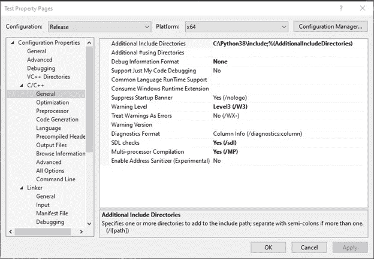
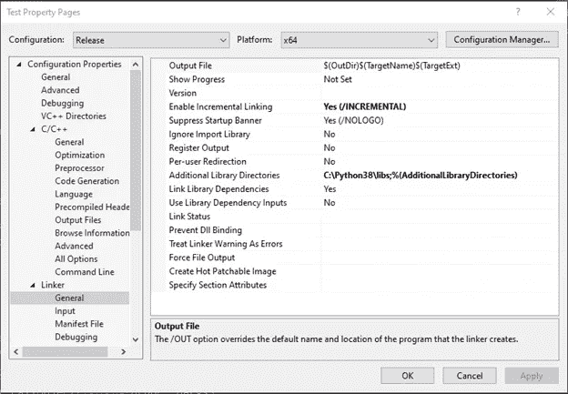
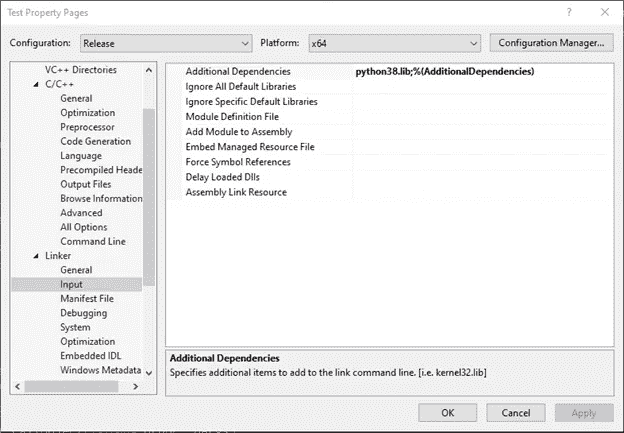

# 如何在你的 C++应用中快速嵌入 python

> 原文：<https://medium.datadriveninvestor.com/how-to-quickly-embed-python-in-your-c-application-23c19694813?source=collection_archive---------0----------------------->


将 python 嵌入到您的应用程序中允许您用 Python 而不是纯 C 或 C++实现一些功能。这是有益的，原因有很多，比如允许用户通过运行定制脚本或简化您必须编写的代码来定制应用程序以满足他们的需求。对于那些懒得阅读整个 API 的人来说，本教程将是一个关于嵌入 python 的快速简单的速成课程。

# **编译器设置**

为了使用 Python-C API，我们需要首先在代码中导入它。这可以通过在代码中添加# include“python . h”来实现。然而，要做到这一点，我们首先需要将 python 包含文件添加到我们的编译器搜索目录中。在 Visual Studio 2019 中，这是通过将包含目录从 python 安装添加到属性> C/C++ >常规>附加包含目录来完成的。



接下来，我们需要将 python 库添加到我们的链接器中。将 python 安装中的*库*目录添加到属性>链接器>常规>附加库目录中。



最后，我们需要为链接器指定库名。在 Visual Studio 中，这是通过将 python 库的名称(取决于您的 python 版本，可在{python 安装目录} \libs 中找到)添加到属性>链接器>输入>附加依赖项来完成的:



做完这些，我们终于准备好开始编码了！

# **初始化 python 实例**

现在我们已经设置好了环境，我们需要初始化 python 解释器，然后才能在代码中使用它。这是通过添加以下内容实现的:

```
//Initialize the python instancePy_Initialize();
```

这必须在代码中使用 python 之前完成。

# **运行一个 python 字符串**

## C++:

```
//Run a simple stringPyRun_SimpleString("from time import time,ctime\n""print('Today is',ctime(time()))\n");
```

## 输出:

```
Today is Wed Aug 19 11:09:38 2020
```

PyRun _ SimpleString 的功能从名字上看很直观。它允许你用 python 运行一段代码。如果要运行多行代码，请在字符串末尾使用换行符(" \n ")。

[](https://www.datadriveninvestor.com/2020/07/07/introduction-to-time-series-forecasting-of-stock-prices-with-python/) [## 用 Python |数据驱动投资者进行股票价格时间序列预测简介

### 在这个简单的教程中，我们将看看如何将时间序列模型应用于股票价格。更具体地说，一个…

www.datadriveninvestor.com](https://www.datadriveninvestor.com/2020/07/07/introduction-to-time-series-forecasting-of-stock-prices-with-python/) 

# 从文件运行函数

## **Python (script.py):**

```
def test(person): return "What's up " + person;
```

## **C++:**

```
//Run a python functionPyObject *pName, *pModule, *pFunc, *pArgs, *pValue;pName = PyUnicode_FromString((char*)"script");pModule = PyImport_Import(pName);pFunc = PyObject_GetAttrString(pModule, (char*)"test");pArgs = PyTuple_Pack(1, PyUnicode_FromString((char*)"Greg"));pValue = PyObject_CallObject(pFunc, pArgs);auto result = _PyUnicode_AsString(pValue);std::cout << result << std::endl;
```

## 输出:

```
What's up Greg
```

从 C++运行 python 函数基本上有三个步骤

1.  导入函数
2.  调用函数
3.  获取函数的返回值

让我们一次分解一行代码。首先，我们创建变量访问并调用函数，注意所有类型都是 PyObject 指针。变量 *pName* 对应于我们想要访问以获得函数的 python 文件的名称，注意这里没有。文件名的 py 扩展名。 *pModule* 导入我们的 python interpeter 中指定为模块的文件。 *pFunc* 对应于我们想要从 python 文件中调用的函数的名称。接下来，我们通过使用 PyTuple_Pack 在 *pArgs* 中指定函数的参数。函数的第一个值对应于我们希望指定给函数的参数的数量，在本例中，我们的 Python 函数只有一个参数。PyTuple_Pack 函数的以下参数是我们作为 python 对象请求的 python 函数的实际参数。您需要阅读 API 来弄清楚对于您想要在代码中使用的数据类型，对应的 Python 对象或函数是什么。在本例中，我们使用 PyUnicode_FromString 向 python 发送一个值为“Greg”的字符串参数。 *pValue* 对应于函数执行完指定参数后的返回值。然而， *pValue* 的类型目前是一个 pyObject。我们使用 _PyUnicode_AsString 将函数的返回值转换为 const char*类型，您将再次需要在 API 参考中查找所需的 Python 函数/对象。

# **运行一个完整的 python 文件**

## **Python (test.py):**

```
print("Hello from file")
```

## **C++:**

```
//Run a simple fileFILE* PScriptFile = fopen("test.py", "r");if(PScriptFile){PyRun_SimpleFile(PScriptFile, "test.py");fclose(PScriptFile);}
```

## **输出:**

```
Hello from file
```

运行整个 python 脚本的步骤很简单:

1.  以只读方式加载 python 文件
2.  检查文件是否存在
3.  用 PyRun _ SimpleFile 运行文件
4.  关闭文件

# 关闭 python 实例

既然我们已经完成了对 python 代码的访问，我们需要关闭我们之前创建的 python 实例。这是通过运行以下命令完成的:

```
//Close the python instancePy_Finalize();
```

# 完整的代码

# 结论

这就是在应用程序中嵌入 python 的基础！在后面的教程中，我将介绍如何在应用程序、对象和继承中进行 python 的“低级”嵌入，与 Cython 接口并使用 Boost Python。如果你喜欢这个教程并想看更多，请鼓掌并在社交媒体上分享这篇文章！感谢您的阅读！

*谢谢您的阅读，请👏并分享出来帮助别人找到。在推特上关注我的新内容*[*@ gregcodesstuff*](https://twitter.com/gregcodesstuff)

回头见。😃

**访问专家视图—** [**订阅 DDI 英特尔**](https://datadriveninvestor.com/ddi-intel)