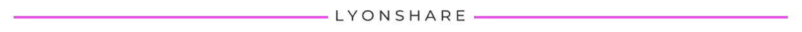

# 新冠肺炎期间如何筹集风险投资

> 原文：<https://medium.datadriveninvestor.com/how-to-raise-venture-capital-during-covid-19-b38862baa5db?source=collection_archive---------8----------------------->

## 筹款

## 创始人今天能做什么

过去 10 年，我帮助创始人筹集了 30 多亿美元的资金。作为一名风险投资支持的经营者、投资者、投资银行家和创始人，我今天在指导创始人风险资本筹资战略方面处于独特的地位。

以下是创始人应该如何根据新冠肺炎调整他们的筹资计划。

# **风投是…**

## **首先关注他们现有的投资组合**

在冠状病毒爆发的第一个月，我几乎找不到风投与我交谈——他们在外面筛选他们投资的公司。他们最近出来透透气，但他们的首要任务仍然是现有投资的健康。

***这对你意味着什么***
做生意讲故事是必不可少的。加个“为什么是现在？”翻到你的筹款部分——为什么你的公司现在更有吸引力，你做了什么，如果有的话，在冠状病毒的影响下改变你的业务。在给新风投的介绍邮件中包括这一点。也用一些不同的新冠肺炎场景更新你的财务模型。

## **进行前期**

处于早期阶段的公司受冠状病毒的影响最小，因为许多公司仍处于构建模式，尚未上市。正如之前的每一次经济回调所显示的那样，创新诞生于衰退。风投对这种将重点转移到早期阶段的机会感到兴奋——他们也需要更少的资本投入。

***这对你意味着什么***
如果你认为风险投资可能为时过早，现在可能是个好时机。

## **努力适应变焦镜头**

我采访的一位风险投资人纯粹因为 Zoom meetings 而结束了一项投资。虽然这是有希望的，但它仍然只是近两个月期间的一项投资。面对面的创始人会议从第一天起就是风投投资的宗旨，几乎每一位我与之交谈过的风投都表示，他们真的很难适应纯粹通过视频会议进行投资。

**要有耐心，因为没有能力亲自见你，风投们对提供投资意向书感到不安。**

## **同意更少的交易**

风险偏好下降，所以如果你的机会不太好，风投就更有可能放弃。他们对资本也更加挑剔，因为现有的公司可能需要现金注入。

这对你来说意味着什么？如果你真的创造了伟大的东西，你可以用更少的交易在市场上脱颖而出。如果你以正确的方式利用今天不断变化的环境，并恰当地构建它，你会得到他们的注意。

## **估值下降**

市场从未有过如此多的不确定性。不确定性导致估值全面下降。风险投资的估值反映了更广阔的市场。如果你现在融资，条款可能会比两个月前更不利。

***这对你意味着什么***
如果你没有推出与今天的新冠肺炎气候高度相关的东西，那就推迟筹款。即使你达成了交易，条件也会对风投更有利。

 [## 夏普比率悖论:为什么还要投资风险资本？数据驱动的投资者

### 夏普比率是一种基于风险量化回报的方法，具体来说，它是超过…

www.datadriveninvestor.com](https://www.datadriveninvestor.com/2020/03/29/the-sharpe-ratio-paradox-why-still-invest-in-venture-capital/) 

# **总之**

*   如果你没有利用新冠肺炎带来的新机会，并且有能力推迟融资，你应该这样做——今天的估值对你不利。如果你绝对需要筹集资金，先去找现有的投资者。
*   商业故事比以往任何时候都更重要，因为你需要说服投资者“为什么是现在？”取得今天的成功。如果需要专业帮助，这是[我们的专业](http://www.kellylyons.com)。
*   投资者环境*比四周前*有了显著改善，请耐心等待，敬请关注。

*资源:这是我对直接和间接来自 Anthemis、Boost VC、Cowboy Ventures、Dreamit Ventures、Lightspeed Venture Partners、NextGen Venture Partners、Primary Venture Partners、Precursor Ventures、Soma Capital、Torch Capital、XRC 实验室等许多公司的信息的解读。*

我是 Lyonshare 的创始人。我们建立得到资助的公司——6 亿多美元的资金，而且还在增加。客户包括由 RRE 风险投资公司、联合广场风险投资公司、Lerer Hippeau 和 GGV 资本公司支持的初创公司。

[在](https://www.linkedin.com/in/kellylions/)中。[推特](https://twitter.com/kellylions)。 [IG](https://www.instagram.com/kellylions/) 。