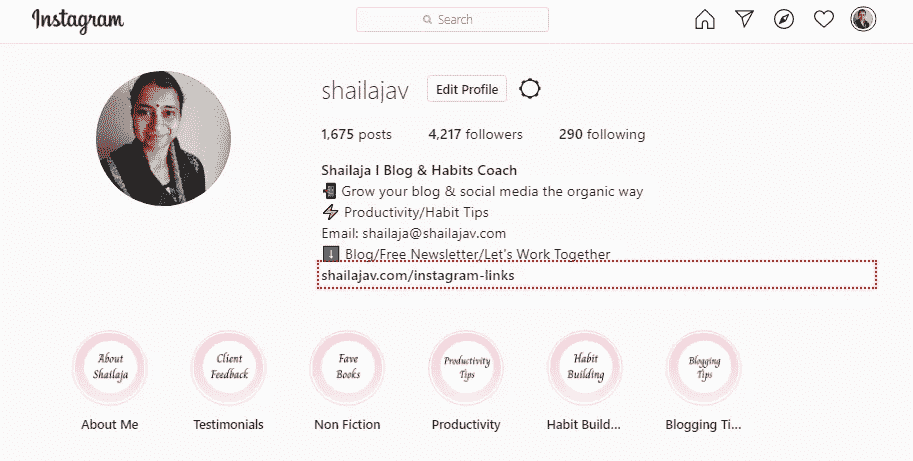
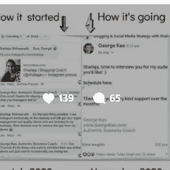
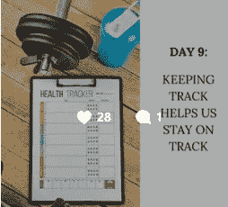

# 当你的内容参与度低时，该如何应对

> 原文：<https://medium.datadriveninvestor.com/how-to-react-when-you-get-low-engagement-on-your-content-d9e79bf852e2?source=collection_archive---------14----------------------->

## 这就是我所做的&为什么它总是有效

Photo by [Markus Winkler](https://unsplash.com/@markuswinkler?utm_source=unsplash&utm_medium=referral&utm_content=creditCopyText) on [Unsplash](https://unsplash.com/s/photos/sad-phone?utm_source=unsplash&utm_medium=referral&utm_content=creditCopyText)

社交媒体的力量在于，它帮助我们在舒适的家中，点击一个按钮，与如此多的人联系。

社交媒体的问题？我们很容易因缺乏参与而感到沮丧，这似乎是我们的制胜法宝之一。事实上，这是我的一个粉丝今天在我的 Instagram 帖子上提出的问题。

她提到她在平台上的参与度似乎在下降，她对此感到沮丧！是算法又变了吗？Instagram 是不是在人们没注意的时候改了东西？她能做些什么来使数字回升呢？

听起来熟悉吗？我在这里告诉你,“问题”只会是一个，如果你这样看的话。相反，如果我们把它翻过来呢？

让我分享一个例子来说明我的意思。

这是我的 [**Instagram 账号**](http://www.instagram.com/shailajav) 。

这是一个社交媒体渠道，我通常可以在这里获得关于我内容的最佳参与度。

[**这是我上周发的一个帖子，**](https://www.instagram.com/p/CHMYlbZAoo3/) 在这里我分享了即将采访[乔治·高](https://medium.com/u/76ce54637ee7?source=post_page-----d9e79bf852e2--------------------------------)的消息。

看看参与度:那个帖子有超过 130 个赞和超过 60 条评论。

[**这是我本周贴的一个帖子**](https://www.instagram.com/p/CHW2qDJox8B/) ，作为我正在进行的习惯培养系列的一部分。那里的订婚显示了 28 个赞和一条评论。

现在，你可能会想，这太可悲了！对于一个拥有 4k 粉丝的人来说，你的帖子只有一条评论？你是如何管理的？你晚上怎么睡得着？(好吧，我可能夸大了这一点；)

在我谈论如何处理低参与度之前，让我们描述一下你觉得没有达到标准的参与度。

1.  敬业度“下降”是一个相对指标。down 到底是什么意思？它比你通常收到的少还是比你所在领域的其他客户少？首先识别它。如果是前者，很有可能这个帖子并没有展示给很多人。如果是后者，可以不用担心。
2.  人们对你的内容感兴趣吗？完全没有吗？如果答案是肯定的，那么这比“参与度低”的事实更重要。

## 我如何处理低参与度的秘密

这是我如何处理我自己内容的低参与度的秘密，这正是我今天早上告诉向我提出这个问题的追随者的。

> 无论我在一篇帖子上收到 100 条评论还是 1 条评论，我的反应都完全一样:带着感激。

不久前，我完全不再担心获得更多的关注者、更多的评论和更多的参与。相反，我关注的是那些真正与我互动的人，我的观众。

## 这里有一个练习供你尝试

这叫颠倒你的反应。

假设你在你的社交媒体账户上发了一个帖子。你等一会儿，然后在一天结束时回来检查。

它有 5 条评论。现在，有两种方法来应对这种情况:

一) ***什么？5 条评论？！*** 毕竟我在帖子里做了那些露骨的事？去他妈的。算法在搞乱我的帖子，没人关心我的工作！

B) **哦哇！5 条评论！**这太神奇了。我的作品引起了 5 个人的共鸣。让我看看他们说了些什么，并对每一个问题作出回应。

你认为哪种反应会让你长期留在内容创作和连接的空间？猜这个没有奖励。

## 订婚的真相

这是我的做法。这就是我对待每一篇文章的方式。

如果你检查我的 Instagram 账户，你会看到我的一些帖子有 3 条评论。其他人有 20 条评论。还有一些人有 50 条评论。

> 事实是评论的数量并不重要。发表评论的人更重要。

让他们觉得自己很特别。承认他们，并邀请他们问你具体的问题。

忘记算法，专注于你的优势:创造内容和与你的人联系。努力培养你已经拥有的观众。你不能控制算法。

您可以控制如何回应与您合作的人:)

更多诚实、真实、有机的参与技巧，请查看我的免费每周时事通讯。