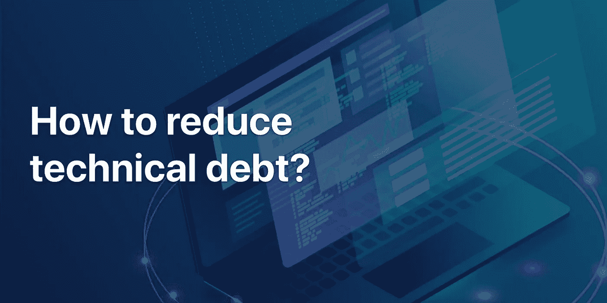

# 如何减少技术债务

> 原文：<https://medium.datadriveninvestor.com/how-to-reduce-technical-debt-d70a9e8dd2b2?source=collection_archive---------34----------------------->

在软件开发中，[技术债务](https://duecode.io/blog/what-does-technical-debt-look-like/)发生在代码的某些必要方面没有作为一种更快完成项目的方式被添加或删除的时候。技术债务的不利之处在于，将来修复这段代码很可能比现在修复它花费更多的时间。

一个本可以持续 10 天的项目，如果加上你试图修复被忽略的代码行的时间，可能会多花几天。所以，作为一个开发者，你总是需要尽可能地避免技术债务。在这篇文章中，我将与你分享一些实用的方法，你可以[在你的软件开发项目中减少甚至消除技术债务](https://duecode.io/blog/how-to-reduce-technical-debt/)。让我们开始吧

# 承认它的存在

如果你要解决技术债务的问题，你首先需要承认的是它存在的事实。当您和您的团队知道技术债务确实存在时，提前计划如何处理它是非常容易的。也许不可能有 100%完美的代码，但是作为一个团队，你的目标应该是尽可能接近 100%。

# 例行代码审查

当与团队合作时，与你的一些团队成员分享你的代码总是很重要的，这样他们可以检查代码以识别错误和任何遗漏的代码行，这对[提高代码质量](https://duecode.io/blog/how-can-i-improve-my-code-quality/)是必要的。我建议使用工具来审查代码，因为它可以很容易地查看每个人所做的所有更改以及这些更改的时间和地点。

此外，当您计划您的软件开发项目时，总是将它分解成更小的里程碑，以便您在每个里程碑之后进行评审。在项目结束时指出工作中的错误和缺失部分比在开发过程中按顺序做要花费更多的时间。从实践的角度来看，审查 100 行代码比审查 3000 行代码要容易得多。

此外，为了简化团队的评审过程，始终要有一个代码结构应该是什么样子的指南。当团队中的每个人都遵循一个结构时，指出任何错误就变得非常容易，因为评审人员知道在哪里可以找到什么。

# 开发者和设计者之间更好的沟通

在开始编写任何项目代码之前，开发人员需要与设计人员坐下来，就最终产品的外观达成一致。这将消除删除任何可能影响最终产品使用方式的有用代码的可能性。在开发的某个阶段，也有必要让产品的设计者对完成的代码部分进行评审，并验证它们是否满足他们对最终产品的期望。

这种团队协作将使您不必再回到代码深处去做那些本可以更早解决的小改动。大多数开发人员犯的错误是破坏设计团队的影响力，不知道就最终产品的质量而言，他们的贡献同样重要。

# 选择灵活的软件开发工具

在开发一个特定的项目时，总是需要使用一些工具，这些工具可以使你在需要的时候很容易地做出改变。您选择用来开发项目的语言和框架将对您的团队检测任何错误并尽快修复它们的灵活性产生巨大影响。当通过添加或删除一些代码行来修复错误变得更容易时，您可能会在项目结束时减少技术债务的数量。

你可能还需要使用智能的[开发工具](https://duecode.io/blog/code-quality-tools/)，它可以检测代码中任何形式的语法或语义错误。今天，大多数文本编辑器确实有一定程度的智能，可以根据您用来编码的语言来检测错误。他们会在你的代码中任何可能需要你注意的错误部分加下划线。对于某些编辑器，如果您想要启用某些错误检测功能，您可能需要下载扩展

# 设定现实的截止日期

在进行一个项目时，考虑你为不同的里程碑设定的最后期限是非常重要的。当你设定一个不容易实现的截止日期时，你最终会更专注于完成项目，而不太注意你正在做的工作的质量。在压力下工作会在最终产品中导致很多错误，这将会花费你更多的时间来修正。

所以，在设定最后期限之前，一定要清楚地了解你要做的工作类型。您可能还需要与您的团队进行讨论，并就每个可交付成果的时间表达成一致。在一天结束的时候，按时完成一个产品是没有意义的，但是它有许多错误需要处理。

# 最终想法

软件开发团队在某些时候必须处理的主要成本之一是偿还技术债务。就像在金融界一样，你偿还债务的时间越长，偿还债务的成本就越大。在软件开发方面，这种成本是以时间和金钱的形式支付的。

所以，及时处理你的技术债务将会节省你将来在这些债务上花费的时间和金钱。提前计划你将如何处理技术债务是非常重要的。像 [duecode.io](https://duecode.io/) 这样的自动化和智能工具可以帮助你减少开发过程中的技术债务。

*原载于 2020 年 12 月 14 日*[*https://due code . io*](https://duecode.io/blog/how-to-reduce-technical-debt/)*。*

在 [**编码、软件和移动开发**](https://app.ddichat.com/category/coding-software-mobile-development) 中安排 DDIChat 会话:

 [## 专家-编码、软件和移动开发- DDIChat

### DDIChat 允许个人和企业直接与主题专家交流。它使咨询变得快速…

app.ddichat.com](https://app.ddichat.com/category/coding-software-mobile-development) 

在此申请成为 DDIChat 专家[。
与 DDI 合作:](https://app.ddichat.com/expertsignup)[https://datadriveninvestor.com/collaborate](https://datadriveninvestor.com/collaborate)
点击此处订阅 DDIntel [。](https://ddintel.datadriveninvestor.com/)