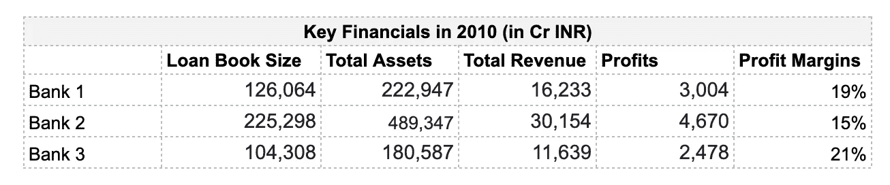
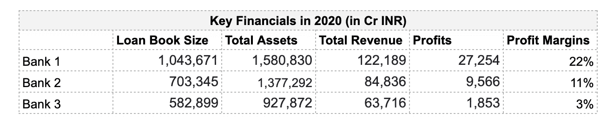
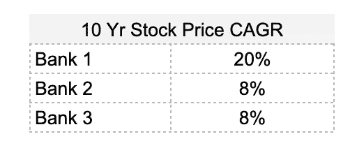

# 如何减少 DIY 投资失败的几率

> 原文：<https://medium.datadriveninvestor.com/how-to-reduce-the-chances-of-screw-ups-in-diy-investing-ef9a87f28e0?source=collection_archive---------4----------------------->

Photo by [MayoFinance](https://unsplash.com/@mayofi?utm_source=medium&utm_medium=referral) on [Unsplash](https://unsplash.com?utm_source=medium&utm_medium=referral)

在这篇文章中，我们将谈论一些实用的步骤，人们可以采取这些步骤来最小化投资股票时永久资本损失的风险。

谁是**不是**这篇文章的目标受众:

*   著名投资者 Mohnish Pabrai 建议做一个简单的测试——问问你自己，如果你想买下整个公司，要花多少钱？如果你不知道答案或者不明白被问到的问题，你自己就不应该做投资。投资低成本的指数基金。
*   如果你不喜欢花时间在年度报告上，看不懂财务报表，或者不喜欢做研究。

**这篇文章的目标受众**是谁:

*   试图从基本面评估股票的人，愿意努力做必要的研究，并至少持有 3 年以上。

研究变得很无聊，有时很难得到你需要的信息，这需要毅力，总的来说这不是一件容易的事情。此外，可以说 95%以上的投资者无法长期跑赢指数。这么多努力都白费了！所以投资指数可能还是最优方案。

## **(1)投资者的困境**——如何选择合适的骑师

作为一名投资者，你的工作是选择一家会变得比现在更有价值的公司，即股价上涨数倍。一家公司的价值只不过是其一生中为股东创造的所有自由现金流。所以基本上，作为投资者，你必须选择能够产生更多现金流的公司，而目前的价格已经没有反映出来。

让我们重现一个情景，让你更好地体验这个困境:让我们回到过去，假设你在 2010 年，你必须从印度的三家私营银行中选择一家:

Three private sector banks in Mar 2010

这三家银行都是领先的私营银行。宏观理论认为，从 2010 年到 2020 年，银行将以 14%以上的增长率增长。2010 年你会选择哪些公司？暂停一下，选择其中一个。

银行 2 的贷款账簿规模最大。银行 3 的利润率最高。银行 1 和银行 3 的资产基础相似。

十年后的 2020 年，这是这三家公司的财务状况:

The same three private sector banks in Mar 2020

这是股价回报:

Data source: Screener as of Dec 1, 2020

银行 1: HDFC 银行，银行 2: ICICI 银行，银行 3: Axis 银行

仅从 2010 年的财务状况来看，要预测 HDFC 银行将增长数倍，安讯士银行将面临不良资产危机可能并不容易。不同的指标在不同的行业变得很重要。在这种特殊情况下，净息差和贷款账簿的质量会提供更多信息，但总会有一些未知数。

作为投资者，你需要回答选择哪个骑师的问题，这是一件非常困难的事情。

## (2) **伟大的投资者如何挑选赢家？**

通过用我有限的智慧跟随伟大的投资者，我明白了伟大的投资者不会试图预测赢家，相反，他们会努力减少在选择赢家时出错的几率。看起来我们仍然在谈论同样的事情，但是这种思维过程的改变有助于控制热情。它将焦点从增长预测转移到过去的记录。

那么，如何减少出错的几率呢？—将问题从“*谁将是赢家*”修改为:

1.  经营企业的人诚实可信吗？诚信是没有商量余地的。想想看，一个不诚实的人真的能相信 AR/投资者的陈述吗？
2.  为了变得更有价值，公司应该能够在保持 ROCE 高于资本成本的同时增加收益。问题变成了“*”企业主们过去有没有这样做过* —如果是的话，他们将来很可能会这样做，即关注历史记录而不是童话故事。
3.  他们在正确的地方操作吗？众所周知的事实是，有些行业提供有利的动态赚钱，而有些行业极其困难。想想*两轮车，它* vs *航空公司，电影院*。投资者理念:如果你在正确的行业运营，你很可能会继续赚钱。
4.  企业能否在未来的竞争中继续保护自己？赚取更高 ROCE 的原因是可持续的和持久的吗？或者说，你的生意有护城河吗？
5.  增长从何而来？是结构性的，如印度的保险业，还是市场份额的增加，如电信业的联合投资组织，还是行业正规化，如 real 商品及服务税/黑钱法案后的房地产，还是行业整合，如每次不良资产证券化危机后的银行业？一个行业可能受益于多重顺风，例如印度作为一个国家受益于结构性增长的跑道。投资者的理由:如果一个行业有自然的增长顺风，你的赛马骑师也可能做得很好。
6.  所有的圣杯，资本分配决策。管理层是否做出了正确的决策来利用机会并合理利用资本？或者，过去的成功完全是因为运气不好。你在骑师身上下注，毕竟，所有其他的事情都被分析以理解这项工作对骑师来说有多难或多容易。[你可以在这里](https://medium.com/swlh/understanding-capital-allocation-1-66caab324194)获得资金配置入门。
7.  事情不会在这里结束。一旦你确定了合适的公司，它必须有合适的估值。为质量付出过高是投资的另一个主要风险。价格很容易获得，但是培养对公司价值的意识本身就是一个话题。

*“价格是你付出的，价值是你得到的”——沃伦·巴菲特*

还有，*“价值在于旁观者的眼中”——匿名*

似乎是一项艰巨的任务？是的，它是！上述每个因素都有几个子部分和相关的细微差别。投资需要理性的框架和不带感情色彩的方法。保持理性比听起来要困难得多。当$$$危在旦夕时。正如本杰明·格拉哈姆所说，*投资者最大的敌人可能是投资者自己*。

*指数基金万岁！*

**继续阅读** [**第二部**](https://p17abhishekr.medium.com/how-to-reduce-the-chances-of-screw-ups-in-diy-investing-2-b1c4ebab302b?source=friends_link&sk=722552a917a15a5e087bc95799c1e399) [此处](https://p17abhishekr.medium.com/how-to-reduce-the-chances-of-screw-ups-in-diy-investing-2-b1c4ebab302b?source=friends_link&sk=722552a917a15a5e087bc95799c1e399)

在第 2 部分中，我们将讨论:

## (3)克隆超级投资者作为投资策略&怎么做？

## (4)如何选择克隆的超级投资人？

*附注:目标是阐明概念。本文中提到的公司不是买卖建议(好像我的建议很重要)。*

*本文中的所有见解均非原创，并归功于他人。原文解读的所有错误或疏漏都是我的。*