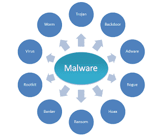
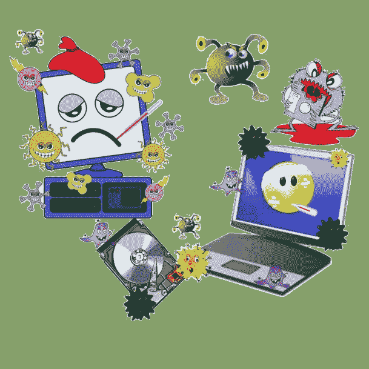
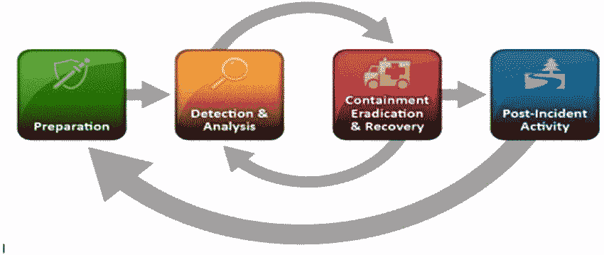

# 如何应对恶意软件/病毒的传播

> 原文：<https://medium.datadriveninvestor.com/how-to-respond-malware-virus-spread-e59838226664?source=collection_archive---------12----------------------->

由于冠状病毒(新冠肺炎)，也就是现在的疫情，我们正经历着人类的历史时刻。我的目标是提高对卫生当局指导方针的认识，并指出我们如何应对 IT 行业病毒传播的相似之处。

由于导致系统故障、损坏数据、增加维护成本等，计算机病毒每年造成数十亿美元的损失。

MyDoom 是最具破坏性和传染性的计算机病毒之一，在 2004 年造成了超过 380 亿美元的损失，25%的电子邮件被感染。

**ILOVEYOU** 是另一种致命的传染性计算机病毒，它造成了超过 100 亿美元的损失，并传播了全世界 10%的计算机系统。这些计算机系统中有一半在 2000 年 5 月的第一周内受到感染。情况如此糟糕，以至于政府和大公司将他们的邮件系统离线以防止感染。

**Stuxnet** 是第一个意在破坏伊朗核计划的网络战病毒。它设法摧毁了伊朗五分之一的核离心机，近 60%的感染集中在伊朗。

Stuxnet

在这篇文章中，我将试着强调计算机恶意软件/病毒的基本原理，以及我们如何应对它们，而不会让你对技术细节感到厌烦。我将努力强调生物恶意软件/病毒的相似性，如冠状病毒(新冠肺炎)。我不是生物恶意软件/病毒方面的专家，所以我将以 IT 专业人士的身份提出我的观点。

# 什么是恶意软件/病毒？

恶意软件是一种恶意软件，旨在对计算机、服务器、客户端或计算机网络造成损害。因此，我们可以将恶意软件定义为各种恶意软件的统称，如计算机病毒、蠕虫、特洛伊木马、勒索软件、间谍软件、广告软件和恶意软件。

Malware

计算机病毒是一段代码，它通过修改其他程序进行自我复制，并在执行时从一台主机传播到其他主机。这通常会对宿主造成损害。零日病毒是一种以前未知的计算机病毒，没有已知的防病毒签名可用。

常驻内存病毒(resident virus)，在执行时将自身安装为操作系统的一部分，并保留在 RAM 中，直到关闭。就像有些病毒会永久留在体内。一种非内存驻留病毒(non-resident virus)，它在执行后不会留在 RAM 中，扫描目标，感染它们，然后退出。

生物病毒是一种微小的传染因子，它在生物体的活细胞内复制。病毒可以感染所有类型的生命形式，人、动物、植物、微生物，包括细菌和古菌。**疫苗**帮助身体的免疫系统识别并对抗病毒或细菌等病原体，从而保护我们免受它们引起的疾病。

Computer Virus

如果我们可以称签名为计算机病毒的疫苗。新冠肺炎病毒和零日病毒有相似之处。因为目前还没有针对冠状病毒(新冠肺炎)的已知药物或疫苗。

# 什么是反病毒软件的签名？

计算机病毒签名是用于检测和识别特定病毒的独特代码模式。反病毒软件扫描签名并依赖已知恶意代码的签名数据库。这是有效的，但是如果没有获取样本、生成签名和分发更新，则无法防御零日恶意软件/病毒。基于签名的方法容易受到混淆和各种其他技术的攻击。因此，现代反病毒软件使用更先进的方法(启发式:与相关病毒的相似性，实时行为:行为异常，沙盒和签名)。

Anti-Virus Signature

签名是由专家执行的恶意软件分析的结果。通常有两种类型:

1.  **静态恶意软件分析**:静态或代码分析是一种逆向工程，在不执行的情况下检查二进制代码的每个组件以及与其他资源的关系。
2.  **动态恶意软件分析**:观察恶意软件在与主机系统相同的沙箱环境中实际运行时的行为。

通过提取病毒并削弱或杀死它们使它们不能繁殖而开发的疫苗。身体免疫系统将它们视为威胁并消灭它们。因此，身体的免疫系统识别并消灭任何与未来可能遇到的病毒相关的微生物。

与正在开发签名的反病毒软件公司类似，许多制药公司正在开发冠状病毒药物或疫苗(新冠肺炎)

# 病毒的组成、症状和生命周期？

通常，计算机病毒有以下三个组成部分:

*   **感染媒介**:病毒如何传播/传播(冠状病毒通过呼吸道飞沫、体表、密切接触等。)
*   **触发:**将引发恶意功能/有效载荷(冠状病毒的潜伏)的事件/条件
*   **有效载荷**:数据/代码执行恶意操作(冠状病毒可导致严重疾病，如肺炎或死亡)

计算机病毒的生命周期有 4 个阶段(类似于生物学):

1.  **病毒入侵(休眠):**病毒已设法访问目标主机。(冠状病毒进入体内)
2.  **复制(传播)**:病毒开始繁殖，也就是自我繁殖和复制。(冠状病毒开始感染细胞，自我复制并通过呼吸道飞沫传播)
3.  **触发**:病毒因条件或事件而被激活，从而开始执行预期的功能。(暴露于感染和出现第一个症状之间的时间，如冠状病毒潜伏期)
4.  **执行**:病毒在释放有效载荷的地方开始工作，最终用户将开始注意到诸如删除文件、系统崩溃或屏幕上无休止的弹出窗口等问题。(这是感染者开始出现咳嗽、气短、发烧等症状的地方，并可能导致严重疾病，如肺炎或死亡)(这是身体与病毒斗争的地方)

# 我们如何应对(计算机安全事件响应)？

员工行为会对组织中的信息安全产生重大影响。类似的人的行为会对当今疫情的病毒传播产生很大的影响。因此，员工是组织中信息安全链的重要组成部分。与人相似，我们也是全球努力保护亲人和其他人(尤其是老年人)安全和健康的重要组成部分。

为了应对事故，有两个级别的计划:

*   战略计划:执行层面，战略层面
*   事故响应计划:操作层面、战术层面

# 战略计划

组织定义并传达其管理层战略、优先事项、方向、运营，并分配其资源以实现其战略目标和评估，调整组织的方向以应对整个信息安全业务环境的变化。

通常，在这一级完成以下工作:

*   **预评估**:识别员工的信息安全意识，分析当前的安全政策。
*   **战略规划:**拿出一个更好的认知方案，明确目标，将人或单位分组实现目标。
*   **操作规划**:基于内部沟通、管理、意识和培训计划建立良好的安全实践
*   **实施**:管理层承诺、员工承诺、全员沟通培训。
*   **后评估**:评估规划和实施的成功性，并确定关注领域。

这与世卫组织疾病预防控制中心和卫生部的指导方针相似。世界各地都有关于以下重要性的宣传活动:

*   待在家里，保持社交距离，保持个人和设施卫生，不要囤积物品，满足老年人的需求等。
*   **如果你从国外或危险地区旅行，隔离 14 天**
*   **如有发烧、咳嗽或气短等症状，请自行隔离。**
*   **首先打电话给你的医生或紧急医疗热线，如果你有症状，不要自己去医疗机构，让他们给你指引并接你回家**

# 事故响应计划

事件响应计划是组织为帮助 IT 安全团队准备、检测、遏制、响应和恢复安全事件而采取的系统方法。事件响应计划的目标是检测安全事件并做出反应，确定其范围和风险，做出适当的响应，向所有利益相关方传达结果和风险。同时降低成本、恢复时间和事故再次发生的可能性。

这类似于当地卫生当局和医疗机构根据政府、卫生部、疾病预防控制中心等给出的指导方针和计划制定事件处理流程。

**事件处理指南**:IT 安全团队处理安全事件的一般指南和程序。安全事故处理指南有四个关键组成部分:

Incident Handling

1.  **准备**:建立并培训事故响应团队，获取必要的工具、资源并应用一套控制措施。(建立和培训医疗队、检测包、公共活动限制、设施等。)
2.  **检测&分析**:识别和调查可疑活动，以确认安全事件，根据影响确定响应的优先级，并协调事件通知(测试、分析和确定患者优先级，调查和跟踪患者接触的人员等)。)
3.  **遏制、根除&恢复**:隔离受影响的系统以防止升级、限制影响、找到事件的根本原因、从环境中移除恶意软件、受影响的系统和不良参与者。当威胁不再存在时，恢复系统和数据。(隔离受冠状病毒影响的人或地区，在医院治疗等。)
4.  **事件后活动**:经验教训分析、根本原因和响应、报告改进事件响应计划和未来响应工作的机会(医学专业人员和国家之间共享的已出版期刊和案例。

# 最终用户安全意识

最终用户是安全链中最薄弱的环节，据估计，超过 90%的安全事故和安全漏洞都与某种人为错误有关。我们是疫情病毒中最薄弱的一环，病毒在人与人之间传播。

# 数字卫生

与最终用户培训一样，数字卫生是信息安全的一项基本原则。与个人卫生类似，它是关于建立简单的日常工作，以尽量减少来自网络威胁的风险。数字卫生实践为用户提供了另一层保护，降低了易受攻击的节点受到影响并危及其他节点或网络的风险。

# 隔离

在事故淹没资源或增加损失之前，遏制是很重要的。大多数事件都需要控制，因此这是处理每个事件早期的一个重要考虑因素。遏制措施为制定量身定制的补救策略提供了时间。

A Pale Blue Dot

*最初发表于*[*【https://github.com】*](https://github.com/ealtili/HowToRespondVirusSpread/blob/master/README.md)*/ealtili。*