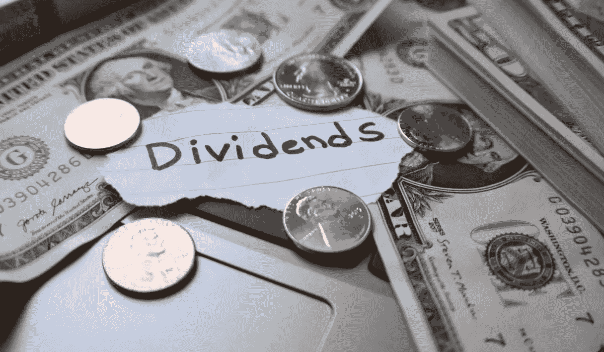

# 如何通过分红投资退休

> 原文：<https://medium.datadriveninvestor.com/how-to-retire-through-dividend-investing-b875ebfa21f1?source=collection_archive---------0----------------------->

## 借助这一行之有效的策略，加速您的退休之路

分红投资是最好的退休方式之一。围绕分红股票建立的投资组合不像期权投资组合那样需要太多的关注，也没有房地产带来的那么多麻烦。

如果你可以退休后使用任何收入流，股息投资将是最好的选择。但是怎么才能通过分红投资退休呢？需要什么…整个过程是如何进行的？

股息投资包括购买向股东支付股息的股票。大多数股票提供季度分红，而有些股票每年或每月分红一次。

首先从你的生活成本开始。分红股票不会为你的退休买单。他们为你支付一定数量的费用。如果把所有费用都计算在内，你的股息支付还有剩余，你就退出了股息投资。

如果你平均每月分红 5000 美元，而你每月只花 4000 美元，那么你已经通过分红投资成功退休了。

如果每月 4，000 美元的支出增加到每月 6，000 美元，您仍然有一些工作要做。

这就是为什么许多主张提前退休的人也主张低生活成本。成为一名极简主义者还会给你带来“极简主义红利”，也就是你用这种生活方式省下的钱。

买一个小一点的房子可以减少你每月几百美元的抵押贷款。这笔额外的钱可以用于分红股票，进一步刺激你的退休生活。这是工作中的最低限度红利……在这个过程中刺激你的红利支付。由于抵押贷款支付较低，在你退休之前，你不需要从股息支付中获得那么多钱。

如果你将股息投资和房屋拆迁结合起来(购买多户房产，让租户支付你的抵押贷款)，你会更快地退休。

所以这个过程的第一步是算出你每个月花多少钱。跟踪每一项支出，因为你会发现很多削减支出的机会。你减得越多，就越容易早点退休。

下一步是投资符合你的短期和长期目标的分红股票。有些人追逐高股息率，不太在乎升值幅度。平稳的股票价格对他们来说很好。其他人想投资有巨大升值潜力的分红股票。在这种情况下，股息率可能会很低。

在撰写本文时，苹果的股息率目前不到 1%。这是一家成长中的公司，但在你退休之前，你需要积累太多的股票。如果你通过苹果公司的股息退休，不仅需要更长的时间，而且苹果公司会占用你太多的投资组合。

要从你的股息支付中每月赚 4000 美元，你每年必须赚 48000 美元(每年计算比每月计算更容易)。以 1%的股息收益率计算，你将有 480 万美元投资于股息股票，每年可赚 48000 美元。

在 4%的股息收益率下，你只需要投资 120 万美元在股息股票上，每年就能赚 48000 美元。

我寻找股息收益率高于 3%且有可观股息增长的成长型公司(至少增长 5%，但通常我会寻找更高的数字)。我还寻找表明公司能够维持股息的股息支付率。

股利支付率就是公司收益中有多少用于支付股利。股息支付率为 0%的公司不支付股息。股息支付率为 100%的公司将所有收益作为股息进行分配。100%的股息支付率是不可持续的，也没有提高股息的回旋余地。

任何股息支付率低于 70%的股票都在我的关注范围之内。

股票的价格对我来说并不重要，除非我认为它被高估了。我宁愿买 300 美元的低估股，也不愿买 10 美元的高估股。

建立一个符合你标准的股票清单，并开始买入。我关注的一只股息股是保诚。由于疫情和保诚不是一家科技公司的事实，他们的股价仍然远远低于疫情之前的股价。

保诚在最近的收益报告中报告了增长，并采取了成功的成本削减措施来提高底线。该股目前的交易水平是股息收益率超过 6%，这对于任何不是 AT&T 的非 REIT 股票来说都是一个罕见的壮举。

此外，保诚去年的股息增长了 10%,在过去 5 年中，股息增长了近 90%。根据今年的估计，他们的股息支付率也低于 50%。它检查了足够多的我的箱子，以便在我的投资组合中有一席之地。

但是这和提前退休有什么关系呢？在这个例子中，我们将继续使用保诚。

保诚目前支付每股 1.10 美元的季度股息，相当于每年 4.40 美元的股息。

如果你持有 100 股保诚的股票，你每个季度赚 110 美元(每年 440 美元)。如果保诚在未来 5 年像前 5 年一样将股息提高 90%，那么 110 美元的季度付款将变成 209 美元的季度付款(836 美元的年化股息付款)。

每年 836 美元离退休还差得很远，但在你没有任何额外工作的情况下，这是从 440 美元/年的一个大飞跃。

你也可以建立自己的投资组合，让股息自动再投资于股票。这 110 美元不是以现金形式支付，而是被转换成保诚的额外股份(根据当前价格大约为 1.5 股)。这一额外份额将导致下一季度额外支付 1.65 美元的股息。

这将随着时间的推移而复合，如果你在数字上加额外的零，你会对股息投资的长期收益有更好的理解。

这些概念对于通过红利投资理解退休很重要。如果你想每年从保诚股票中赚 48，000 美元，你需要大约 10，910 股当前年化股息收益率为 4.40 美元的股票(购买这么多股票加起来略低于 800，000 美元)。

今天购买 10，910 股保诚股票感觉不可逾越，但如果你每个月增加你的头寸，并将股息再投资，随着时间的推移，你可以建立那个头寸。

如果你持有 1000 股保诚保险的股票，按目前的收益率计算，你每个季度将获得 1100 美元的额外收益。按照目前大约 72 美元/股的价格，你将额外获得 15.28 股保诚股票。股息投资回报的是坚持投资的投资者。

利用红利投资作为退休工具的最重要的部分是你每个月投资多少钱。如果你每个月赚 5000 美元，而你每个月的支出是 4000 美元，你可以将差额投资于分红股票。

1000 美元投资于收益率为 4%的股息股票，每年会产生 40 美元的额外收益。如果你一整年都这样做，你将会每年多赚 480 美元。这不包括提高股息和再投资。保守估计，这两项指标可以让您的总支出额外增加 500 美元/年。

500 美元/年本身将继续复利，但随着你投资更多的钱到分红股票，你当前的支付将增加，你将有更多的钱在未来复利。

# 缩小差距

为了缩小差距，开始跟踪你每月的股息支付。根据你选择的股票以及这些股票何时向股东支付股息，有些月份会比其他月份好。

为了缩小差距，先弄清楚你每月的开销，然后算出一年的总开销。然后，算出你目前每年从股息投资中赚了多少钱。

如果你每年从股息投资中赚 1000 美元，你有 48000 美元的年度支出，你有 47000 美元的缺口。了解差距并更多地关注自己的进步，会激励你采取额外的措施，通过分红投资来加速退休之路。

[***想学习如何投资股市赚钱？确保你订阅了我的 YouTube 频道***](http://bit.ly/2W4ag01)