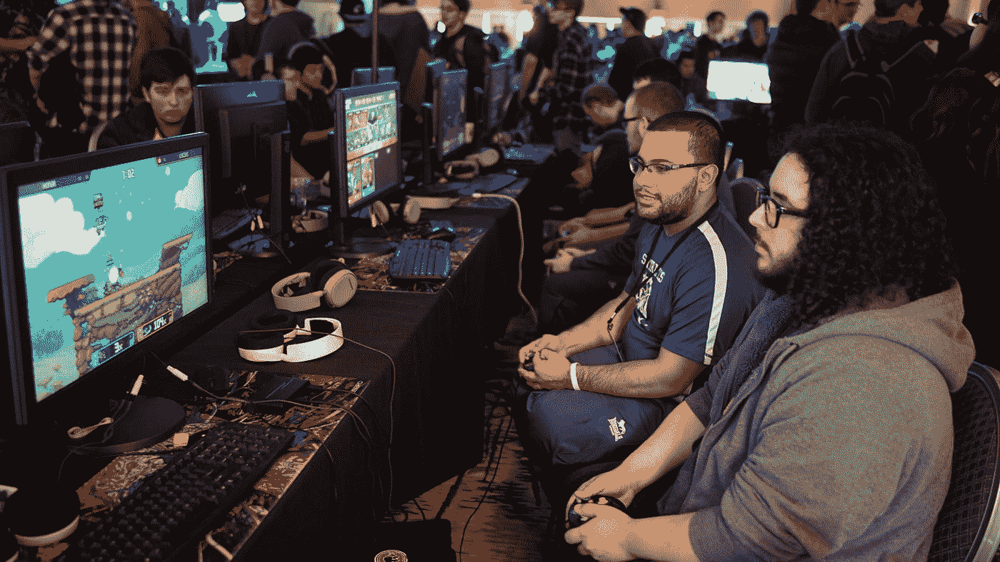

# 如何在一次发布中毁掉你公司的声誉

> 原文：<https://medium.datadriveninvestor.com/how-to-ruin-your-company-reputation-in-a-single-launch-46f3d350ee2?source=collection_archive---------4----------------------->

Photo by [Stem List](https://unsplash.com/@stemlist?utm_source=medium&utm_medium=referral) on [Unsplash](https://unsplash.com?utm_source=medium&utm_medium=referral)

如果你是一个游戏玩家，你可能听说过视频游戏《魔兽争霸 3》的灾难性发布。

如果你对游戏不感兴趣，暴雪是几个经典和标志性视频游戏系列的创造者。

Z 世代的观众肯定熟悉他们的巨作《守望先锋》。

对于我们这些千禧一代来说，星际争霸、魔兽争霸和暗黑破坏神是他们最大的财产。

魔兽争霸 3 是我从小最喜欢的游戏之一。我从小就喜欢这些游戏，还记得我曾经对最新的版本有多兴奋。

 [## 在创业之旅中，拥抱学习|数据驱动的投资者

### 好像建立一个数百万美元的公司还不够困难，企业家必须额外照顾他们的…

www.datadriveninvestor.com](https://www.datadriveninvestor.com/2018/10/16/on-the-entrepreneurial-trek-embrace-the-learning/) 

暴雪有着惊人的声誉。

他们的游戏与其他同类游戏完全不同。

质量和深度都优于市场上的其他产品。

当一个新的暴雪发布时，这是一件大事。

在 90 年代末到 2000 年代末的巅峰时期，他们是电脑游戏界最大的品牌。

然而，他们在 2008 年与动视合并，现在以动视暴雪的名义运营。

上周，2020 年 1 月 28 日，他们发布了他们最经典的游戏之一《魔兽争霸 3》的复刻版。

这次发射完全是一场灾难。

*   被宣传的功能并没有进入游戏
*   发布当天出现了严重的服务器和连接问题
*   粉丝和顾客对该公司感到不安和厌倦
*   大量退款生效
*   这是目前 Metacritic 历史上评分最低的游戏(流行的游戏评论网站)
*   暴雪的品牌声誉受到了不可挽回的进一步损害

这是怎么发生的？

对我来说，它似乎是贪婪、无能、承诺过多、兑现不足、傲慢和糟糕的损害控制的不稳定混合物。

我实际上关注了这个游戏的开发和发布，包括在过去的几个月里看了几个小时的游戏视频和 beta 测试者的评论。

几个月前，我差点就预订了它，不过现在我很庆幸我没有预订。

# 暴雪搞砸了一个本该非常简单的项目…一个简单的重制

最初的魔兽争霸 3 于 2002 年问世。这个项目不是翻拍，而是简单的翻拍。

暴雪将美化视觉图像和电影剪辑场景，提供新的地图，更新的用户界面，重新平衡游戏，将魔兽争霸 3 带入现代时代。

粉丝收到的是一个充满漏洞的游戏，需要补丁和更新，缺少过场动画，图形远不如最初宣传的那样出色，无法连接到服务器，以及其他问题。

他们甚至在原版游戏上欺骗了许多人，这些人甚至不想要重制者。

这个新游戏不应该对原版有丝毫影响。他们应该是独立的实体。

但现在，即使是拥有忠实粉丝群、已经运行了近 20 年的原版游戏，也被这种粗制滥造的版本所破坏。

现在，许多对原版感到满意的长期粉丝被迫下载重新定位的更新，或者被他们购买和支付并玩了多年的游戏拒之门外。

让我们更深入地探究一下这个史诗般的失败。

# 暴雪没有发布一个最基本的可行产品

他们在本应是一个大灌篮的事情上承诺过多，却没有兑现。

虽然这不是一个主要的版本，它只是一个旧游戏的重新制作，但这个游戏仍然属于他们的旗舰系列之一。

魔兽争霸是他们最大和最知名的财产之一，魔兽争霸 3 是巩固王朝作为其最大的热门，魔兽世界的前身。

粉丝们感觉到了与这些游戏的联系，这些游戏让暴雪成为了顶级游戏公司。

事实上，许多粉丝认为《复刻》实际上比很久以前发行的原版质量更差，这让暴雪显得更加无能和粗心。

就好像他们没把它当回事一样。

他们完全没有制作出一个简单的 20 年前游戏技术的复刻版，并且在试图这样做的时候，最终也损害了已经运行了同样长时间的原始游戏。

除了疏忽或无能之外，没有理由认为一家拥有如此丰富资源和经验的公司不能实现这一目标。

# 暴雪官方对粉丝的回应是一场公关噩梦

我从暴雪看到的回应是一个全面的教训，告诉所有专业人士在处理拙劣的产品发布、合理的愤怒客户和公众反弹时不要做什么。

甚至有[报道](https://www.reddit.com/r/warcraft3/comments/eves3w/people_are_getting_banned/)说暴雪论坛的一些成员因为试图帮助其他客户获得退款而被禁止。

从那以后，暴雪最终屈服于压力，开始给予魔兽争霸 3 即时退款。

但他们选择向观众解释整个发布会失败的方式是我在相当长一段时间内见过的大公司最糟糕的公关失误之一。

这封信的第一行开头很糟糕，从那以后也没有好到哪里去。

> 首先，我们想对那些没有得到你想要的体验的人说我们很抱歉，我们想分享我们对接下来的计划。

这不是向愤怒的粉丝道歉的方式。

下面是官方回应的链接。

 [## 魔兽争霸 3:开发者更新

### 向 War3 玩家致敬，我们在过去的几天里一直关注着讨论，感谢你们的反馈…

us.forums.blizzard.com](https://us.forums.blizzard.com/en/warcraft3/t/warcraft-iii-reforged-developer-update/18425) 

这种回应是不真诚的，是居高临下的，是缺乏责任感的，是虚假的道歉，尽管事实上球迷们有充分的理由感到不安。

他们花钱买了一个与预期或广告宣传不符的产品，在他们已经失望之后，暴雪团队告诉他们“很抱歉你没有想要的体验。”

这就像当你与虐待你的朋友或爱人发生分歧时，他们说“很抱歉你有这种感觉。”

这不是道歉。简直是一记耳光。

这是用圆滑的“公司语言”写的，其中使用了很多词汇，但实际上什么也没说，也没有承认任何错误。

人们可以看穿缺乏真实性。

如果你向下滚动魔兽争霸 3 重组团队的声明，你还会看到顾客和粉丝的反应，这是一个丑陋的反应。

# 不要不尊重你的顾客

这些是你最大和最有力的品牌拥护者。

这些人甚至在产品发布前就购买预购。

这些人很兴奋，并围绕你的产品建立起有机的宣传。

这些人多年来一直是忠实的顾客。

这些人是你社区的一部分。

这些人在为你买单，让你的灯亮着！

然而暴雪表现出对他们智力的公然漠视和对他们自己社区的缺乏考虑。

他们没有承认错误并承担责任，而是给出了一个虚假的道歉，这是一种居高临下的态度，并夹杂着空洞的“公司语言”。

它表现出明显的傲慢和侮辱。

为你的错误负责，诚实

有时候人们只是想被听到和感受到。

作为一家企业，你对你的客户和支持你的人负有义务。

作为一个品牌，当客户和你的社区找你解决你造成的问题时，要谦虚一些。

# 没有人大到不能倒

暴雪是一家价值数十亿美元的公司，也是游戏产业巨头。

但那些对游戏感兴趣的人知道，即使在过去的 10 年里，他们作为 PC 游戏顶级品牌的声誉也在缓慢而逐渐地下降。

这里或那里的事件可以被忽略，但这些事情累积起来，有助于公众的看法。

不幸的是，这只是暴雪最近一系列公关失败的又一个例子，该公司似乎正在失去控制。

 [## 在裁员和公关灾难之后，一些暴雪员工害怕暴雪嘉年华

### 暴雪娱乐公司的员工总是期待着暴雪嘉年华，这是一年一度的游戏公司…

www.thestar.com.my](https://www.thestar.com.my/tech/tech-news/2019/11/04/after-layoffs-and-a-pr-disaster-some-blizzard-employees-dreaded-blizzcon) 

这重新引发了关于暴雪作为一家公司的诚信的讨论，这无疑引起了互联网和游戏社区的热议。

越来越多的粉丝谴责这个品牌。

像这样的事件真的会损害一个企业的终身客户价值，激怒你的粉丝群中最忠诚和最铁杆的成员从来都不是一个明智的决定。

你的公司大不代表它无敌。

# 结论

看到公司和品牌将他们的粉丝群体视为一次性的，令人沮丧。

品牌在与顾客打交道和处理他们引起的问题的公关时，需要考虑他们的声誉。

对于任何人谁买了这个游戏，我希望你收集你的退款，如果你不满意的产品。我现在肯定不会买它。

个人和企业应该意识到建立声誉有多难，毁掉声誉又有多容易。

直接的后果可能不容易看到，但长期的结果可能是极具破坏性的。