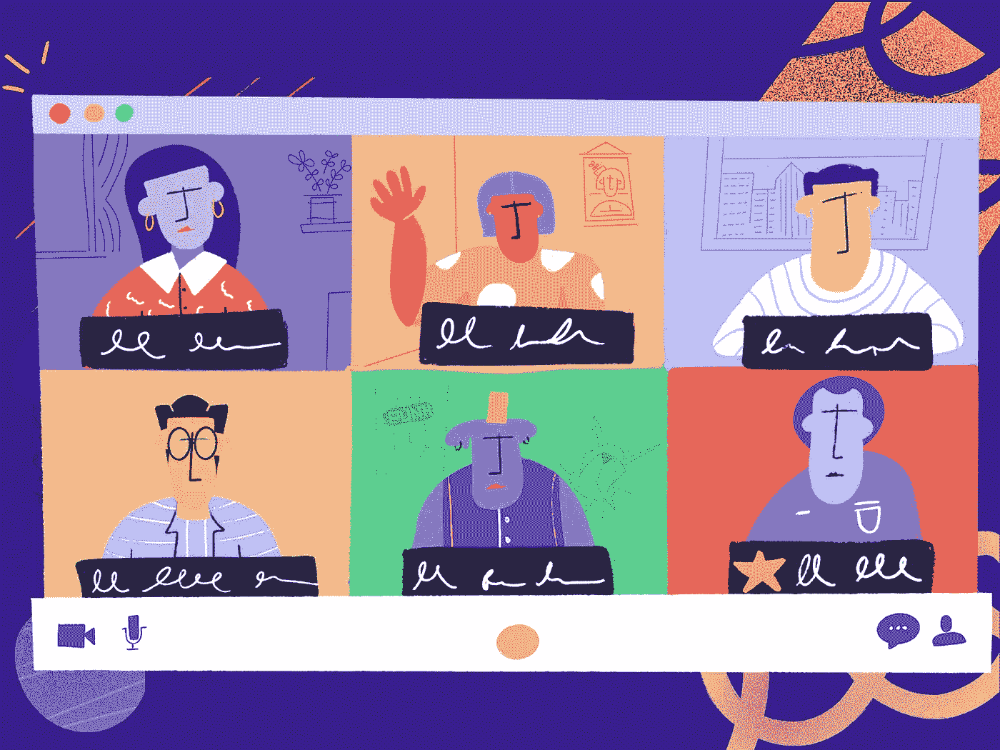
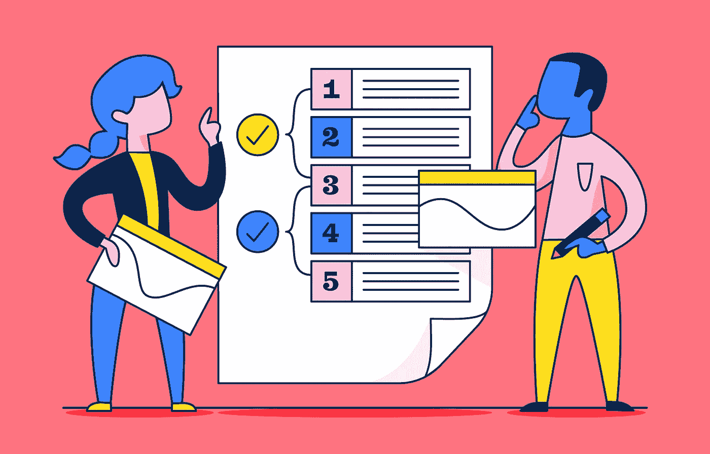
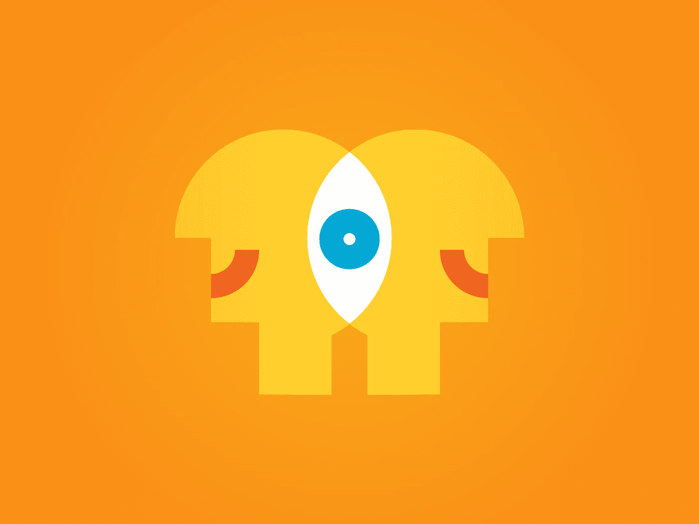

# 设计师的远程会议方法

> 原文：<https://medium.datadriveninvestor.com/how-to-run-a-great-meeting-in-2020-5f986750b298?source=collection_archive---------8----------------------->

## 如何在任何规模下举办一场伟大的会议

Illustration by [Clubhouse](https://dribbble.com/shots/11523888-Remote-Calls)

你也讨厌低效的会议吗？超时的会议，没有有意义的结果的会议，或者与我们无关的会议——这些会议不会提高我们的生产力，它们会让我们对工作不太满意。

> "没有成效的会议就像从我们身边偷走的时间."

2020 年，设计师们经历了缩放疲劳和日历膨胀。虽然许多文章都在讨论与会者应该做些什么来避免这种情况，但让每次会议都超级有效也是会议主持人的职责。

为了在组织层面上应用设计思维，我决定在任何规模上重新设计我们的会议结构。上周在静修期间，我做了一个关于我如何主持设计评审会议的报告，并主持了一个有趣的头脑风暴会议来创建我们的会议指南。在这里，我很乐意分享我关于如何让会议变得高效的关键要点。

# 安排会议——为什么，谁，什么时候？

**为什么** —先想想这次会议的目标。在我的报告中，我主持了一场关于什么让会议变得糟糕的讨论。人们提到一些会议甚至不应该存在——“哦，太好了，另一个会议可能只是一封电子邮件！”在安排会议之前，一定要考虑“为什么”。

**谁**——尽量只邀请与话题相关且有积极性的人加入对话。我在我的公司里发出了一份调查，问题是，“在任何规模下，你最喜欢的会议是什么？”结果显示，大多数人更喜欢小型会议，因为他们觉得更亲密、更有效率、更有意义。对此我有一个建议，那就是在发出邀请之前，想想每个人能带来什么，以及他们为什么关心这个话题。

当时——寻找最佳时机可能很棘手，但却很重要。首先，了解你同事的工作习惯。例如，有些人喜欢在下午有更多的专注时间，所以试着在早上安排一些时间和他们在一起。检查参与者的日程表，尽量不要邀请他们参加没有任何休息的连续会议——我们都在远程工作，这些休息对我们的心理健康至关重要。如果你不确定某个时间是否适合某个特定的人(比如一个新员工)，发一条简短甜蜜的时差信息来确认一下。

# 确保会议准时结束

你参加过超时的会议吗？你当然有！我也经常这样。让我告诉你真相——没有人希望会议超时。以下是我的一些建议，让你更容易坚持下去:

**总是要有一个时间分解的议程**

我一直在做的一件事非常有效，那就是每次会议都要有一个时间分配的议程。我不仅把议程附在日历上，而且还在每次会议开始时谈论它。然后我会监控时间，坚持议程。

illustration by [Asana Blog](https://blog.asana.com/2017/12/run-effective-meetings-agenda-tips/)

**当有人离题时立即打断**

你正在开会。有人变得兴奋起来，提出了一个不同的话题。你觉得阻止他们很尴尬，所以你让他们在会议的剩余时间里发言。

停止这样做，并立即中断。在中国文化中，打断别人是不礼貌的，所以我一直觉得这超级难。但我也知道通过打断，我可以节省人们更多的时间，并专注于更重要的事情。简单地说，“这是一个好主意，但我想回到注册流程的话题。大家对第二个设计有什么想法？”，你的同事会感激你让每个人都在正轨上。

# 通过移情和激励促进自由表达

**感同身受**——有些人喜欢直言不讳地说出自己的观点，而有些人则更喜欢给出书面反馈。在我的设计评论会议上，我总是说，“你可以随时提问或者在谷歌文档中写下你的想法——用你觉得更舒服的方式就行了，”这很有效。

**动机—** 人们只关注与自己相关的事情。在会议开始时，我喜欢谈论这个话题如何影响每个人的工作，或者每个人的独特贡献如何如此有帮助。例如，我会说，“我邀请了 Alex，因为我希望获得他对产品隐私和安全问题的独特观点，我知道他非常关心设计如何影响他们。”如果人们知道他们应该扮演的角色，他们就更有可能做出贡献。

illustration by [Blankenship](https://dribbble.com/shots/5667869-Empathy-helps-you-see-eye-to-eye-to-EYE)

# 以 TL 结尾；灾难恢复和行动项目

人们讨厌没有明确结论的会议。事实上，仅仅通过陈述 TL；会议结束时的 DR 可以帮助人们更有成就感。

明确行动项目。它可以标志着一次会议的圆满结束。为了更进一步，你也可以在会议后张贴行动项目来通知人们，尤其是那些未能参加会议的风险承担者。

# 照顾彼此的幸福

一天中有很多聚会或放大会议会让人疲惫不堪。如果会议超过一个小时，试着给人们足够的休息时间会很有帮助。

由于整天呆在同一个地方，人们可能更容易对会议产生负面情绪。对同事更有同情心；我和我的同事尝试做的一件事是在户外进行更多的一对一活动。我们鼓励彼此尽可能在一对一的时候去散步。

我相信幸福是我们工作和生活的重要组成部分。别忘了照顾好自己和他人，即使是在开会的时候:)

Enjoyed that read? Click (and hold) the 👏🏻 to recommend it to other interested readers!