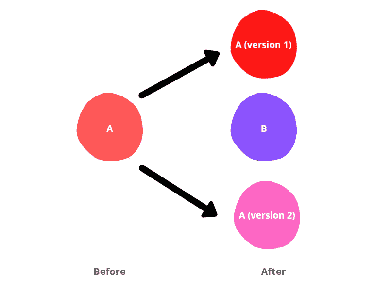
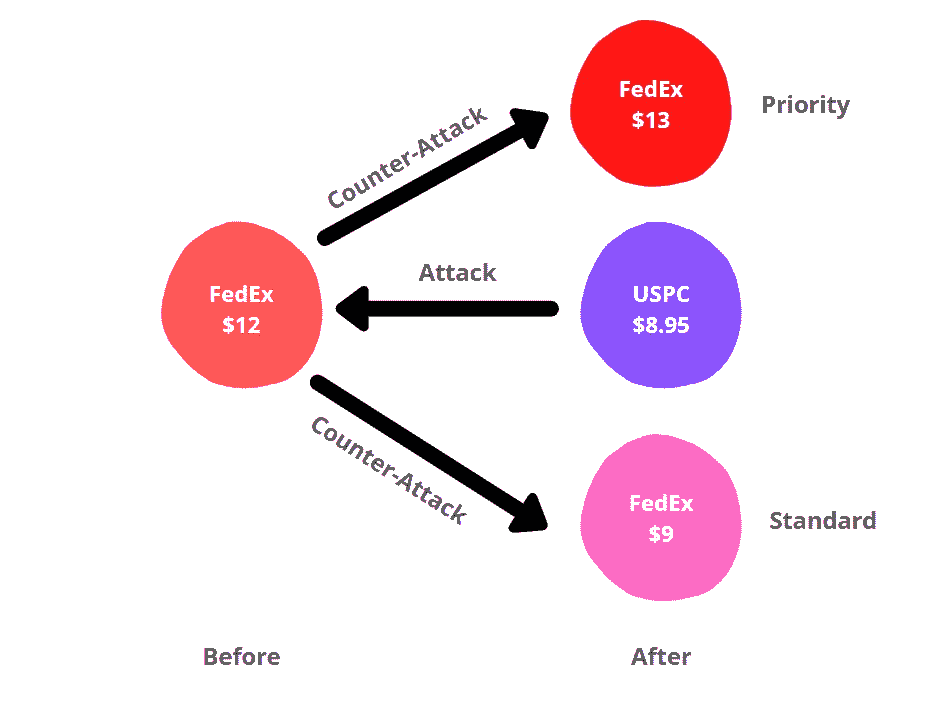

# 如何“夹住”你的竞争对手

> 原文：<https://medium.datadriveninvestor.com/how-to-sandwich-your-competition-4a6c13cad76c?source=collection_archive---------7----------------------->

## 在充满活力、竞争激烈的市场中扩大您的客户群

By Author. Don’t worry, I’ll explain this in a while.

假设你在经营一家企业，创造利润和一些商誉。你这么做已经有一段时间了。现在有一天，这个新玩家来到镇上，他提供了一个与你相似的产品，但价格更低。你会如何回应？

或者更好的情况是，假设你是一个新玩家，你想加入这个游戏，但是注意到已经有一个现有的玩家提供相似价格范围的相似产品。你会怎么做？

或者更好。比如说，你想扩大业务，同时保持健康的利润率。你该怎么办？

你会如何处理这些问题？

虽然有多种策略可以专门解决这三个不同的问题，但我将在这里与您讨论其中一个——“三明治”策略，如果应用得当，它可以创造奇迹。

为了理解这一策略，让我们来分析一下联邦快递当年发现自己处于困境时是怎么做的。

联邦快递的服务运行顺利，直到有一天，美国邮政署​(USPS)决定推出定价 8.95 美元的快递邮件，与联邦快递 12 美元的服务竞争。

任何其他公司都会通过降低价格来应对，并与美国邮政展开无情的价格战。

但是联邦快递意识到价格不仅仅是一个数字。这是一种表明他们为客户增加价值的机制。

 [## 2020 年最佳短期投资选择精选资源|数据驱动型投资者

### 投资是增加你净财富的一个好方法。如果你通过遵循一个严格的…

www.datadriveninvestor.com](https://www.datadriveninvestor.com/2020/03/28/handpicked-resources-for-the-best-short-term-investment-options-of-2020/) 

所以，并没有引发价格战。而是重新定义了市场，稍微修改了产品。

联邦快递现有的服务没有具体说明交付时间。因此，它引入了一个新功能——现在你也可以设置时间，以及你的交货日期。

随着这一增加，联邦快递开始提供两种交付服务:
-优先:将在早上到达
-标准:将在下午或晚上到达

对于联邦快递与客户打交道的 B2B 客户来说，“优先”帮助他们传递了一个强有力的信息——他们重视客户的业务。许多公司，包括[高盛和摩根大通](http://glennmeyer.blogspot.com/2011/11/price-warsthe-sandwich-strategy.html#:~:text=This%20method%20helps%20segment%20the,Sandwich%20Strategy%20for%20market%20resegmentation.)，都乐于为这项新服务付费。

除此之外，告诉我这个。如果一封标有“优先”的邮件和十几封其他邮件一起出现在你家门口，你会先打开哪一封？

因此，这更有商业意义。

联邦快递将其优先服务的价格提高到 13 美元，标准服务的价格为 9 美元，有效地将 USPS“夹在”其优质和超值服务之间。

Designed by Author

最棒的是。扩展新的“额外费用”服务使联邦快递的收入增加了 1 美元，而利润增加很少，因为固定成本仍然相同(主要是库存成本)，物流成本略有增加，每次额外费用交付都会产生更高的净利润。

这种市场的重新划分帮助联邦快递获得了更大的市场份额，同时避免了一对一价格战可能导致的流血事件。

## 外卖是什么？

当给顾客选择时，大多数人会走极端，而不是在两者之间做出选择。仅仅是因为我们觉得我们至少在一个方面得到了实惠——无论是数量还是质量。这有助于减少我们的认知负荷。

在这种情况下，客户只需在优质(优先)或低价(标准)之间做出选择。因此，他们求助于联邦快递，而不是选择 USPC 无针对性的普遍服务。

这在商业史上不是一个孤立的事件。在这样或那样的行业中，夹心层总是在发生。有时候是有意的，有时候不是。

以金牌健身房为例。这家健身连锁店一直面临着巨大的损失，因为他们的客户离开他们，加入高端精品健身工作室或高价值、低价格(HVLP)的健身房。这个链条被夹在中间，因为它没有直接解决任何客户群的需求。

因此，关注客户群的差异化需求将有助于您开发一系列产品，每种产品都将为该客户群提供独特的定制优势。

**访问专家视图—** [**订阅 DDI 英特尔**](https://datadriveninvestor.com/ddi-intel)