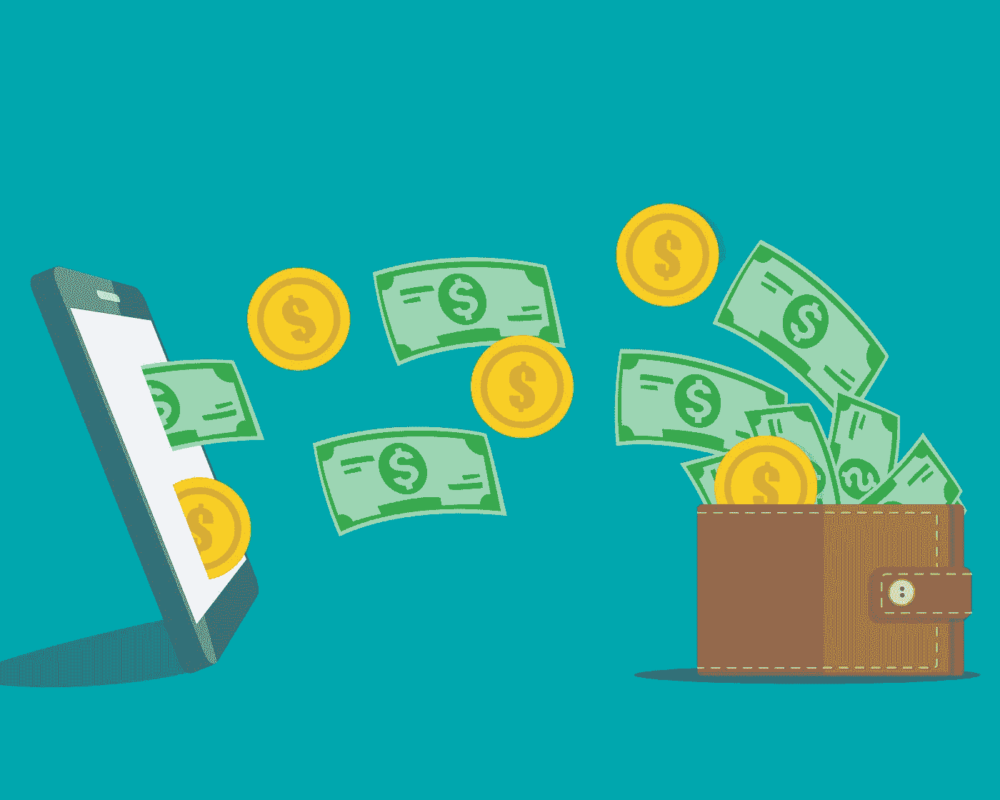

# 今年如何在技术上节省 1000 美元

> 原文：<https://medium.datadriveninvestor.com/how-to-save-1000s-of-dollars-on-tech-this-year-1d694eb668c7?source=collection_archive---------2----------------------->



Licensed from Adobe Stock

## 数码简约主义者购买手机、电脑和小配件指南

大多数人在他们的技术上花费太多。

普通用户除了查看电子邮件、查看社交媒体、浏览互联网和观看流媒体服务之外，什么也不做。也许他们偶尔会打开微软 Word。

然而，一般的电脑或手机的市场功能远不止于此。

想想最新的苹果 iPhone 发布会。iPhone 12 Pro 可以以名为 Apple ProRAW 的比 RAW 更好的格式拍摄。*更好的*，iPhone 12 Pro 可以在杜比视界中拍摄、编辑、处理。(目前，我们只是假装知道那是什么)。

苹果公司用一位我认为是著名且成功的摄影师拍摄了一部电影。在这部电影中，他与观众分享了他的信念，即世界上下一位伟大的电影摄影师将使用 iPhone 12 Pro 拍摄他们的第一部电影。

你、我和绝大多数观看苹果发布会的观众*都不是世界上下一个伟大的电影摄影师*。

我们是白痴，只会用我们的相机拍 Instagram 上的食物照片或糟糕的全家福。它们让我们快乐，我完全支持这一点，但它们不是专业工作。

对于我们来说，iPhone 12 Pro 完全没有必要。

这并不能阻止人们在职业球员身上花更多的钱。数据显示，购买 iPhone 11 Pro 机型的人数几乎与购买 iPhone 11 Pro 的人数一样多。2018 年和 2019 年的标准 iPhone 11 型号。

不，一半的 iPhone 用户不是初露头角的摄影师和电影摄影师。他们购买的 iPhone 数量远远超过了他们的需求。

**他们这样做浪费了很多钱。**

发布时，iPhone 11 的基本型号为 700 美元，iPhone 11 Pro 的基本型号为 1000 美元(11 Pro Max 为 1100 美元)。

这些消费者在他们不需要的手机电量上至少花了 300 美元。(实际上，如果他们购买的存储容量超过了他们的需求，那就不止这些了，很多人都是这样做的)。

那只是电话。笔记本电脑呢？许多人也买了比他们需要更多的笔记本电脑。也不要让我从 Beats 或 AirPods 这样的名牌耳机开始。然后是我们的平板电脑，每个人都喜欢，但没有人真正使用…

除非你是一个非常精明的消费者，否则你很可能在每一项购买上多花了至少 300 美元。

## 数字简约主义者如何购买技术

数码极简主义者不会买给下一个伟大的电影摄影师的 iPhones，除非他们是下一个伟大的电影摄影师。数字极简主义者采取了不同的方法。

数字极简主义者决定他们想要从他们的技术中得到什么，然后他们只为足够满足他们需求的技术付费。

这种方法的财务优势是巨大的。通过购买您需要的技术能力，而不是市场能够提供的能力，您可以轻松地每年节省数千美元。

诚然，这可能很难做到。数字极简主义者是根据一套屡试不爽的原则做到这一点的。

```
Disclaimer: This guide is full of Apple examples because I’m an Apple user and I’m only familiar with their product line. The principles described, though, apply equally as much when buying Pixel phones or Surface Pros or any other high-end tech as well.
```

事不宜迟，这些原则是…

## 只需为您实际使用的处理能力和存储支付费用

与 iPhone 12 Pro 一样，市场上大多数电脑和手机的处理能力和存储容量都远远超过了大多数用户的需求。

为了避免被骗去支付超出你需要的费用，请做好购买准备。知道你现在用了多少。

首先，看看你目前使用了多少存储空间。

例如…

*   我用的是 iPhone 上 64 GB 中的 36.4 GB。
*   我用的是 MacBook 上 250 GB 中的 200 GB。

然而，数字极简主义并不止于此。

接下来，我们做一点“数字清理”,以确保我们没有使用超过我们需要的空间。

数字清理很容易做到。这是你要做的…

1.  **删除你不需要的文件。**转到您设备的存储部分，查看您的所有数据。哪些文件和应用程序占用的空间最大？你真的需要留着它们吗？如果没有，现在就删除它们。
2.  **学习如何使用云存储镜像功能**。所有主要的个人云存储提供商都为您提供了选择，要么将您的所有文件存储在计算机和云中，要么只存储在云中。将文件设置为“仅云”会将它们从电脑上移除并节省空间。
3.  **购买外置硬盘**。它们只占内部存储成本的一小部分，大小惊人，如 1 TB、2 TB 和 5 TB。如果您有很多想要存储的档案，这是最好的方法。(此外，因为它们没有连接到您的计算机，所以如果您的计算机也遭到破坏，它们也不会被破坏)。

[](https://www.datadriveninvestor.com/2020/10/08/voice-isnt-dead-how-ai-is-changing-the-call-tech-game/) [## 语音没有死亡——人工智能如何改变呼叫技术游戏|数据驱动的投资者

### 语音死了吗？这是一个公平的问题。关于流程数字化、新应用和增强型移动银行的讨论…

www.datadriveninvestor.com](https://www.datadriveninvestor.com/2020/10/08/voice-isnt-dead-how-ai-is-changing-the-call-tech-game/) 

之前我提到我的 MacBook 上只有 200 GB 的数据。那是因为另外 2 TB 在我的外置硬盘上。我所有的电影、音乐、商业档案、电话备份和电脑备份都在我的外置硬盘上。

完成后，再次检查设备的存储使用情况。

您这次使用的存储量是您真正需要的存储量。

**接下来，算算自己实际需要多少处理能力。**

一个很好的经验法则是，如果你目前的手机或电脑从来没有运行缓慢的问题，你不需要比现在更多的处理能力。

如果你觉得你目前的技术运行得有点慢，那就买一个稍微快一点的处理器。

例如，我的 2017 年 12 英寸 MacBook 最近运行有点慢。不多，但有一点。我的 2017 款 MacBook 有一个 m3 内核，即基本型号，所以当我购买下一台 MacBook 时，我将改为购买中间层型号。

另一个很好的经验法则是，除非你使用专业软件，否则你不需要任何以专业或专业为名的手机或笔记本电脑，也不需要最大的存储容量或处理能力。

我所说的专业软件是指像 Adobe Photoshop、Adobe Premiere、Adobe Lightroom、Final Cut Pro 和 OBS Studio 这样的程序。进行复杂计算并生成大型最终产品文件的程序。

我不是指 Word、Excel、Pages、Numbers 或 Adobe PDF 浏览器。市场上几乎每一台平板电脑都可以运行这些程序，更不用说电脑了。对于这些，您只需要一个基本模型。

案例研究:

我提到的那台 2017 年的 12 英寸 MacBook 是我在过去三年里用来运行整个写作业务的唯一一台电脑。

我用它来写文章、设计书籍封面、创建营销材料、生成电子书、召开 Zoom 电话会议、参加网络研讨会、做演示、创建销售线索磁铁以及设计自动化销售漏斗流程。

它通过 m3 内核完成所有这些工作。当这款笔记本电脑问世时，它是苹果提供的最便宜的笔记本电脑——849 美元。这比他们的一些 iPhones 便宜。而它做了这一切，*三年*，没有任何问题。

它唯一一次慢下来是在我运行 Affinity Photo、Affinity Illustrator 或 Vellum 这些专门的软件程序的时候。即使那样，也只是*慢了一点点。*

这就是为什么，当我更换这台笔记本电脑时，我仍然会换成苹果最便宜、最小的笔记本电脑。这次我只打算买中层版而不是基础版。

**大多数人应该买基础款**

去年，当我们都能去咖啡店时，你可以走进任何一家星巴克，看到各种各样的人拿着 MacBook Pros、Surface Books 和其他高端电脑。每台电脑的价格可能是我可爱的小 MacBook 的两倍。

我敢跟你赌 1000 美元，他们除了修改 excel 电子表格、查看电子邮件、上传东西到公司或学校平台，以及浏览社交媒体之外，没有用那些昂贵的电脑做任何事情。

不要成为那种人。他们在一台他们永远也不会需要的电脑上浪费了 1000 美元。只购买您需要的处理能力。

## 无论如何，不要为你不想要的功能付费

这更适用于外围设备，而不是电话或电脑。这很重要，因为外设也是浪费数百美元的好机会。

我最近在易贝卖了我的索尼 WH-1000MX3 耳机。它们已经有几年的历史了，但是当我买它们的时候，它们刚上市的时候将近 400 美元。

它们为什么这么贵？因为它们有很多我从未要求过的功能。

其中一个特点是触摸控制。我可以在耳机的一个杯子上向前或向后滑动，选择下一首或上一首曲目。我花了几个月才意识到这种事的存在。

另一个特点是暂时的噪音消除沉默。我可以把手放在耳机的一个杯子上，只要我的手在那里，主动噪音消除就会关闭。这对于在办公室进行快速交谈来说很棒。

这款耳机还有一个配套的应用程序。您可以微调您的音频偏好，加深歌曲的低音或高音。作为一个重金属爱好者，这是一个有趣的选择。

最后，这些功能值一个月的租金吗？

上周，我在亚马逊上花 30 美元买了一套耳挂式降噪耳机。它们没有触摸控制，也没有配套的应用程序让我可以微调我的聆听体验。但是它们有很好的噪音消除功能，在咖啡店里戴几个小时都很舒服，我的音乐听起来仍然像是撒旦赞助的。当我买耳机时，那是我所关心的。

耳机里所有对我重要的东西都可以花 30 美元买到。

我花了 400 美元买了那副索尼耳机。

不，他们不值得。

无论如何，不要让你自己被你不想要的特性弄得眼花缭乱。

不要因为有 Touch Bar 就买 MacBook Pro，不要因为有铅笔就买 iPad Pro，不要因为有折叠就买 Surface Duo，不要因为是名牌就买 AirPods 或者 Pixel Buds 你懂的。

在你购买任何东西，尤其是外设之前，先确定你想要什么功能。只付那些。

只为您使用的功能付费。

## 只有当改进对你来说很重要时，才购买新的电子产品

我自豪地拥有一部 iPhone X。当它问世时，它很酷。屏幕一直延伸到设备的边缘，这是新的，这使我能够在普通 iPhone 8 大小的设备上拥有 iPhone 8+大小的屏幕。

我和我的小口袋兴奋不已，我尽快买了一个。

三年没再买过 iPhone。我可以的，但是我没有。

为什么我要？我买 iPhone X 是因为经济的尺寸和显示屏的清晰度，而不是其他原因。当 iPhone XS、iPhone 11 和 iPhone 11 Pro 问世时，它们有许多重大改进，但屏幕尺寸不是其中之一。我在意的功能变化不大，所以没有买新手机。

快进三年。苹果发布了 iPhone 12 mini。那个漂亮的小屏幕变得更小更漂亮了。帮我报名！

iPhone 12 mini 还有一系列其他出色的功能，比如一个令人惊叹的相机，它肯定会帮助我拍出更好的专业头像。我很期待它们，但它们对我来说并不重要。我关心屏幕尺寸、设备尺寸、电池寿命和蜂窝连接。在这些方面，iPhone 12 mini 表现出色。

我和我的小口袋都很兴奋，我会尽快买一个。

只买那些在你关心的功能上比以前的版本*好得多的电子产品。*

如果你不是摄影师，就不要花几百美元买一部带专业相机的手机。如果你从来不画画，就不要花几百美元买一台可以折叠成绘图板的笔记本电脑。如果你不爱运动，就不要花数百美元买一块运动型智能手表。

只为你关心的功能改进付费。

## 把你买的东西搁置一周。

在过去的 25 年里，电子产品制造商已经从营销傻瓜变成了营销大师。

他们把高度技术化和复杂的产品设计得如此之好，把它们推销得如此之漂亮，以至于全球大部分人都在他们的日历上标出产品发布日期，就像产品发布是一个节日一样。

然后，当这个日期最终到来，我们有机会预购和预付价值数千美元的设备时，我们觉得*我们是*赢家。

我们不要自欺欺人了。我会爱上 iPhone 12 mini，但在那次交易中，真正的赢家是苹果。他们已经成功地说服我放弃了很大一部分收入。

一旦您通读了本指南，并决定只购买您需要的处理能力，只购买您想要的功能，并且只在产品对您来说是重大升级时，**等待一周再购买。**

如果你整个星期都在热切期待，那就去买吧。

但是如果你真的在周末的时候忘记了，不要。

这些原则都不会降低技术的成本。苹果、微软和谷歌将继续为他们的手机和电脑收取成百上千美元的费用。

这些原则的作用是确保当你拿到它们的时候，你不会花超过你需要的钱。

# 想戒掉手机瘾？

如果你知道自己用手机太多，我的免费电子邮件课程*在 7 天内戒掉你的手机瘾*将帮助你一劳永逸地戒掉。

[现在就报名参加 7 天戒掉你的手机瘾吧！](https://www.meganeholstein.com/free/break-phone-addiction-7-day-course/)

## 访问专家视图— [订阅 DDI 英特尔](https://datadriveninvestor.com/ddi-intel)