# 如何挽救亏损的交易策略(第二部分)

> 原文：<https://medium.datadriveninvestor.com/how-to-save-a-losing-trading-strategy-part-2-8d4f713068eb?source=collection_archive---------3----------------------->

## 通过优化风险管理进一步改善交易策略

Photo by [M. B. M.](https://unsplash.com/@m_b_m?utm_source=medium&utm_medium=referral) on [Unsplash](https://unsplash.com?utm_source=medium&utm_medium=referral)

在本系列的前一部分，我们已经测试了 TMA 交叉交易策略，表明在我们挽救它并再次获利之前它是无利可图的。在我们深入了解更多优化之前，让我们快速回顾一下上次我们离开的地方:

*   快速 TMA 周期:1
*   慢速 TMA 周期:65
*   参赛作品限于格林威治时间 13:00 至 17:00 之间
*   多头进场:当(1)快速 TMA 已经穿过慢速 TMA 上方，并且(2)当前价格位于交叉杆的高点时，1 手的未平仓头寸
*   短线进场:当(1)快速 TMA 已经穿过慢速 TMA 下方，并且(2)当前价格处于交叉杆的低点时，开仓 1 手

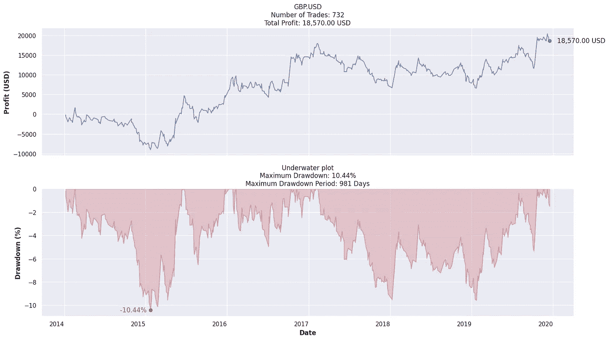

Performance of our strategy so far

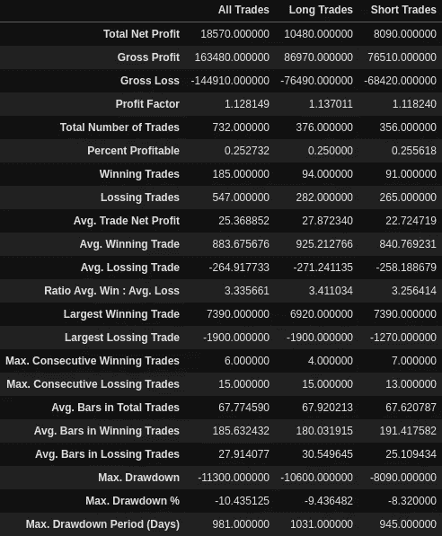

如果您想看一看我们之前的旅程，请随意阅读下面的故事:

 [## 如何挽救亏损的交易策略？(第一部分)

### 一步一步的教程来拯救一个看似有希望的交易策略

louis-chan.medium.com](https://louis-chan.medium.com/step-by-step-forex-trading-strategy-optimisation-part-1-b1516753b42e) 

*免责声明:我目前没有用这个策略交易，这个博客也不是一个财务建议。请自担风险使用。*

# 风险管理

我们将在这个博客中经历的所有优化步骤都与风险管理有关。投资伴随着风险。不管我们对自己的交易策略有多自信，我们都必须做好准备，以度过雨天。然而，我们都知道我们对止损的感觉:他们很早就阻止了我们，并把所有的钱都留在了桌子上。不幸的是，事实是:风险管理是稳健可靠的交易系统的关键；止损、跟踪止损和止盈是当市场出乎意料甚至崩溃时我们最好的安全气囊。

> “从这个角度来看:不管你的交易系统是像一个枪手在乱开枪，还是像一个狙击手埋伏在埋伏的地方，知道你的交易走向可能意味着你是在夕阳下骑马，还是在正午在尘土飞扬的街道上受致命伤。要想活命，你必须知道什么时候该拔枪，什么时候该逃跑。”
> 
> 托马斯·斯特里德曼

也就是说，没有所谓的最佳退出。即使我们设法在所有历史衰退之前退出市场，它仍然是次优的，因为如果我们一直 HODL 到现在，我们可以获得更大的回报。毕竟，一个退出逻辑只有在经过统计检验，并且持续执行的情况下才是好的。我们可以使用时间卷积神经网络、遗传算法或强化学习方法开发一个极其复杂的退出逻辑，但在这篇博客中，我们将使用一个非常简单的例子来说明退出逻辑如何帮助提高性能:

1.  **止损:**止损旨在限制我们未平仓头寸的损失。例如，设置一个低于我们开仓价格 10%的止损单，将我们的损失限制在 10%。
2.  **跟踪止损:**跟踪止损旨在保护未平仓头寸的利润。例如，为多头头寸设置 10%的跟踪止损单，其最大起始亏损为 10%。如果价格上涨，止损点将更新到当前价格的 10%以下；如果价格下跌，止损水平将不会调整，因此锁定了这个位置的最低利润。
3.  **止盈:**止盈订单指定平仓获利的确切价格。如果标的资产的价格没有达到限价，止盈单就不会被执行。如果我们希望我们的亏损交易在反转前有一个强劲的运行，止盈特别有用，因为如果价格达到反转前的水平，它将能够锁定利润。

# 第三步:优化止损

> “减少你的损失。减少你的损失。减少你的损失。那也许你就有机会了。”
> 
> 埃德·塞科塔

没有人愿意承受巨大的损失，也没有人愿意仅仅因为价格稍微向相反的方向波动就错过一笔利润丰厚的交易。这使得定义止损成为一个非常微妙而重要的过程。耐受性需要足够高，以承受轻弹，同时避免我们的屁股接住落下的刀。

在我们开始起草我们的止损逻辑之前，我们需要先理解**最大不利偏移(MAE)** 的概念。这是约翰·斯威尼最近开发的一项技术[1]。MAE 是指**对某一头寸**的最大提款。这将允许我们通过评估每笔交易的 MAE 分布来确定合理的保护性止损逻辑。

为了应用这个概念，我们可以首先创建一个我们每笔交易的利润(或亏损)百分比散点图:

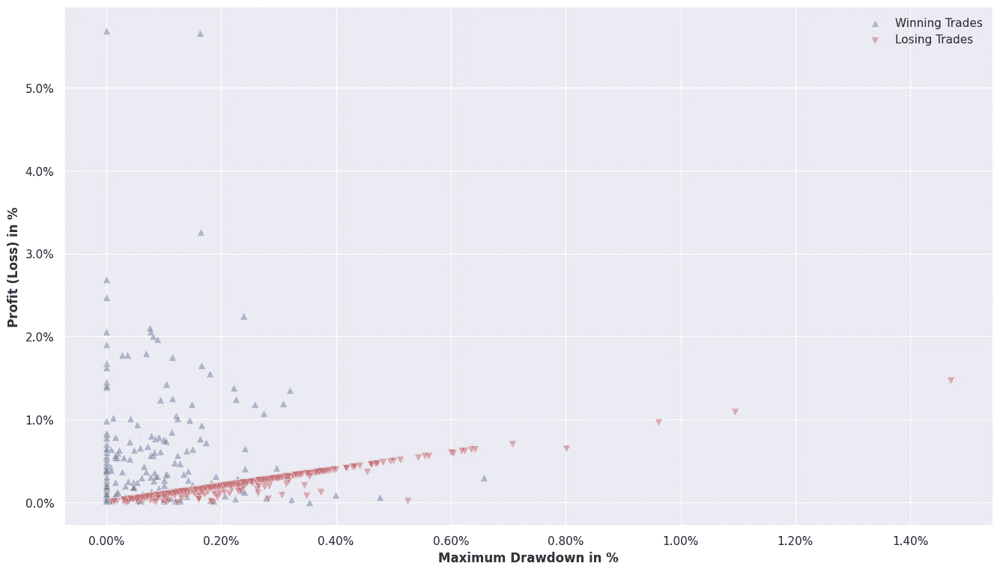

从散点图中我们可以看出，有一条由亏损交易形成的对角线。这些是我们在价格接近最大跌幅时平仓的交易。我们也可以观察到，从左到右，赢的交易越来越少。这意味着**我们的大多数盈利交易不会通过相对较高的提款%** 来完成。

当决定止损水平时，我们需要确定一个水平，在这个水平上，大多数亏损的交易在右边，而大多数盈利的交易在左边。我们可以看到最右边的盈利交易(即亏损最严重的盈利交易%)低于 0.7%。这意味着我们的止损范围应该低于或等于 0.7%。为了衡量止损水平的拟合优度，我们可以使用总利润和总最大提款之间的比率。如果平均盈利交易和平均亏损交易之间的比率可以被视为我们每笔交易的回报风险比，我们在这里使用的比率可以被视为我们策略的长期回报风险比。如果我们使用我们当前的策略作为基准，我们将有 1.643 的比率来击败(即，我们的总利润是我们最大提款的 1.643 倍)。这意味着止损是我们交易策略中一个有意义的增加，止损的比率应该高于 1.643。

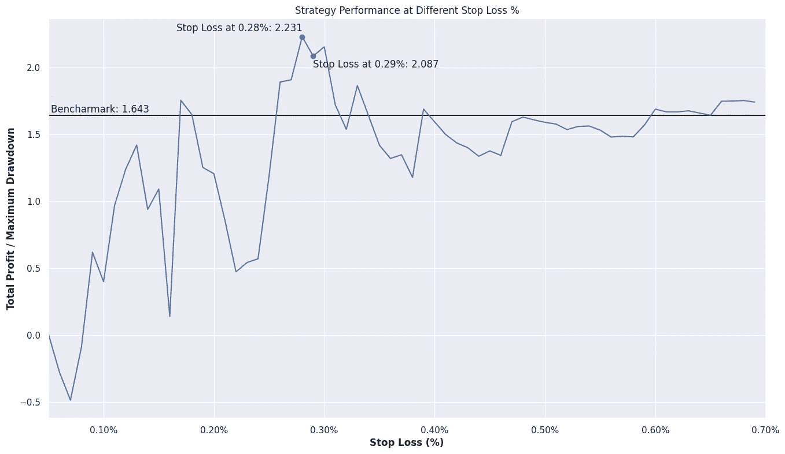

从上图中，我们可以看到，如果我们适当地设置止损，我们的策略可以表现得更好。虽然将其设置为 0.28%将实现最高性能，总体利润是我们最大提款的 2.231 倍，**让我们改为选择 0.29%** ，我们将稍微牺牲性能以获得更稳定的相邻参数性能。

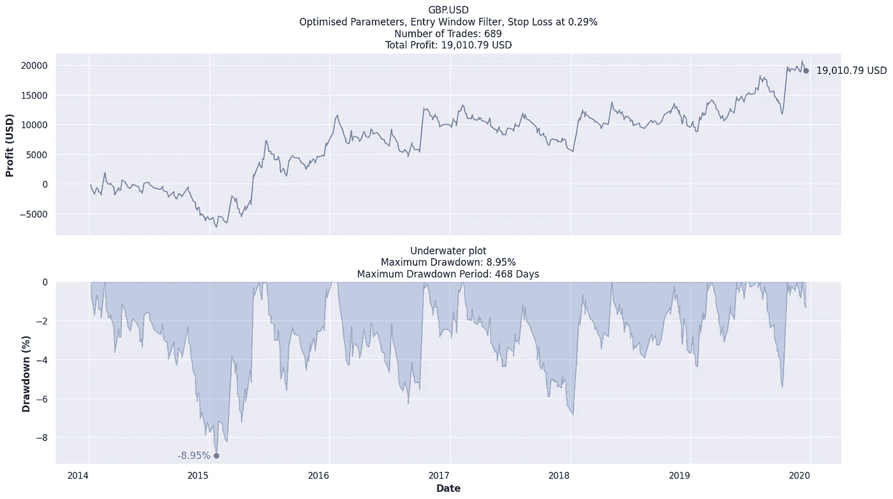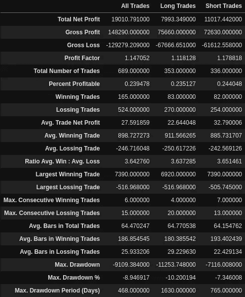

我们的交易策略又迈出了一小步，止损到位。该策略的**总利润增加了约 500 美元**(是的，有点令人失望)，最大提款减少了约 1.5 个百分点，我们的最大提款期减少了 50%以上。我们最大的亏损交易也从 1900 美元减少到仅略高于 510 美元。我们还观察到该策略的利润因子和回报风险比都有所提高。

# 第四步:优化跟踪止损

尽管止损改善了我们的策略，但还是有很多潜在盈利的交易被止损了，反而亏损了。由于其中一些交易的利润百分比相对高于提取百分比，我们可以从理论上优化跟踪止损，这样我们就可以为这些止损交易获得一些利润。

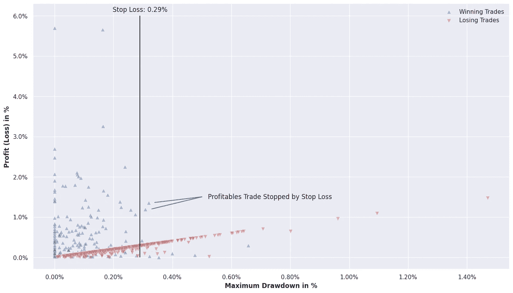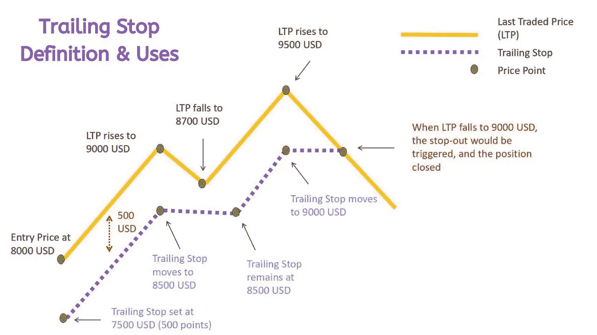

Credit: [The Diary of a Trader](https://www.youtube.com/watch?v=dZFb0-fwqOk)

由于我们的止损设置在 0.29%，**，跟踪止损设置在≤0.29%** 是没有意义的，因为这将覆盖止损逻辑并使其无效。查看不同追踪止损的策略总利润与最大提取比率，我们可以看到一个非常突出的峰值，为 0.69%。然而，为了与我们之前选择更稳定表现的逻辑保持一致，**我们将把我们的跟踪止损设置为 1.13%** 。这将提高比率，从没有任何退出逻辑的 1.643，到有 0.29%止损的 2.087，再到有 0.29%止损和 1.13%跟踪止损的 2.816。

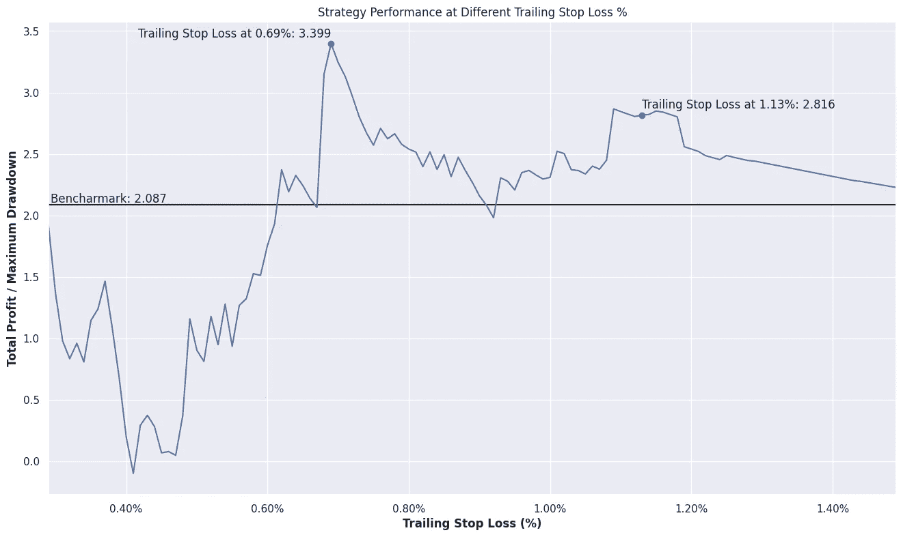

增加 1.13%的跟踪止损进一步改善了我们的战略，**将总利润提高了 6000 多美元**，提高了我们的胜率(仅 0.2 个百分点)和回报风险比(从 3.64 提高到 3.77)。

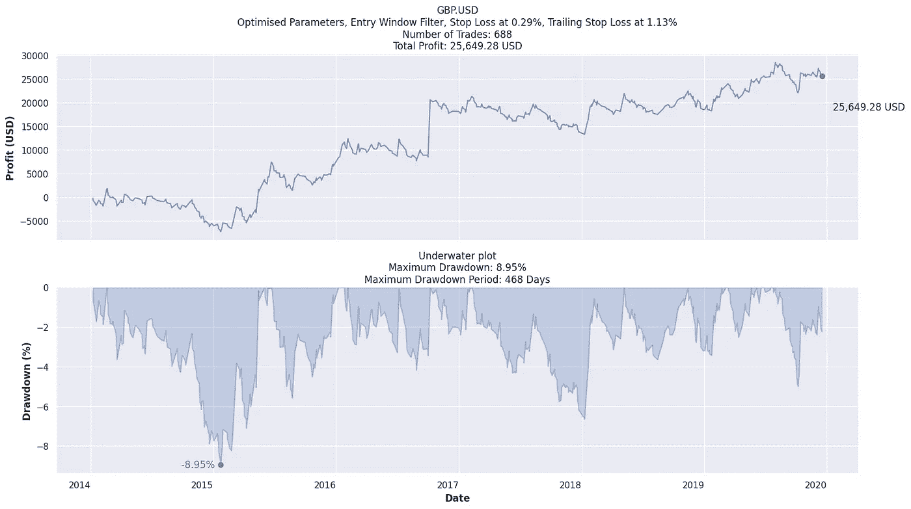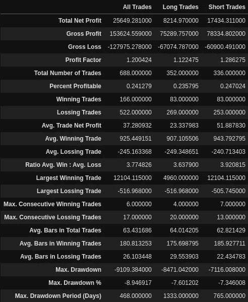

# 第五步:优化获利

虽然跟踪止损可以保护我们的利润不受回撤、回调和长期趋势潜在变化的影响，但仍有部分利润处于风险之中。如果止盈达到一个合理的高水平，我们就不会在每笔交易中为了最小的收益而拿资本冒险，从而损害我们的业绩，那么止盈可以成为我们退出逻辑的一个很好的补充。如果我们的亏损交易在转向南方并以亏损结束之前有一个相对强劲的盈利，止盈也是一个很好的主意。

为了评估获利逻辑的表现，我们可以使用**最大有利波动(MFE)** 测量，这是对约翰·斯威尼的 MAE 的补充。MFE 指的是**头寸**的最高未实现利润，换句话说，就是我们从该交易中可能获得的最大利润。

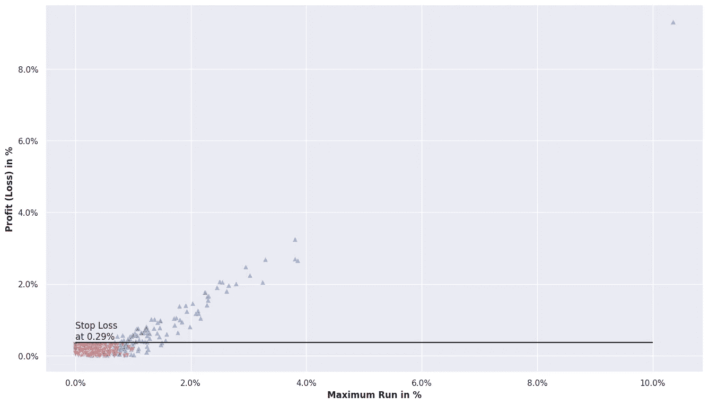

看上面的散点图，看起来我们的止损和跟踪止损已经将我们的亏损交易控制在了 1.5%以下。这表明**获利了结逻辑不会像止损和跟踪止损那样带来改善**。边际收益递减也表明我们正在接近优化过程的终点。

# 第六步:蒙特卡洛模拟

> “爬梯子前你做的最后一件事是什么？你摇它。这就是蒙特卡洛模拟。”
> 
> 山姆·萨维奇

无论你是全权交易者，还是算法交易者，在我们制定策略后，最重要的事情是相信我们的系统。然而，要获得这种信任，我们需要了解我们的系统拥有多大的预测能力。

蒙特卡洛分析包括调整交易订单，作为我们预期最大亏损的压力测试。这个分析隐含了一个假设，即交易的表现应该是一个相同且独立的高斯分布过程。虽然我们知道这种情况很少发生，但这仍然是我们了解理想情况下最大水位下降分布的一种非常好的方式。

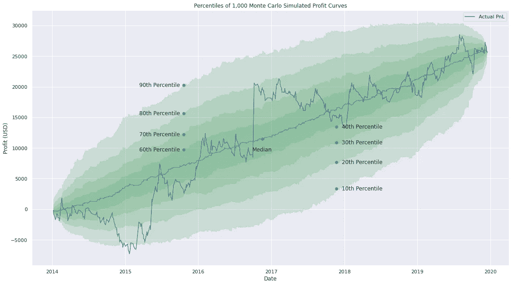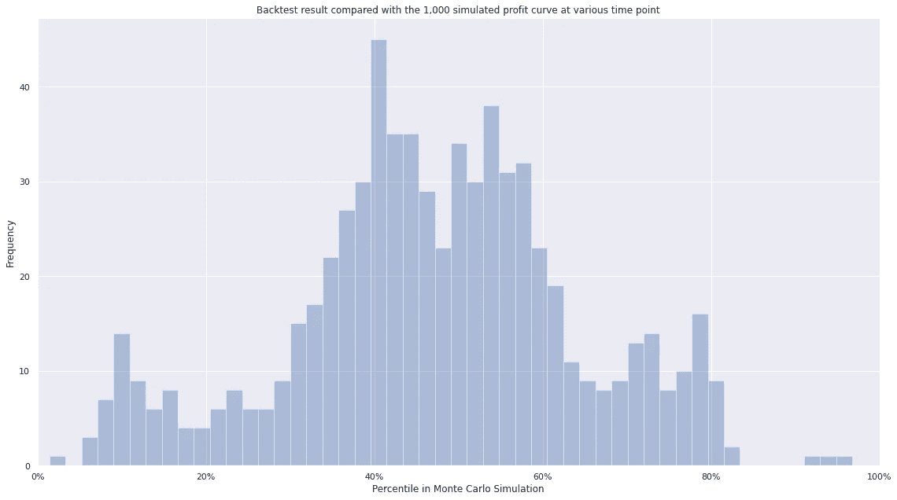

从我们的 1000 个模拟交易排列中，我们画出了许多通道，说明了利润曲线的置信区间。从线图中，我们可以注意到，在 2015 年初，我们的利润曲线实际上跌破了第 10 百分位线，这意味着假设交易的表现是独立的，这种情况发生的可能性相对较小。为了验证这一点，在直方图中，我们可以看到，在整个回溯测试期间，我们的回溯测试结果大部分位于第 40 和第 60 百分位之间。这让我们确信，跌破第 10 百分位线是一个相对罕见的事件。

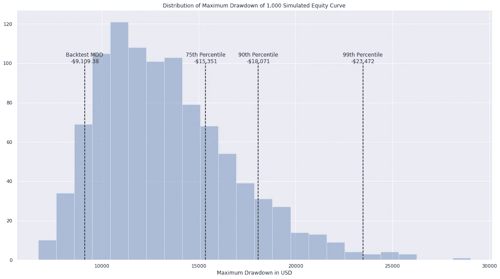

> 我们的交易策略在 5 年内不太可能出现超过 23，000 美元的最大损失。

这一切都很酷，很好；但是就像我前面提到的，蒙特卡罗模拟有一个非常重要的假设:交易的表现被认为是一个相同且独立的高斯分布过程。**这使得蒙特卡洛成为一个很好的工具，只有当策略没有过度拟合时，才能理解提款的置信区间**。想象一下，如果我们有一个几乎完美地捕捉每个转折点的策略，蒙特卡洛模拟中最大下降的 99%将非常非常小，这好得令人难以置信。

# 结论(到目前为止)和后续步骤

以下是我们到目前为止的策略设置:

*   快速 TMA 周期:1
*   慢速 TMA 周期:65
*   参赛作品限于格林威治时间 13:00 至 17:00 之间
*   多头进场:当(1)快速 TMA 已经穿过慢速 TMA 上方，并且(2)当前价格位于交叉杆的高点时，1 手的未平仓头寸
*   短线进场:当(1)快速 TMA 已经穿过慢速 TMA 下方，并且(2)当前价格处于交叉杆的低点时，开仓 1 手
*   慢速 TMA 周期:65
*   参赛作品限于格林威治时间 13:00 至 17:00 之间
*   止损:0.29%
*   追踪止损:1.13%

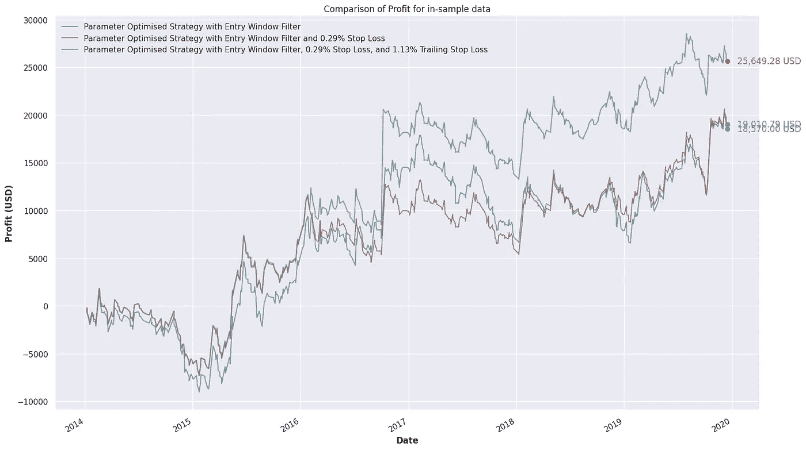

在这篇博客中，我们采用了优化参数和进入时间窗口过滤器的 TMA 交叉策略，以进一步优化风险管理。我们增加了 0.29%的止损和 1.13%的跟踪止损，以进一步改善我们的策略表现。我们的总利润从 18，570 美元增加到 25，650 美元。我们还看到我们的最大提款百分比从 10.45%减少到 8.95%，最大提款期也减少了 50%以上，为 468 天。该策略的回报风险比也从 3.44 增加到 3.77。同时，注意止损如何减少了我们最大的亏损交易，跟踪止损如何增加了我们最大的盈利交易。

业绩的改善表明，建立健全的风险管理和退出逻辑是多么重要。想出退出策略的方法有很多。其中，我们在博客中展示的技术是一些最简单的方法。将来，我们可以重新讨论这个话题，并研究动态退出策略的优化，例如，止损水平根据交易量或与慢速 TMA 的相对距离而变化。优化退出逻辑的另一种可能方式是使用随机森林的三重屏障方法，这是马科斯·洛佩兹·德·普拉多在《金融机器学习进展》一书中提出的。它基本上把交易标为触及上限(多头仓位止盈，空头仓位止损)，触及下限，或者两者都不触及。然后，这些标签可以被输入到基于规则的系统或机器学习算法中，用于(1)识别到上限和下限的合适距离(即，设置动态退出逻辑)，以及(2)识别进入信号[2]。

我们可能已经完成了对我们策略的基本参数和组成部分的优化，并且已经进行了蒙特卡罗模拟来评估我们的 VaR。然而，旅程并没有就此结束。为了减轻蒙特卡洛模拟的局限性，我们将在本系列的下一部分中研究其他测试和评估技术。

*参考文献*

1.  斯威尼 J. (2008 年)。 [*最大不利偏移:为交易管理分析价格波动*](https://amzn.to/2GogAZA) *(威利交易者的交换书 7)* (第 1 版。).威利。
2.  普拉多法律硕士(2018)。 [*金融机器学习进展*(第 1 版。)](https://amzn.to/2J3wB8o)。威利。
3.  c .法雷尔(2001 年)。蒙特卡罗模型模拟各种场景。*彭博商业周刊*。[https://bit.ly/3kACCHy](https://bit.ly/3kACCHy)
4.  Tomasini，e .，& Jaekle，U. (2019 年)。交易系统第二版:系统开发和投资组合优化的新方法(第二版。)。哈里曼之家。

# 在你走之前…

感谢您加入本系列的第二部分。让我知道你在评论中的想法，你从中学到的任何东西，以及如何改进这篇文章。请注意，这些书的链接是附属链接。如果你想直接购买这些书，你可以在亚马逊上搜索书名。暂时，保持坚强，继续相信我们的蓝宝就在眼前；我们将在博客的下一部分继续这个旅程。

再见！