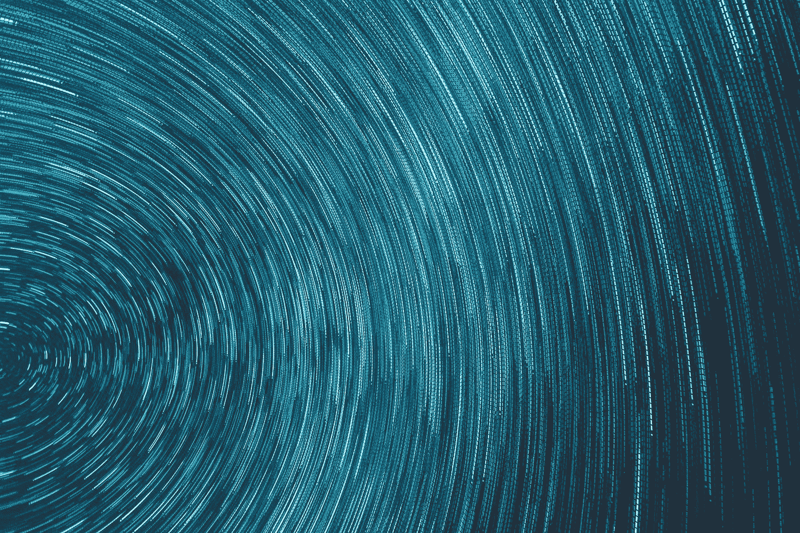

# 如何拯救世界

> 原文：<https://medium.datadriveninvestor.com/how-to-save-the-world-a415d916acd5?source=collection_archive---------12----------------------->

## 将来的

## 走向批判性思维的策略

Photo by [Avi Richards](https://unsplash.com/@avirichards?utm_source=medium&utm_medium=referral) on [Unsplash](https://unsplash.com?utm_source=medium&utm_medium=referral)

你有时会想一些大问题吗，比如:

# 如何拯救世界？

你把这句话记在心里几秒钟，也许一两分钟。然后，你可能会像我一样，放下那些棘手的问题，回到你的日常生活，你的孩子，妻子或丈夫，你需要准备的饭菜，你需要在太晚之前打电话给你的母亲。

也许你甚至有时间和平静地更彻底地思考这个问题:**未来会是什么样子，我们如何避免所有即将出现的可怕事情？**

我们没有人能一直思考大问题，但有时花几分钟或几小时思考这些问题是有意义的。

*   我现在在哪里？
*   我认为我的余生会是怎样的？
*   对于我未来十年的生活，大环境有什么要说的？

对于那些想获得一个总体印象的人来说，尝试整理并专注于一个或几个重要问题是值得的。例如，我可以从一个最大的开始:

> 未来十年，人类和世界将会如何发展？
> 
> 我们要如何拯救世界？

# 我们的工具:批判性思维

批判性思维是实现这一目的的一个相关的重要工具。批判性思维可以用于私人生活或社会中的重要问题。批判性思维对于获取相关和真实的信息非常重要。

批判性思维是人生指导的一部分，也是人生指导的必要基础。这篇笔记中关于批判性思维的内容，可以结合《人文主义人生指导策略》中的关键主题进行阐述和举例说明。

 [## 股票捐赠:知道什么|数据驱动的投资者

### 有很多交易者和投资者也分别试图找出捐赠他们的…

www.datadriveninvestor.com](https://www.datadriveninvestor.com/2020/08/03/stock-donations-what-to-know/) 

在这篇对批判性思维策略的贡献中，我将特别关注挪威人类伦理协会在这两段引文中指出的内容:

> “右翼民粹主义政权在匈牙利、波兰，尤其是在美国的出现，让人们高度重视诚实对待事实的重要性，尤其是能够区分真假新闻的重要性。”(人类伦理协会区域和地方团队对重点领域公共信息/批判性思维的意见讨论说明，2020 年 6 月)
> 
> “我们被越来越多的信息、越来越多的印象、新闻和广告包围着。在这样一个社会中，我们学会质疑正在呈现的东西是至关重要的。它从哪里来？所展示内容的议程是什么？证据是什么，反驳的理由是什么？”(Https://human . no/Kate gorier/humanitime/Demokrati-og-kri disk-tenk ning/kri disk-tenk ning/)

作为讨论的背景，我将引用尤瓦尔·诺亚·哈拉里(Yuval Noah Harari)的著作《21 世纪的 21 条经验教训》(T1)中的四句话，作者以一种非常鼓舞人心的方式阐述了我们这个时代人类面临的一些重大挑战。

# 互联网革命如何影响社会

我们这个时代的特点是信息大量流动。理论上，全球数十亿人可以同时在线。据 https://internetworldstats.com/stats.htm 的[报道，这是世界上每。2020 年 6 月 30 日 48 亿(4，833，521，806)互联网用户，可能任何时候都有超过 10 亿人在线。](https://internetworldstats.com/stats.htm)

互联网现在显然已经成为给人们提供最多信息的信息渠道，互联网已经接管并部分取代了印刷媒体(书籍、报纸、杂志、信件)和广播媒体(广播、电视)。

这是一场可怕的剧变，按照哈拉里的说法，它证明了“革命”一词的合理性:

> 自 20 世纪 90 年代以来，互联网对世界的改变可能超过了任何其他因素，然而，互联网革命更多地是由工程师而非政党主导的。你对互联网投过票吗？民主制度仍在努力理解是什么冲击了它，而且几乎没有准备好应对新的下一轮冲击，如人工智能的崛起和区块链革命。
> 
> 今天，计算机已经使金融系统变得如此复杂，以至于很少有人能理解它。随着人工智能的进步，我们可能很快就会到达一个点，那就是没有人能够再理解金融。这对政治进程会有什么影响？你能想象一个谦卑地等待算法批准其预算或新税制改革的政府吗？
> (尤瓦尔·诺亚·哈拉里:21 世纪的 21 个教训，第 14-15 页)。

## **此处关注的相关主题是互联网革命如何影响社会，以及互联网革命如何为我们的未来创造新的框架条件。**

*   10 年、20 年或 30 年后，我们的日常生活会是什么样子？
*   这个愿景中有哪些方面是我们应该认真努力去改变的？
*   作为一种政府形式，民主如何容忍互联网革命带来的通信和权力关系的变化？

Photo by [Markus Spiske](https://unsplash.com/@markusspiske?utm_source=medium&utm_medium=referral) on [Unsplash](https://unsplash.com?utm_source=medium&utm_medium=referral)

# 信息溢出

互联网的存在和运行是革命性的。此外，互联网的工作方式和互联网产生的东西有助于改变世界和我们生活在那里的条件。
如今，信息量、不可阻挡的信息流以及大量传递信息和影响我们的渠道已经铺天盖地。

没有人被赋予对世界上正在发生的事情和影响我们的力量的全面了解。许多人觉得他们缺乏全局观念，有些人干脆放弃获取生活中重要事物的可靠信息。这当然是非常不幸的，而且对民主也是一种威胁。

在《21 世纪的 21 个教训》中，尤瓦尔·诺亚·哈拉里关注的就是这些问题，在这本书的序言中，哈拉里强调了参与公共对话的必要性:

> 在一个充斥着无关信息的世界里，清晰就是力量。理论上，任何人都可以加入关于人类未来的辩论，但保持清晰的愿景是如此之难。通常，我们甚至没有注意到正在进行的辩论，或者关键问题是什么。我们几十亿人几乎负担不起调查的奢侈，因为我们有更紧迫的事情要做:我们必须去工作，照顾孩子，或照顾年迈的父母。不幸的是，历史不会打折扣。如果人类的未来是在你缺席的情况下决定的，因为你忙于给你的孩子喂饭和穿衣服——你和他们都不能免除后果。这是非常不公平的；但谁说历史是公平的？
> (尤瓦尔·诺亚·哈拉里:21 世纪的 21 个教训，第 1 页)

这种现象的一面之词叫“信息泛滥”。丰富的信息是我们作为接收者在私人和社会交流中，以及在我们生活的时代的伟大对话中所获得的大量不同质量的信息。

## **人们非常需要参与到关于社会重要问题的公共和私人辩论中，包括在私人领域。**

*   我们如何确保可靠的信息、事实和道德上可接受的态度被用作我们言行的基础？
*   我们怎样才能鼓励和教导后代进行科学思考呢？
*   我们如何确保所提供的信息的质量并考虑重复使用，包括在社交媒体上？

Photo by [Rami Al-zayat](https://unsplash.com/@rami_alzayat?utm_source=medium&utm_medium=referral) on [Unsplash](https://unsplash.com?utm_source=medium&utm_medium=referral)

# 什么是真，什么是假？

除了令人难以置信的大量信息之外，我们生活的时代还有一个特点，那就是价值观的巨大不确定性和混乱，什么是真的和假的，什么是“假新闻”，什么是真实的、真实的新闻。当我们被告知相同事实的不同“真相”时，我们该相信谁呢？

正因为如此，我们经常不确定我们应该做出什么选择，例如在民主和社会发展方面，在我们应该如何处理各种价值问题以及在我们自己的生活中应该做出什么选择方面。我们应该相信什么对我们的国家和人民是好的，什么对我们和地球上的所有人是不幸的或坏的？

我们生活在一个到处都面临危机的时代，涉及到信誉、真相和社会价值观。人类也许比以往任何时候都更需要理想和信仰，良好的价值观和积极有价值的事情。我们需要一套我们能够认同的、被大多数人接受和尊重的价值观、规范和规则，也就是说，我们可以把这些价值观、规范和规则作为我们生活中的指导方针和理想。

尽管越来越多的人看到了主要宗教在世界上发生的事情以及在发展和社区建设方面的不幸后果，但既定的宗教在一定程度上是遥远和过时的信仰体系，仍然对人类具有非常大的影响力。

然而，宗教作为一种信仰体系和人生指南具有巨大的影响力，人们不应低估积极的宗教在许多道德和伦理问题上对人们的积极影响。但在某些领域，人们可以看到宗教意识形态是不幸的，它们是我们巨大冲突的根源，是无意义破坏的原因。

为了应对为人类创造美好未来的巨大挑战，我们需要独立于宗教之外的解决方案:

> 最后，世俗的人珍惜**责任**。他们不相信有任何更高的力量来照顾这个世界，惩罚邪恶，奖励正义，保护我们免受饥荒、瘟疫或战争。我们这些有血有肉的凡人必须为我们做的或没做的任何事情承担全部责任。如果世界充满苦难，我们有责任找到解决办法。世俗的人对现代社会的巨大成就感到自豪，例如治愈流行病，为饥饿者提供食物，给世界大部分地区带来和平。我们不需要把这些成就归功于任何神的保护者——它们是人类发展自己的知识和同情心的结果。然而，出于完全相同的原因，我们需要为从种族灭绝到生态退化的现代性罪行和失败承担全部责任。我们需要问自己能做些什么来帮助他们，而不是祈祷奇迹。(尤瓦尔·诺亚·哈拉里:21 世纪的 21 个教训，第 242 页)

因此，我们绝对需要一个生活方式和生活指导的行动计划，它显示并阐明人们需要发展和进一步生存的重要道路选择和重要价值观。人文主义生活指导和批判性思维的策略应该致力于成为这样一种工具。

Photo by [Markus Spiske](https://unsplash.com/@markusspiske?utm_source=medium&utm_medium=referral) on [Unsplash](https://unsplash.com?utm_source=medium&utm_medium=referral)

# 没有人能全面了解

人类的大脑有足够的能力储存和处理大量的信息:

> 人脑奇妙已经不是什么秘密了……但是在当今世界信息不断的情况下，大脑会受到太多的过度刺激，这就是信息过载这个概念的由来。最近的研究表明，人类的大脑能够存储相当于整个互联网的信息，或者更准确地说，是 1pb 的信息。此外，研究人员发现，一个脑细胞使用 26 种不同的方式来编码信息。”(安德里亚·瓦杜瓦:信息超载的 10 种症状及其如何影响你的大脑&身体)

然而，今天的信息流和信息量以及各种信息渠道是如此广泛和混乱，以至于没有人能够全面了解世界上正在发生的事情以及影响世界的各种力量。人类的大脑可能可以存储大量的信息，但在处理大量数据时能力有限。

我们生活在一个明显以信息混乱和困惑为特征的世界。有一种危险是，互联网、人工智能和区块链可能会把国际社会和人类引向我们都不想要的方向:

> 危险在于，如果我们在开发人工智能上投入太多，而在开发人类意识上投入太少，计算机非常复杂的人工智能可能只会助长人类天生的愚蠢。在未来几十年，我们不太可能面临机器人叛乱，但我们可能不得不应对成群结队的机器人，它们比我们的母亲更知道如何按下我们的情感按钮，并利用这种不可思议的能力告诉并试图向我们出售一些东西——无论是汽车、政治家还是整个意识形态。机器人可以识别我们最深的恐惧、仇恨和渴望，并利用这些内在杠杆来对付我们。在最近世界各地的选举和公投中，我们已经尝到了这一点的甜头，黑客已经学会了如何通过分析个人选民的数据和利用他们现有的偏见来操纵他们。虽然科幻预告片被吸引到火和烟的戏剧性启示，但在现实中，我们可能会通过点击来面对平庸的启示。
> (尤瓦尔·诺亚·哈拉里:21 世纪的 21 个教训，第 87 页)

如果越来越多的人跟不上和不了解世界上正在发生的事情，这对民主和我们的未来是一种危险。这样的发展很容易产生钝化效应，因为人们干脆放弃了去理解正在发生的事情。因此，非常需要人们参与和参加关于价值问题以及基于民主价值观的社会应如何进一步发展的公开和私下辩论。

除其他外，民主价值观在当今世界受到新自由主义、新法西斯主义和无节制资本主义的威胁。如前所述，互联网、人工智能和区块链支持了这些负面趋势的出现。不可否认的是，互联网革命也带来了许多积极和有价值的进步，但我们仍然可以看到，还有许多其他力量在发挥作用，对未来的世界构成威胁，包括虚假新闻以及助长气候破坏的政治和经济力量，以及在全世界无节制和有害地开采自然资源和人力资源。

这是关于我们如何在未来保护自己免受混乱，避免破坏，战争和狭隘的特殊利益集团占上风。这个世界需要许多人参与进来，互相帮助，也需要大多数人了解我们生活的世界，塑造未来。

哲学指导和哲学讨论的要点是帮助理解我们生活的世界和我们在这个世界上的位置，以及我们可以和应该做什么，以及我们应该*不*做什么，以便为地球上的每个人创造一个可持续的美好未来。

正如我们所看到的，信息量、信息质量和不可阻挡的信息流本身，不管是它们自己还是一起，都是停止试图找出我们如何以对人类和未来最好的方式处理这一问题的好理由。

绝对有必要进一步制定一个每个人都能理解并从中受益的批判性思维策略。

Photo by [Derek Thomson](https://unsplash.com/@derekthomson?utm_source=medium&utm_medium=referral) on [Unsplash](https://unsplash.com?utm_source=medium&utm_medium=referral)

# 批判性思维战略应包含的拟议要素

## ->什么是真实的？
——>我们怎么知道这是真的？
- >怎样才能揭穿不真实的说法？

一切都变了。唯一可以确定的是未来是不确定的。我们必须接受这一点。我们不知道 2050 年的世界会是什么样子。但是我们知道，对许多人来说，真理不是最重要的价值观。如果依赖谎言比依赖真理更方便，他们宁愿接受谎言。谎言经常被用作获得政治支持、利益和权力的手段。

批判性思维的策略因此成为揭露谎言的长期策略。

*   这对我们的未来意味着什么？这对什么样的人在社会中获得权力有什么影响？
*   真理和力量并不总是形影不离。在某一点上，他们分开了，因为对权力的需求不同于对真相的需求。

因此，批判性思维的策略也将是反对权力使用谎言的斗争。我们必须团结起来揭露权力对谎言的利用。

没有人能知道所有的事情，也没有人能独自对所传达的所有信息有一个全面的了解。意识到这一点并承担起这一点，是成为所有类型对话——私下、社交媒体和公共辩论——的积极和有能力的参与者的第一步。

我们必须相互支持，并获得好的工具，以确保我们手头有好的事实和好的论据。

更多的人必须单独和集体承担责任，在私人、社会和公共对话中揭露真相，揭露谎言和“假新闻”。

要做到这一点，我们必须获得可用的知识和工具来识别和评估信息。

作为个人和社会中的一员，我们需要更多的知识和理解信息量对我们的意义。

尽管我们无法有目的、有效地应对所有的谎言和欺骗，但我们需要增加知识，意识到信息流和虚假新闻是如何“拧在一起”并影响我们的。

# 完成单词

# 参与和投入——在私人和社交对话中，以及在大型对话中

今天人类遇到了大量的信息，这些信息没有给任何人以完整的概述或知识。当我们试图从虚假、不准确或不可靠的信息中挑出真实、可靠的事实和指控时，我们面临着一个非常大的挑战。因此，与批判性思维相关的一项重要练习是能够理清真实的事实，拒绝谎言和“假新闻”。

由于我们每时每刻都会遇到大量的信息流和大量的信息，许多人不愿意考虑他们行动所依据的信息是否有效和真实。存在这样一种风险，即许多人遵循基于虚假事实的建议、指导方针和推荐，因为他们不想或不能理解所有的信息。这样，无法逾越的信息量可能会成为对言论自由的威胁，尤其是对民主的威胁。

民主受到虚假信息的威胁，受到操纵真相的人的威胁，从而使现实看起来不真实。

今天需要的是人们在寻求真理和事实时求助于可靠的来源，特别是科学，并让我们学会科学思维。并非所有事情都是简单的事实，在需要评估的情况下，这些评估必须基于经过核实的事实。

**进入专家视角—** [**订阅 DDI 英特尔**](https://datadriveninvestor.com/ddi-intel)