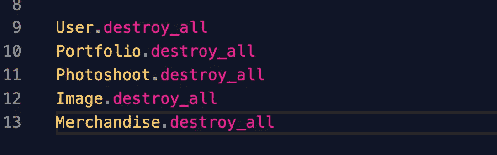

# 使用 Ruby on Rails 在开发阶段设置数据库时如何节省时间

> 原文：<https://medium.datadriveninvestor.com/how-to-save-time-when-setting-up-your-database-in-the-development-stage-with-ruby-on-rails-a57dd18f5d58?source=collection_archive---------18----------------------->


在您的初始设置错误，你发现自己不得不放弃你的数据库，并修改你的错误或添加更多的信息。因此，为了让您的项目正常工作，您需要创建一个新的数据库，运行您的迁移并重新播种您的数据库。各按部就班！如果您可以在终端中用一行 if 命令完成所有这些工作，那会怎么样？有了 Ruby 你就可以。

[](https://www.datadriveninvestor.com/2020/09/11/the-uselessness-of-centralized-economic-development-and-the-hope-of-ubi/) [## 集中式经济发展的无用性和 UBI |数据驱动投资者的希望

### 在我的家乡缅因州的乡村海岸，我们曾经有一个经济发展委员会，但它只不过是一个…

www.datadriveninvestor.com](https://www.datadriveninvestor.com/2020/09/11/the-uselessness-of-centralized-economic-development-and-the-hope-of-ubi/) 

但首先你需要优化你的设置，尤其是你的种子文件，这意味着在你的种子文件的顶层，你需要有一些代码行，在重新运行种子信息之前，删除你已经有的所有种子数据。当您必须重新播种数据时，这就是您处理任何重复问题的方式。这些行应该如下所示:



top level code in your seed file

好了，现在您在迁移文件中发现了一个错误，您可以运行另一个迁移来修复它，但是您处于开发阶段，丢弃(删除)整个数据库没有问题。因此，您在终端中运行这一行；

```
rails db:drop 
```

现在你已经修改了你的错误，你需要创建一个新的数据库，只有当你使用 postgresql 时才需要，但是当你使用 MySQL 时这一步是不需要的；

```
rails db:create
```

您的数据库已经启动，现在您需要运行您的迁移。因此你运行这条线；

```
rails db:migrate 
```

现在你需要重新播种你的数据库；

```
rails db:seed
```

最后，一切都完成了，您希望看到它，所以您启动了 rails 服务器。然而，在最初的开发阶段，在终端中反复运行这一行代码可能会很乏味。使用 Ruby on Rails，只需一行代码就可以完成所有工作；

```
rails db:reset 
```

使用这一行代码，您的数据库被删除，一个新的数据库被创建，您的迁移在一个新的数据库上完成，您的数据库被植入您的种子文件中的数据。所有的一切都在你的终端里。像魔术一样！

祝您编码愉快，希望这能在您使用 Ruby on Rails 的初始开发阶段对您有所帮助。

感谢阅读！

## 访问专家视图— [订阅 DDI 英特尔](https://datadriveninvestor.com/ddi-intel)