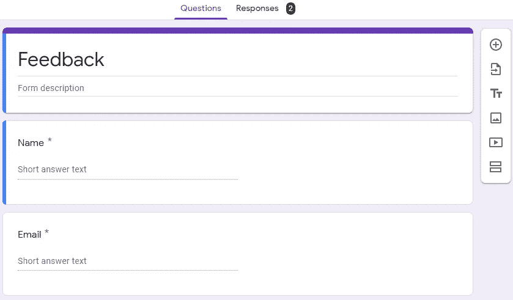
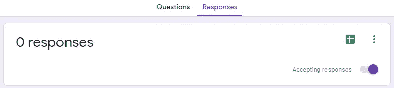
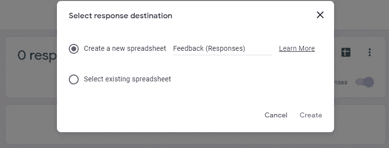
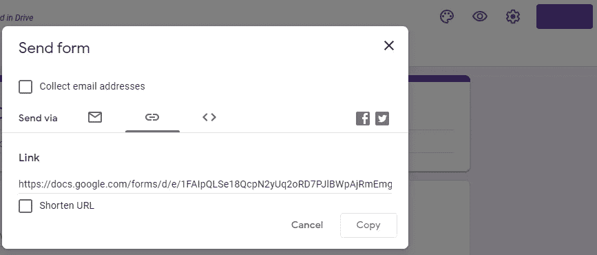

# 如何使用 R Shiny 在你的谷歌电子表格中保存用户回复？

> 原文：<https://medium.datadriveninvestor.com/how-to-save-user-responses-in-your-google-spreadsheet-using-r-shiny-fa35775aab90?source=collection_archive---------4----------------------->

在这篇博客中，你将学习如何在 **R Shiny** 中轻松保存用户在谷歌电子表格中的回复。我们将主要使用流行的 **shiny 包**，它包含`tags$iframe`函数来创建一个内嵌框架以在 R Shiny 应用程序中嵌入 HTML 文档。如需更多信息，如 **iframe** 的公共属性描述，请查看 [this](https://shiny.rstudio.com/articles/tag-glossary.html) 。这篇博客还讲述了如何在你的 google drive 中制作 google 表单。如果有人没有制作谷歌表单，那么首先创建谷歌表单，然后将其连接到 shiny 的应用程序。我希望这对任何想在 google 电子表格中保存用户回复的人有用。

## 步骤 1:从 Google Drive 创建一个表单。

当你创建一个 Google 表单时，它会被保存在 Google Drive 中。要直接从 Google Drive 创建表单:

1.  在计算机上，转到[链接](https://drive.google.com/)。
2.  在左上角，点击**新建**。
3.  点击**更多** > **谷歌表单**。并根据您的要求制作 google 表单。



4.在谷歌表单的顶部中间有两个选项，像问题和回答。点击**响应**。所以你可以在谷歌表单中看到下面的输出。

> *以后想看这个故事？把它保存在*[](https://usejournal.com/?utm_source=medium.com&utm_medium=blog&utm_campaign=noteworthy&utm_content=eid7)**期刊里。**

**

*5.现在，点击右上角的绿色电子表格图标**。之后，如果您没有现有的电子表格，请选择第一个选项“创建新的电子表格”，然后单击**创建**。所以当用户提交回答时，它会自动存储在电子表格中。***

******

***6.完成上述步骤后，点击谷歌表单中的**发送按钮**。它显示了发送表单的各种选项，因此从那点击**链接**选项，然后你可以看到你的表单的 **URL** 。复制 URL 以备将来使用。您也可以通过选择**缩短网址**选项来缩短网址。***

******

## ***第二步:使用 R Shiny 保存用户响应。***

***首先，您需要安装 shiny 包并加载库，然后您可以使用 Shiny 的`tags$iframe`函数包装 google form。之后，您可以在您的应用程序中显示 google 表单，并将用户响应保存在您的电子表格中。***

```
***library(shiny)ui <- shinyUI(navbarPage("App Title",
                         tabPanel(HTML('<b>','Feedback','</b>'),
                                  tags$iframe(src = '[https://forms.gle/sV7P5xhcLwcHvbPU8'](https://forms.gle/sV7P5xhcLwcHvbPU8'),
                                              width = '100%',
                                              height = 500,
                                              frameborder = 0,
                                              marginheight = 0)
                         )
))server <- function(input, output, session) {

}shinyApp(ui, server)***
```

*****注意，在本地运行 app 时，必须使用“在浏览器中打开”才能看到嵌入的 Google 表单！*****

***如果你喜欢这个博客或者觉得它很有帮助，请留下你的掌声！***

***谢谢你***

***📝把这个故事保存在[杂志](https://usejournal.com/?utm_source=medium.com&utm_medium=noteworthy_blog&utm_campaign=tech&utm_content=guest_post_read_later_text)上。***

***👩‍💻每周日早上醒来，你的收件箱里会有本周最值得关注的科技新闻。[阅读科技简讯中值得关注的内容](https://usejournal.com/newsletter/noteworthy-in-tech/?utm_source=medium.com&utm_medium=noteworthy_blog&utm_campaign=tech&utm_content=guest_post_text)。***