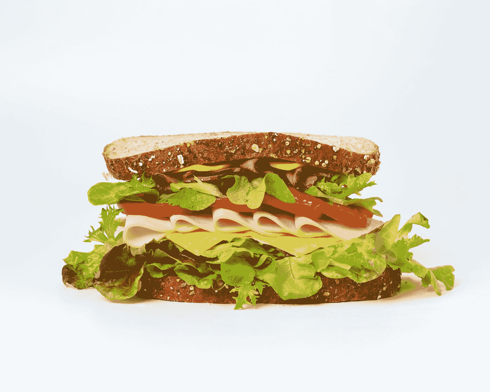

# 如何拒绝

> 原文：<https://medium.datadriveninvestor.com/how-to-say-no-522ec1c71411?source=collection_archive---------31----------------------->

## 基于自身经验的强大技术的简短指南

## 学会如何简单、有效且不冒犯他人地说不或给出相反的意见。

Photo by [Zan](https://unsplash.com/@zanilic?utm_source=medium&utm_medium=referral) on [Unsplash](https://unsplash.com?utm_source=medium&utm_medium=referral)

# 简短的序言

虽然标题听起来很明显，但我相信你不止一次遇到过这样的情况:你想说“不”，但你说“是”，因为害怕和老板发生冲突。

这是我们所有人在生活中的某个时刻都会遇到的事情。我也是。

> 对我们来说，说‘不’要难得多。

没有具体的原因，但事实就是如此。这种情况在我身上发生了很多年，从孩提时代开始，一直持续到我成年后的早期工作生涯。

 [## 成功人生的 25 种自我提升方式|数据驱动的投资者

### “我活得越久，学到的就越多。学的越多，体会的越多，知道的越少。”―米切尔·莱格兰德时间到…

www.datadriveninvestor.com](https://www.datadriveninvestor.com/2019/03/12/25-self-improvement-ways-for-a-successful-life/) 

我意识到我不得不去找治疗师来帮我解决这些情况。

毕竟，这是**根据**我自己的经验**我能给你的最好建议**。

# 成为一张破磁盘

Photo by [Аnna Dyakova](https://unsplash.com/@annadyakov1999?utm_source=medium&utm_medium=referral) on [Unsplash](https://unsplash.com?utm_source=medium&utm_medium=referral)

不要找借口。如果我对答案很清楚，我不会给另一个人反驳我的机会。

> 它的工作原理就像一个**破盘。**

说出我要说的话，当对方坚持时，保持安静，等到他或她说完，然后，**重复开头的**，添加几个词作为*‘我知道，但是……’*。

如果我对一个答案很清楚，我不会给另一个人反驳我的机会。

# 把你的话变成三明治

Photo by [Mae Mu](https://unsplash.com/@picoftasty?utm_source=medium&utm_medium=referral) on [Unsplash](https://unsplash.com?utm_source=medium&utm_medium=referral)

想想你小时候非常喜欢的美味三明治。

像所有的三明治一样，他们先吃面包，然后是三明治的内容，最后是另一层面包。很好吃，不是吗？😋

这非常有用，尤其是当我需要给出更多复杂的论点时。

大概意思就是:**sweet——内容——sweet。**

让我们给这个技巧一个更清晰的例子，这样你就能理解了。想象一下，我的老板告诉我‘明天，星期六，你必须来上班’。让我们假设在那个星期六我要给我的小侄子洗礼。

## **该技术将被脚本化为**

*   第一层面包我会甜言蜜语地说“我明白为了公司的利益，我必须在周六离开”。
*   **第二层内容**:我告诉他**对我来说不可能**，因为这是我侄子的洗礼**我必须出席**。这是我已经计划了几个月的事情。
*   **第三层面包** : **我道歉**，**提出一个替代方案**比如把轮班工作换给另一个同事，最后重申我愿意为了公司的利益而去。

# 最后一点:要自信

Photo by [Caroline Hernandez](https://unsplash.com/@carolinehdz?utm_source=medium&utm_medium=referral) on [Unsplash](https://unsplash.com?utm_source=medium&utm_medium=referral)

如果我不够自信，这些技巧对我都不起作用。

在我之前提到的老板的例子中。如果他告诉我周六去，而现在是周一，我知道我的老板因为其他问题今天过得很糟糕，最好是聪明一点，这些天不要和他说任何事情，等到周二或周三我发现他更容易接受的时候。

> 在任何情况下，我都必须保持自信。

我希望它对你有所帮助，欢迎任何反馈，如果你喜欢，请分享！😉