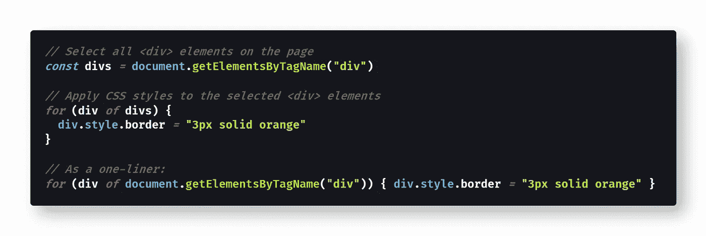
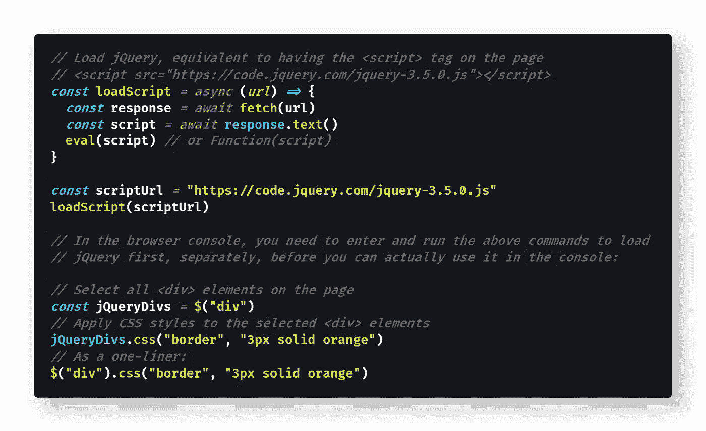

# How to Select AllElements on a Page using JavaScript

> 原文：<https://medium.datadriveninvestor.com/how-to-select-all-div-elements-on-a-page-using-javascript-9b2cd16af740?source=collection_archive---------0----------------------->

## 如果您使用过 jQuery，那么语法非常熟悉——但是没有必要仅仅为了选择页面上的项目而加载外部库。下面是如何用普通的 JavaScript 实现的。

Photo by [Caspar Camille Rubin](https://unsplash.com/@casparrubin?utm_source=medium&utm_medium=referral) on [Unsplash](https://unsplash.com?utm_source=medium&utm_medium=referral)

当使用 JavaScript 动态操作[文档对象模型](https://developer.mozilla.org/en-US/docs/Web/API/Document_Object_Model)(或 DOM)时，最常见的任务之一是选择页面上某个 [HTML 元素](https://www.learn-html.org/en/Basic_Elements)的所有实例，例如网站上出现的所有`[
](https://developer.mozilla.org/en-US/docs/Web/HTML/Element/div)`元素。

在本文中，我将向您展示如何使用普通 JavaScript(没有外部库)选择所有的`
`元素。然后我将演示使用流行的 jQuery 框架选择所有的`
`元素。

在开始之前，你应该熟悉基本的 [HTML](https://developer.mozilla.org/en-US/docs/Web/HTML) 、 [CSS](https://developer.mozilla.org/en-US/docs/Web/CSS) 和 [JavaScript](https://developer.mozilla.org/en-US/docs/Web/JavaScript) 概念，包括`[const](https://medium.com/@derek_develops/how-to-use-let-var-and-const-in-javascript-cdf42b48d70)`变量和`[for-of](https://developer.mozilla.org/en-US/docs/Web/JavaScript/Reference/Statements/for...of)`循环。

# 如何用 JavaScript 选择所有`
`元素

J avaScript 内置了一个名为`[document.getElementsByTagName()](https://developer.mozilla.org/en-US/docs/Web/API/Document/getElementsByTagName)`的函数，它会根据标签名选择当前网页上某个 HTML 元素的所有实例，即`
`。

> `[*Document*](https://developer.mozilla.org/en-US/docs/Web/API/Document)`接口的`***getElementsByTagName***`方法返回具有给定标记名的元素的`[*HTMLCollection*](https://developer.mozilla.org/en-US/docs/Web/API/HTMLCollection)`。将搜索整个文档，包括根节点。— [MDN 文档](https://developer.mozilla.org/en-US/docs/Web/API/Document/getElementsByTagName)

下面是演示选择所有`
`元素的代码片段:

[View the raw code](https://gist.github.com/djD-REK/a58fc0aa1f367bd539ca8f2123ad19aa) as a GitHub gist

使用 JavaScript 调用`document.getElementsByTagName("div")`就可以选择当前页面上的所有`
`元素。很酷吧。

在代码片段中，出于演示目的，我使用了一个`[for...of](https://developer.mozilla.org/en-US/docs/Web/JavaScript/Reference/Statements/for...of)`循环将 CSS 样式应用于每个选定的`
`元素。因为`getElementsByTagName`返回的 [HTMLCollection](https://developer.mozilla.org/en-US/docs/Web/API/HTMLCollection) 不是数组，所以不能使用`[Array.prototype.forEach](https://developer.mozilla.org/en-US/docs/Web/JavaScript/Reference/Global_Objects/Array/forEach)`方法——必须使用`for...of`循环。

# 如果 DOM 改变了呢？

调用`getElementsByTagName()`的好处之一是它返回一个与页面保持同步的动态 HTMLCollection。

> 从`*getElementsByTagName*`返回的`HTMLCollection`是活动的，这意味着它会自动更新自己以与 DOM 树保持同步，而无需再次调用`document.getElementsByTagName()`。”— [MDN 文档](https://developer.mozilla.org/en-US/docs/Web/API/Document/getElementsByTagName)

换句话说，HTMLCollection 对象将随着当前页面的改变而自动改变。

随着[巨大的性能改进](https://humanwhocodes.com/blog/2010/09/28/why-is-getelementsbytagname-faster-that-queryselectorall/)，返回一个动态 HTMLCollection 是`document.getElementsByTagName()`优于类似的`[document.querySelectorAll()](https://developer.mozilla.org/en-US/docs/Web/API/Document/querySelectorAll)`方法的另一个原因，后者返回一个不会自动更新的静态列表。

# 你应该知道的事情

在与`document.getElementsByTagName()`共事时，这里有两个小问题你应该注意。

首先是`document.getElementsByTagName()`将只匹配小写标签名:

> 当在一个 HTML 文档中被调用时，`getElementsByTagName()`在继续之前小写它的参数。当试图在 HTML 文档的子树中匹配 camelCase SVG 元素时，这是不可取的。`[document.getElementsByTagNameNS()](https://developer.mozilla.org/en-US/docs/Web/API/Document/getElementsByTagNameNS)`在那种情况下很有用。另请参见[错误 499656](https://bugzilla.mozilla.org/show_bug.cgi?id=499656) 。— [MDN 文档](https://developer.mozilla.org/en-US/docs/Web/API/Document/getElementsByTagName)

这是一个非常罕见的问题，因为 [HTML 标签](https://developer.mozilla.org/en-US/docs/Web/HTML/Element)(也称为 HTML 元素)都是小写的，但是在处理 [SVG](https://developer.mozilla.org/en-US/docs/Web/SVG/Attribute/format) 元素时会出现这个问题。

 [## 软件开发过程:如何选择正确的过程？数据驱动的投资者

### 软件是任何企业组织成功的生命线。没有软件的帮助，一个…

www.datadriveninvestor.com](https://www.datadriveninvestor.com/2020/01/16/software-development-process-how-to-pick-the-right-process/) 

第二个问题是，您需要使用另一种方法，如果您想匹配某个元素包含的所有 HTML 元素，就需要使用类似的方法。要在另一个元素中搜索，可以使用`[Element.getElementsByTagName()](https://developer.mozilla.org/en-US/docs/Web/API/Element/getElementsByTagName)`:

> "`document.getElementsByTagName()`类似于`[Element.getElementsByTagName()](https://developer.mozilla.org/en-US/docs/Web/API/Element/getElementsByTagName)`，只是它的搜索包含整个文档。"— [MDN 文档](https://developer.mozilla.org/en-US/docs/Web/API/Document/getElementsByTagName)

例如，您可能希望匹配另一个 HTML 元素中的所有`
`元素，比如页面上的`[<header>](https://developer.mozilla.org/en-US/docs/Web/HTML/Element/header)`元素。这有时被称为匹配一个“父”元素中的所有“子”元素，使用 [DOM 术语](https://developer.mozilla.org/en-US/docs/Web/API/Document_Object_Model/Introduction)。

要找到子元素，首先要使用`document.getElementsByTagName()`找到父元素，然后使用`Element.getElementsByTagName()`选择父元素的子元素。

两种`getElementsByTagName()`方法的语法是相同的。

# 如何用 jQuery 选择所有的`
`元素

F 为了完整性，我认为，如果您开始使用 jQuery 或只是喜欢 jQuery 的语法来从事一个项目，那么看看您如何使用流行的 jQuery 库选择所有的`
`元素是很重要的。

虽然我自己通常不使用 jQuery，但我发现了解 jQuery 语法很有用，这样我就知道我看到的是什么。虽然 jQuery 的受欢迎程度已经下降，取而代之的是[原生语法](http://youmightnotneedjquery.com/)和像 [React](https://reactjs.org/) 或 [Vue](https://vuejs.org/) 这样的框架，但你通常会在较老的项目中看到它。

当查看过去五年或十年没有更新的遗留代码时，需要了解 jQuery 语法尤其有用。

jQuery 语法稍微简单一点，但也仅此而已:`$("div")`是等同于`document.getElementsByTagName("div")`的 jQuery。

下面是 jQuery 的[元素选择器](https://api.jquery.com/element-selector/)的 API 文档:

> "**描述:**选择具有给定标记名的所有元素。
> 
> **→元素:**要搜索的元素。指 DOM 节点的标记名。
> 
> 当使用这个表达式时，调用 JavaScript 的`getElementsByTagName()`函数来返回适当的元素。”— [jQuery 文档](https://api.jquery.com/element-selector/)

如您所见，`$("div")`实际上只是我们已经介绍过的 JavaScript 函数的包装器——为了方便起见，使用了[语法糖](https://api.jquery.com/element-selector/)。

这里有一个简短的代码示例，我从控制台加载 jQuery，然后用它来选择页面上的所有`
`元素。

[View the raw code](https://gist.github.com/djD-REK/423cd380bab1f1f26448554d0fa6ccfe) as a GitHub gist

注意，jQuery 的`$("div")`方法返回与`getElementsByTagName()`调用完全相同的 html collection——jQuery 选择器只是原生 JavaScript 语法的包装器，使其更加简洁。

在 jQuery 中，为所有这些`
`元素调整 CSS 更加简单，尽管最终结果是一样的。

# 结论

选择网页上所有特定类型的元素是使用 JavaScript 操作 DOM 的基本技巧。

这篇简短的教程讨论了如何使用内置的 JavaScript 选择器`document.getElementsByTagName()`来选择页面上的所有`
`元素。

这个函数返回的 HTMLCollection 是动态的，会随着 DOM 树的变化而自动更新，所以不需要重复调用选择器。

当使用 SVG 时，您可能会遇到这样的问题:只有`document.getElementsByTagName()`匹配小写元素，而没有 [camelCase](https://techterms.com/definition/camelcase) 元素——所以在这种情况下，您需要切换到使用`[document.getElementsByTagNameNS()](https://developer.mozilla.org/en-US/docs/Web/API/Document/getElementsByTagNameNS)`。

为了选择一个或多个父 HTML 元素的子元素，就像一个`<header>`中的所有`
`元素一样，你应该结合使用`Element.getElementsByTagName()`和`document.getElementsByTagName()`。

最后，如果已经在页面上加载了 jQuery，可以使用 jQuery 的元素选择器`$("div")`作为`document.getElementsByTagName()`的替代语法。

编码快乐！😎💻👌⌨🔥

# 进一步阅读

*   [HTML Online](https://html-online.com/articles/select-div-content-text-one-click-javascript/) 超越选择器用鼠标选择一个`
`:

 [## 单击鼠标选择 Div 内容文本- JavaScript

### 从网站上复制文本可能会不舒服。帮助您的网站访问者选择文本，只需单击一个…

html-online.com](https://html-online.com/articles/select-div-content-text-one-click-javascript/) 

*   [教程 Republic](https://www.tutorialrepublic.com/javascript-tutorial/javascript-dom-selectors.php) 提供了一些使用选择器的示例代码片段:

 [## JavaScript 选择 DOM 元素-教程 Republic

### 在本教程中，你将学习如何在 JavaScript 中选择 DOM 元素。JavaScript 最常用于获取或…

www.tutorialrepublic.com](https://www.tutorialrepublic.com/javascript-tutorial/javascript-dom-selectors.php) 

*   [Tania Rascia](https://www.digitalocean.com/community/users/taniarascia) 分享在 DigitalOcean 使用 JS 选择器[的截图:](https://www.digitalocean.com/community/tutorials/how-to-access-elements-in-the-dom)

 [## 用 JavaScript | DigitalOcean 访问 DOM 文件中元素的方法

### 为了熟练地访问 DOM 中的元素，有必要掌握 CSS 的工作知识。

www.digitalocean.com](https://www.digitalocean.com/community/tutorials/how-to-access-elements-in-the-dom) 

*   网站 [LearnSteps](https://www.learnsteps.com/javascript-increase-performance-by-handling-dom-with-care/) 提供了使用 JS 选择器的有用的性能提示:

 [## JavaScript:如何处理 DOM 以提高性能和优化。

### 嘿，伙计们，到目前为止，我们一直在讨论通过动态加载和智能处理范围来提高性能。如果你…

www.learnsteps.com](https://www.learnsteps.com/javascript-increase-performance-by-handling-dom-with-care/) 

*   [JavaScript 老师](https://medium.com/u/6727c1eb71f8?source=post_page-----9b2cd16af740--------------------------------)在他的中型博客上有选择器[的很好的例子:](https://medium.com/@js_tut/calling-javascript-code-on-multiple-div-elements-without-the-id-attribute-97ff6a50f31)

 [## 在没有 ID 属性的多个 DIV 元素上调用 JavaScript 代码

### 你可以在 Twitter 上关注我，获取教程、JavaScript 技巧等。

medium.com](https://medium.com/@js_tut/calling-javascript-code-on-multiple-div-elements-without-the-id-attribute-97ff6a50f31) 

*   [JavaScript.info](https://javascript.info/searching-elements-dom) 在教程中讨论了遍历(导航)DOM:

 [## 搜索:getElement*，querySelector*

### 当元素彼此靠近时，DOM 导航属性非常有用。如果不是呢？如何获得一个…

javascript.info](https://javascript.info/searching-elements-dom) 

*   虽然我不推荐`querySelector`， [JavaScript 教程](https://www.javascripttutorial.net/javascript-dom/javascript-queryselector/)推荐:

 [## JavaScript querySelector:通过 CSS 选择器选择元素

### 摘要:在本教程中，您将学习如何使用 JavaScript querySelector()和 querySelectorAll()来查找…

www.javascripttutorial.net](https://www.javascripttutorial.net/javascript-dom/javascript-queryselector/) 

*   [Jonathan Sexton](https://www.freecodecamp.org/news/author/jonathan/) 在 freeCodeCamp 讨论不同的 JS 选择器[:](https://www.freecodecamp.org/news/how-to-avoid-frustration-by-choosing-the-right-javascript-selector-73c64c3906b6/)

 [## 如何通过选择正确的 JavaScript 选择器来避免挫折

### 关于选择器如何影响你的代码的快速指南在一个项目中，我在代码中遇到了一个问题。我在……

www.freecodecamp.org](https://www.freecodecamp.org/news/how-to-avoid-frustration-by-choosing-the-right-javascript-selector-73c64c3906b6/) 

*   jQuery 提供了许多选择器函数来选择各种 DOM 元素:

 [## 选择器| jQuery API 文档

### 使用任何元字符(例如！"#$%&'()*+,./:;[电邮 protected][\]^`{|}~]作为名字的字面部分…

api.jquery.com](https://api.jquery.com/category/selectors/) 

*   [MDN 文档](https://developer.mozilla.org/en-US/docs/Learn/JavaScript/Client-side_web_APIs/Manipulating_documents)有一系列使用 JavaScript 的 DOM 操作:

 [## 操纵文档

### 我们已经完成了对文档和 DOM 操作的研究。在这一点上你应该明白什么是…

developer.mozilla.org](https://developer.mozilla.org/en-US/docs/Learn/JavaScript/Client-side_web_APIs/Manipulating_documents) 

Photo by [Edu Grande](https://unsplash.com/@edgr?utm_source=medium&utm_medium=referral) on [Unsplash](https://unsplash.com?utm_source=medium&utm_medium=referral)

[德里克·奥斯汀博士](https://www.linkedin.com/in/derek-austin/)是《职业规划:如何在 6 个月内成为一名成功的 6 位数程序员 》一书的作者，该书现已在亚马逊上架。