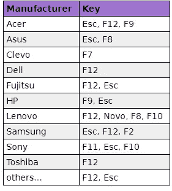

# 如何设置一个实时操作系统

> 原文：<https://medium.datadriveninvestor.com/how-to-set-up-a-live-operating-system-1e4a70bf64b9?source=collection_archive---------19----------------------->

你一定听说过互联网有时会变得多么疯狂和可怕，现在你想安全地浏览某些在线活动。嗯，Tails 是一个实时操作系统，可以直接从 USB、SD 棒甚至 DVD 上运行。是的，你看到了，它甚至可以从 DVD 上运行，唯一的缺点是每次有更新时你都要重写，这有点不方便。如果你在追求隐形和匿名，那么这是你正确的选择。

Photo by [Chris Yang](https://unsplash.com/@chrisyangchrisfilm?utm_source=medium&utm_medium=referral) on [Unsplash](https://unsplash.com?utm_source=medium&utm_medium=referral)

# 什么是尾巴？

Tails 是一个便携式操作系统，可以保护你的隐私，帮助你避开审查。避免监视、审查、广告和病毒。Tails 使用 Tor 网络来保护您的在线隐私，并帮助您避免审查。享受互联网应有的乐趣。它是为忙碌的人设计的，这就是它便于携带的原因。

你可以通过 u 盘、SD 甚至 DVD 来运行它。非常方便，因为这使它能够抵抗病毒。如果你不想让你的硬盘留下你浏览会话的残余，这也是有益的。最棒的是，它是免费的，基于 Linux，配有聊天客户端、电子邮件、办公软件和浏览器。

 [## 现在是改变支撑社会的系统的时候了吗？数据驱动的投资者

### 首先，我要感谢 5CsofBusiness，是它激励我写这篇关于通过…创造一个更美好的世界的文章

www.datadriveninvestor.com](https://www.datadriveninvestor.com/2020/07/14/is-this-the-time-to-change-the-systems-that-underpin-society/) 

# 它是如何工作的？

要使用 Tails，请关闭计算机，从 Tailsu 盘启动，而不是从 Windows、macOS 或 Linux 启动。你可以暂时把自己的电脑变成一台安全的机器。你也可以在使用别人的电脑时保持安全。

Tails 总是从相同的干净状态开始，**当你关闭 Tails 时，你所做的一切都会自动消失**。

您可以**将一些文件和配置**保存在 u 盘上的加密永久存储器中:您的文档、浏览器书签、电子邮件，甚至一些附加软件。

Tails 包括一系列应用程序，用于**处理敏感文档**和**安全通信**。

所有应用程序都已准备就绪，并配置了安全默认值**以防止出错**。

你在网上做的任何事情都要通过 Tor 网络。Tor 通过三个中继对你的连接进行加密和匿名。*中继*是由世界各地不同的人和组织运营的服务器。

单个中继永远不知道加密连接的来源和目的地:

*   第一次接力只知道你从哪里来，不知道你要去哪里。
*   这个第三中继只知道你要去哪里，但不知道你从哪里来。
*   到最终目的地的连接尽可能被加密，以防止第三中继读取其内容。

通过这种方式，Tor 在设计上是安全的，即使一些中继是恶意的。

# 怎么安装？

**在这里下载 tails 安装程序** [，确保你的电脑没有病毒。你需要验证你的下载，他们会在网站上告诉你怎么做。](https://tails.boum.org/install/)

你必须先把它安装在某个地方，比如 DVD，然后克隆到 u 盘或 SD 卡上。为此，您需要**从安装页面下载** [**通用 USB 安装程序**](https://tails.boum.org/install/win/usb/index.en.html) 。

*   Windows 用户将被引导通过**安装向导**，并被提示**在 USB 驱动器上安装 Tails** 映像。

***重要*** :用你的移动设备打开[指令网址](https://tails.boum.org/install/win/usb)。在下一步中，您需要重新启动您的机器。这个说明列表将引导您快速恢复在线。

*   重新启动计算机。在启动过程中，按下启动菜单键，通常是 F12 或 esc，并从您的 USB 驱动器中选择启动尾。

*   按照欢迎使用 Tails 提示上的说明进行操作。
*   接下来，插入第二个 USB 驱动器。
*   在“应用程序”下，单击“Tails 安装程序”,并按照提示在第二个 USB 驱动器上安装 Tails。
*   安装完成后，关闭计算机。
*   移除第一个 USB 驱动器，保留第二个 USB 驱动器。
*   重复启动过程并运行 Tails。

**访问专家视图—** [**订阅 DDI 英特尔**](https://datadriveninvestor.com/ddi-intel)