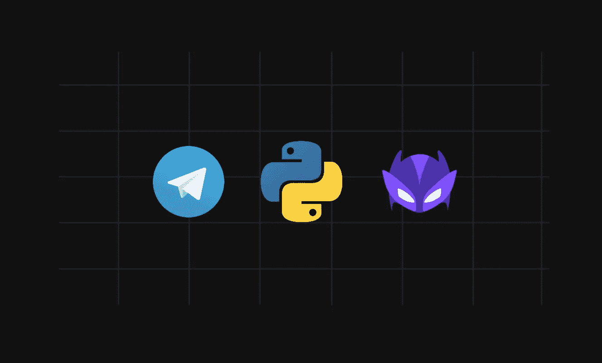
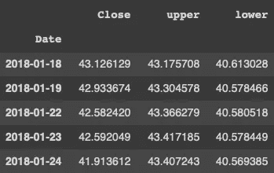
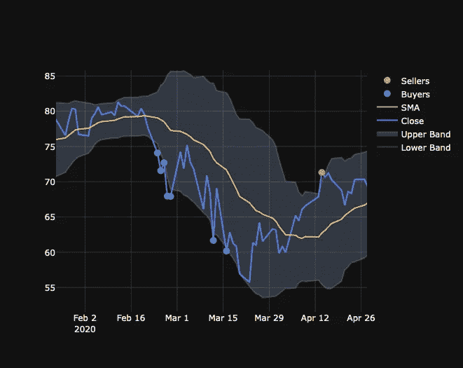
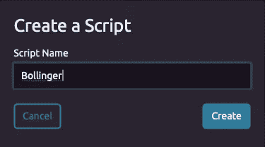
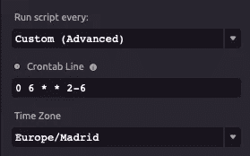
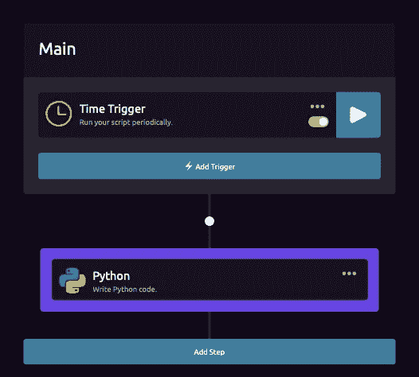
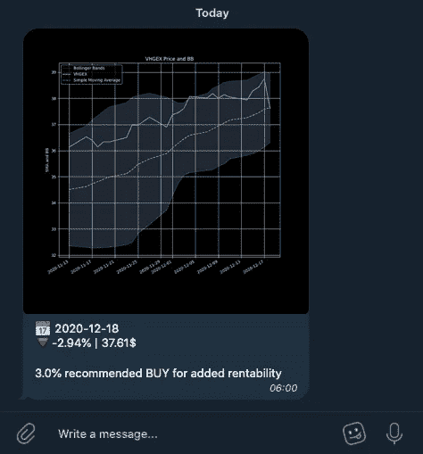

# 如何设置你的自动交易系统

> 原文：<https://medium.datadriveninvestor.com/how-to-set-up-an-automated-trading-strategy-67ad9f8c0a5f?source=collection_archive---------1----------------------->

## 使用 Bollinger Bands 策略、Telegram bot 和 Wayscript 作为托管服务，接收投资股票最佳时机的通知。



Photo by Author

如果你像我一样，你会花很多时间看数据、曲线和投资的好时机。或者，也许你正在决定用什么策略来尽可能缩短时间。

使用本文中的[实现的策略，我们将为 Telegram 建立一个通知系统，每当需要投资或转移资产时，该系统将获取这些信息并生成一个经过策划的消息。](https://danielcarlander.medium.com/how-to-implement-bollinger-bands-in-python-1106b90da8d1)

**免责声明:**我建立了一个通知系统，因为我用来购买基金的经纪人是不可自动化的。否则，我也会自动投资这些钱。

[](https://danielcarlander.medium.com/how-to-implement-bollinger-bands-in-python-1106b90da8d1) [## 如何在 Python 中实现交易的布林线

### 利用熊猫和 Plotly 来实施一个美丽的布林线策略。

danielcarlander.medium.com](https://danielcarlander.medium.com/how-to-implement-bollinger-bands-in-python-1106b90da8d1) 

# 生成消息

使用我们实现的布林线[代码](https://danielcarlander.medium.com/how-to-implement-bollinger-bands-in-python-1106b90da8d1)，我们需要生成一个可理解的消息发送给我们的机器人。

概括地说，我们创建了一个名为 bb 的数据框架，其中包含以下信息:



DataFrame (By Author)

*收盘*栏是股票的实际价值，上下，代表布林线模型的波段。



Photo by Author

有了这些信息，我们需要创建一个警报，当图像中的绿点或红点出现时，就会发出警报。这些是模型中的买卖指标。

因此，每次我们运行脚本时，我们都需要获取最后的日期，并计算股票的当前价值是否在范围之外

这可以通过下面几行代码来完成:

```
current_value = bb['Close'][-1]upper_bound = bb['upper'][-1]
lower_bound = bb['lower'][-1]if current_value > upper_bound:
    message = 'Sell indicator'
elif current_value < lower_bound:
    message = 'Buy indicator'
else:
    message = False
```

你可以生成任何你想要的信息。我包括了股票每日的百分比变化，但是你可以在这里查看。

# 发送消息

为了发送信息，我们将使用电报。为此，我们需要创建一个新的机器人。为了做到这一点，在电报中我们去[父亲](https://t.me/botfather)。在那里，我们输入命令并设置新 bot 的名称，直到我们获得 bot 令牌。我们将使用这个令牌来发送消息。

```
BOT_TOKEN = <bottoken>
```

要在不创建服务器的情况下发送消息，您需要知道与机器人聊天的 id。为此，你需要向机器人发送一条消息，然后转到[https://api.telegram.org/bot<机器人令牌>/获取更新](https://api.telegram.org/bot<tokenhere>/getUpdates)，用你的实际令牌替换<机器人令牌>。

在那里，您可以找到您的 chat_id，并将其保存到您的脚本中:

```
chat_id = 11033399
```

然后，用这一行简单的代码传达出这样的信息:

```
from twx.botapi import TelegramBotbot.send_message(chat_id, message, parse_mode='Markdown')
```

很神奇，对吧？只用三行代码就能做什么。当然，你需要用 pip 安装这些库( *pip install twx.botapi* )。

但是我们如何让它每天运行来给我们发送这个通知呢？

# 自动化脚本的执行

现在我们有了一个运行脚本。我用的剧本是[这个](https://github.com/danicrg/stocks-bot)。你可以使用任何你喜欢的托管服务，但我喜欢使用 Wayscript，因为你不必管理服务器或任何东西，它只是专注于代码。

要设置我们的代码定期运行，我们需要遵循以下步骤:

1.  创建一个帐户。
2.  点击**新建脚本。**



New Script (By Author)

3.点击**添加触发器**并选择**时间触发器。**您可以在这里为每天设置一个触发器，也可以像我一样使用 crontab 只在工作日执行，因为股市在周末关闭。如果您不熟悉 crontab，您可以使用[工具](https://crontab.guru)来生成该行。



Crontab (By Author)

4.然后，你点击**添加步骤**，进入 *Python。*在这里，您可以在文本编辑器中复制并粘贴代码。您还需要在 *requirements.txt* 文件中包含依赖关系。

给你。您的屏幕应该是这样的:



Wayscript (By Author)

要测试和调试代码，你只需点击蓝色的播放按钮，你应该会在你的电报机器人上看到一条消息。



Telegram Message (By Author)

# 概述

首先，我们实现了生成消息并发送消息的代码。我们将这段代码合并成一个. py 文件，你可以在这里访问。

然后，我们将这个脚本上传到 Wayscript，并包含一个带有 crontab 的调度程序，用于在每个工作日向我们发送消息。