# 如何为颤振应用设置 Gitlab CI-CD 流水线:第 1 部分

> 原文：<https://medium.datadriveninvestor.com/how-to-setup-gitlab-ci-cd-pipeline-for-flutter-applications-part-1-6c359ca3945b?source=collection_archive---------2----------------------->

# 第 1 部分——配置具有不同风格的 Flutter 应用程序

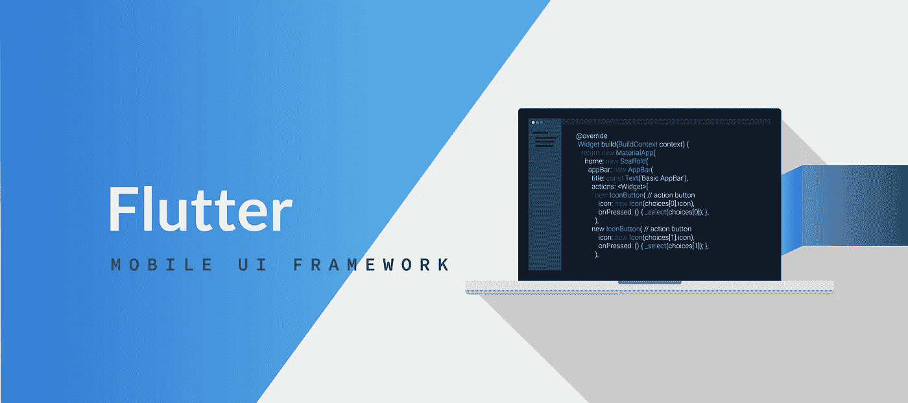

为 Flutter 应用程序创建个性化风格是每个组织都遵循的实践，以保证最终用户的开发和生产安全。在这里，我们将创建两种不同的风格:“开发”和“生产”。

名为“develop”的风格将在 Flutter 应用程序的开发过程中使用。“生产”将在我们向最终用户推出时使用。因此，让我们看看如何为我们新创建的 Flutter 应用程序的 Android 和 iOS 模块设置这两种风格。

# Android 模块的风格设置

要为 Android 模块设置两种不同的风格，需要在 Android 节点内 buildTypes 之后的 app 的 build.gradle 文件中添加几行代码。检查下面的代码片段:

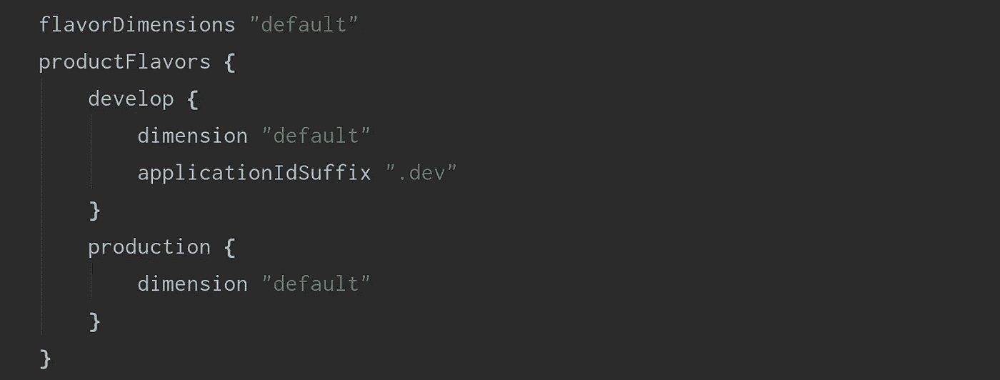

现在，我们的 Android 应用程序模块已经准备好了两种不同的风格:“开发”和“生产”。现在我们来看看如何将它设置为我们的 Flutter 应用程序的 iOS 模块。

# iOS 模块的风格设置

为 iOS 设置 flavor 有点棘手，但是一旦你理解了它是如何工作的，你将会大吃一惊。我们将一步一步地完成整个过程。

## 第一步

创建两个使用 xCode 开发和生产的方案:

*   从顶部菜单中选择产品->方案->编辑方案
*   复制主流道方案，根据我们需要的口味逐一命名

当你完成这一步，你应该有如下图所示的方案:

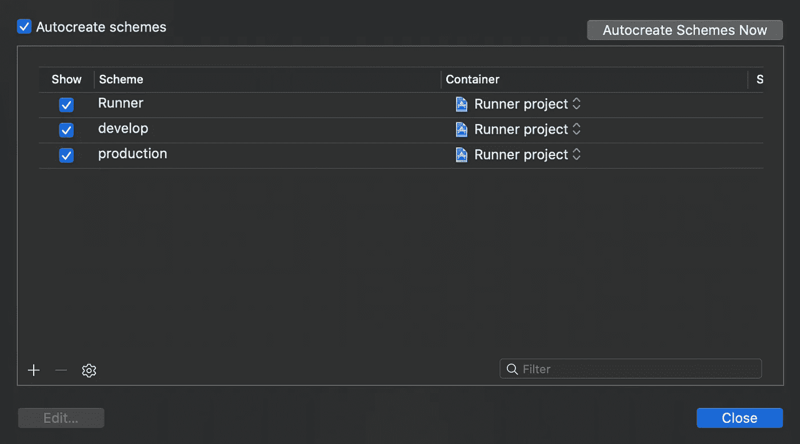

## 第二步

现在，对于创建的每一个方案，我们必须添加一个新的构建配置，并结合每一个不同的构建模式类型(Debug，Release)。

*   选择转轮项目并打开信息选项卡
*   在配置部分，创建构建类型(调试，发布)和方案(开发，生产)的组合。默认情况下，调试、分析和发布都在那里。让它们保持原样。

当您完成这一步，您应该有如下图所示的配置:

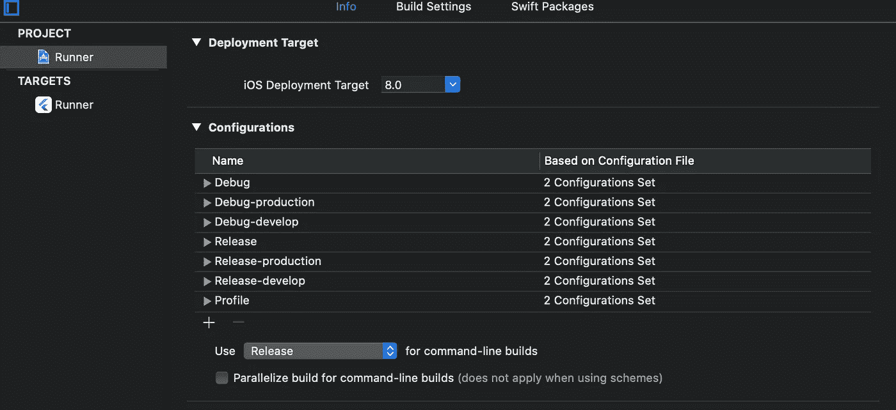

## 第三步

现在，我们已经完成了方案和配置的设置，因此我们将它们配对在一起，以启用哪个方案和构建类型组合以及将选择哪个配置。现在，我们将在这里设置运行和归档。

*   转到产品->方案->编辑方案
*   对于像 developer 这样特定方案，
*   对于运行，选择调试-开发作为构建配置
*   对于存档，选择发布-开发作为构建配置

我们的另一个计划也要这样做。完成后，我们将得到如下图所示的配置设置:

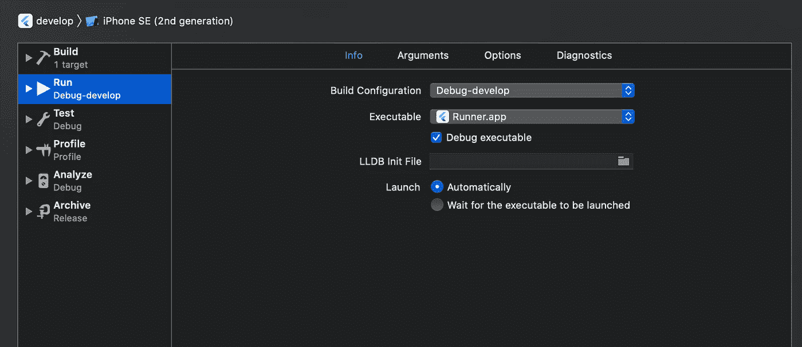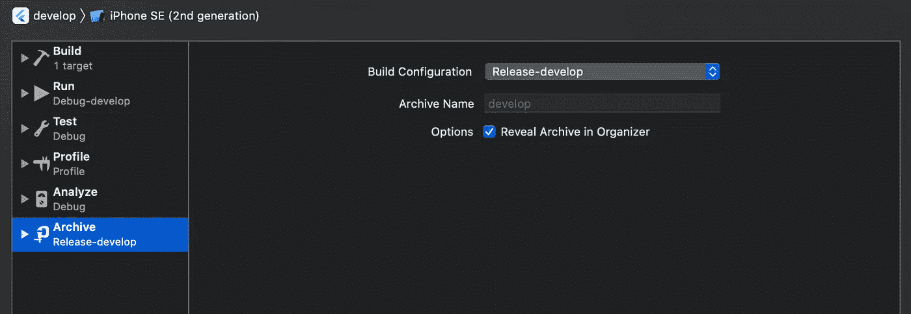

最后，我们已经为 Flutter 应用程序的 Android 和 iOS 模块设置好了风格。但是还有一个主要问题:我们的 dart Flutter 应用程序将如何通知本机(Android 或 iOS)模块它正在执行哪种风格。

因此，为此，我们将在 Dart 和 Native(针对 Android 和 iOS 模块)中编写一个双方通信的方法，我们将在下一个模块中介绍。

 [## 隐私指南，关于应用开发|数据驱动投资者

### 挪威隐私机构 DPA 对当地的一个现实处以 20 万欧元的罚款，原因是…

www.datadriveninvestor.com](https://www.datadriveninvestor.com/2020/04/29/privacy-guidelines-about-app-development/) 

# Flutter 应用配置

在上一节中，我们已经在 Flutter 应用程序的 Android 和 iOS 模块中配置了风格。现在，我们将配置我们的 Flutter 应用程序的 Dart 端，以便它能够与正在执行或构建的 flavor 的本机模块进行通信。为此，我们将使用平台通道在 Dart 和我们的应用程序本机代码之间建立通信桥梁。

第一步

在 main.dart 所在的应用程序的 lib 文件夹中创建一个名为 app_config.dart 的文件。该文件将用于配置，或者我们可以基于我们当前的运行配置来存储 API 基本端点和风格。

首先，导入所需的包，如下图所示:

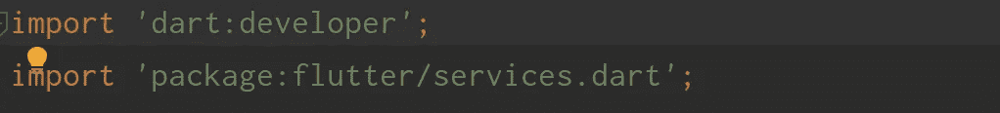

然后声明一个用户定义函数定义，并声明 enum 环境的值与我们的 definedflavors 相同，

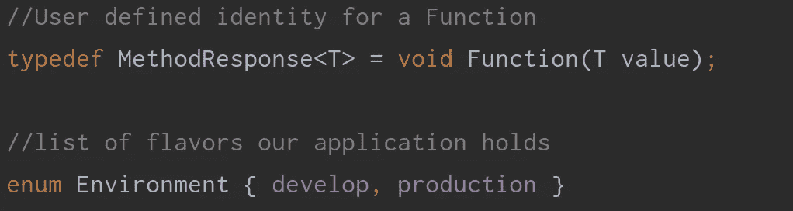

接下来，我们将创建一个名为 AppConfig 的类，并声明如下所示的参数:

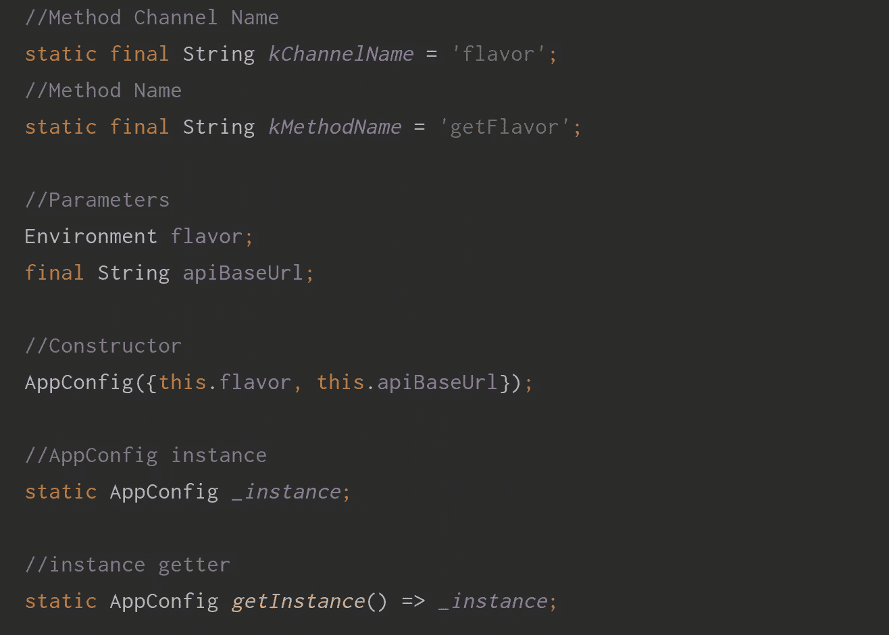

我们将通过方法通道与本机模块通信。这将通知我们的本机模块我们正在运行哪种风格，以便在执行时采取适当的运行配置。

*   kChannelName (flavor) —与 Android 和 iOS 的本机模块通信的通道的名称
*   kMethodName (getFlavor) —将在本机模块中标识的方法名
*   风味—将存储运行配置时使用的风味值
*   apiBaseUrl——基于风格，我们将设置不同的后端(服务器)Url，这些 URL 将在通信时使用。
*   _ instance 将存储 flavor 和 apiBaseUrlparameter 值的 AppConfig 类的私有实例。
*   GetInstance —在应用程序生命周期的任何时间点检索 _instance 值的方法。

接下来，根据我们定义函数签名定义一个方法，如下所示:

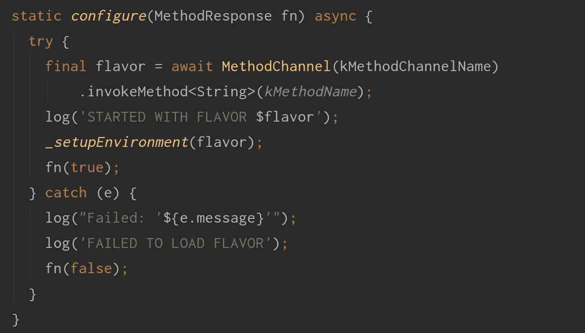

该静态方法将通过 AppConfig 类的实例调用，该实例将执行几个功能，如:

*   与本机模块通信，获取风味名称
*   将检索到的味道传递给另一个方法，该方法将设置 AppConfig 参数值并存储该类的 in _instance。
*   如果在任何时候发生异常，那么它将从 catch 块中记录关于它的信息。

最后，我们将向设置环境添加一个方法，如下所示:

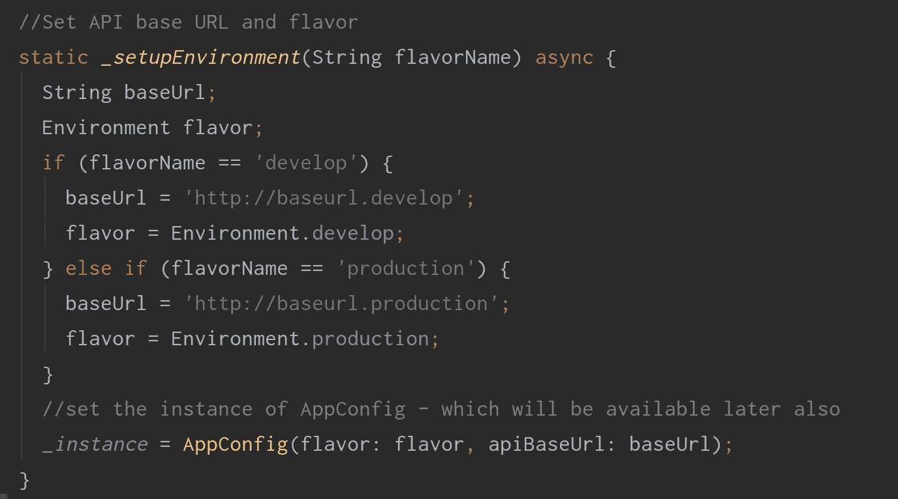

该方法将通过根据它检索的 flavor 为 apiBaseUrl 和 flavor 参数赋值来创建一个 _instance。

最后，我们需要对 main.dart 文件进行一些修改，如下所示:

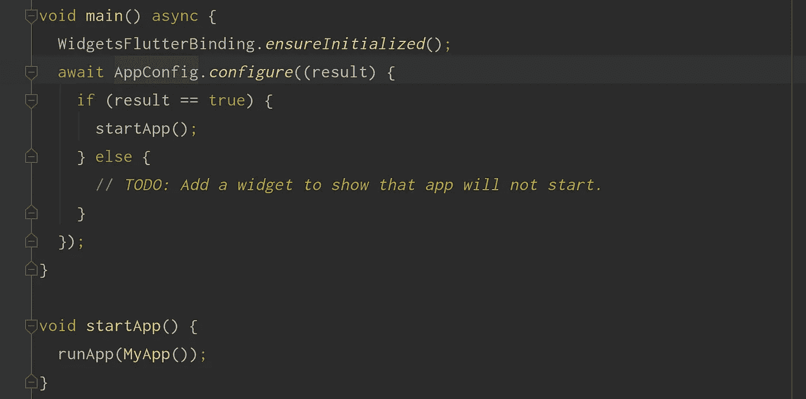

在应用程序启动之初，我们将检查 Flutter 小部件是否通过一行调用进行了初始化。然后，我们将对 AppConfig 类的 configure 方法进行 await 调用，以根据运行配置获得味道，并根据它设置环境，并将结果作为 true 或 false 发送回来。如果结果为真，我们将转发执行以启动应用程序。

第二步

在这一步中，我们将对本机模块进行修改，以便它们可以从 dart 端处理方法通道调用。让我们一个一个地检查一下。

机器人

从文件夹 Android-> app-> src-> main-> kot Lin-> PACKAGE-> MainActivity.kt 中打开 main activity . kt 文件，并包括如下图所示的更改:

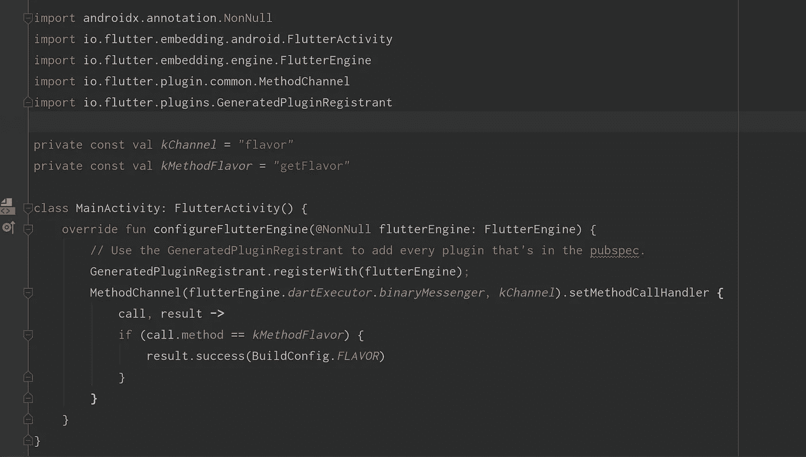

由于我们需要在 Android 本机上处理方法通道调用，我们将首先导入一些必需的包。然后，我们将声明通道名和方法名，与我们在 Flutter Dart 应用程序中采用的名称相同。

接下来，我们将添加这个方法调用的处理部分，为此我们必须覆盖一个名为 configureFlutterEngine 的函数。在其中，我们将使用 method channel 类的 setMethodCallHandlemethod 通过传递所需的参数和通道名称来声明方法通道处理程序。此外，我们将检查进行了哪个方法调用，并根据它，我们将回复一个包含我们的应用程序按照运行配置配置的 Flavor 值的 result 实例。

ios

配置 iOS 模块非常简单，但需要精确的更改，因此需要时间来保证准确性。首先，打开 AppDelegate.swift 文件，进行如下图所示的更改。这和我们处理 Android 端的方法通道调用是一样的。这个是 iOS 端的。但是它需要更多一点的修改。我们需要使变量 Flavor 在 info.plist 文件中可用。

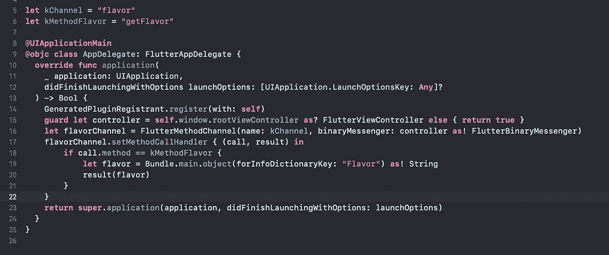

因此，在 xCode 中打开 Runner/Info.plist 文件，添加一个名为 Flavor 的新关键字，并为其赋值${PRODUCT_FLAVOR}。你可以看看下面的图片。

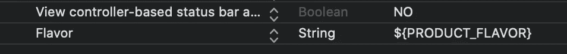

接下来，我们必须在 Targets/Runner/build settings/User-Defined 下定义 PRODUCT_FLAVOR 的新设置。这里，我们将为左侧的每个配置添加一个风格名称。因此，做出如下图所示的改变。

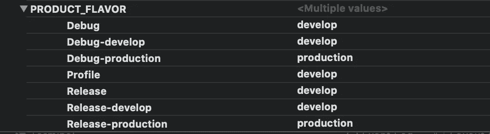

最后，我们将根据我们的口味配置修改包名。因此，移动到相同 BuildSettings 下的 Packaging 部分，并修改每个运行配置的产品包标识符值，如下所示:

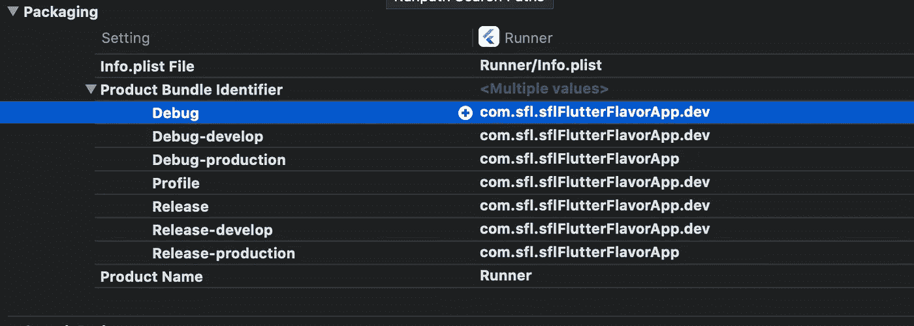

现在，我们准备通过指定风味名称来运行我们的应用程序。为此，您可以将命令行代码用作:

颤动运行——风味开发或颤动运行——风味生产

或者，您可以始终编辑运行配置，如下图所示:

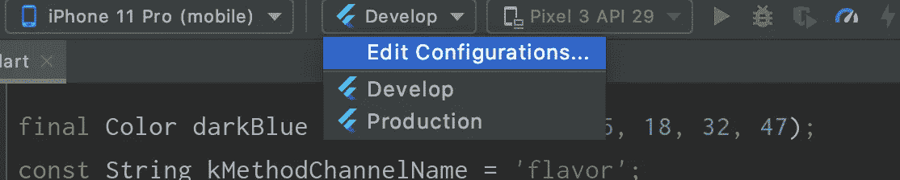

首先转到编辑配置，然后提及风味的名称，如下图所示，用于运行配置。你也可以把它命名为 Develop。对于生产，只需复制开发配置，并根据我们的要求修改其名称和指定的风格。

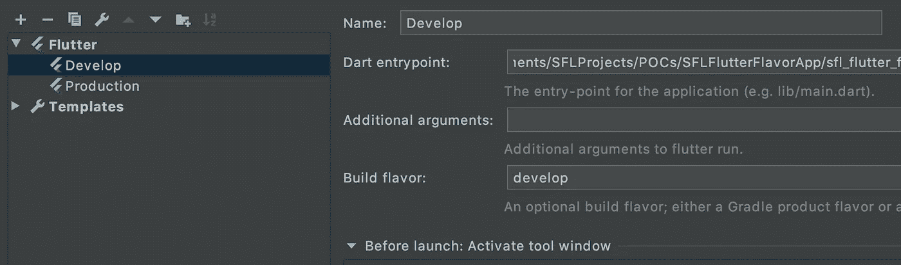

现在，当您通过选择特定配置来运行应用程序时，您还可以在日志中检查它正在执行的版本，并且您还可以分别在 iOS 和 Android 设备上检查已安装的应用程序捆绑 id 或包 id。就是这样。我们已经为我们的 Flutter 应用程序设置好了风格。

请继续关注第 2 部分！

**进入专家视图—** [**订阅 DDI 英特尔**](https://datadriveninvestor.com/ddi-intel)