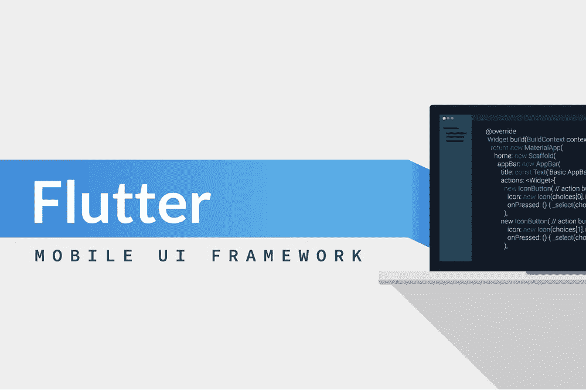
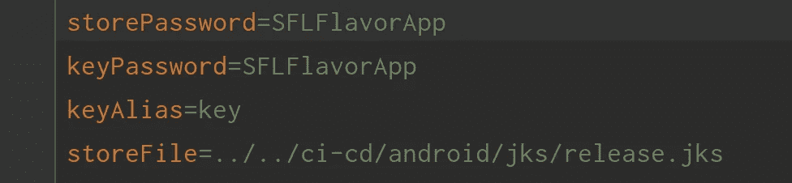
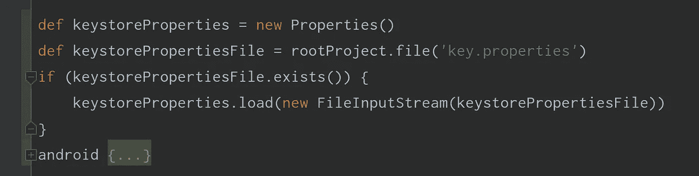
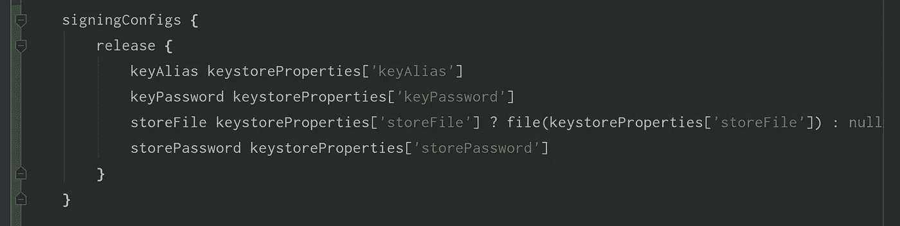
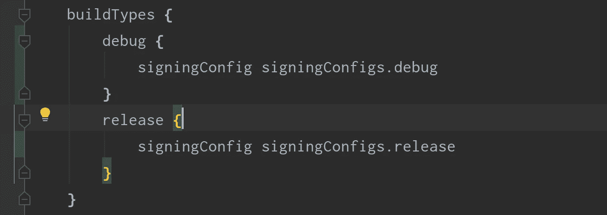
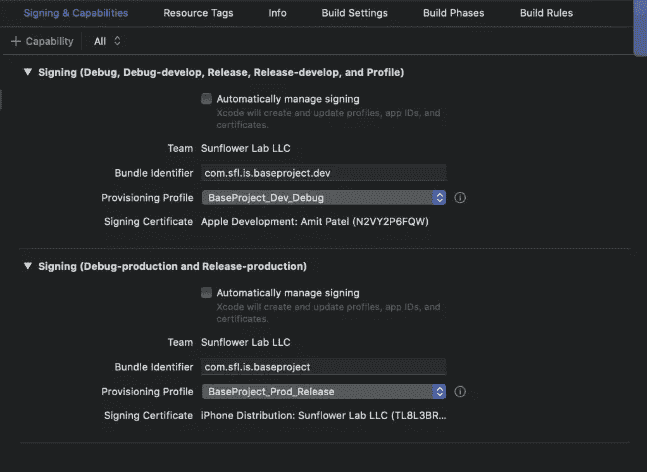
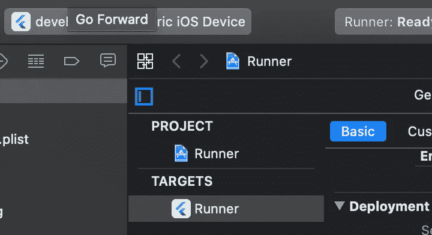
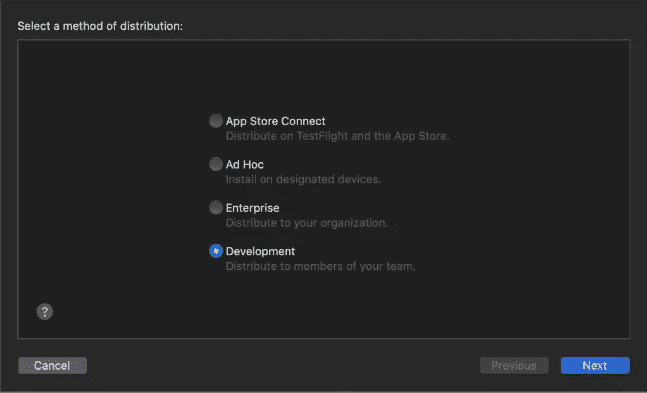
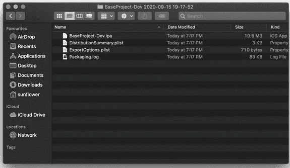

# 如何为颤振应用设置 Gitlab CI-CD 流水线:第 2 部分

> 原文：<https://medium.datadriveninvestor.com/how-to-setup-gitlab-ci-cd-pipeline-for-flutter-applications-part-2-511b43d8cc7e?source=collection_archive---------9----------------------->

# 第 2 部分—配置 Android 和 iOS 发布模块

欢迎回到如何为颤振应用设置 Gitlab CI-CD 流水线。在第一部分的中，你学习了如何[为 Android 和 iOS 配置不同风格的](https://www.thesunflowerlab.com/blog/how-to-setup-gitlab-ci-cd-pipeline-for-flutter-applications-part-1/)Flutter 应用程序。

在这一部分，我们将使用发布配置来配置我们的 Android 和 iOS 模块。我们开始吧！

首先，我们将一步一步地配置 Android 模块，如下所示。

1.  我们需要创建一个密钥库文件，我们可以按照这个链接的指示[点击这里](https://flutter.dev/docs/deployment/android#signing-the-app)。
2.  我们需要在应用程序中的 APP_DIR/android/key.properties 位置引用这个密钥库，它包含如下数据:

正如我们所看到的，我们必须将在步骤 1 中创建的 jks 文件放在文件夹 APP_DIR/ci-cd/android/jks/中。jks

3.接下来，我们必须在 app/build.gradle 文件中配置签名。

*   如下所示，在 android 块之前添加代码，这会将 key.properties 文件加载到 keystoreProperties 对象中。

在 buildTypes 块之前添加代码，签名配置如下，并同样更新发布 buildType。

我们还将使用发布配置更新构建类型，并可选地添加调试，如下所示:

就是这样。我们这边已经完成了 Flutter 应用程序 Android 模块的签名配置。现在我们将为我们的 iOS 模块添加相同的内容。

 [## 技术是市场的领头羊|数据驱动的投资者

### 大量的首次公开募股，中国做他们自己的事，微软政府的灾难应对，以及抖音的民谣…

www.datadriveninvestor.com](https://www.datadriveninvestor.com/2020/08/28/tech-is-the-market-top-dog/) 

对于 iOS，在开始之前，我们需要为我们在[第 1 部分](https://www.thesunflowerlab.com/blog/how-to-setup-gitlab-ci-cd-pipeline-for-flutter-applications-part-1/)中定义的所有方案/风格创建 ExportOptions.plist 文件。我们可以创造。手动创建 plist 文件，但我们强烈建议仅使用 XCode 生成 ExportOptions.plist 文件。那么，让我们看看如何生成这个 plist 文件。

1.  在“签名和功能”选项中设置有效的证书和配置文件。

2.选择开发方案，将通用 iOS 设备放在旁边，如下所示:

现在产品菜单，并选择存档，让它执行操作，以创建存档。完成后，进入下一步。

3.选择“created archive”并单击“Export ”,然后选择“Development”并单击“next”。等待它创建构建，并在被要求时将其导出到特定位置。完成后，我们将进入下一步。

4.在导出的目标文件夹中，我们将找到 ExportOption.plist 文件。我们将复制该文件并将其粘贴到此处指定的路径 APP _ DIR/ci-CD/iOS/develop/debug/

5.最后，我们将以相同的方式为生产生成归档文件，并在特定的目标文件夹中导出构建。在该文件夹中，我们将找到生产模式的 ExportOption.plist 文件。我们将复制该文件并粘贴到此处指定的路径 APP _ DIR/ci-CD/iOS/develop/release/。

这里，我们只完成了开发方案/偏好&对于生产方案，选择带有通用 iOS 设备的生产方案，并重复上述 3 到 5 个步骤。我们将把开发和生产 ExportOption.plist 文件分别复制到之前指定为 APP _ DIR/ci-CD/iOS/production/debug/和 APP _ DIR/ci-CD/iOS/production/release/的同一路径下。

就是这样。我们在这里为我们的 Flutter 应用程序的 iOS 模块添加签名配置。在下一个也是最后一个部分，我们将会看到，为了我们的 Flutter 项目，我们需要在 Gitlab 上做什么样的配置和改变，这样我们就可以直接在 git lab 上启用和运行构建管道。

所以，敬请期待最后的部分！

## 访问专家视图— [订阅 DDI 英特尔](https://datadriveninvestor.com/ddi-intel)