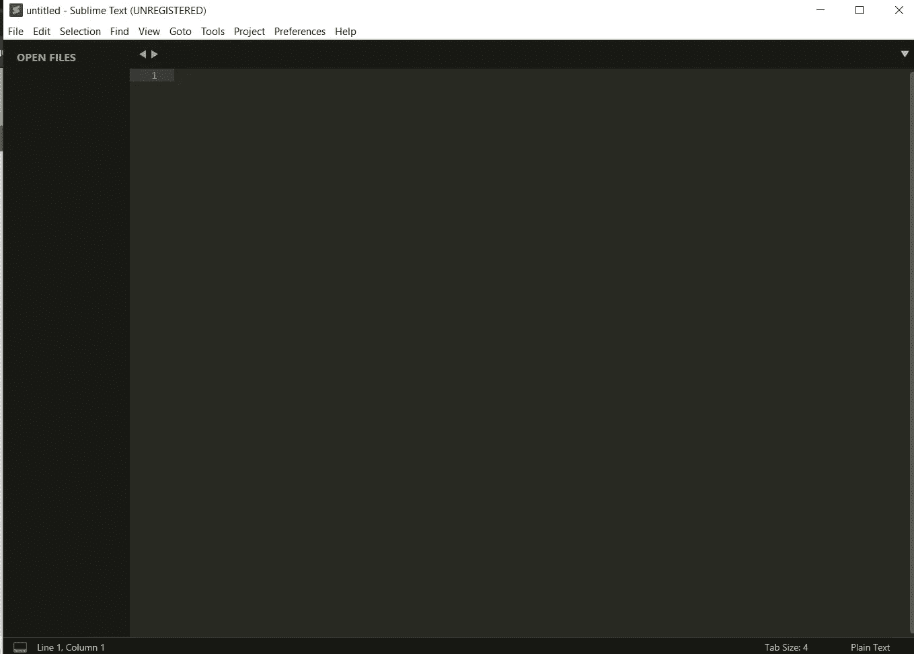
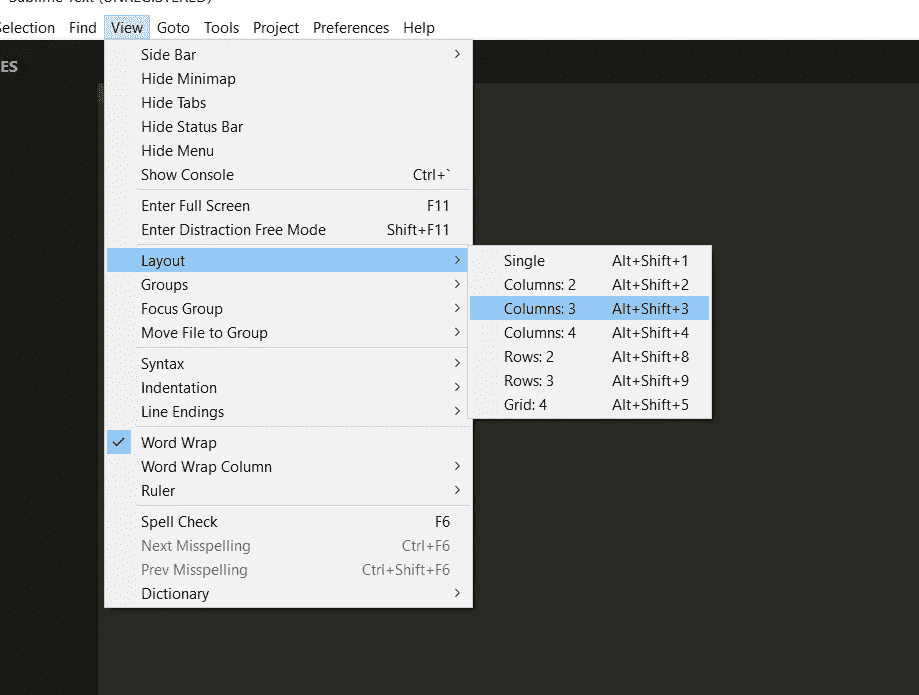
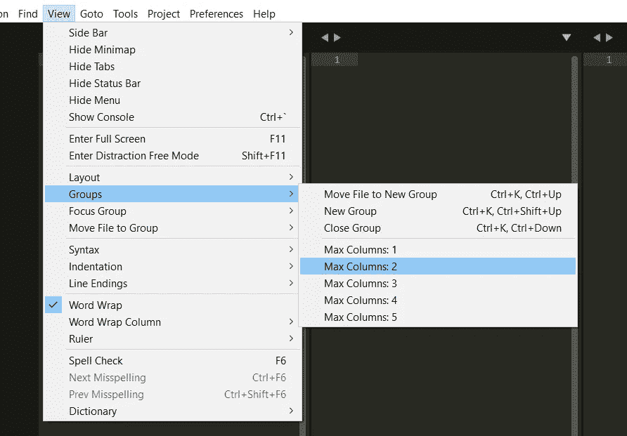
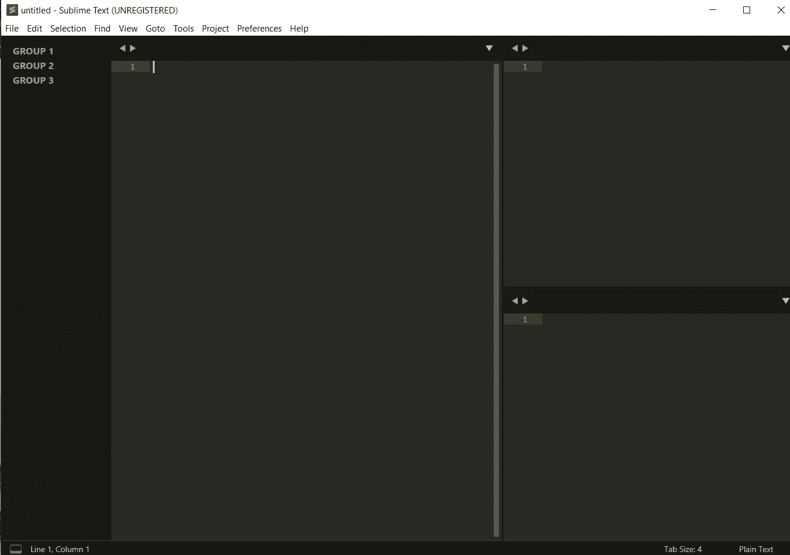
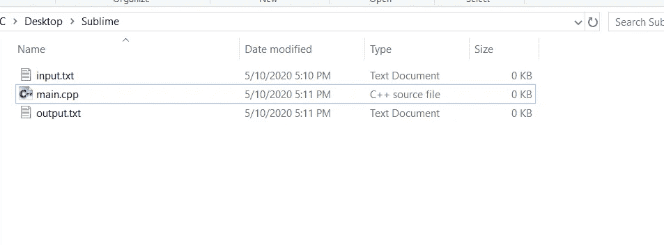
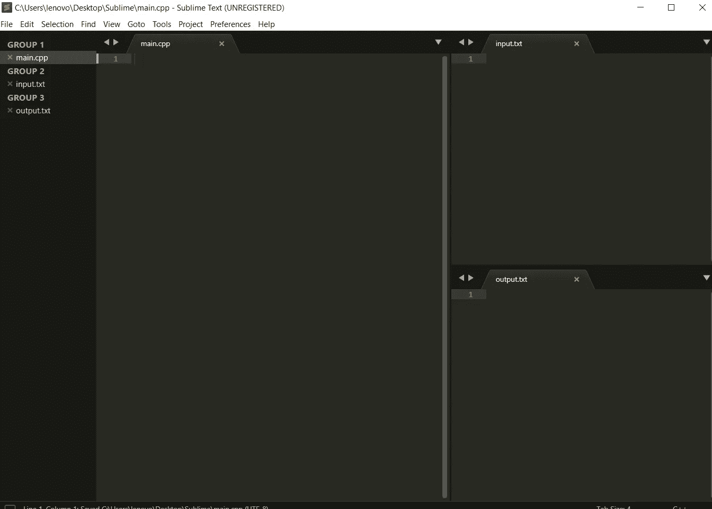
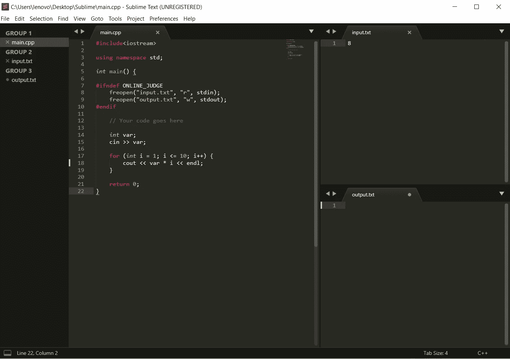
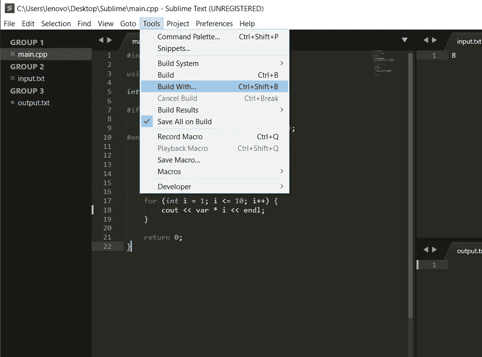
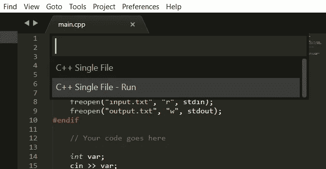
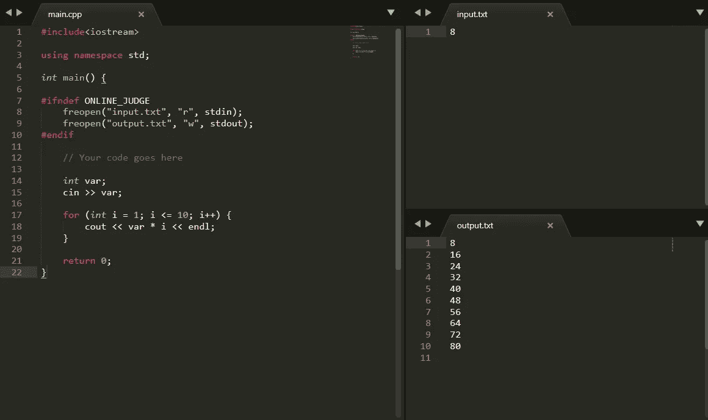

# 如何为 C++竞争性编码设置崇高的文本

> 原文：<https://medium.datadriveninvestor.com/how-to-setup-sublime-text-for-c-competitive-coding-665ea495aeb5?source=collection_archive---------0----------------------->


Sublime Text 是一个用于编码的高级文本编辑器。你会爱上流畅的用户界面，非凡的功能和惊人的性能。而不是等待在线 IDE 编译和输出您的结果。Sublime 可以用来即时构建和编译你的程序。

这种设置将在比赛过程中为你节省大量**宝贵的时间**。

现在让我们开始吧。

# 步骤 1:安装 Sublime 文本

Sublime Text 适用于 Mac、Linux 和 Windows。点击下面的链接在你的电脑上安装 Sublime Text。

[](https://www.sublimetext.com/) [## sublime Text——一个用于代码、标记和散文的复杂文本编辑器

### 使用 Goto Anything，只需击几下键就可以打开文件，并立即跳转到符号、行或单词。已触发…

www.sublimetext.com](https://www.sublimetext.com/) 

现在打开崇高的文本。您将看到默认界面。



Default Interface of Sublime Text

现在，我们将开始为竞争性编码定制 sublime。

# 步骤 2:设置布局

首先，我们将当前工作区分成 3 个部分，一部分用于编码，另外两部分分别用于输入和输出。

> *进入-查看>布局>栏目:3*
> 
> 或者你可以使用快捷键:Alt + Shift + 3



划分工作空间后，让我们安排它，给我们更多的编码空间，让它看起来更漂亮。

> *转到-查看>组>最大列数:2*



您的工作区现在应该看起来更吸引人和更易于管理。



# 步骤 3:创建必要的文件

现在在你喜欢的任何地方创建一个新的文件夹，在里面创建 3 个文件，命名为:

> 主页面
> 
> 输入文件
> 
> 输出. txt

您可以将“cpp”文件命名为任何名称，但其他两个文件必须命名为“input.txt”和“output.txt”。



在 sublime 中打开各自空间中的文件。你的工作空间应该是这样的:



# 步骤 4:编写我们的 CPP 计划

现在我们准备好了版面，期待着写出第一个 CPP 程序。让我们从打印一个数的前 10 个倍数开始。

```
#include<iostream>
using namespace std;int main(){
    int var;
    cin>>var;
    for(int i=1; i<=10; i++){
      cout<<var * i<<endl;
    }
 return 0;
}
```

但是在编译和运行我们的程序之前，我们必须添加四行代码，这些代码将从我们之前创建的 *input.txt* 文件接收输入，并将输出写入 *output.txt* 文件。我们必须在主函数的第一行添加这些。

```
#ifndef ONLINE_JUDGEfreopen(“input.txt”, “r”, stdin);freopen(“output.txt”, “w”, stdout);#endif
```

可以阅读 *#ifndef* 和*# endif*[https://www . geeks forgeeks . org/CPP-preprocessor-directives-set-2/](https://www.geeksforgeeks.org/cpp-preprocessor-directives-set-2/)的详细功能



现在我们可以在 *input.txt* 文件中直接输入。这里我想要 8 的倍数，所以我在输入中写了 8。

# 步骤 5:构建并运行

现在我们必须检查我们的代码是否运行良好，并在 *output.txt* 文件中显示结果。

Sublime 已经检测到你正在使用的文件扩展名，并为它使用正确的编译器。

> 转到:工具>构建方式..
> 
> 或者使用快捷键:Ctrl + Shift + B



> 单击 C++单个文件—运行



现在您的终端应该显示构建成功完成，输出将显示在 *output.txt.* 的空间中



这就是我们要做的，这只是一个小例子，但是我们可以输入那些大的测试用例，并准确地得到输出，而不需要等待在线 ide 去做。

不断学习。✌️