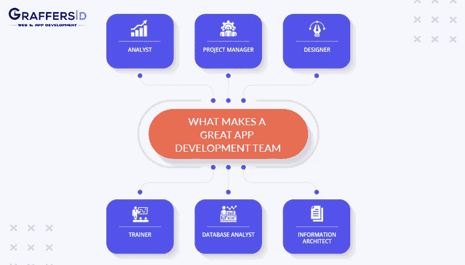
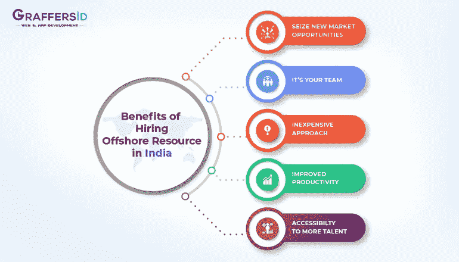

# 如何在印度建立离岸开发团队？

> 原文：<https://medium.datadriveninvestor.com/how-to-setup-the-offshore-development-team-in-india-f8962e16b235?source=collection_archive---------1----------------------->

成立一家离岸开发公司已经成为外包软件开发最流行的方式。离岸开发意味着要有一个专门的内部团队，成本要有利于你的口袋。

离岸开发已经成为成熟企业和初创企业为了他们的业务利益而有序地维护、实现和改进软件产品的一种受欢迎的方法。一家专门的离岸开发公司通过为您的业务实现灵活性、成本效益和知识集中来利用业务。

 [## 一个企业在肚子上移动:如何照顾直觉|数据驱动的投资者

### 事实证明，直觉不仅仅是一种感觉。科学很清楚:你的直觉比你知道的更多…

www.datadriveninvestor.com](https://www.datadriveninvestor.com/2018/11/09/a-business-moves-on-its-stomach-how-to-make-allowances-for-gut-feelings/) 

离岸开发作为一个扩展的团队，在一个重叠的班次工作。当你根据自己的需要对他们进行培训时，他们会遵循公司的文化。确保你雇佣的团队知识渊博，并确保高质量的结果。拥有一个离岸开发团队意味着拥有一个有杰出工作才能的高效团队。

你不必在他们身上花费额外的资源。此外，有了离岸开发团队，你不仅能得到开发人员，还能得到许多类型的专家。无论是项目经理、平面设计师还是内容写手，每个角色都很重要。

App Development Team

以下是一些需要扮演的角色:

**1。设计者和开发者:**

设计师和开发人员负责规划、起草设计、开发软件、网站或应用程序、测试和维护。

**2。客户经理:**

与公司客户合作，并授予他们忠诚度。客户经理的工作是确保客户对公司的工作感到满意。

**3。项目协调人:**

项目经理或项目协调员负责确定管理海上开发和控制沟通任务的优先级。项目经理负责制定开发计划，对团队进行分组，并确保项目按时交付。

**4。测试员/质量分析师:**

测试人员或质量分析师对项目的质量和完整性进行检查。

**5。内容作者:**

处理应用程序或网站的内容创作。

**6。可用性工程师:**

在产品发布之前，可用性工程师有责任评估应用程序或网站的用户友好性。

**为什么需要离岸开发中心？**

离岸开发中心最好建立在一个负担得起的国家，而不是维持一个内部团队。印度是生活成本低的国家之一，这使得印度成为建立离岸开发的广泛首选国家之一。

Benefits of Hiring Offshore Resource in India

根据 AT Kearney 最近的报告，印度是第一个基于技能、资金和开发人员可用性的国家。

7.707:印度

6.32:中国

6.11:马来西亚

5.99:印度尼西亚

通过在印度开展离岸开发，你可以减少公司的工作量，并有更多的时间专注于核心业务目标。下面是 [**为什么把开发项目外包给印度是成功的**](https://graffersid.com/blogs/why-outsourcing-software-development-projects-to-india-is-a-success/) 。

那么，你在印度的离岸开发都准备好了吗？寻找一个 [**合适的离岸合作伙伴**](https://graffersid.com/) 的过程比雇佣一个内部团队要容易得多。下面是建立离岸开发团队需要遵循的几个步骤:

1.**设定你的商业目标:**

对你想外包的项目有一个清晰的想法，如果不是整个项目，你想卸下的具体任务是什么。首先也是最重要的是，要明确你是想从头开始开发一个项目，还是只想外包其中的一部分。也有可能你只是需要一个 python 开发人员，并期待从离岸开发公司雇佣一个专门的 python 开发人员。

**2。保密协议**

制定严格的政策规范，并签署保密协议。提及你认为最重要且不应向第三方披露的细节和细节条款。在正式签署协议之前，您和离岸团队都应该对协议有一个清楚的了解。

**3。提供详细规格**

在落笔之前，确保向远程开发人员提供完整的规格和设定的截止日期。试着尽可能的彻底，并且总是给他们留一些即兴发挥和创造性的空间。

沟通和透明是支撑近海开发的重要支柱。确保你的团队在任何需要的时候都向你提供请求电话和 sprint 报告。有像吉拉和特雷罗这样的工具可以用来与你的离岸开发团队保持沟通。

**4。跟进**

留出一个特别的清单和参数，最好地描述你的项目每周和每月的进展。跟进并不意味着提供负面反馈，还包括强化良好表现。有了跟进，就很容易发现发生了什么。优先事项正在实现或没有实现，并消除任何障碍。

有一些在线工具，比如 Freedcamp，你可以通过它来跟踪每天的任务。回顾进展，并毫不犹豫地对您希望看到的变化给出反馈。

要深入了解组建离岸开发团队时的考虑因素和挑战，[请点击此处](https://graffersid.com/blogs/here-is-all-you-need-to-know-about-offshore-development-centre/)。

当谈到寻找一个可靠的离岸开发团队时，Graffersid 是你最好的选择。凭借 95%的客户成功率，Graffersid 为其客户的项目提供了无与伦比的解决方案。我们努力开发以客户为中心的软件解决方案，为我们的客户提供独一无二的身份。我们的网站开发专家团队提出的想法能够完美地满足客户的业务需求。

你有在印度任何地方的离岸开发中心工作的经验吗？请告诉我们您的经历，以及如何让您和您的团队的流程更加顺畅。

必读:[找到并雇佣应用开发者的 5 种方法](https://graffersid.com/blogs/5-ways-to-find-and-hire-the-right-app-developer/)