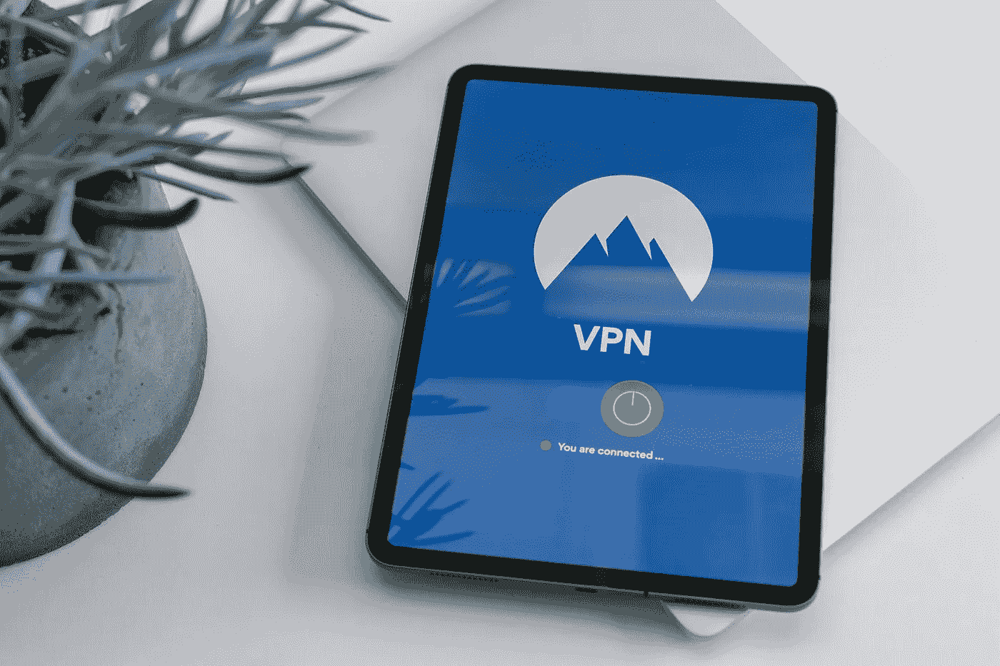

# 如何保护个人数据不被坏人窃取

> 原文：<https://medium.datadriveninvestor.com/how-to-shield-personal-data-from-evil-doers-e57b2330cfa?source=collection_archive---------18----------------------->

## 隐私和社交媒体必须符合消费者的关切

Photo by Petter Lagson on Unsplash

数字隐私实际上是一个误称。未被黑客攻击的公司名单似乎比被攻击的公司要短。

[Dentin Waweru](https://twitter.com/the_dentin/) 可能不同意这种夸张的说法，但网络安全是一个令人担忧的问题。这位软件工程师兼自由职业数字修复师在[非洲推特聊天](https://twitter.com/AfricaTweetChat)上谈论了隐私以及社交媒体如何与消费者的利益保持一致。

“我热爱科技的一切，”他说，并为用户提供保护社交媒体隐私的技巧:

*   自己的信息技术:添加您的个性，包括姓名，个人资料图片和传记。
*   保护 IT:两步认证。
*   保护它:不共享您的密码。

 [## 网络安全生活是一个缺口

### 在线隐私和安全是个人和企业面临的问题

medium.datadriveninvestor.com](/cybersecurity-life-is-a-breach-2393bfc1795e) 

你的账号被黑后第一反应就是改密码。然后确保你的隐私设置严密。还要确保您已经下载了浏览器的最新更新。

“重要的是承认你已经被黑客攻击，并意识到这种情况更经常发生，”Waweru 说。“社交媒体平台难以应对黑客攻击。幸运的是，您可以采取一些措施来重新获得对您帐户的访问和控制。

“检查你的邮件，看看有没有新的登录活动，”他说。“我们的大多数账户都与我们的邮件相关联。这一功能是我们所有社交媒体活动的中枢。”

检查数据中的细微差异。

“仔细看看你的账户，注意是否有变化，”Waweru 说。“很可能会有一些可疑的活动，比如发消息或发布你无法解释的信息。

“你的朋友和家人也可能会联系你，并根据你的在线互动性质询问恶意活动，”他说。“删除您以前可能参与的场外下载和扩展。”

# 可疑的饼干

网站可能启用了篡改网关。

“Cookies 是最常见的黑客来源，”Waweru 说。“这是为了清除恶意软件。您可能不小心下载了它们，它们可能会被用来再次危害您的安全。

“对你的设备进行全面扫描，”他说。"确保你只使用安全和经过验证的网站."

 [## 良好的安全性保护我们免受自身威胁|数据驱动型投资者

### 您收集的数据易受黑客攻击。他们可能会直接攻击或编译看似不相关的和…

www.datadriveninvestor.com](https://www.datadriveninvestor.com/2018/10/24/good-security-protects-us-from-ourselves/) 

帐户访问工具也容易受到攻击。

Waweru 说:“如果你对多个账户使用相同的密码，请重新设置密码，这是非常不鼓励的。”。“大多数设备和社交媒体平台都有隐私保护计划，例如两步验证，作为额外的保护层。

“采取额外的安全措施，”他说。“记录你的账户几天。通知朋友和家人，您的帐户可能已经受到威胁。向他们保证你已经采取了必要的预防措施。”

在社交媒体或物联网的任何地方，你都不会感到太安全。愤世嫉俗者说，如果坏人还没有直接从你的账户中获得你的个人信息，他们会在你下次去市场时获得。

“记住，社交媒体只会强化你自愿提供的信息，”Waweru 说。“一些人认为平台尽最大努力维护数据隐私是安全的，而另一些人则认为他们的数据隐私没有得到维护。

“这是消费者普遍担心的问题，”他说。“需要注意的是，在与任何社交媒体平台互动之前，询问你是否订阅了该平台的商业模式是至关重要的。”

# 你知道的越多…

大多数人都没有意识到这些细节。

“商业模式根据平台的开发周期而变化，”Waweru 说。“一些平台鼓励消费者接受他们的条款，因为它们让你的手机更有用。这个应用程序对你了解得越多，它能为你做的就越多。

“其他平台拒绝这种商业模式，”他说。“他们认为，允许侵犯数据隐私，你就是产品，而不是顾客。了解他们的商业模式，看看它是否符合你的兴趣。然后挑选最好的产品。”

与普遍看法相反，Waweru 说广告拦截器不会[屏蔽设备上的 cookies 功能。](https://www.datadriveninvestor.com/glossary/block/)

有很多方法可以定制社交媒体信息，以充分利用这些信息。

“社交媒体以商业模式为前提，”Waweru 说。“对于消费者来说，重要的是要注意，你可以控制你在社交媒体上提供的信息。

“基于消费者的兴趣，你可以向你的平台提供相关信息，这可能有助于确保你的生活在检查中，”他说按时间顺序安排你的约会，以更好地帮助你处理个人和职业生活。把它想象成私人秘书。"

 [## 网络安全威胁比恐怖更可怕

### “你是一个目标。”

medium.com](https://medium.com/datadriveninvestor/cybersecurity-threats-scarier-than-scary-60fcc2f704c2) 

在用户协议的细则中，你可能已经同意公司可以出售你的信息。

“数据相当于金钱，”Waweru 说。“一些品牌将您的数据转售给第三方。这是一个商业工具，有助于营销。这影响了你观看的广告或来自群发信息设施的信息的增加。

“当涉及到个人数据时，很难从合法收集中识别出非法收集，”他说。

# 定向广告源于数据

不管它的来源是什么，大量的信息都被用于分析。

“这将收集你浏览、分享或喜欢的所有和任何类型的数据，”Waweru 说。“它能让你了解自己是谁，以及你可能喜欢什么样的兴趣。

他说:“这些数据被第三方用于有针对性的广告、政治活动，有时还被用作人类注释者。”“人们普遍认为，根据国家安全法，这些人监听个人谈话，并向政府机构出售数据。”

Waweru 为社交媒体隐私保护提出了以下建议:

*   不要对你的信息过于私人化。
*   看好你的邮箱。
*   使用唯一的密码。避免不同社交媒体平台的共享密码。
*   使用您的密码。你的威胁可能就在你身边。

 [## 网络罪犯期待您的邀请

### 您的隐私取决于坚持个人最佳实践

medium.com](https://medium.com/datadriveninvestor/cyber-criminals-look-forward-to-your-invitation-9c01640367fd) 

数据泄露会产生麻木的效果。消费者听天由命——并且被激怒了。

Waweru 说:“违规行为会影响消费者，因为用户可能会在银行平台上遭遇身份盗窃、诽谤、欺诈活动，以及在各种平台上被取消账户。”

“这反过来又夺走了消费者的信任，导致他们转向有竞争力的替代品，”他说一旦信任被打破，就很难说服消费者回到你的平台。社交媒体平台的繁荣依赖于消费者的信任度。"

他补充道:“在社交媒体上，你信任的越多，你付出的就越多。”

# 善意的隐藏身份

社交媒体上的人可能会选择匿名，但这应该是有充分理由的。如果是欺侮痛打而不承担后果，那就不好了。

“匿名有好有坏，”Waweru 说。“社交媒体平台依靠‘消费者责任’而非‘消费者责任’发展壮大。”

他说:“好处包括言论自由不受攻击，减少审判，举报人受到保护。”“缺点包括网上滥用和提供虚假信息变得容易——错误信息更好地被称为‘假新闻’——几乎没有反响。”

 [## 通过保持数据个性化最大化数据|数据驱动型投资者

### 想要成功的企业主应该知道如何利用数字技术增加收入。企业家不…

www.datadriveninvestor.com](https://www.datadriveninvestor.com/2019/05/11/maximize-date-by-keeping-it-personal/) 

就个人而言，Waweru 说社交媒体符合他作为用户的兴趣。

“作为一名消费者，你必须记住你是掌控者，”他说。“社交媒体应该让你的生活变得便利。了解与你互动的平台的商业模式，以便获得更多信息。找一个知道细节的人会有很大帮助。

“保护你的账户，”Waweru 说。“社交媒体应该提倡简单、易用、数据隐私和便利。这是消费者和社交媒体平台之间的集体努力。责任和问责是拥有美妙社交媒体体验的关键。”

他提出了网络安全，相当于“跟着钱走”:

*“数据是货币的一种形式。先服务保护好自己。”*

**关于作者**

吉姆·卡扎曼是[拉戈金融服务公司](http://largofinancialservices.com/)的经理，曾在空军和联邦政府的公共事务部门工作。你可以在[推特](https://twitter.com/JKatzaman)、[脸书](https://www.facebook.com/jim.katzaman)和 [LinkedIn](https://www.linkedin.com/in/jim-katzaman-33641b21/) 上和他联系。

*原载于 2020 年 7 月 28 日 https://www.datadriveninvestor.com***。**