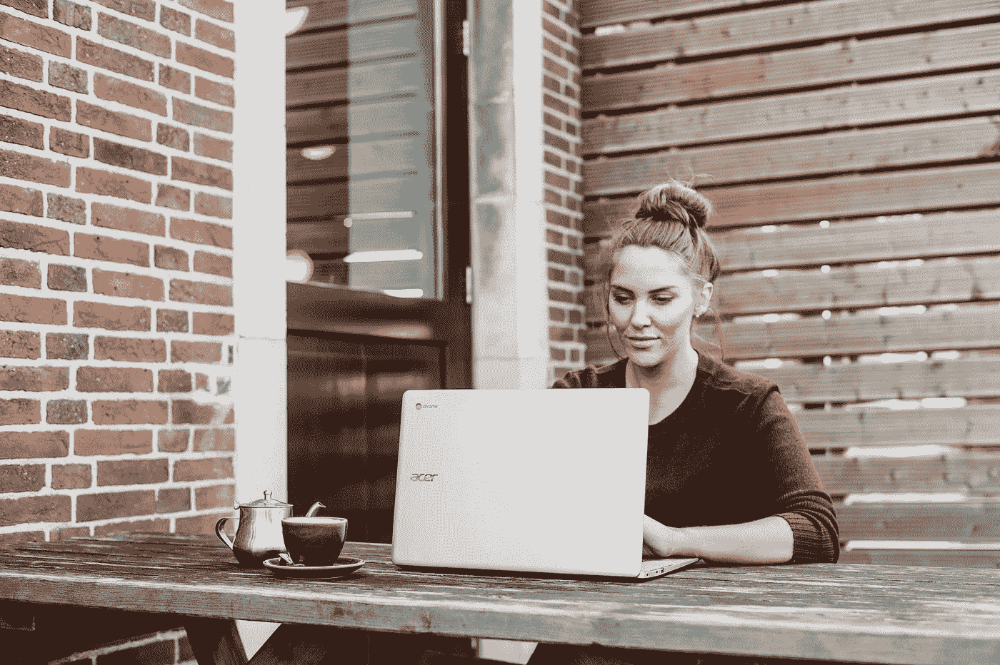

# 如何将在家工作的习惯转变为全职旅行

> 原文：<https://medium.datadriveninvestor.com/how-to-shift-your-work-from-home-habits-to-full-time-travel-2cd45f0140e2?source=collection_archive---------23----------------------->

## 在旅途中使用家庭办公技能的 7 种方式

Photo by [Anete Lūsiņa](https://unsplash.com/@anete_lusina?utm_source=unsplash&utm_medium=referral&utm_content=creditCopyText) on [Unsplash](https://unsplash.com/s/photos/laptop-work?utm_source=unsplash&utm_medium=referral&utm_content=creditCopyText)

2020 年，许多人第一次尝到了在家工作(“WFH”)的滋味。

餐桌变成了工作空间。你的猫成了你的隔壁同事。最重要的是，人们必须找到在家工作的方法。

整个 2019 年，我都在路上，在这个过程中建立了一个远程工作程序。在 2020 年的早期阶段，我必须调整这些系统，使其在我的公寓中发挥作用。在我的 WFH 工作期间，我意识到在家里有效的习惯在路上也有效，反之亦然。

换句话说，在舒适的家中工作时保持高效率可以让你为数字游牧做好准备，反之亦然。

> 最重要的一点是，WFH 和数字游牧都将生产力从传统办公室中分离出来。

这就是为什么你的 WFH 习惯可以在路上发挥作用。经过一些调整，WFH 是未来在任何地方远程工作的理想训练。

在此基础上，这里有一个关于如何将在家工作的习惯转变为全职旅行的指南。

# **在路上培养你的 WFH 责任感**

将你的 WFH 生产力转化为全职旅行生活方式的第一步是要有正确的态度。

大多数在家工作的人会比在传统的小隔间环境中感受到更多的责任。

没有老板会亲自来拍你的肩膀。具有挑战性的任务将需要虚拟的，而不是面对面的帮助。你突然被家常菜、你最喜欢的书和你的 50 英寸电视包围了。

简而言之，如果你想[在家里保持高效](https://medium.com/datadriveninvestor/7-remote-working-hacks-to-stay-productive-anywhere-92554c9dd3fa)，你需要把事情掌握在自己手中。这同样适用于旅行时的工作。

当你在旅途中，你必须解决与同事和上司同样缺乏身体接触的问题。除此之外，你还必须应对不同的时区、频繁的地点变更和旅行中的打嗝。

这就是为什么你的工作职责需要切中要害。

在你的[游牧基地](https://medium.com/datadriveninvestor/how-to-choose-your-nomad-base-as-a-remote-worker-efb619aec37b)寻找最佳远程工作地点。确保你的沟通是一致的，可靠的，直截了当的。最重要的是，通过积极主动来证明你愿意承担责任。

无论你是在家工作还是在伊斯坦布尔的咖啡店工作，你都需要为自己的行为负责。

总结这一点，责任是远程工作成功的必要条件。

# **确定你的 WFH 生产力助推器，并把它们从你的家中分离出来**

如果你在家工作了很长一段时间，你会知道什么样的习惯、物品和仪式会让你有效率。

就我个人而言，这是一次家庭锻炼，我喜欢的早餐，我的[日常日志](https://minimalistfocus.com/my-daily-journaling-routine-in-3-essential-parts/)，冥想和有趣的书籍。

这些元素在家里也能发挥作用，但对我在旅途中的工作效率也至关重要。

因此，要想在任何地方保持高效，你需要找到*你的*提高效率的习惯，并让它们适应非家庭环境。

在家工作时，问问自己哪些习惯决定了你的一天。

他们只在你家的范围内工作吗？他们依赖于特定的物质项目吗？最重要的是，你能在任何时间任何地点表演吗？

一旦确定下来，这些习惯将帮助你在任何地方完成工作任务，因为无论你是在家里还是在吉隆坡的 Airbnb，它们都将保护你的工作成果。

# **将你的家庭办公室切换到旅行模式**

为了在旅途中出色地工作，您需要一个远程办公室，这种设置可以是您家庭办公室的移动版本。

看看你现在的家庭办公室。它可能包含一台电脑、一些书籍、扬声器和其他与工作相关的设备。

问问你自己，这些东西有多少能装进一个手提箱或背包。换掉那些没有的。

买一台笔记本电脑，用降噪耳机取代你的扬声器，将你的文档数字化，将你的平装书转移到电子书阅读器上。

一项接一项，您将把您的家庭办公室转变为移动工作站，使您能够在咖啡店、机场候机楼和酒店房间里开展业务或工作。

这个想法是把你的 WFH 装备换成旅行模式。每个与工作相关的基本项目都需要在特定的位置独立运行。

# **识别 WFH 干扰，并在路上消除它们**

当我们在家工作时，干扰无处不在。

电视遥控器从不远离。我们可以随时看手机。最糟糕的是，没有人看到我们这样做。

在路上，同样的杂念存在，但更多。除了常见的社交媒体和娱乐陷阱，事实是我们在一个不同的城市，有很多令人兴奋的事情可看。

为了在旅行中保持高效——不错过景点——我们需要把自己放在一个不受干扰的起始位置。

换句话说，我们必须从一开始就消除最常见的干扰。

就我个人而言，从我的手机上卸载与工作无关的应用程序，[将旅行和工作日分开](https://medium.com/datadriveninvestor/how-to-balance-work-and-adventure-as-a-digital-nomad-e6c1a089d2f0)，并且只在必要时连接 WiFi，效果非常好。

# **提前计划会议、截止日期和休息时间**

作为一名远程工作者，成功的关键之一是精明的计划。

正如[*美丽目的地*的创始人杰瑞米·贾恩斯](https://edition.cnn.com/travel/article/stay-productive-while-traveling/index.html)在 2019 年为 CNN 旅游撰写的一篇文章中所说，

> “在旅行前制定一个强有力的活动和会议计划，这样你就能清楚地看到日记中的空白，可以有效地用于重要的电话、额外的会议或写作内容。”

因此，全职旅行时，走在你的计划前面是很重要的。在家里，你需要计划你的工作，而不需要有人强制执行这些计划。道路也是如此。

当你在旅行的时候，你需要知道你什么时候在途中，你在哪里睡觉，无线网络如何，你可以在哪里工作。在前往一个新的目的地之前，研究所有这些事情，你会将不可预测的旅行挫折的风险降到最低。

# 干净的家有助于你的工作节奏。一个组织良好的旅行计划也是如此

如果你有在家工作的经历，你会知道这会变得很乱。

因为我们的办公室和生活空间往往重叠，许多松散的物品不知从哪里冒出来，我们很难做到井井有条。

在路上，问题是相似的，但是大多数混乱是由于频繁改变位置造成的。

这就是一个组织良好的旅行机构发挥作用的地方。

一个对我很有效的习惯是[将不同类型的齿轮分成不同的包装立方体](https://jackkrier.medium.com/how-to-travel-minimalist-d84a2bd669f1)。我有一个放我的摄影器材，我的工作相关物品，还有几个放不同类型的衣服。

当到达一个新的目的地时，我总是知道我与工作相关的物品在哪里，并且我只在那个特定的工作区带走我需要的东西。

最大的挑战在于，每次你开始工作或到达一个新的目的地时，避免长时间的打包和拆包。在旅行前整理好你的装备，避免旅途中的混乱。

进入边旅行边工作状态的一个好方法是在家练习。假设你在 Airbnb 或咖啡店里，试试你的装备和组织技巧。这些测试将帮助你在家里和最终转向数字游牧时变得更有效率。

# **旅行时保持与暂停相关的习惯**

将你的 WFH 习惯转变为全职旅行的最后一个关键因素是停工期。

大多数第一次远程办公的人都知道，当你在家的时候，停止工作是很困难的。

由于你不必通勤，所以你不考虑回家的时间，你的午休往往发生在电脑前。

然而，不管你是在家还是在路上，停机时间对你的工作效率和精神健康都是至关重要的。

用[企业家](https://www.entrepreneur.com/article/282903)的话说，

> “真正的生产力在于了解你自己。你需要知道什么时候用力，什么时候松开油门。如果你从凌晨 3 点就起床赶早上 6 点的飞机，也许现在不是埋头完成另一项工作的时候。”

就像确定在家和在路上工作的生产力提升者一样，你也需要确定你理想的休息时间，并在旅行时为它们腾出时间。

在家里，它可能是穿过你的邻居——当你旅行时，这很容易复制。其他放松的停顿，如看书、听播客或小睡，都是不受地点限制的。

因此，在旅途中保持你的 WFH 平衡的答案是当你旅行时，反映你最好的休息时间习惯。

## [加入我的电子邮件列表，获得更多关于生活方式设计和极简主义的想法](https://minimalistfocus.com/email-list/)。

# 你可能也会喜欢

 [## 作为一名数字流浪者，如何保持高度的组织性

### 保证你产出的 7 个组织技巧

medium.com](https://medium.com/datadriveninvestor/how-to-stay-super-organized-as-a-digital-nomad-20b63f672ff4)