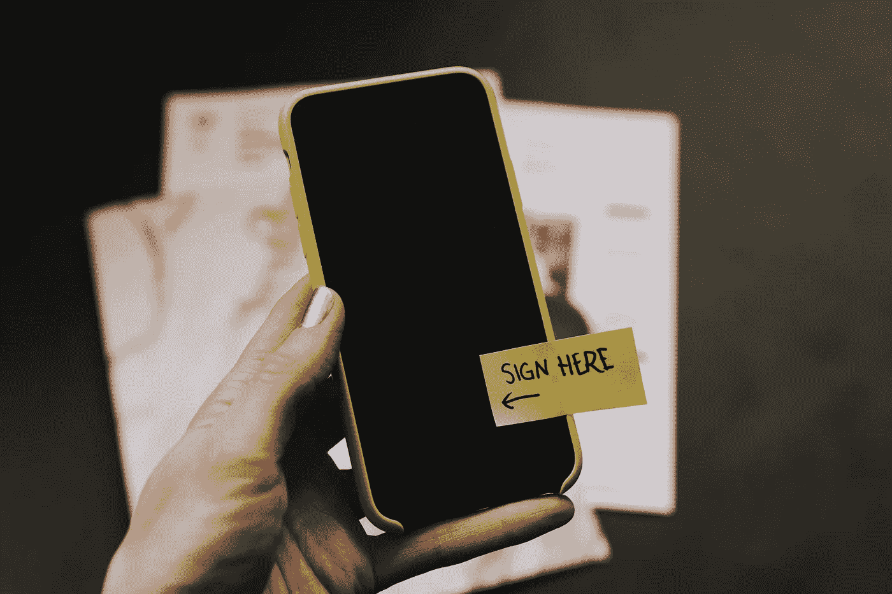
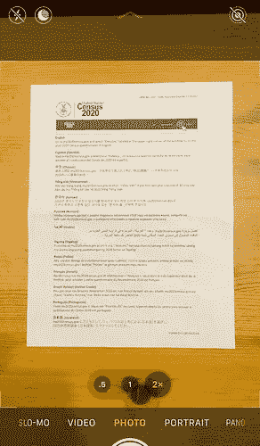
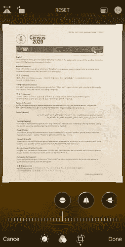
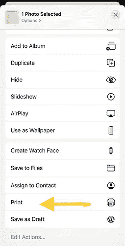
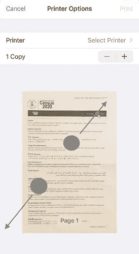
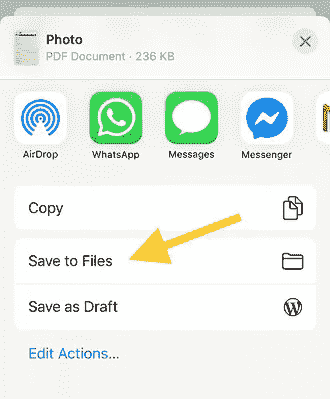
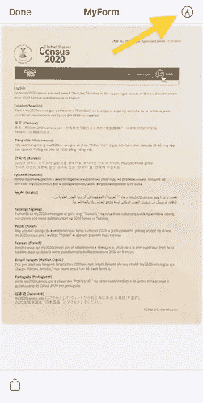
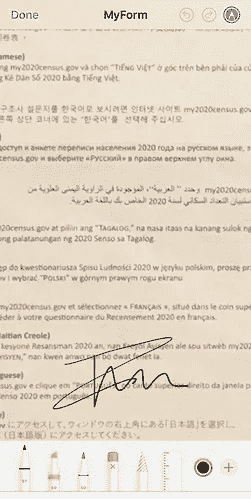
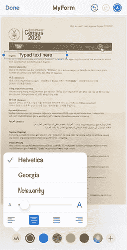

# 如何只用手机签署文件

> 原文：<https://medium.datadriveninvestor.com/how-to-sign-documents-with-just-your-phone-e467bd09abfc?source=collection_archive---------31----------------------->

你曾经需要在文件上签名并通过电子邮件发送吗？不，你不需要打印机或扫描仪。你知道吗，只用你的 iPhone 就可以免费做到这一点。请继续阅读，了解如何操作。

冠状病毒新冠肺炎造成的健康危机正迫使世界各地的人们呆在家里，练习物理距离；商店和企业正在关闭，以防止病毒扩散。这也意味着可以打印文件的地方更少了，而且我们很多人家里都没有打印机或扫描仪。当我们需要签署文件并通过电子邮件发送时，我们可以做什么？这个指南应该可以帮助任何使用 iOS 设备的人扫描和签署他们的文档和表格。

 [## 人工智能和监督资本主义|数据驱动的投资者

### 大科技，总是现在:人工智能推动的大科技，已经使购物，搜索，在你的…

www.datadriveninvestor.com](https://www.datadriveninvestor.com/2020/03/04/on-artificial-intelligence-and-surveillance-capitalism/) 

**第一步。为您的文档拍照**

如果您的文档已经是 PDF 格式，您可以跳过这一步，直接跳到步骤 3。

第一步是将你的文档转换成数字格式。你可以从任何手机或平板电脑上免费完成。你可以通过下载一个免费的应用程序来简化这个过程；有数十款免费应用可供选择。例如，如果你不介意看广告，你可以使用 [iOS](https://apps.apple.com/us/app/scanner-app-pdf-document-scan/id1040093707) 上的扫描仪应用。所有这些应用程序都以类似的方式工作:你用你的设备给文档拍照，然后应用程序自动检测物理文档的边界，并用它创建一个 PDF 文件。

如果你不信任任何可用的免费应用程序，你仍然可以用 iOS 本身来做这件事。首先用相机应用程序给文档拍照:

打开照片应用程序，进入图片的“编辑”模式。修剪边框以删除文档之外的任何内容:

一旦图片只包含居中的文档，您就可以“打印”它了。

**第二步。将您的图片转换或“打印”成 PDF 文档**

在照片应用中，点击“分享”按钮。向下滚动，直到看到“打印”选项。这些说明将帮助您创建您在屏幕上看到的任何内容的 PDF 版本。

在“打印”对话框中，在您想要打印的内容上做挤压手势，就像您想要放大文档一样(这将向您显示文档的全屏视图):

此时，您在全屏视图中看到的已经是一个 PDF 文档。现在你只需要拯救它。右上角将显示一个新的“分享”按钮。点击它并选择您想要存储 PDF 文件的位置。我将使用文件应用程序:

您刚刚保存了文档的 PDF 版本！这个技巧在你看到“打印”选项的任何时候都有效，这个选项总是可以从“共享”菜单中找到。例如，您可以从 Safari 创建 PDF 版本的网站，或者从 Word 应用程序创建 PDF 版本的. doc 文件。

**第三步。添加数字文本并签署您的 PDF 文档**

苹果的 App Store 上有付费应用，允许你修改 PDF 文件，但当然，你也可以免费对 PDF 进行一些基本的编辑，使用 iOS 本身。

例如，从“文件”应用程序中，打开您的 PDF 文件并进入“标记”模式:

然后只需放大，用手指在需要的地方画出您的签名:

如果您愿意，也可以添加数字文本:

**第四步。发送您签署的文件**

编辑完文档后，您可以点击“完成”。您现在可以通过电子邮件与请求您签名的人共享您签名的 PDF 了。

抱歉，印刷商，你可能很快就会失业。

**你喜欢这篇文章吗？** [**订阅**](https://geekonrecord.com/subscribe/) **通过邮件获取新帖。**

*原载于 2020 年 3 月 30 日 geekonrecord.com***。**

*凯利·西克玛在 [Unsplash](https://unsplash.com/s/photos/signature?utm_source=unsplash&utm_medium=referral&utm_content=creditCopyText) 上拍摄的照片*