# 如何模拟和排除医学成像传输故障

> 原文：<https://medium.datadriveninvestor.com/how-to-simulate-and-troubleshoot-medical-imaging-transfers-8f328de80c03?source=collection_archive---------2----------------------->

## 了解如何使用 DICOM 图像传输部署和模拟 PACS 系统，故障排除，并了解每种设备的安全含义。

在本教程中，我们将介绍如何结合使用免费和开源工具来设置和部署一个基于客户端-服务器的小型医学成像网络。此外，我们将对这类系统之间一些常见的互操作性问题进行故障排除；并且还为健康信息技术( [HIT](https://www.hhs.gov/hipaa/for-professionals/special-topics/health-information-technology/index.html) )专业人士提供建议。

完成本文后，您应该能够:

*   对常见的医学影像协议
    和标准有基本的了解
*   能够利用该标准部署两种不同的客户端/服务器供应商软件

*   对两个供应商之间的基本网络和配置支持需求
    进行故障排除
*   了解这些系统的[安全含义](https://cyber.findings.co/click.track?CID=431076&AFID=470105&ADID=2431672&SID=WD)和所需的补偿控制

# 医学成像系统 101

作为一名安全专业人员和前渗透测试人员；我一直困惑于我是如何能够如此轻易地损害许多内部医疗成像相关系统的。当我向必须部署和管理这些系统的管理员展示重要发现时；你可以看到他们脸上绝望的表情。这与典型的 Windows 系统管理员大不相同，后者可能只是以一劳永逸的方式推送额外的补丁或 GPO 配置。

那么，为什么医疗成像系统比典型的 IT 企业系统更难管理呢？首先，我们需要了解成像组件的两个关键部分。在行业中，医疗保健支持技术的专业技术人员将这些类型的技术集合称为图片归档和通信系统( [PACS](https://www.nccoe.nist.gov/sites/default/files/library/sp1800/hit-pacs-nist-sp1800-24-draft.pdf) )。

这些类型的网络专用于不同的系统和组件，称为上传、编辑、保存和传输医学特定图像的设备。作为文件对象和协议规范的最常见成像标准称为:医学数字成像和通信( [DICOM](http://dicom.nema.org/medical/dicom/current/output/html/part01.html) )。

许多不得不在 PACS 网络上使用 DICOM 标准的 HIT 管理员遇到了互操作性问题，这主要是因为不同供应商部署 DICOM 标准的方式、支持的 DICOM 版本以及支持的采集[设备类型](http://dicom.nema.org/medical/dicom/current/output/chtml/part16/sect_CID_29.html)存在差异。这三个不同之处意味着，要使 PACS 组件能够正确地相互“对话”;它通常是系统架构和安全性的最佳实践的折衷，我们很快就会看到。

在较小程度上支持发行；在每个图像周围支持的元数据中也存在潜在的问题，这些图像组合在一起成为一个完整的患者记录；两个常见的标准是 [HL7 和 FHIR](https://healthstandards.com/blog/2013/03/26/hl7-fhir/) 。元数据标准超出了本教程的范围。

# 为实验室安装软件

让我们开始我们的第一个服务器/客户机部署设置。出于本实验的目的，我将使用相同的本地主机。然而，这些可以很容易地放在不同的容器上，或者直接部署在网络上的不同系统上。我们将使用不冲突的端口，这样您就可以跟着做了。我们将首先下载并安装[或传统服务器](https://www.orthanc-server.com/)，使用默认的向导设置来包含所有支持的插件。

Orthanc Server 是一个为医疗专业人员和研究人员开发的开源平台，它提供了一个一体化的 DICOM 兼容服务器和客户端。它还拥有插件和 REST API 以及使用用户名/密码认证和 TLS 来保护服务器本身的能力。要在生产网络中部署它，请先通读他们的[文档](https://www.orthanc-server.com/static.php?page=documentation)。

docker、Linux 和 Windows 编译的二进制文件的安装步骤有所不同。在写这篇文章的时候，我已经把我的例子安装在 64 位的 Windows 10 上了。

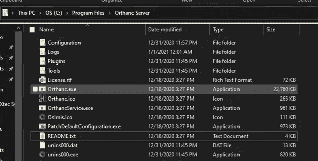

Orthanc Server Install Directory

如果安装正确，您应该能够导航到服务器目录。在 windows 中，这是默认位置:“C:\ Program Files \ or ANC Server”。有一个“README.txt”文件，您可以打开它来了解有关您的安装的更多信息，您将找到可以使用浏览器导航到的主机和端口号。默认为 HTTP 不安全:"[HTTP://127 . 0 . 0 . 1:8042/app/explorer . html](http://127.0.0.1:8042/app/explorer.html)"

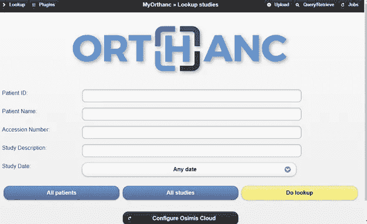

Orthanc Explorer Home Page

让我们保留该部署，并使用我们的第二个客户机/服务器来处理与的图像交换。这次我们将使用一个叫做[的工具 on Viewer 2.5](http://www.onis-viewer.com/ProductInfo.aspx?id=19)(免费版)。出于实验目的，也在同一台主机上下载并安装该软件。或者，如果您愿意，也可以将其放在不同的主机上。记住以后要更改 IP 地址设置。

我们使用 ONIS 来模拟一个完全不同的供应商，作为我们 PACS 的一部分，以模拟根据功能文档“应该”与 exchanges images 和 Orthanc 软件套件完全互操作的内容。我不会在此一一列举，但我们将在本实验室测试的 DICOM 相关特性至关重要:

> 从任何设备读取和显示所有 DICOM 文件
> 
> 按需功能(可以直接从 DICOM
> 服务器、CD 或文件夹中打开 DICOM 文件，而无需先下载到本地
> 数据库中)
> 
> 支持 DICOM 网络服务(C-查找 SCU，C-获取 SCU，C-移动 SCU，
> C-存储 SCP/SCU)

成功的安装应该显示如下所示的窗口；请暂时忽略患者条目。这些是导入的示例，稍后将在我们的实验室测试中使用。

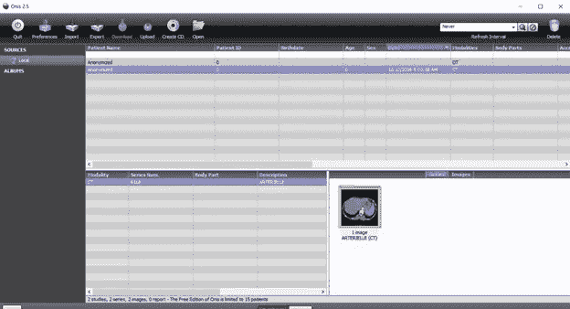

Onis 2.5 Free Edition Home Screen

最后，我们将安装使用 npcap 库安装的 [Wireshark](https://www.wireshark.org/download.html) ，而*将需要重启*。使用向导中的默认设置。如果您使用较旧的 wireshark 或已安装，它将默认使用 winpcap 或 libpcap，具体取决于您的操作系统和预安装的打包版本。成功安装后，如果您打开 Wireshark，您应该会看到您主机的一个或多个适配器。我们将关注“环回”适配器，如下图所示:

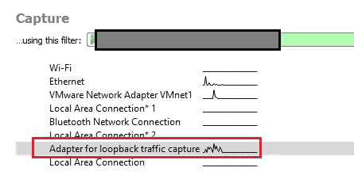

Ensure that your Wireshark has a Loopback Traffic Adapter

# 配置 PACS 通信

现在是时候记下我们对 Orthanc 和 Onis 的配置了。我们将从 Orthanc 开始，因为我们首先安装了它。导航到服务器目录并检查“配置”文件夹。在 windows 中，这是:C:\ Program Files \ or ANC Server \ Configuration。制作 ortanc.json 的备份，并将备份重命名为类似 ortanc.json.bak 的名称，如下所示:

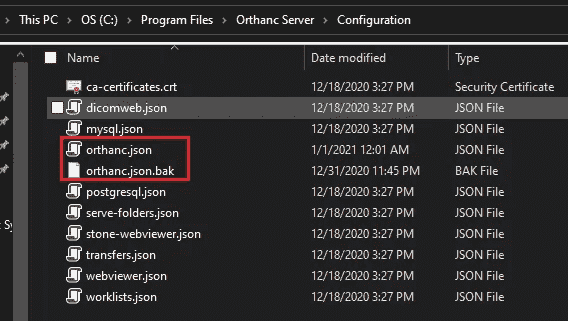

Make a backup of the config JSON file first

使用您喜欢的文本编辑器，继续编辑 orthanc.json 原始文件。我使用的是 [notepad++](https://notepad-plus-plus.org/downloads/) ，它默认给出了 JSON 格式的颜色解释。在 Orthanc 服务器上，您可以配置许多有趣的选项。现在忽略它们，让我们专注于配置与另一个 DICOM 服务器/客户端设备的通信；也就是 Onis 2.5。向下滚动并注意“DICOM 服务器配置”部分下的 DICOM AET 字符串名称和端口设置:

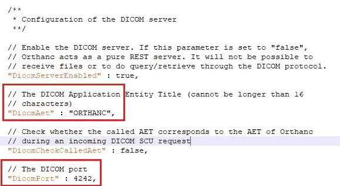

Note the peer connection name and port

您看到的字符串“ORTHANC”相当于常规网络监控管理中的 SNMP [社区名称字符串](https://www.dnsstuff.com/snmp-community-string)；在 PACS 世界中，这被称为应用实体标题( [AET](http://dicom.nema.org/medical/dicom/2014c/output/chtml/part02/sect_A.3.4.html) )。端口是服务器端口，Ortanc 主机正在侦听入站“推送”连接，例如存储和查询数据。请记下这些信息，因为我们以后还会用到它们。

*让 orthanc.json 文件保持打开状态*在 2.5 上继续打开。导航至首选项模块。正如你所看到的，这个软件也是一个客户端/服务器，只是支持不同的功能。单击“DICOM 服务器”选项卡，记下网络 AET、IP 和端口信息。PDU 大小没问题，因为它是大多数 PACS 交换大小的常见默认值。

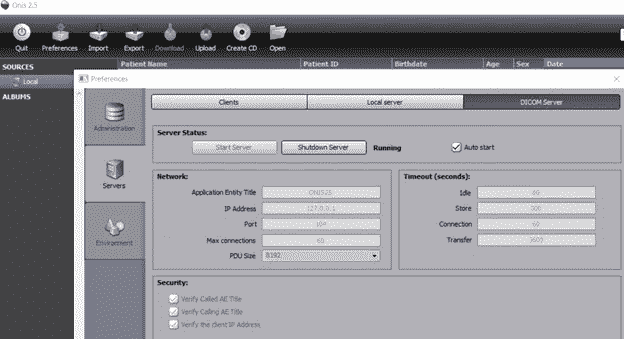

Note the Onis server connection name and port

现在我们知道了两个端点服务器端的监听信息，让我们继续将它们“对等”在一起。在 Onis 2.5 中，单击“Clients”选项卡，并使用之前看到的奥桑克 AET 详细信息添加一个新名称。请注意，由于我们在同一台主机上进行实验，因此我们使用的是环回 IP 地址“127.0.0.1”。

如果您在不同的主机上安装这两个解决方案，请用正确的地址信息替换它。在 ORTHANC 中输入 AET 信息。您可以选择将 CSTORE 留空或添加一个标题。记得将端口更改为“4242 ”,因为这是默认端口或 anc 正在侦听的端口。请注意，在生产环境中，许多 PACS 系统已经在 tcp 端口 104 上进行了转换。

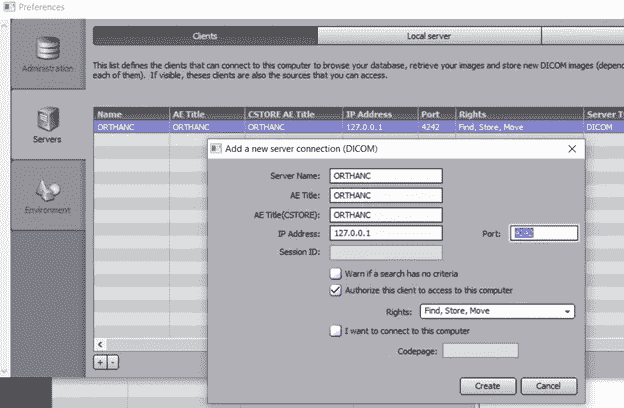

Add Orthanc as a client peer to Onis under the clients tab

创建您的客户端，然后返回到“DICOM 服务器”选项卡，关闭并再次启动服务器，以确保配置更改已加载到内存中，以防万一:

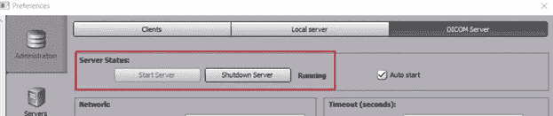

Restart the Onis DICOM Server

让我们返回 othanc.json，向下滚动到“DicomModalities”部分，将 Onis 2.5 添加为我们的对等项。请记住，之前的字符串“ONIS25”被用作 tcp 端口 104 上的服务器 AET。在一行中添加对等配置，如下图所示:

> " ONIS25" : [ "ONIS25 "，" 127.0.0.1 "，104 ]

请务必注意配置文件中的意图和间距:

Set the Onis peer connection details

保存 orthanc.json 并重新启动 orthanc 服务。在 windows 中，这位于“开始”、“运行”、“服务”. msc 管理单元下:

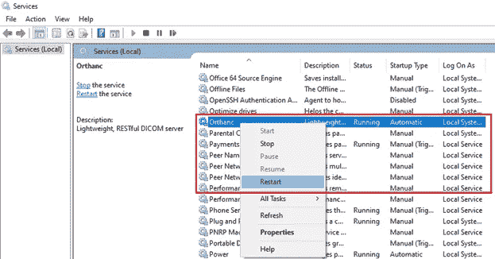

Restart the Orthanc service after saving the JSON config file

作为最终配置组件；让我们打开 Wireshark 嗅探器和适当的捕获过滤器，只捕获这两个本地应用程序之间的流量。为此，在捕获部分设置以下过滤器:

> tcp 端口 104 或 tcp 端口 4242

现在选择或突出显示“回送流量捕获适配器”如果您看不到这一点，这意味着您的安装不包括启用环回的适配器。选择与您的监听服务相对应的本地以太网适配器。或者，使用适当的组件重新安装 wireshark。

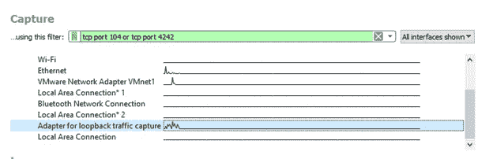

Add the filter to the wireshark capture screen

现在导航到 Wireshark 应用程序的左上方，单击蓝鲨图标。它现在将开始将数据包捕获到临时假脱机中:

Start the capture

让我们通过 DICOM 协议在这两个 PACS 端点之间发出“ [C-Echo](https://book.orthanc-server.com/dicom-guide.html#c-echo-testing-connectivity) ”来测试连通性。这相当于在常规网络测试中运行“ [ping](https://www.howtogeek.com/howto/windows-vista/allow-pings-icmp-echo-request-through-your-windows-vista-firewall/) ”。回到 Orthanc explorer 窗口并刷新页面。如果你关闭了它，这是链接

> http://127 . 0 . 0 . 1:8042/app/explorer . html

现在，点击右上角的查询/检索:

Begin a query retrieve job against Onis

通过点击不同的选项进行导航，或者保留默认值。点击“测试回声”

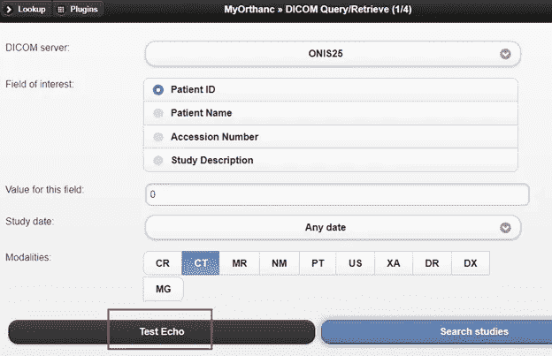

Perform a peer connection test between the modalities

您应该会在 Wireshark 中收到一条成功消息和一个新的 TCP 流，如下所示:

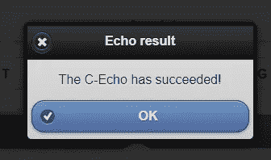

A successful DICOM connection based on AET strings

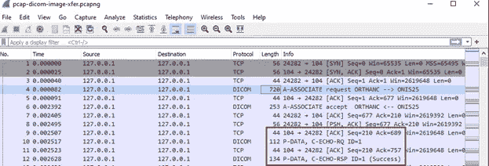

Packet capture validation of the successful peer connection test

# 模拟图像传输

是时候开始我们的测试用例了。因为这些不是图像采集模式；只有 DICOM 客户端和服务器。我们将需要获取一些去标识的公共样本数据，以摄取到我们的一个端点进行传输。让我们从 dicomlibrary.com[下载 2 个样本文件](https://www.dicomlibrary.com/)，一个是模态“OT”类型，是“其他”的缩写，另一个是“CT”，是“计算机断层扫描”的缩写。

下载以下内容:

[CT 设备匿名的文件 1](https://www.dicomlibrary.com?requestType=WADO&studyUID=1.2.826.0.1.3680043.8.1055.1.20111102150758591.92402465.76095170&manage=1b9baeb16d2aeba13bed71045df1bc65&token=a915dc65c126e7c152e35f5e209fc7e6)

[用于 OT 设备匿名化的文件 2](https://www.dicomlibrary.com?requestType=WADO&studyUID=1.2.826.0.1.3680043.8.1055.1.20111103112244831.40200514.30965937&manage=feb6447a72c9a0a31e1bb4459e547964&token=74820de0bc791c79af946968ef09dea0)

注意:如果在撰写本文之后链接失败或改变，请直接访问 dicomlibrary.com 链接，从他们的公共库中找到两个相同的样本。

将文件解压缩到一个暂存位置，并在我们测试用例的过程中注意哪个文件是哪个文件。

对于我们的第一个测试案例，让我们通过单击 import 按钮，并为每个研究选择目录或文件，将两个文件都导入到 Onis 2.5 中。请注意，患者姓名是“匿名的”，这是两者的标准字符串，ID 设置为“0”。如果您选择将图像放在不同的患者档案下，Onis 免费版将限制您使用 15 个唯一的患者 ID。观察新的元数据和与设备相关的系列或图像。您也可以选择在他们的胖客户端查看它们。

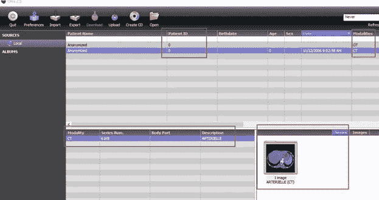

Import the sample DICOM images to Onis locally

要在查看器中查看图像，请双击右下角的图标:

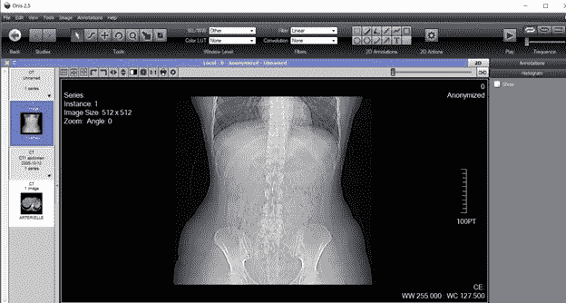

Viewer mode in Onis of one of the DICOM images

现在，您可以根据自己的意愿进行更改，或者添加注释或其他项目，就像您是一名放射科医师或其他医学专业人员一样。让我们通过将这个映像推送到 Orthanc 服务器端点来启动我们的第一个文件传输。完成所需的任何更改后，单击文件、导入，然后选择“或”。

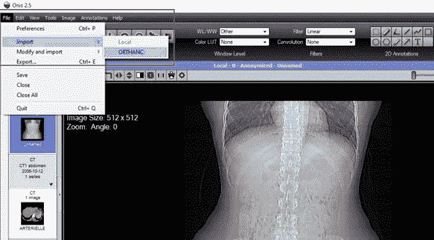

Push the DICOM image to the Orthanc Server modality

您可能还希望更改与该患者健康记录相关的一些元数据。完成后，点击“复制到”:

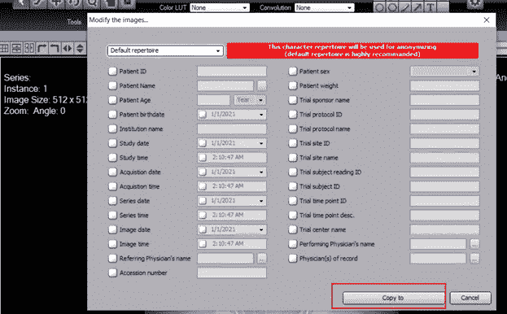

Modify the DICOM image if you desire before pushing to Orthanc

现在，观察 Wireshark 已经创建了一个新的 TCP 流，并且正在通过 C-STORE 协议命令 initiated 传输数据。Wireshark 尽最大努力解码 DICOM 格式的有效载荷，并解析报头和适当的协议细节。欲了解更多关于 DICOM 网络级分析的信息，请点击 [NIH 参考](https://www.ncbi.nlm.nih.gov/pmc/articles/PMC61235/)，了解更多关于 C-methods 和 PDU 架构的细节。观察字段中不同的元数据和网络级成功的图像上传，显示为“C-STORE-RSP ID=5”状态退出代码 0x00 作为回复。随后是 FIN-ACK 的 TCP 流拆除。

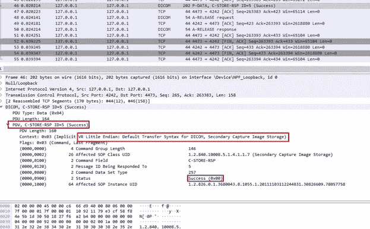

Packet capture example of a successful image transfer from Onis to Orthanc

从网络取证的角度来看；Wireshark 还有一个内置的解剖器，可以将 DICOM 图像切割成其原生的 DCS 文件扩展名格式。它并不完美；尤其是当存在网络延迟、错误或数据包丢失时，因为这会影响 DICOM 图像的完整性。尽管如此，它在 Wireshark 的更高版本中还是很可靠的。为此，在菜单中选择文件、导出对象和 DICOM:

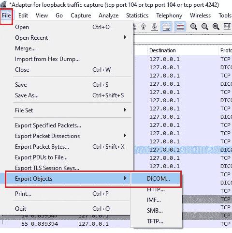

Forensically extract DICOM images out of a packet capture

现在，您可以选择每个图像的流，然后单击“保存”保存 DCM 文件，并在任何您喜欢的本地查看器中打开它:

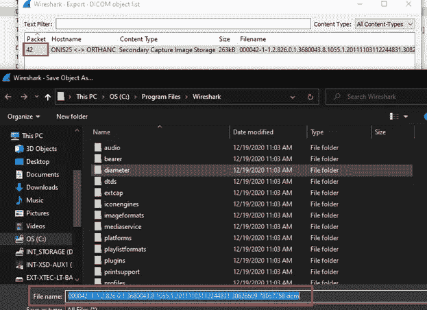

Save the DICOM image locally from the Wireshark packet capture

这是查看是否有重大网络问题或其他应用程序特定问题导致 PACS 端点之间的 DICOM 图像损坏的好方法。

 [## 提高网络安全的最低成本和最有效途径|数据驱动型投资者

### 在组织在 2020 年面临的诸多挑战中，网络安全(或缺乏网络安全)已成为新闻报道的焦点…

www.datadriveninvestor.com](https://www.datadriveninvestor.com/2020/09/04/the-lowest-cost-most-effective-path-to-better-cybersecurity/) 

要在 Orthanc 中观察图像上传，请导航回浏览器主页。或者点击左上方的“查找”。现在将患者 ID 设置为“0 ”,并单击“执行查找”或单击“所有患者”。执行“执行查找”将显示上传到患者的所有文件:

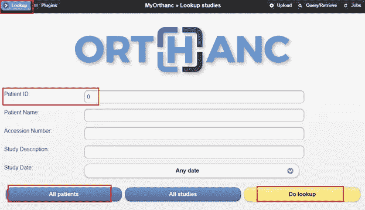

Search for patient records inside Orthanc

*注意:执行“所有患者”将仅加载每个患者的结果并显示文件数。在这里，我按患者“0”进行了查找，您会注意到两个不同的条目。这是因为出于本实验的目的，我从 Onis 上传了 CT 和 OT 设备图像文件。*

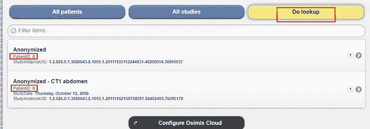

A ‘do lookup’ click will show unique files per study ID for the specified patient number

点击你上传的腹部 CT 图像。您将导航至患者的病历报告，其中包含变更中的元数据以及样本 DCS 文件中的原始信息。这个系列看起来像你在 PCAP 看到的吗？这应该是因为虽然这不是我们在图像中显示的相同的 UID。它是一个特定于患者、研究和其他层次结构的标识符，DICOM 协议利用它来匹配哪个图像部分或系列属于谁。

在该窗口中，您可以选择使用 Orthanc 自己的 DICOM 查看器，并对其界面中的数据进行编辑，或者如果您是开发人员，可以使用其 REST API。现在，让我们尝试将这个更新的图像*传输回*到 Onis 2.5 来更新它的本地索引:

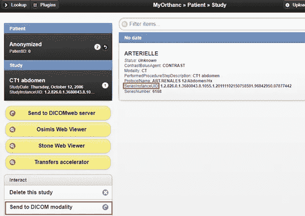

Attempt to push DICOM image back to Onis from Orthanc

单击“发送到 DICOM 设备”,您应该会看到一个弹出窗口，将我们唯一的对等目标指向 ONIS25:

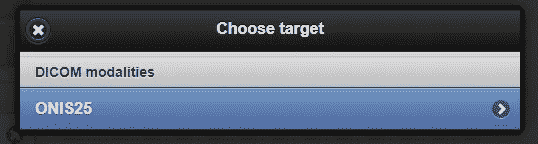

Execute the send DICOM image transfer job to Onis

您现在应该会收到一条错误消息:

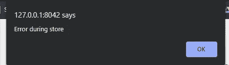

An expected error attempting to push to Onis

检查 PCAP 数据，您现在应该看到对 on 上的 tcp 端口 104 的“C-STORE”尝试。现在，响应显示状态错误代码 0cx001，Wireshark 将其解释为 Onis 2.5 上的端点由于某种原因无法理解或处理，后面是映像名称的 UID:

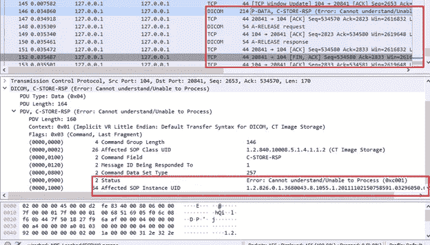

Packet capture troubleshooting the DICOM transfer

而从网络层面来看，这有助于确定问题是*而不是*网络；这并不能帮助我们排除 PACS 终端应用层的故障。此外，图像仍然以明文形式通过电线传送。如果你做另一个文件导出对象；您将能够看到 DCS 文件，就像传输成功一样！

让我们检查 Onis 2.5，看看日志中是否有什么。正如我们所看到的，这里没有任何东西可以从这个端点帮助我们诊断我们的问题。要查看此信息，请单击首选项、管理，然后单击日志选项卡以了解更多详细信息:

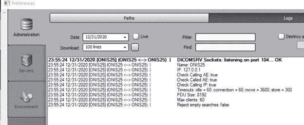

Onis log file does not provide much verbosity of the failure

为了完整的测试；我们知道连接对等是单向的。我们能不能至少查询一下 Onis 索引中的病人数据？毕竟，我们首先在这里存储了这两个文件。导航回 Orthanc 并单击查询/检索。将患者 ID 设置为 0，选择“ct”记录设备类型，然后单击“搜索病历报告”:

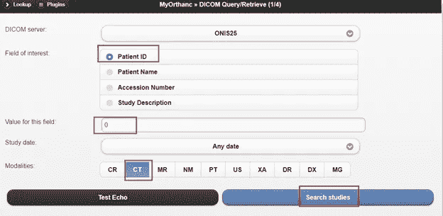

Try a different method to get files from Onis instead

现在，在执行简单查询(C-Find)时，您应该会收到一个错误，请注意，wireshark 捕获显示了更多关于 UID 的上下文，请求的详细信息如下。然而，pcap 在状态命令中变得更加无用。我们知道调用者请求了什么，但是没有 C 响应，只有 AET 连接级别的关联对等接受:

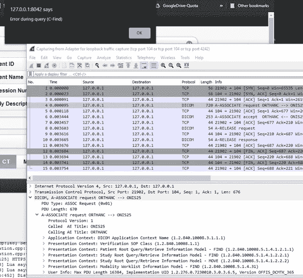

Error persists connecting to Onis for patient identifiers with packet capture

为了更好地进行诊断，请转到 Orthanc 服务器文件夹目录并打开最新的日志文件。请记住，每次运行服务时，至少会有两个日志。您可以在 windows 中的“C:\ Program Files \ or ANC Server \ Logs”下找到这些日志。滚动到底部，它将声明查询不支持 C-Find 命令，也不支持 store 命令。这两者都在 Onis 目标服务器上，尽管公布了特性集；Orthanc 似乎说不出 Onis 能接受的 DICOM 的适当实现:

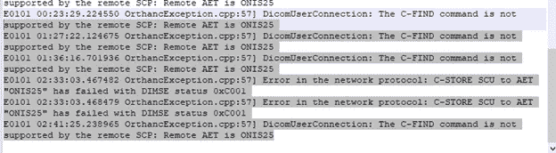

Log file from Orthanc showing Onis does not accept or understand its C-FIND/STORE methods implementation of DICOM

根本原因可能是一个或多个问题；但至少在我们的基础设施中没有。很明显，C-FIND 和 C-STORE 命令应该是相同的，这在 Onis 2.5 免费版中有记录，正如我们从模态之间的通信对话中看到的那样。

# 高级故障排除和解决方法

接下来的步骤是通过修改 Orthanc 配置文件来尝试利用 C-GET 的修改，我们将不会在本教程中介绍这一点。这样做的信息可以在[这里](https://book.orthanc-server.com/dicom-guide.html#c-echo-testing-connectivity)找到。

或者，Orthanc 的参数在运行时内置了补丁或行为修饰符，特别是在 C-FIND 重用中。在 orthanc.json 文件中，您可以在“DicomModalities”下找到它。您还可以尝试对 Onis 强制执行修补的行为，看看会发生什么。这本质上是它自己内置的挂钩机制。

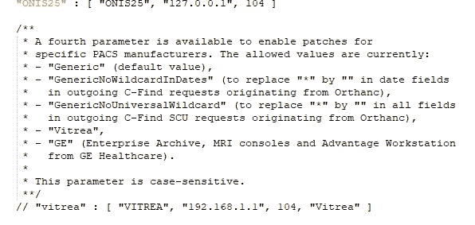

Use Orthanc’s built in function hooking patches to modify the C-method behavior

另一个解决方案可能是使用动态工具在二进制级别使用定制挂钩。PACS 专家或工程师必须审查 DICOM 客户端或服务器的相关 C-method 库的任何公开记录的 API，并在适当时制作适当的参数函数入口或出口挂钩。完成这项工作的一个工具是[弗里达](https://frida.re/)。这是一项非常高级的要求，通常由不再提供支持的传统供应商完成。

# 安全考虑

我多次看到医疗 IT 专业人员禁用安全验证来试图隔离问题，例如 AET 验证和源 IP 验证。我强烈反对这种做法，因为它会给安全威胁带来更大的问题。例如，如果我在源 IP 验证访问控制列表上禁用了，如下图所示；从攻击者的角度来看，你认为会发生什么？

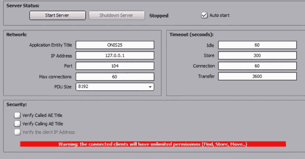

Security turned off for Onis DICOM server

如果您的答案是肯定的，那么任何可以在网络级别访问该 IP 和端口组合的人都可以— *操纵患者记录、文件，甚至完全删除记录*。你的猜测是正确的。最起码，需要实施和维护所有的访问控制。如果您的设备不支持这一点，您将需要在操作系统或网络级别抽象更高的安全性来帮助保护这一点。

除了确保您使用所有内置的粒度控制，而不管 PACS 设备端点如何；您应该考虑通过 TLS 连接隧道包装所有 DICOM 图像传输。作为一名前医疗安全工程师；我见过许多设备不支持加密，或者只支持传统的 TLS v1.0 或 SSLv3。要解决这个问题，您需要使用一个[本地端口重定向器](https://nmap.org/ncat/guide/ncat-tricks.html)包装每个端点连接。

“ [ncat](https://nmap.org/ncat/guide/ncat-ssl.html) 的最新 nmap 包支持内置的动态生成的 SSL 证书，您可以使用该证书来保护 DICOM 连接免受网络上的被动嗅探和潜在的主动中间人攻击。这不仅对于加密特别有用，而且作为 TCP 端口代理也特别有用，因为一些模式具有不能改变的硬编码端口号，例如 TCP 端口 104。使用 ncat 终止您的连接可能有助于在每个设备上完成额外的配置步骤，以满足多种用例或工程部署需求。

# 关闭

我希望您喜欢我们对 PACS 和 DICOM 模式的简要介绍。我们部署了两个免费且受欢迎的解决方案，以了解它们在沟通方面有哪些现成的限制。我们还检查了数据包跟踪的网络取证工件、完整性和认证安全问题。当然，对于典型的 PACS 管理员来说，我们也经历了尽可能多的实际故障排除。一如既往，如果您有任何网络安全需求，请随时拨打[www.scisecurity.com](http://www.scisecurity.com)联系我。

获得专家视图— [**订阅 DDI 英特尔**](https://datadriveninvestor.com/ddi-intel)