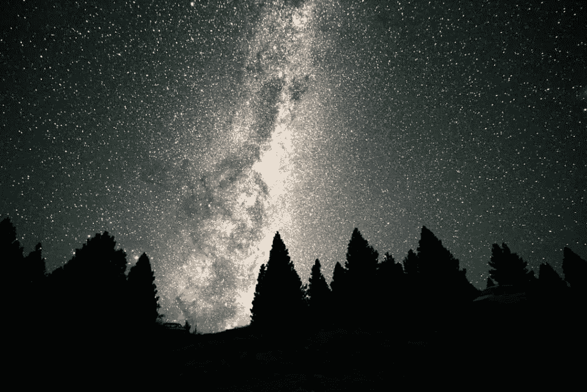
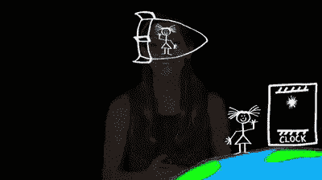
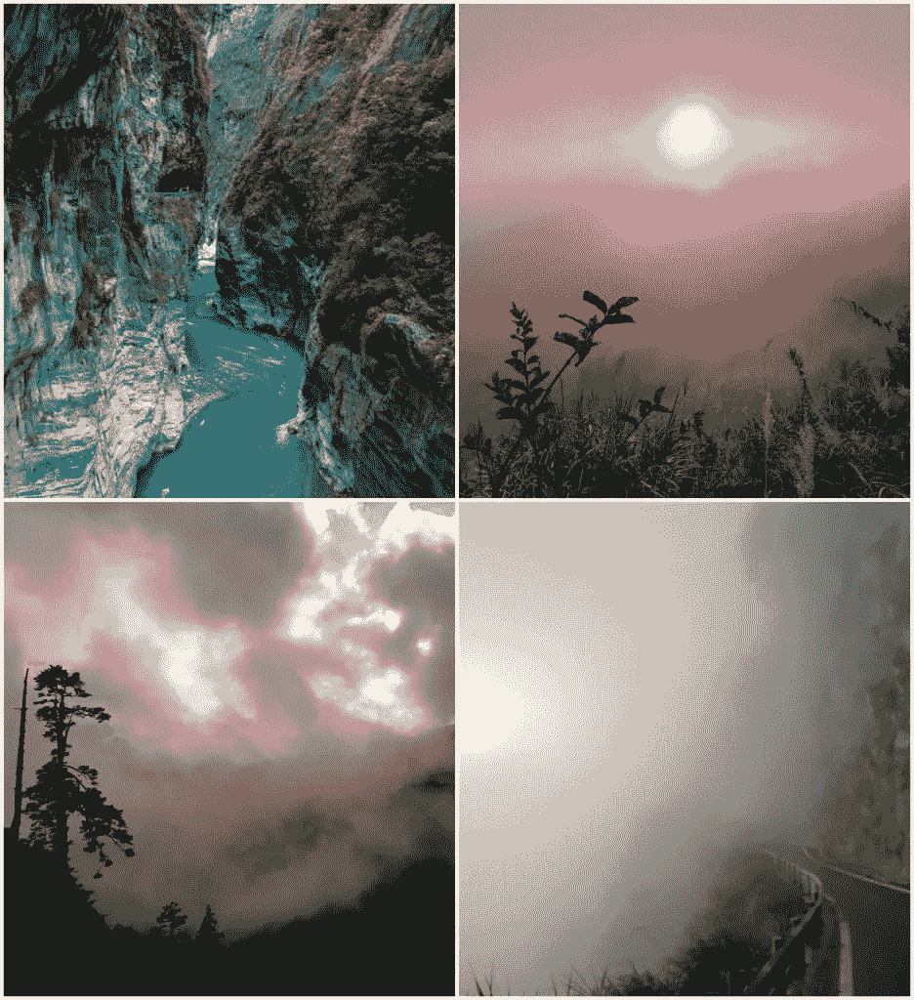
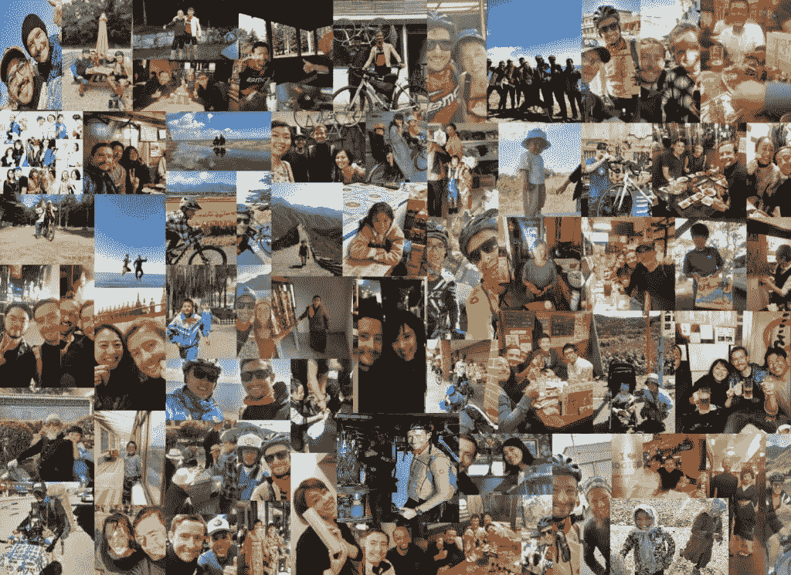
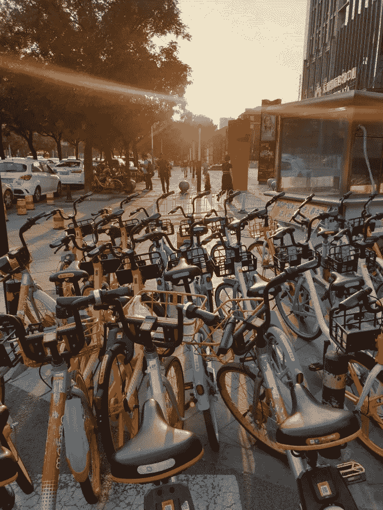

# 如何让时间慢下来

> 原文：<https://medium.datadriveninvestor.com/how-to-slow-down-time-by-investing-b112f96bb1d7?source=collection_archive---------32----------------------->

“你最大的骑行体验是什么？”，是我经常被问到的问题。也许是最短的。原因如下。

在印度尼西亚的努沙半岛，我们坐在其中一栋高层别墅的露台上喝茶。我们喝了一些伏特加(在穆斯林国家不容易买到)来杀死胃里的一些小虫，这是我们在沙滩上吃的芒果中发现的。

**和我的日本朋友的谈话变成了为什么我们旅行的时候时间慢了这么多。**

传统观点认为，鉴于我年龄较大，她的时间应该比我慢。但 2019 年是我人生中最漫长的一年。也许比在伦敦的几年还要长。现在，我知道 2020 年也是最短的一年。

**随着年龄的增长，时间真的会加速吗？我不再确定了。**

我想通过三个骑自行车的人来分享我们对时间的看法——车轮上的银行家、他的世界骑自行车者朋友和一位成为纽约时报畅销书作家的骑自行车者。

# 时间是你自己创造的

时间是一个迷人的主题，我理解它的第一步是从物理学开始的。

当你旅行时，时间变慢了。与呆在办公室里的银行家相比，骑自行车的人确实如此。

我们都听说过，根据[双胞胎悖论](https://en.wikipedia.org/wiki/Twin_paradox#:~:text=In%20physics%2C%20the%20twin%20paradox,on%20Earth%20has%20aged%20more.)，**旅行中的双胞胎会比留在地球上的那个更年轻，**当他们再次相遇时。

虽然结果已经得到证实，但这只是故事的一半。我发现直观理解这一理论中的不对称性很有意思。

因为在爱因斯坦的狭义相对论中,**地球上的双胞胎观察到他的时间相对于宇宙飞船中的双胞胎慢了下来也是同样的道理。两者怎么可能同时为真，*？***

*这需要 Coursera 的课程来理解其中的细微差别——感谢这个迷人的旅程，拉里。如果你很好奇，不需要进入太复杂的数学领域，在你提前退休的时候有空闲时间，这绝对是你“遗愿清单”上的一件事。如果你想要一个快速的版本，这里有一个 5 分钟的视频(虽然我发现没有使用广义相对论的视频优雅)*

> *和一个漂亮的女孩坐在一起一个小时感觉像一分钟；在热炉子上坐一分钟，感觉像很多小时。这就是相对论*
> 
> **——阿尔伯特·爱因斯坦**

# *超越物理——时间在你的大脑中变慢*

*然而，这种不对称远远超出了物理学的范畴。*

*在我的自行车旅行中，我花了很长时间才意识到这一点。*

*但是我们都目睹了这种现象——为什么我们记得假期比实际时间长得多，但是当我们实际在那里的时候却感觉假期过得很快呢？*

*为什么我们会记得发生事故时播放的**音乐的歌词？***

# *最长的一天*

*回顾我在自行车上的一些经历，似乎经历了漫长的时间。然而，这一切发生得太快了。*

*甚至在 11 月的一天，我在凌晨 4 点前开始骑自行车，冒着小雨，穿过台湾太鲁阁国家公园。*

*这条路建于 20 世纪 50 年代，花费了 450 多条生命。即使在今天，它仍然被列为世界上最危险的道路之一。*

*我记得从海平面开始的早晨旅程的每一分钟。我听到**“飞石”，从大部分覆盖着大理石的垂直悬崖上掉下来，在 2000 米**(6500 英尺)以下几乎没有能见度。*

*这一天以我经历过的最好的日落结束，在云层之上，海拔超过 3200 米。*

*今天，感觉是我生命中最漫长的一天。当然是这次旅行中最长的一次，在这里发生了太多的事情。*

*这么多人。这么多经历。太多回忆了。*

**

# *怎样才能让时间慢下来？*

*两个不同的骑车人给了我两个深刻的教训。*

*第一篇来自一位自行车爱好者，纽约时报畅销书作家杰迪迪亚·詹金斯，他探究了为什么我们自行车爱好者会觉得我们的旅程比几年或相对“稳定”的生活要长得多、有价值得多。*

*第二个，来自我的一个朋友，他也有有趣的观察。所有骑自行车人都与我们遇到的人分享这些有意义的(但短暂的)互动的感觉。*

> *不是我们时间少，而是我们浪费了很多时间*
> 
> *小塞内卡*

# *#1 恐惧是它的核心*

*当面临危险或新的经历时，我们的大脑工作得更快——在自行车上，你很少知道我们会在哪里睡觉，我们会吃什么，我们会遇到什么样的天气状况。*

*我们适应并**承担预计的风险**。我们知道制定计划被大大高估了。这就是为什么骑自行车的人很少这样做。*

*在日本，我觉得在任何地方搭帐篷都相对安全。在塔斯马尼亚，你必须小心蜘蛛。在西藏，我根本不确定自己能不能睡着*(改天再说)**

*然而，**关于这一主题的学术研究得出的最有趣的结论是，当我们面对与我们个人价值层次和身份相关的经历时，时间会变慢。这是一个非常个人化的问题，与对抗我们的恐惧有关——做让我们紧张的事情。***

*或者，正如杰迪迪亚·詹金斯(在下面的视频中)所说:“知道你永远不会找到身份，总是发现并追求发现身份的可操作步骤，你会成为这些基础身份锚——这些记忆让时间感觉动态、丰富、真实”*

*关于如何放慢时间的必看的 15 分钟食谱*

# *#2 身份伪造遭遇*

*期望也能发挥作用。*

*当你骑自行车旅行时，你非常脆弱。人们欣赏这一点，但也知道我们的相遇是短暂的。这也是它们珍贵的原因。*

*事实上，双方都知道我们很可能再也见不到对方，这意味着话题变得更加深入和丰富。*

*引用一位花时间研究这个话题的自行车手朋友的话:*

*矛盾的是，对我来说，几个小时的邂逅，有时甚至更短，比回家和朋友闲聊几天更有意义。我开始了解人性。什么让我们相似，什么让我们文化不同*

**

*骑自行车的人通常珍惜时间，有时会不知不觉地遵循斯多葛派的原则，即整个未来都存在不确定性——立即生活并充分利用它。*

*我想起了一些可以说明这一点的经历，比如在新西兰遇到一位意大利自行车手，我们都知道我们的道路迟早会分开。有趣的是，一些这样的联系仍然存在。或许，是因为最初的期待。*

# *财务独立有什么帮助？*

# *记忆的复合价值*

*我们都有不同的天性，我们的生活环境也可能大不相同。*

*但是有些事情并不是相对的——随着年龄的增长，我们赋予记忆的价值越来越大。*

*我可能有偏见，但千禧一代重视体验胜过“物质”，这是正确的。腾出时间来捕捉它们，可以以相对较低的财务纪律成本为代价。*

# *财务独立意味着抗脆弱性*

*财务独立运动的核心价值观在两个方面与我的信念一致:*

*   *幸福，*高于可持续水平，*是与财富基本不相关。**花时间在重要的经历上并不像大多数人想的那样依赖金钱。***
*   *但是引用尼古拉斯·塔勒布的话来说，瞄准金融[抗脆弱性](https://fs.blog/2014/04/antifragile-a-definition/)，是帮助**抓住机遇的关键。***

# *明智的储蓄者*

*金融脆弱性是债务。我认为存钱是财务独立的核心——是明智的储蓄者，而不是聪明的投资者的运动。*

*到 2018 年底，我通过一个**恐惧环境，也就是** [斯多葛派的后悔-厌恶矩阵](https://bankeronwheels.com/9-investment-lessons-from-cycling-the-world/)，运行了我的骑行世界的想法。现在，我准备好环游世界了——由于各种各样的恐惧，这个决定我推迟了一段时间。*

*有了资金储备，我就能抓住机会(或者，完全诚实地说，至少从那个角度来看，精神上是安全的，因为这次旅行本身是我生命中最便宜的一年*

**

*生活给我们带来了挑战和机遇，而有时间从后者中获益需要有能力(也需要财务灵活性)来做到这一点。*

*经济独立意味着抵御(大多数)随机事件并从中受益。*

*识别对我们身份至关重要的经历是关键。围绕省钱和遵循正确原则的纪律也是如此，这将最终为重要的记忆创造更多机会。*

*投资通常会增加这些机会。*

## *祝你好运，继续前进！*

**(*车轮&分红)**