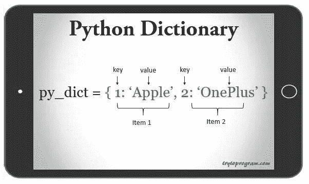
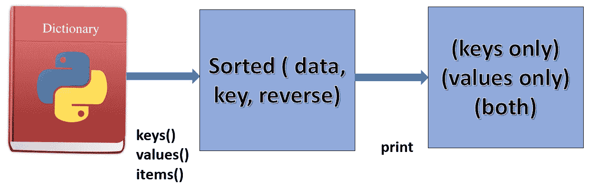

# Python 中如何按键和值对字典进行排序？

> 原文：<https://medium.datadriveninvestor.com/how-to-sort-a-dictionary-by-key-and-value-in-python-6358a8142c73?source=collection_archive---------0----------------------->

大家好。今天我将给出一些关于 Python (Python3)中字典排序的小技巧。众所周知，字典天生是无序的，但其他类型，如列表和元组则不是。对字典进行排序是不可能的，但是我们可以对排序后的字典进行表示。因此，您需要一个有序数据类型来表示排序的键或值，这将是一个列表—可能是一个元组列表。



Dictionary in Python ([Source](http://www.trytoprogram.com/images/python_dictionary.jpg))



Process of sorting dictionaries

正如我们在第一张图中看到的，python 中的字典是一组键-值对，其中每对键-值被称为一个条目。现在让我们关注主要问题:字典可以通过键或值来排序。正如第二张图中所描绘的，我们可以对字典中的`keys()`、`values()`和`items()` 进行排序。先重点按`values()`排序吧。

## 按值对字典排序

让我们有一个由几个知名组织组成的字典，如`keys()`，他们的成立年份为`values()`。因此，我们希望有一个排序的字典，其中最老的组织项目将是第一个元素，最年轻的组织将是最后一个元素。

```
d = {"Apple": 1976, "Microsoft":1975, "Facebook":2004, "Sony":1946, "IBM":1911, "Amazon": 1994 }
```

正如我们在字典 *d* 中看到的，IBM 是最古老的组织，因此它将是排序字典的第一个*关键字*，脸书将是最后一个。

```
print(sorted(d.items(), key = lambda kv:kv[1]))
print(sorted(d.items(), key = lambda kv:kv[1], reverse = True))
print(dict(sorted(d.items(), key = lambda kv:kv[1])))
sort_d = dict(sorted(d.items(), key = lambda kv:kv[1]))
print(sort_d)
```

**输出:**

```
[('IBM', 1911), ('Sony', 1946), ('Microsoft', 1975), ('Apple', 1976), ('Amazon', 1994), ('Facebook', 2004)]
[('Facebook', 2004), ('Amazon', 1994), ('Apple', 1976), ('Microsoft', 1975), ('Sony', 1946), ('IBM', 1911)]
{'IBM': 1911, 'Sony': 1946, 'Microsoft': 1975, 'Apple': 1976, 'Amazon': 1994, 'Facebook': 2004}
{'IBM': 1911, 'Sony': 1946, 'Microsoft': 1975, 'Apple': 1976, 'Amazon': 1994, 'Facebook': 2004}
```

因为我们正在排序`d.items()`，这是一个元组列表，其中`keys()`是每个元组的第一个参数，`values()` 是第二个参数。为了对元组列表进行排序，我们选择了*值*，即每个元组的第二个参数作为*键。*在第一行中，*键*被定义为`lambda`函数，其中键值是项目的第二个参数。这种排序将创建一个有序元组列表。我们可以使用第三行代码所示的`dict()`函数将它变成一个字典。我们也可以颠倒排序，结果创建一个元组列表，最新的一个在前，最老的一个在后，如代码的第二行所示。我们也可以将排序后的字典保存为另一个名称，如上所示。

## 按关键字排序字典

```
print(sorted(d.items()))
print(dict(sorted(d.items())))
print(dict(sorted(d.items(), key = lambda kv:kv[0])))
print(sorted(d.items(), reverse = True))
```

**输出:**

```
[('Amazon', 1994), ('Apple', 1976), ('Facebook', 2004), ('IBM', 1911), ('Microsoft', 1975), ('Sony', 1946)]
{'Amazon': 1994, 'Apple': 1976, 'Facebook': 2004, 'IBM': 1911, 'Microsoft': 1975, 'Sony': 1946}
{'Amazon': 1994, 'Apple': 1976, 'Facebook': 2004, 'IBM': 1911, 'Microsoft': 1975, 'Sony': 1946}
[('Sony', 1946), ('Microsoft', 1975), ('IBM', 1911), ('Facebook', 2004), ('Apple', 1976), ('Amazon', 1994)]
```

正如我们所知，字典 *d* 中的`keys()`*T5 是字符串，然后通过*键*的排序将在每个条目的`keys()`中创建一个按字母顺序排列的元组列表，并使用`dict()`函数形成字典。我们还可以使用`lambda`函数来定义键，这几乎是不必要的，我刚刚展示了在排序中定义*键*的比较。*

就是这样。请访问我的[简介](https://medium.com/@armanruet)获取更多关于机器学习和数据分析的故事。任何建议和批评都非常感谢。以下是我之前根据韩国仁荷大学提供的研究生课程编写的故事:

以前的故事:

[**Part-1**](https://towardsdatascience.com/machine-learning-and-data-analysis-inha-university-part-1-be288b619fb5?source=friends_link&sk=583ba29a0766ad36bc993cddc642b11f)**:**python 基础及安装
[**Part-2**](https://towardsdatascience.com/machine-learning-and-data-analysis-inha-university-part-2-3fb599732021?source=friends_link&sk=80523165c66560e46f907da4c8af0d95)**:**第二章:Python 数据结构—数据类型
[**Part-3**](https://towardsdatascience.com/machine-learning-and-data-analysis-inha-university-part-3-51cb64c10901?source=friends_link&sk=a735571ab8f7bc418703fc3147eb6ecb)**:**Python 中的控制语句(循环)
[**Part:4**](https://towardsdatascience.com/machine-learning-and-data-analysis-inha-university-part-4-67aa1aa9c95d?source=friends_link&sk=9f1a2d1a77df1e9019cfea70b9de7edb)**:**Python 函数【T52
[**Part-6**](https://medium.com/datadriveninvestor/the-types-and-procedure-of-machine-learning-8ba691c3ddf)**:**机器学习的类型&程序
[**Part-7:**](https://levelup.gitconnected.com/feature-engineering-for-machine-learning-algorithms-7f1c98d98d93) 特征工程用于机器学习

# 参考链接:

1.  [https://stack overflow . com/questions/613183/how-do-I-sort-a-dictionary-by-value](https://stackoverflow.com/questions/613183/how-do-i-sort-a-dictionary-by-value)
2.  [https://www . geeks forgeeks . org/python-sort-python-dictionary-by-key-or-value/](https://www.geeksforgeeks.org/python-sort-python-dictionaries-by-key-or-value/)
3.  [https://www.youtube.com/watch?v=BcSc0fmXUJ4](https://www.youtube.com/watch?v=BcSc0fmXUJ4)